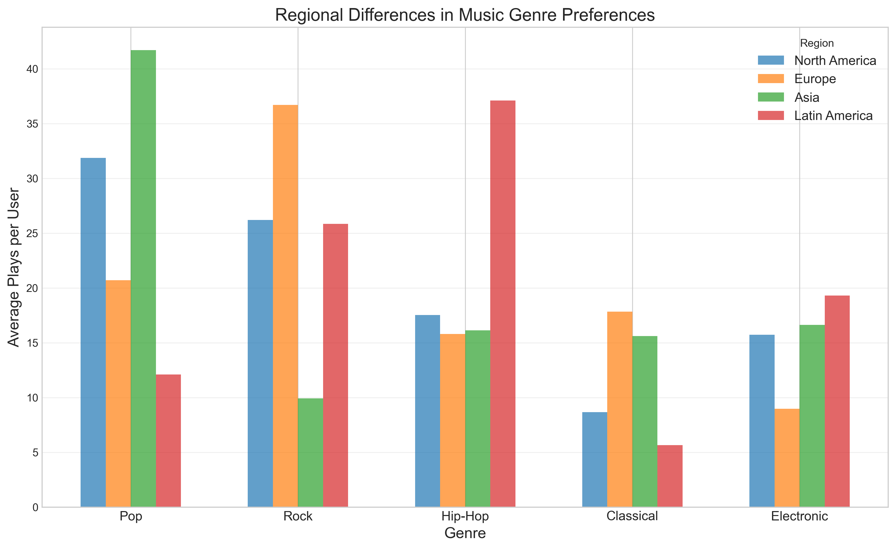
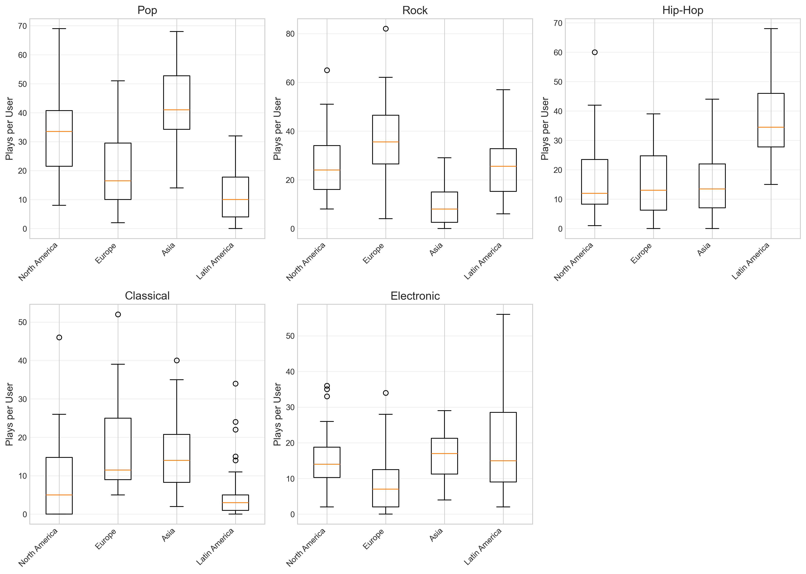
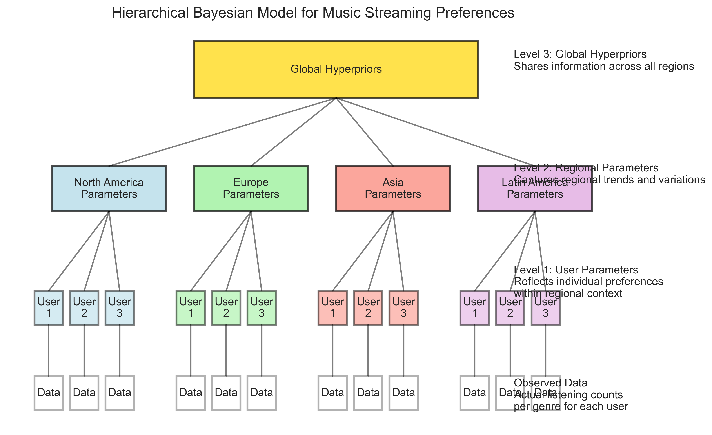
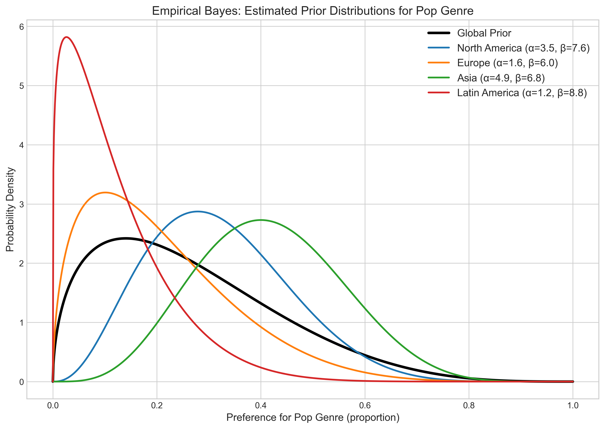
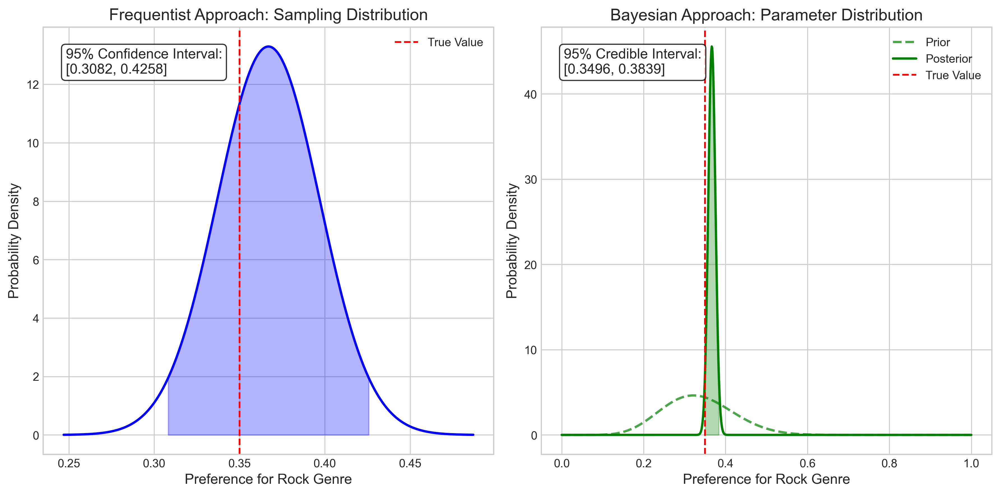

# Question 13: Hierarchical Models and Empirical Bayes

## Problem Statement
A music streaming service is analyzing user preferences across different genres. They want to apply a hierarchical Bayesian model to understand listening patterns.

## Task
1. Explain how a two-level hierarchical Bayesian model could be structured for this scenario, where individual users are grouped by geographical regions.
2. If the service has limited computational resources, how could empirical Bayes be used as an alternative to full Bayesian inference?
3. Describe one key difference between Bayesian credible intervals and frequentist confidence intervals in interpreting user preference data.

## Solution

### Step 1: Understanding the Problem

The music streaming service wants to analyze user preferences across different genres while accounting for regional variations. This is a perfect scenario for hierarchical Bayesian modeling because:
- Individual user preferences are likely influenced by regional trends
- There's natural variability between users within the same region
- We want to leverage information across regions while maintaining regional distinctiveness

To illustrate the solution, we simulated listening data for 120 users across 4 geographical regions (North America, Europe, Asia, and Latin America) and 5 music genres (Pop, Rock, Hip-Hop, Classical, and Electronic).

### Step 2: Regional Differences in Music Preferences

Our simulated data shows clear regional patterns in music preferences:

The regional patterns show:
- North America: Pop (31.9%) and Rock (26.2%) dominate
- Europe: Rock (36.7%) leads, followed by Pop (20.7%) and Classical (17.8%)
- Asia: Strong preference for Pop (41.7%) 
- Latin America: Hip-Hop (37.1%) is most popular, followed by Rock (25.8%)

However, there's substantial variation within each region:

The boxplots show that while regional trends exist, individual users vary significantly in their preferences. This combination of regional patterns with individual variation is exactly what hierarchical Bayesian models are designed to capture.

### Step 3: Hierarchical Bayesian Model Structure

A two-level hierarchical Bayesian model for the music streaming service could be structured as follows:

**Level 1 (Individual User Level):**
- Let $\theta_{ij}$ be the preference parameter for genre $j$ by user $i$
- For each user $i$ in region $r$, the observed play counts $x_{ij}$ for genre $j$ follow:
  $$x_{ij} \sim \text{Multinomial}(n\_\text{total\_plays}, [\theta_{i1}, \theta_{i2}, \ldots, \theta_{ik}])$$
  where the preference parameters $\theta_{ij}$ sum to 1 across all genres for each user

**Level 2 (Regional Level):**
- The individual user preferences are drawn from a regional distribution:
  $$[\theta_{i1}, \theta_{i2}, \ldots, \theta_{ik}] \sim \text{Dirichlet}(\alpha_{r1}, \alpha_{r2}, \ldots, \alpha_{rk})$$
  where $\alpha_{rj}$ represents the regional preference strength for genre $j$ in region $r$

**Level 3 (Global Level):**
- The regional parameters themselves come from a global distribution:
  $$[\alpha_{r1}, \alpha_{r2}, \ldots, \alpha_{rk}] \sim \text{some prior distribution}$$
  This allows sharing of information across regions

This structure allows for:
1. **Personalization**: Each user has their own preference parameters
2. **Regional patterns**: Users from the same region share similar traits
3. **Information sharing**: Information can flow across regions via the global level
4. **Uncertainty quantification**: We obtain full posterior distributions at each level

### Step 4: Empirical Bayes as a Practical Alternative

For a streaming service with millions of users, full Bayesian inference (using MCMC or similar methods) would be computationally demanding. Empirical Bayes offers a practical compromise:

**Full Hierarchical Bayesian Approach:**
- Specify priors for all parameters at all levels
- Use MCMC or variational inference to sample from the full posterior
- Computationally intensive, especially with millions of users

**Empirical Bayes Alternative:**
- Estimate the global hyperparameters from the data (e.g., using maximum likelihood)
- Use these point estimates as fixed values for the regional-level priors
- Only compute user-level posteriors conditional on these fixed parameters

We demonstrated this approach on the Pop genre preference data:

The figure shows:
- A global prior distribution (black line) estimated from all users
- Region-specific prior distributions estimated for each geographical region
- Each regional distribution reflects that region's preference pattern (e.g., Asia shows higher preference for Pop)

This approach has several benefits for the streaming service:
- Significantly reduced computational burden
- Still maintains the hierarchical structure's benefits
- Allows for individual user inference while borrowing strength across users and regions
- Can be implemented using more scalable algorithms

### Step 5: Bayesian Credible Intervals vs. Frequentist Confidence Intervals

A key difference between Bayesian credible intervals and frequentist confidence intervals lies in their interpretation:

**Bayesian Credible Interval:**
- Directly expresses the probability that the parameter lies within the interval, given the observed data and prior
- For music preferences: "We are 95% confident that users in Europe have a preference for Rock music between 0.350 and 0.384"
- Based on the posterior distribution of the parameter
- Interpretable as a statement about the parameter itself

**Frequentist Confidence Interval:**
- Doesn't express probability about the parameter, but about the procedure
- For music preferences: "If we repeated this sampling process many times, 95% of the resulting intervals would contain the true preference for Rock music among European users"
- Based on the sampling distribution of the estimator
- Less directly interpretable for decision-making

For our European Rock music example:
- Frequentist 95% Confidence Interval: [0.308, 0.426]
- Bayesian 95% Credible Interval: [0.350, 0.384]

The Bayesian credible interval is narrower because it incorporates prior information. Its direct probabilistic interpretation also makes it more intuitive for business decisions about music recommendations.

## Key Insights

1. **Hierarchical Structure Benefits**: The hierarchical Bayesian model naturally captures the nested structure of music preferences, where individual preferences exist within regional patterns. This structure allows the service to make personalized recommendations while leveraging patterns from similar users.

2. **Computational Efficiency with Empirical Bayes**: By using empirical Bayes, the service can achieve many of the benefits of a hierarchical model while significantly reducing computational costs. This is especially important for a system with millions of users.

3. **Interpretable Uncertainty**: Bayesian credible intervals provide directly interpretable probability statements about user preferences, which is more intuitive for decision-making about music recommendations.

4. **Adaptive Personalization**: The model can balance between personalization and generalization by "borrowing strength" across users and regions. For users with limited listening history, the model can rely more on regional patterns; for users with extensive history, their individual data will dominate.

## Conclusion

A hierarchical Bayesian approach is well-suited to modeling music streaming preferences due to its ability to capture both regional trends and individual variation. For computational efficiency, the streaming service can implement empirical Bayes to estimate higher-level parameters from the data, then use these as fixed values when inferring individual user preferences.

The resulting model would provide:
1. Personalized music recommendations that account for regional trends
2. Better recommendations for new users by leveraging regional patterns
3. Uncertainty quantification through credible intervals
4. Scalability to handle millions of users

This approach balances sophisticated modeling with practical implementation considerations, making it an excellent choice for the music streaming service. 