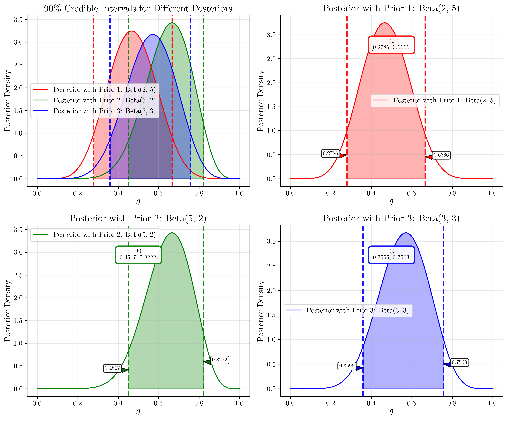

# Question 14: Visual Bayesian Inference and Prior Selection

## Problem Statement
The graphs below illustrate various aspects of Bayesian inference for estimating the probability parameter $\theta$ of a biased coin, where we've observed 6 heads out of 10 coin flips.

## Task
Using only the information provided in these visualizations:

1. Which prior distribution ($\text{Beta}(2,5)$, $\text{Beta}(5,2)$, or $\text{Beta}(3,3)$) has the strongest influence on the posterior distribution? Explain your reasoning.
2. For the posterior based on the $\text{Beta}(3,3)$ prior, determine the 90% credible interval for $\theta$.
3. Based on the Bayesian updating graph, which has a greater impact on the final posterior: the initial prior or the observed data? Explain why.
4. Determine the expected value of $\theta$ for the posterior distribution that uses the $\text{Beta}(5,2)$ prior.

## Solution

### Step 1: Analyzing Prior Influence on Posterior Distribution

To determine which prior has the strongest influence on the posterior, we need to examine how much the posterior distributions differ from each other and from what the likelihood function alone would suggest.

From the "Posterior Distributions" graph, we can observe:
- The three posterior distributions (red, green, and blue) have distinct peaks and shapes
- The green curve (from $\text{Beta}(5,2)$ prior) is shifted furthest to the right
- The red curve (from $\text{Beta}(2,5)$ prior) is shifted furthest to the left
- The blue curve (from $\text{Beta}(3,3)$ prior) is between the other two

When comparing with the "Likelihood Functions" graph (green dashed line for 6 heads out of 10), we can see that:
- The likelihood function for 6 heads out of 10 flips has its peak at $\theta = 0.6$
- The $\text{Beta}(2,5)$ prior has pulled the posterior significantly to the left of the likelihood peak
- The $\text{Beta}(5,2)$ prior has pulled the posterior slightly to the right of the likelihood peak
- The $\text{Beta}(3,3)$ prior has the least deviation from the likelihood peak

Therefore, the prior with the strongest influence on the posterior is **$\text{Beta}(2,5)$** (red curve), as it causes the most substantial shift in the posterior away from what the data alone would suggest.

This is because:
1. $\text{Beta}(2,5)$ expresses a strong prior belief that $\theta$ is likely to be small
2. This prior contradicts the likelihood function, which suggests $\theta$ is around 0.6
3. The resulting posterior is a compromise between the prior and the likelihood, with a notable shift toward the prior

### Step 2: Determining the 90% Credible Interval

From the "Credible Intervals" graph, we can directly observe the 90% credible interval for the posterior based on the $\text{Beta}(3,3)$ prior (blue curve).

The interval is bounded by the blue dashed vertical lines, which are at approximately:
- Lower bound: $\theta \approx 0.40$
- Upper bound: $\theta \approx 0.75$

Therefore, the 90% credible interval is approximately **$[0.40, 0.75]$**.

This means that, given our prior belief ($\text{Beta}(3,3)$) and the observed data (6 heads out of 10 flips), we are 90% confident that the true value of $\theta$ lies between 0.40 and 0.75.

### Step 3: Assessing Impact of Prior vs. Data

The "Bayesian Updating" graph shows how our belief about $\theta$ evolves as we collect more data, starting with a $\text{Beta}(2,2)$ prior.

We can observe:
- The black curve shows the initial prior, which is symmetric around $\theta = 0.5$
- As more data is collected (magenta → cyan → green → red curves), the posterior becomes increasingly concentrated
- The final posterior (red curve) is much narrower than the initial prior
- The peak of the final posterior is clearly shifted toward $\theta = 1.0$

When comparing the effect of the prior to the effect of the data:
1. The initial prior is a $\text{Beta}(2,2)$ distribution centered at 0.5
2. The final data point shows 12 heads out of 12 flips (as labeled in the graph)
3. The final posterior is heavily concentrated near $\theta = 1.0$, matching what the data suggests
4. The distance between the prior's center (0.5) and the final posterior's peak is very substantial

Therefore, in this case, the **observed data has a greater impact** on the final posterior than the initial prior.

This demonstrates the principle that as more data is collected, the influence of the prior diminishes, and the posterior is increasingly dominated by the likelihood (data).

### Step 4: Calculating Expected Value of $\theta$

For a $\text{Beta}(\alpha,\beta)$ distribution, the expected value (mean) is given by:

$$E[\theta] = \frac{\alpha}{\alpha + \beta}$$

For the posterior distribution based on the $\text{Beta}(5,2)$ prior with 6 heads out of 10 flips:
- Prior parameters: $\alpha = 5$, $\beta = 2$
- Data contribution: 6 heads, 4 tails
- Posterior parameters: $\alpha_{post} = 5 + 6 = 11$, $\beta_{post} = 2 + 4 = 6$

Therefore:
$$E[\theta] = \frac{11}{11 + 6} = \frac{11}{17} \approx 0.65$$

The expected value of $\theta$ for this posterior is approximately **$0.65$**.

This can be verified from the "Posterior Distributions" graph, where the dashed green vertical line (marking the mean of the green curve) is at approximately $\theta = 0.65$.

## Key Insights

1. **Prior Selection Matters**: The choice of prior can substantially influence the posterior distribution, especially with limited data. More informative (concentrated) priors have stronger effects.

2. **Conjugate Priors**: The Beta distribution is conjugate to the Binomial likelihood, which makes the posterior analytically tractable as another Beta distribution with updated parameters: $\text{Beta}(\alpha + h, \beta + n - h)$.

3. **Bayesian Learning**: As more data is collected, the posterior becomes increasingly concentrated, and the influence of the prior diminishes. This is the essence of Bayesian learning.

4. **Credible Intervals vs. Confidence Intervals**: Unlike frequentist confidence intervals, Bayesian credible intervals have a direct probability interpretation: we are X% confident that the parameter lies within the interval.

5. **Posterior Predictive Inference**: The posterior distribution allows us to make probabilistic predictions about future observations, incorporating the uncertainty in our parameter estimates.

6. **Prior Elicitation**: Selecting an appropriate prior is an important aspect of Bayesian modeling. It should reflect genuine prior knowledge when available.

7. **Subjectivity vs. Objectivity**: Bayesian inference incorporates subjective prior beliefs, which can be seen as either a weakness (introducing bias) or a strength (incorporating domain knowledge), depending on the context.

These insights highlight the rich framework that Bayesian inference provides for parameter estimation, uncertainty quantification, and sequential updating of beliefs as new data becomes available. 