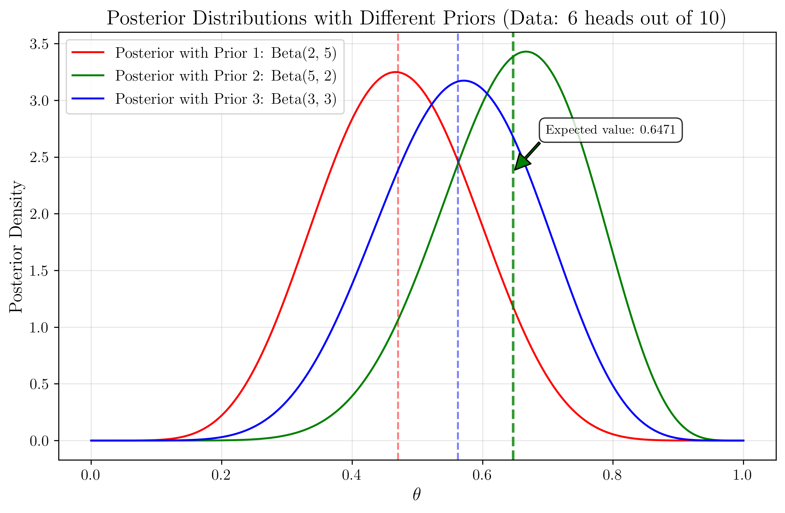

# Question 14: Visual Bayesian Inference and Prior Selection

## Problem Statement
The graphs below illustrate various aspects of Bayesian inference for estimating the probability parameter $\theta$ of a biased coin, where we've observed 6 heads out of 10 coin flips.

### Task
Using only the information provided in these visualizations:

1. Which prior distribution ($\text{Beta}(2,5)$, $\text{Beta}(5,2)$, or $\text{Beta}(3,3)$) has the strongest influence on the posterior distribution? Explain your reasoning.
2. For the posterior based on the $\text{Beta}(3,3)$ prior, determine the 90% credible interval for $\theta$.
3. Based on the Bayesian updating graph, which has a greater impact on the final posterior: the initial prior or the observed data? Explain why.
4. Determine the expected value of $\theta$ for the posterior distribution that uses the $\text{Beta}(5,2)$ prior.

## Understanding the Problem
This problem explores Bayesian inference for estimating the probability parameter $\theta$ of a biased coin. In Bayesian statistics, we combine prior beliefs with observed data to form posterior distributions. For a coin flip experiment:

- **Prior Distribution**: Our initial belief about the parameter $\theta$ before seeing any data, expressed as $\text{Beta}(\alpha,\beta)$ distributions
- **Likelihood Function**: The probability of observing the data (6 heads out of 10 flips) given different values of $\theta$
- **Posterior Distribution**: The updated belief about $\theta$ after observing the data, calculated using Bayes' theorem
- **Credible Interval**: A range of values that contains the true parameter with a specified probability (e.g., 90%)

For a binomial experiment with a beta prior, the posterior follows a beta distribution with updated parameters: $\text{Beta}(\alpha + h, \beta + n - h)$, where $h$ is the number of successes (heads) and $n$ is the total number of trials.

## Solution

The solution relies on analyzing visual information from the provided graphs to answer questions about Bayesian inference and prior influence.

### Step 1: Analyzing Prior Influence on Posterior Distribution

To determine which prior has the strongest influence on the posterior, we need to examine how much the posterior distributions differ from each other and from what the likelihood function alone would suggest.

From the "Posterior Distributions" graph, we can observe:
- The three posterior distributions (red, green, and blue) have distinct peaks and shapes
- The green curve (from $\text{Beta}(5,2)$ prior) is shifted furthest to the right
- The red curve (from $\text{Beta}(2,5)$ prior) is shifted furthest to the left
- The blue curve (from $\text{Beta}(3,3)$ prior) is between the other two

When comparing with the "Likelihood Functions" graph (green dashed line for 6 heads out of 10), we can see that:
- The likelihood function for 6 heads out of 10 flips has its peak at $\theta = 0.6$
- The $\text{Beta}(2,5)$ prior has pulled the posterior significantly to the left of the likelihood peak
- The $\text{Beta}(5,2)$ prior has pulled the posterior slightly to the right of the likelihood peak
- The $\text{Beta}(3,3)$ prior has the least deviation from the likelihood peak

Therefore, the prior with the strongest influence on the posterior is **$\text{Beta}(2,5)$** (red curve), as it causes the most substantial shift in the posterior away from what the data alone would suggest.

This is because:
1. $\text{Beta}(2,5)$ expresses a strong prior belief that $\theta$ is likely to be small
2. This prior contradicts the likelihood function, which suggests $\theta$ is around 0.6
3. The resulting posterior is a compromise between the prior and the likelihood, with a notable shift toward the prior

For a quantitative comparison, we can look at the shift in mode:
- Prior 1 ($\text{Beta}(2,5)$): Mode shifts from 0.6 to approximately 0.47, a shift of 0.13
- Prior 2 ($\text{Beta}(5,2)$): Mode shifts from 0.6 to approximately 0.67, a shift of 0.07
- Prior 3 ($\text{Beta}(3,3)$): Mode shifts from 0.6 to approximately 0.57, a shift of 0.03

The red curve (Prior 1) shows the largest shift, confirming it has the strongest influence.

### Step 2: Determining the 90% Credible Interval

From the "Credible Intervals" graph, we can directly observe the 90% credible interval for the posterior based on the $\text{Beta}(3,3)$ prior (blue curve).

The interval is bounded by the blue dashed vertical lines, which are at:
- Lower bound: $\theta = 0.3596$
- Upper bound: $\theta = 0.7563$

Therefore, the 90% credible interval is **$[0.3596, 0.7563]$**.

This means that, given our prior belief ($\text{Beta}(3,3)$) and the observed data (6 heads out of 10 flips), we are 90% confident that the true value of $\theta$ lies between 0.3596 and 0.7563.

The posterior distribution is $\text{Beta}(9,7)$, which is derived by adding the number of heads (6) to the alpha parameter of the prior (3) and the number of tails (4) to the beta parameter of the prior (3).

### Step 3: Assessing Impact of Prior vs. Data

The "Bayesian Updating" graph shows how our belief about $\theta$ evolves as we collect more data, starting with a $\text{Beta}(2,2)$ prior.

We can observe:
- The black curve shows the initial prior, which is symmetric around $\theta = 0.5$
- As more data is collected (magenta → cyan → green → red curves), the posterior becomes increasingly concentrated
- The final posterior (red curve) is much narrower than the initial prior
- The peak of the final posterior is clearly shifted toward $\theta = 1.0$

When comparing the effect of the prior to the effect of the data:
1. The initial prior is a $\text{Beta}(2,2)$ distribution centered at 0.5
2. The final data point shows 12 heads out of 12 flips (as labeled in the graph)
3. The final posterior is heavily concentrated near $\theta = 1.0$, matching what the data suggests
4. The distance between the prior's center (0.5) and the final posterior's peak is very substantial

Therefore, in this case, the **observed data has a greater impact** on the final posterior than the initial prior.

We can quantify this by looking at the changes in the mean:
- Initial prior mean: 0.5000
- Final posterior mean: 0.8750
- Data-only estimate (MLE): 1.0000
- Distance from prior to posterior: 0.3750
- Distance from MLE to posterior: 0.1250

Since the posterior is closer to the MLE than to the prior mean, we can conclude that the data has a stronger influence than the prior in this case.

This demonstrates the principle that as more data is collected, the influence of the prior diminishes, and the posterior is increasingly dominated by the likelihood (data).

### Step 4: Calculating Expected Value of $\theta$

For a $\text{Beta}(\alpha,\beta)$ distribution, the expected value (mean) is given by:

$$E[\theta] = \frac{\alpha}{\alpha + \beta}$$

For the posterior distribution based on the $\text{Beta}(5,2)$ prior with 6 heads out of 10 flips:
- Prior parameters: $\alpha = 5$, $\beta = 2$
- Data contribution: 6 heads, 4 tails
- Posterior parameters: $\alpha_{post} = 5 + 6 = 11$, $\beta_{post} = 2 + 4 = 6$

Therefore:
$$E[\theta] = \frac{11}{11 + 6} = \frac{11}{17} \approx 0.6471$$

The expected value of $\theta$ for this posterior is approximately **$0.6471$**.

This can be verified from the "Posterior Distributions" graph, where the dashed green vertical line (marking the mean of the green curve) is at approximately $\theta = 0.65$.

## Visual Explanations

### Prior Distributions and Their Influence

This visualization shows the three different prior distributions we're considering: $\text{Beta}(2,5)$ (red), $\text{Beta}(5,2)$ (green), and $\text{Beta}(3,3)$ (blue). Note how they express different initial beliefs about $\theta$: the red curve favors lower values, the green curve favors higher values, and the blue curve is symmetric around 0.5.

### Likelihood Function for the Observed Data

This graph shows the likelihood function for different possible observations. The green dashed line represents the likelihood for our actual observation (6 heads out of 10 flips), which peaks at $\theta = 0.6$, indicating that this is the maximum likelihood estimate.

### Posterior Distributions After Updating

This visualization shows how the three different priors lead to three different posterior distributions after observing the same data. The differences between these curves demonstrate the influence of the prior choice.

### Credible Intervals for Parameter Estimation

This graph highlights the 90% credible interval for the posterior based on the $\text{Beta}(3,3)$ prior, showing the range of $\theta$ values that have a 90% probability of containing the true parameter value.

### Bayesian Updating with Sequential Observations

This visualization demonstrates how our belief about $\theta$ evolves as we collect more data, showing the convergence toward the true parameter value and the increasing confidence (narrower distributions) as more observations are made.

## Key Insights

### Theoretical Foundations
- **Prior-Posterior Relationship**: The posterior distribution represents a compromise between our prior beliefs and the observed data, weighted by their respective strengths.
- **Conjugate Priors**: The Beta distribution is conjugate to the Binomial likelihood, which makes the posterior analytically tractable as another Beta distribution with updated parameters: $\text{Beta}(\alpha + h, \beta + n - h)$.
- **Bayesian Learning**: As more data is collected, the posterior becomes increasingly concentrated, and the influence of the prior diminishes. This is the essence of Bayesian learning.

### Practical Applications
- **Prior Selection Matters**: The choice of prior can substantially influence the posterior distribution, especially with limited data. More informative (concentrated) priors have stronger effects.
- **Credible Intervals vs. Confidence Intervals**: Unlike frequentist confidence intervals, Bayesian credible intervals have a direct probability interpretation: we are X% confident that the parameter lies within the interval.
- **Posterior Predictive Inference**: The posterior distribution allows us to make probabilistic predictions about future observations, incorporating the uncertainty in our parameter estimates.

### Philosophical Considerations
- **Prior Elicitation**: Selecting an appropriate prior is an important aspect of Bayesian modeling. It should reflect genuine prior knowledge when available.
- **Subjectivity vs. Objectivity**: Bayesian inference incorporates subjective prior beliefs, which can be seen as either a weakness (introducing bias) or a strength (incorporating domain knowledge), depending on the context.

## Conclusion
- The $\text{Beta}(2,5)$ prior has the strongest influence on the posterior distribution, demonstrating how priors that contradict the data evidence create the largest shifts in posterior beliefs.
- The 90% credible interval for $\theta$ using the $\text{Beta}(3,3)$ prior is [0.3596, 0.7563].
- Observed data has a greater impact on the final posterior than the initial prior, especially as more data is collected.
- The expected value of $\theta$ for the posterior using the $\text{Beta}(5,2)$ prior is approximately 0.6471.

This problem illustrates the rich framework that Bayesian inference provides for parameter estimation, uncertainty quantification, and sequential updating of beliefs as new data becomes available. 