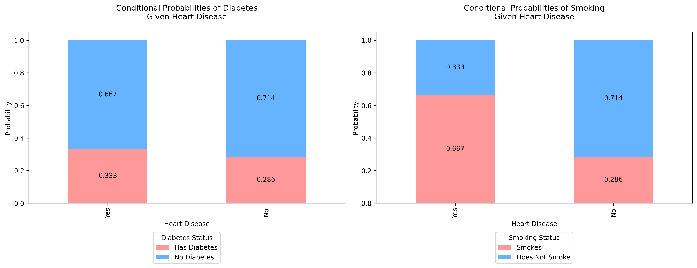
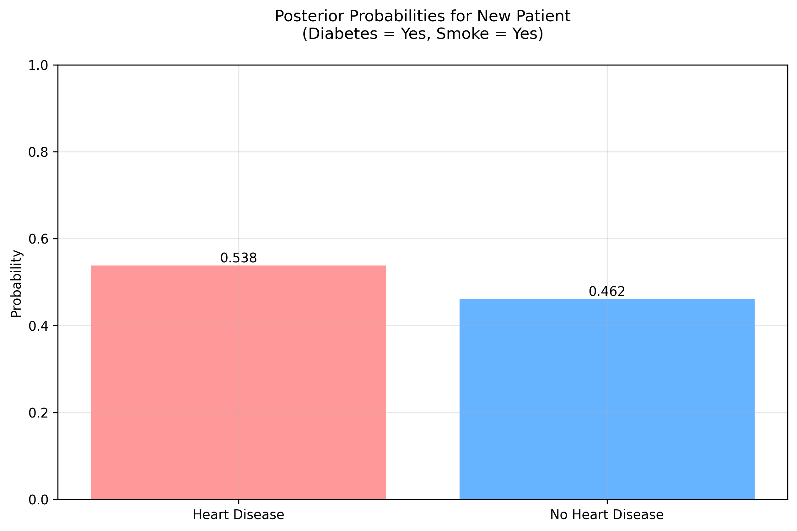
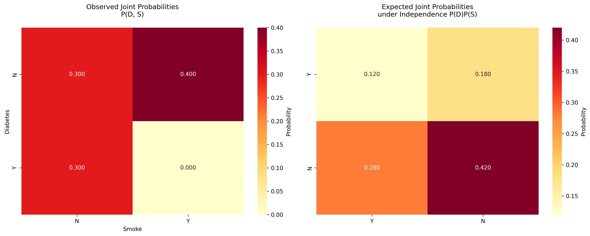

# Question 15: Naive Bayes Classification for Heart Disease Prediction

## Problem Statement
Consider a Naive Bayes classifier for predicting heart disease based on two features: diabetes status and smoking status. The following table shows the training data:

| Diabetes (D) | Smoke (S) | Heart Disease (H) |
|:------------:|:---------:|:-----------------:|
| Y | N | Y |
| Y | N | N |
| N | Y | N |
| N | Y | N |
| N | N | N |
| N | Y | Y |
| N | N | N |
| N | Y | Y |
| N | N | N |
| Y | N | N |

From this data, we can calculate:
- $P(H = \text{Yes}) = 0.3$ (3 out of 10 patients)
- $P(H = \text{No}) = 0.7$ (7 out of 10 patients)
- $P(D = \text{Yes}|H = \text{Yes}) = \frac{1}{3}$ (1 out of 3 patients with heart disease)
- $P(S = \text{Yes}|H = \text{Yes}) = \frac{2}{3}$ (2 out of 3 patients with heart disease)
- $P(D = \text{Yes}|H = \text{No}) = \frac{2}{7}$ (2 out of 7 patients without heart disease)
- $P(S = \text{Yes}|H = \text{No}) = \frac{2}{7}$ (2 out of 7 patients without heart disease)

### Task
1. For a new patient with diabetes who also smokes ($x = [\text{Yes}, \text{Yes}]$), calculate:
   - $P(H = \text{Yes}|x) \propto P(H = \text{Yes})P(D = \text{yes}|H = \text{Yes})P(S = \text{yes}|H = \text{Yes})$
   - $P(H = \text{No}|x) \propto P(H = \text{No})P(D = \text{yes}|H = \text{No})P(S = \text{yes}|H = \text{No})$
2. Based on your calculations, what would be the predicted class for this patient?
3. Explain why we use proportionality ($\propto$) instead of equality ($=$) in the calculations.
4. What assumption does Naive Bayes make about the features D and S? Is this assumption realistic in this medical context?

## Understanding the Problem

The problem involves using Naive Bayes classification to predict heart disease based on two binary features:
1. Diabetes status (Yes/No)
2. Smoking status (Yes/No)

We need to:
1. Calculate posterior probabilities for a new patient
2. Make a prediction based on these probabilities
3. Understand the role of proportionality in calculations
4. Analyze the independence assumption

## Solution

### Step 1: Data Analysis

Let's analyze the distribution in our dataset of 10 patients:

| Condition | Count | Probability |
|:---------:|:-----:|:----------:|
| Heart Disease (Yes) | 3 | 0.3 |
| Heart Disease (No) | 7 | 0.7 |
| Diabetes given Heart Disease | 1 out of 3 | $\frac{1}{3} \approx 0.333$ |
| Smoking given Heart Disease | 2 out of 3 | $\frac{2}{3} \approx 0.667$ |
| Diabetes given No Heart Disease | 2 out of 7 | $\frac{2}{7} \approx 0.286$ |
| Smoking given No Heart Disease | 2 out of 7 | $\frac{2}{7} \approx 0.286$ |

### Step 2: Calculating Posterior Probabilities

For a new patient with both diabetes and smoking ($D = \text{Yes}, S = \text{Yes}$):

For $H = \text{Yes}$:
$$
\begin{align*}
P(H = \text{Yes}|D,S) &\propto P(H = \text{Yes}) \times P(D = \text{Yes}|H = \text{Yes}) \times P(S = \text{Yes}|H = \text{Yes}) \\
&= 0.3 \times \frac{1}{3} \times \frac{2}{3} \\
&= 0.3 \times 0.333 \times 0.667 \\
&= 0.066667
\end{align*}
$$

For $H = \text{No}$:
$$
\begin{align*}
P(H = \text{No}|D,S) &\propto P(H = \text{No}) \times P(D = \text{Yes}|H = \text{No}) \times P(S = \text{Yes}|H = \text{No}) \\
&= 0.7 \times \frac{2}{7} \times \frac{2}{7} \\
&= 0.7 \times 0.286 \times 0.286 \\
&= 0.057143
\end{align*}
$$

### Step 3: Normalization

To get actual probabilities, we normalize by dividing each value by their sum:

Sum of proportional values = $0.066667 + 0.057143 = 0.123810$

$$
\begin{align*}
P(H = \text{Yes}|D,S) &= \frac{0.066667}{0.123810} = 0.538462 \text{ (53.8\%)} \\
P(H = \text{No}|D,S) &= \frac{0.057143}{0.123810} = 0.461538 \text{ (46.2\%)}
\end{align*}
$$

### Step 4: Feature Independence Analysis

The Naive Bayes classifier assumes conditional independence between features. Let's analyze this assumption:

Observed Joint Probabilities $P(D, S)$:

| Smoke | N | Y |
|:-----:|:-:|:-:|
| **Diabetes** | | |
| N | 0.3 | 0.4 |
| Y | 0.3 | 0.0 |

Expected Joint Probabilities under Independence $P(D)P(S)$:

| | Y | N |
|:-:|:-:|:-:|
| Y | 0.12 | 0.18 |
| N | 0.28 | 0.42 |

The differences between observed and expected probabilities suggest some dependence between features.

## Visual Explanations

### Conditional Probabilities

This visualization shows:
1. The probability of having diabetes given heart disease status
2. The probability of smoking given heart disease status

### Posterior Probabilities

This plot shows the final probabilities for our new patient with both diabetes and smoking.

### Independence Assumption

This visualization compares:
1. The observed joint probabilities in the data
2. The expected probabilities if features were truly independent

## Key Insights

1. **Probability Analysis**:
   - Prior probability of heart disease: 30%
   - For a patient with both diabetes and smoking:
     - Probability of heart disease: 53.8%
     - Probability of no heart disease: 46.2%
   - The small difference (7.6%) suggests high uncertainty

2. **Understanding Proportionality**:
   - We use $\propto$ because:
     - The denominator (normalization constant) is complex
     - Proportionality simplifies calculation while preserving relative probabilities
     - Final normalization gives us true probabilities

3. **Independence Assumption Analysis**:
   - Naive Bayes assumes: $P(D,S|H) = P(D|H)P(S|H)$
   - Medical reality:
     - Diabetes and smoking might be correlated
     - Combined risk factors often interact
     - The assumption simplifies computation but may reduce accuracy

## Conclusion

1. **Final Prediction**:
   - Predicted class: Heart Disease (53.8% > 46.2%)
   - Confidence level: Low (only 7.6% difference)
   - Recommendation: Consider additional tests/factors

2. **Mathematical Insights**:
   - Proportionality simplifies calculations
   - Two-step process: proportional values → normalization
   - Mathematically equivalent to direct probability calculation

3. **Model Limitations**:
   - Independence assumption may not hold
   - Close probabilities suggest high uncertainty
   - Model serves as initial screening tool
   - Should be combined with other diagnostic methods

4. **Clinical Implications**:
   - Use as supporting tool, not sole decision maker
   - Consider additional risk factors
   - Regular monitoring recommended
   - Patient-specific factors may override model prediction