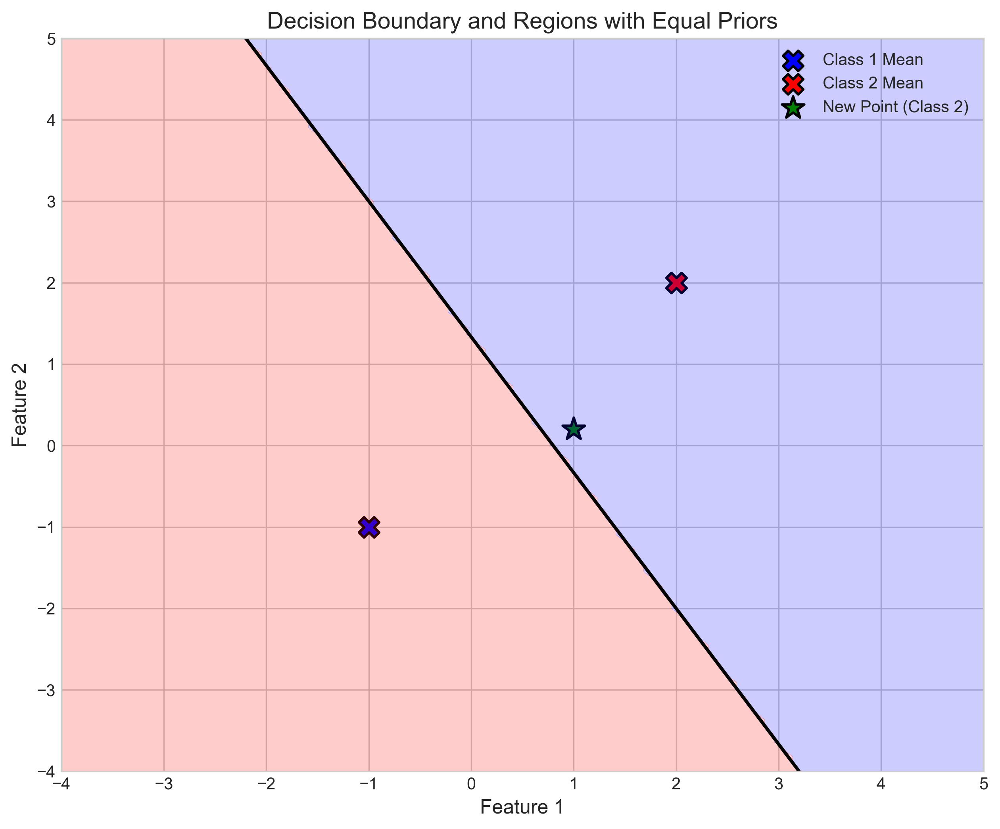
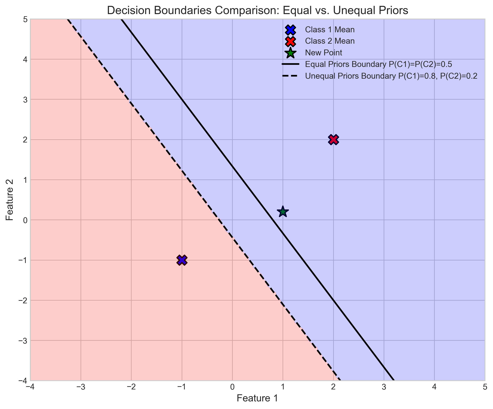
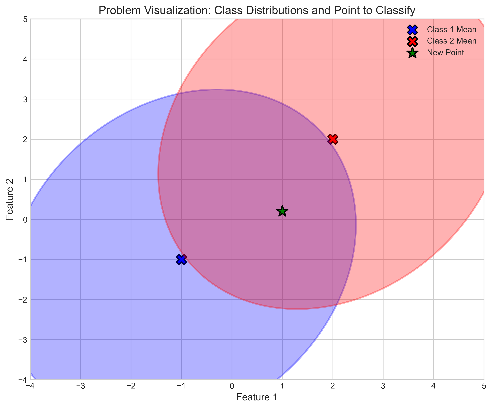
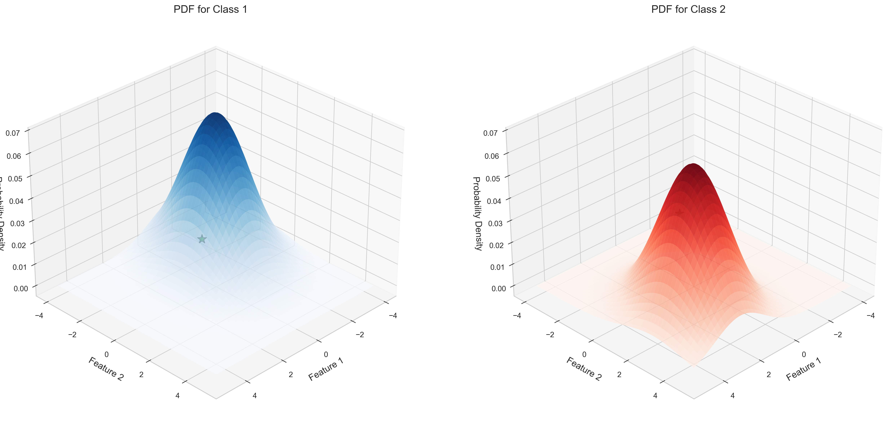

# Question 16: Bayesian Classification with Normal Distributions

## Problem Statement
In a two-class, two-dimensional classification task, the feature vectors are generated by two normal distributions sharing the same covariance matrix
$$\Sigma = \begin{bmatrix} 2 & 0.5 \\ 0.5 & 3 \end{bmatrix}$$
and the mean vectors are $\mu_1 = \begin{bmatrix} -1 \\ -1 \end{bmatrix}$, $\mu_2 = \begin{bmatrix} 2 \\ 2 \end{bmatrix}$, respectively.

### Task
1. Classify the vector $\begin{bmatrix} 1.0 \\ 0.2 \end{bmatrix}$ according to the Bayesian classifier.
2. Draw a creative analogy between the prior, likelihood, and posterior distributions in Bayesian inference and a real-world scenario (such as courtroom judgment, medical diagnosis, or weather prediction).

## Understanding the Problem

In this problem, we're dealing with a two-class classification task using the Bayesian approach. We have two classes, each represented by a multivariate Gaussian (normal) distribution. Both distributions share the same covariance matrix, but they have different mean vectors.

The key to Bayesian classification is combining prior knowledge with observed evidence to make a decision. This approach allows us to calculate the probability of class membership given a feature vector.

We need to classify a new point $\begin{bmatrix} 1.0 \\ 0.2 \end{bmatrix}$ by determining which class it most likely belongs to. We'll apply Bayes' theorem to calculate the posterior probabilities $P(\text{class}|\mathbf{x})$ for each class, and assign the point to the class with the highest posterior probability.

## Solution

### Step 1: Calculate the Likelihoods (Class-Conditional Densities)

The multivariate Gaussian probability density function (PDF) is given by:

$$p(\mathbf{x}|\boldsymbol{\mu}, \boldsymbol{\Sigma}) = \frac{1}{(2\pi)^{d/2}|\boldsymbol{\Sigma}|^{1/2}} \exp\left(-\frac{1}{2}(\mathbf{x} - \boldsymbol{\mu})^T \boldsymbol{\Sigma}^{-1} (\mathbf{x} - \boldsymbol{\mu})\right)$$

where:
- $d$ is the dimension (2 in our case)
- $|\boldsymbol{\Sigma}|$ is the determinant of the covariance matrix
- $\boldsymbol{\Sigma}^{-1}$ is the inverse of the covariance matrix

We first need to find the determinant and inverse of the covariance matrix:

$$|\boldsymbol{\Sigma}| = \begin{vmatrix} 2 & 0.5 \\ 0.5 & 3 \end{vmatrix} = (2 \times 3) - (0.5 \times 0.5) = 6 - 0.25 = 5.75$$

$$\boldsymbol{\Sigma}^{-1} = \frac{1}{|\boldsymbol{\Sigma}|} \begin{bmatrix} 3 & -0.5 \\ -0.5 & 2 \end{bmatrix} = \begin{bmatrix} 0.52174 & -0.08696 \\ -0.08696 & 0.34783 \end{bmatrix}$$

Now we can calculate the PDFs for the new point $\mathbf{x} = \begin{bmatrix} 1.0 \\ 0.2 \end{bmatrix}$ for each class.

For **Class 1** with $\boldsymbol{\mu}_1 = \begin{bmatrix} -1 \\ -1 \end{bmatrix}$:

$$\mathbf{x} - \boldsymbol{\mu}_1 = \begin{bmatrix} 1.0 \\ 0.2 \end{bmatrix} - \begin{bmatrix} -1 \\ -1 \end{bmatrix} = \begin{bmatrix} 2.0 \\ 1.2 \end{bmatrix}$$

The quadratic form in the exponent is:

$$(\mathbf{x} - \boldsymbol{\mu}_1)^T \boldsymbol{\Sigma}^{-1} (\mathbf{x} - \boldsymbol{\mu}_1) = 2.17044$$

The normalization constant is:

$$\frac{1}{(2\pi)^{1}|\boldsymbol{\Sigma}|^{1/2}} = \frac{1}{2\pi \times \sqrt{5.75}} = 0.06637$$

Therefore:

$$p(\mathbf{x}|\text{class 1}) = 0.06637 \times e^{-0.5 \times 2.17044} = 0.06637 \times 0.33783 = 0.02242$$

For **Class 2** with $\boldsymbol{\mu}_2 = \begin{bmatrix} 2 \\ 2 \end{bmatrix}$:

$$\mathbf{x} - \boldsymbol{\mu}_2 = \begin{bmatrix} 1.0 \\ 0.2 \end{bmatrix} - \begin{bmatrix} 2 \\ 2 \end{bmatrix} = \begin{bmatrix} -1.0 \\ -1.8 \end{bmatrix}$$

The quadratic form in the exponent is:

$$(\mathbf{x} - \boldsymbol{\mu}_2)^T \boldsymbol{\Sigma}^{-1} (\mathbf{x} - \boldsymbol{\mu}_2) = 1.33565$$

Using the same normalization constant:

$$p(\mathbf{x}|\text{class 2}) = 0.06637 \times e^{-0.5 \times 1.33565} = 0.06637 \times 0.51282 = 0.03404$$

Thus:
- $P(\mathbf{x}|\text{class 1}) = 0.02242$
- $P(\mathbf{x}|\text{class 2}) = 0.03404$

The likelihood ratio is:
$$\frac{P(\mathbf{x}|\text{class 2})}{P(\mathbf{x}|\text{class 1})} = \frac{0.03404}{0.02242} = 1.518$$

This indicates that the feature vector is about 1.5 times more likely under Class 2 than under Class 1.

### Step 2: Apply Bayes' Theorem with Equal Prior Probabilities

Bayes' theorem states:

$$P(\text{class}|\mathbf{x}) = \frac{P(\mathbf{x}|\text{class}) \times P(\text{class})}{P(\mathbf{x})}$$

Assuming equal prior probabilities $P(\text{class 1}) = P(\text{class 2}) = 0.5$, we have:

1. The evidence (total probability) is:
   $$P(\mathbf{x}) = P(\mathbf{x}|\text{class 1}) \times P(\text{class 1}) + P(\mathbf{x}|\text{class 2}) \times P(\text{class 2})$$
   $$P(\mathbf{x}) = 0.02242 \times 0.5 + 0.03404 \times 0.5 = 0.02823$$

2. The posterior probability for Class 1:
   $$P(\text{class 1}|\mathbf{x}) = \frac{P(\mathbf{x}|\text{class 1}) \times P(\text{class 1})}{P(\mathbf{x})} = \frac{0.02242 \times 0.5}{0.02823} = 0.39714$$

3. The posterior probability for Class 2:
   $$P(\text{class 2}|\mathbf{x}) = \frac{P(\mathbf{x}|\text{class 2}) \times P(\text{class 2})}{P(\mathbf{x})} = \frac{0.03404 \times 0.5}{0.02823} = 0.60286$$

Since $P(\text{class 2}|\mathbf{x}) > P(\text{class 1}|\mathbf{x})$, we classify the vector $\begin{bmatrix} 1.0 \\ 0.2 \end{bmatrix}$ as belonging to **Class 2**.

### Step 3: Decision Boundary Analysis

When both classes share the same covariance matrix, the decision boundary is a straight line in 2D space. This boundary is defined by where the posterior probabilities are equal:

$$P(\text{class 1}|\mathbf{x}) = P(\text{class 2}|\mathbf{x})$$

For equal priors, this corresponds to where the log-likelihood ratio is zero:

$$\ln\frac{P(\mathbf{x}|\text{class 2})}{P(\mathbf{x}|\text{class 1})} = 0$$

The decision boundary passes halfway between the class means when the covariance matrices are equal, but is angled according to the covariance structure.

### Step 4: Effect of Unequal Prior Probabilities

To demonstrate the impact of prior probabilities, let's consider unequal priors where $P(\text{class 1}) = 0.8$ and $P(\text{class 2}) = 0.2$.

1. The new evidence is:
   $$P(\mathbf{x}) = 0.02242 \times 0.8 + 0.03404 \times 0.2 = 0.02475$$

2. The new posterior probabilities are:
   $$P(\text{class 1}|\mathbf{x}) = \frac{0.02242 \times 0.8}{0.02475} = 0.72490$$
   $$P(\text{class 2}|\mathbf{x}) = \frac{0.03404 \times 0.2}{0.02475} = 0.27510$$

With these unequal priors strongly favoring Class 1, we now classify the vector as belonging to **Class 1** instead of Class 2. This demonstrates how prior knowledge can affect the classification decision.

The decision boundary with unequal priors shifts to where:

$$\ln\frac{P(\mathbf{x}|\text{class 2})}{P(\mathbf{x}|\text{class 1})} = \ln\frac{P(\text{class 1})}{P(\text{class 2})} = \ln\frac{0.8}{0.2} \approx 1.3863$$

This shift means the boundary moves in the direction of the class with the lower prior probability, making more of the feature space assigned to the class with the higher prior.

## Practical Implementation

### Visualizing the Solution

To better understand the problem, we can visualize the multivariate Gaussian distributions, the point to be classified, and the decision boundaries:

The 3D visualization of the probability density functions shows how the point relates to each distribution:

### Analogy to a Real-World Scenario: Medical Diagnosis

The Bayesian classification process can be analogized to medical diagnosis:

1. **Prior Probabilities**: These represent the base rates of diseases in the population before any symptoms are observed. For example, if a rare disease affects 1 in 10,000 people, the prior probability is 0.0001, while the prior for not having the disease is 0.9999.

2. **Likelihoods**: These represent how likely specific symptoms are to appear given each condition. For instance, a certain symptom might appear in 90% of patients with the disease but only in 10% of healthy individuals. These are the conditional probabilities P(symptom|disease) and P(symptom|no disease).

3. **Evidence**: This represents how common the symptoms are in the general population, combining the likelihoods weighted by the priors.

4. **Posterior Probabilities**: These represent the updated probabilities of having the disease after observing the symptoms. It's the doctor's assessment of the disease likelihood given all available information.

5. **Decision Boundary**: The threshold at which a doctor decides to diagnose the disease. This threshold can shift based on:
   - Changing disease prevalence (priors)
   - Test sensitivity/specificity improvements (likelihoods)
   - Risk considerations (false positives vs. false negatives)

For example, doctors might lower the diagnostic threshold (making diagnosis more likely) for highly contagious diseases during an epidemic, which is analogous to increasing the prior probability in our classification problem.

## Key Insights

### Theoretical Foundations
- **Bayesian Framework**: Provides a principled approach to classification by combining prior knowledge with observed data
- **Covariance Structure**: Influences the shape and orientation of the decision boundary
- **Equal Covariance Matrices**: Result in a linear decision boundary (a straight line in 2D)

### Decision Boundaries
- **Prior Impact**: Higher prior probability for a class enlarges its decision region
- **Evidence Balance**: The feature vector (1.0, 0.2) is positioned where the evidence is fairly balanced between classes, making the classification sensitive to prior probabilities
- **Boundary Shift**: The boundary shifts in the direction of the class with the lower prior probability

### Practical Applications
- **Prior Selection**: In real-world applications, priors should reflect either true class distributions or costs of misclassification
- **Sensitivity Analysis**: Examining how classification changes with different priors helps assess decision robustness
- **Equal vs. Unequal Covariances**: When classes have different covariance matrices, the decision boundary becomes quadratic rather than linear

## Conclusion

We have solved a Bayesian classification problem with multivariate Gaussian distributions. For the given vector $\begin{bmatrix} 1.0 \\ 0.2 \end{bmatrix}$:

- With equal priors, it is classified as **Class 2** with posterior probability 0.603
- With priors favoring Class 1 (0.8 vs 0.2), it is classified as **Class 1** with posterior probability 0.725

This demonstrates the fundamental Bayesian principle that classification decisions depend not just on the observed data (through likelihoods) but also on prior beliefs about class membership. The example also illustrates how the decision boundary shifts based on prior probabilities, allowing the classification system to adapt to different contexts or requirements. 