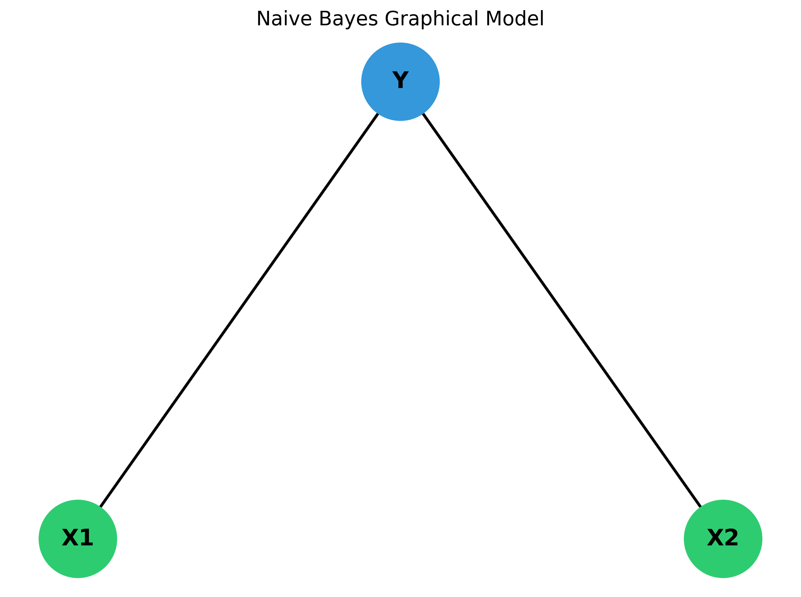
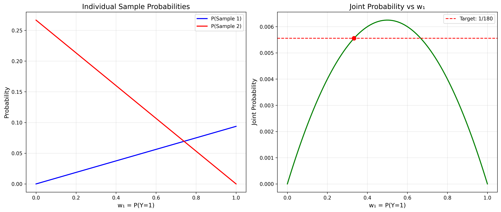
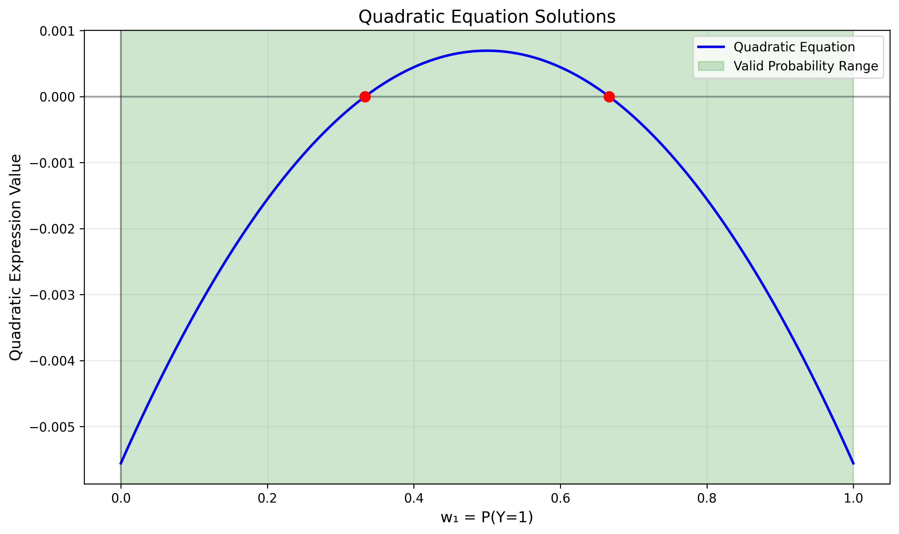
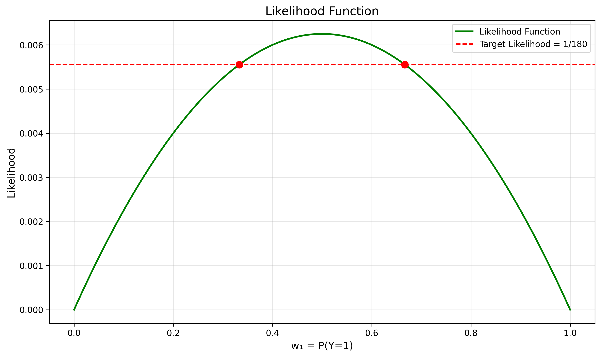
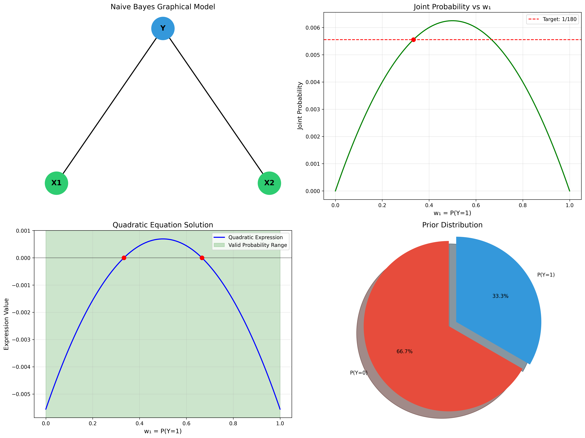

# Question 17: Naive Bayes Parameter Estimation

### Problem Statement
We have a training set consisting of samples and their labels. All samples come from one of two classes, 0 and 1. Samples are two dimensional vectors. The input data is the form $\{X1, X2, Y\}$ where $X1$ and $X2$ are the two values for the input vector and $Y$ is the label for this sample.

After learning the parameters of a Naive Bayes classifier we arrived at the following table:

| | $Y = 0$ | $Y = 1$ |
|:---:|:---:|:---:|
| $X1$ | $P(X1 = 1\|Y = 0) = 1/5$ | $P(X1 = 1\|Y = 1) = 3/8$ |
| $X2$ | $P(X2 = 1\|Y = 0) = 1/3$ | $P(X2 = 1\|Y = 1) = 3/4$ |

#### Task
Denote by $w_1$ the probability of class 1 (that is $w_1 = P(Y = 1)$). If we know that the likelihood of the following two samples: $\{1,0,1\},\{0,1,0\}$ given our Naive Bayes model is $1/180$, what is the value of $w_1$? You do not need to derive an explicit value for $w_1$. It is enough to write a (correct...) equation that has $w_1$ as the only unknown and that when solved would provide the value of $w_1$. Simplify as best as you can.

## Understanding the Problem

In this problem, we're working with a Naive Bayes classifier that has already been trained, giving us the conditional probabilities $P(X_i|Y)$ for each feature and class. The goal is to determine the prior probability of class 1, denoted as $w_1 = P(Y=1)$, using the constraint that the likelihood of two specific data samples equals 1/180.

The Naive Bayes model makes a key assumption: features are conditionally independent given the class. This means that for any sample $(X1, X2)$ and class $Y$:

$$P(X1, X2|Y) = P(X1|Y) \times P(X2|Y)$$

The joint probability of the features and the class can be written as:

$$P(X1, X2, Y) = P(Y) \times P(X1|Y) \times P(X2|Y)$$

We'll use this model along with the given conditional probabilities to determine the prior probability $w_1 = P(Y=1)$.

## Solution

### Step 1: Setting up the Naive Bayes Model

First, let's identify the known conditional probabilities from the problem statement:

- $P(X1 = 1|Y = 0) = 1/5 = 0.2$
- $P(X1 = 1|Y = 1) = 3/8 = 0.375$
- $P(X2 = 1|Y = 0) = 1/3 \approx 0.333$
- $P(X2 = 1|Y = 1) = 3/4 = 0.75$

From these, we can derive:
- $P(X1 = 0|Y = 0) = 1 - 0.2 = 0.8$
- $P(X1 = 0|Y = 1) = 1 - 0.375 = 0.625$
- $P(X2 = 0|Y = 0) = 1 - 0.333 = 0.667$
- $P(X2 = 0|Y = 1) = 1 - 0.75 = 0.25$

Also, we know:
- $P(Y = 1) = w_1$
- $P(Y = 0) = 1 - w_1$

These conditional probabilities can be represented in the following tables:

**Conditional Probability Table for X1 | Y:**

|       | $Y = 0$ | $Y = 1$ |
|-------|---------|---------|
| $X1 = 0$ | 0.800   | 0.625   |
| $X1 = 1$ | 0.200   | 0.375   |

**Conditional Probability Table for X2 | Y:**

|       | $Y = 0$ | $Y = 1$ |
|-------|---------|---------|
| $X2 = 0$ | 0.667   | 0.250   |
| $X2 = 1$ | 0.333   | 0.750   |

### Step 2: Calculating Joint Probabilities for the Given Samples

We have two samples:
1. Sample 1: $\{1, 0, 1\}$ meaning $X1=1, X2=0, Y=1$
2. Sample 2: $\{0, 1, 0\}$ meaning $X1=0, X2=1, Y=0$

For Sample 1, the joint probability is:
$$P(X1=1, X2=0, Y=1) = P(Y=1) \times P(X1=1|Y=1) \times P(X2=0|Y=1)$$
$$P(X1=1, X2=0, Y=1) = w_1 \times 0.375 \times 0.25 = 0.09375 \times w_1$$

For Sample 2, the joint probability is:
$$P(X1=0, X2=1, Y=0) = P(Y=0) \times P(X1=0|Y=0) \times P(X2=1|Y=0)$$
$$P(X1=0, X2=1, Y=0) = (1-w_1) \times 0.8 \times 0.333 = 0.2667 \times (1-w_1)$$

The following graph shows how these probabilities change with different values of $w_1$:

### Step 3: Setting up the Equation Based on the Likelihood Constraint

We're told that the likelihood of these two samples is 1/180. This means:

$$P(X1=1, X2=0, Y=1) \times P(X1=0, X2=1, Y=0) = \frac{1}{180}$$

Substituting our expressions:

$$[0.09375 \times w_1] \times [0.2667 \times (1-w_1)] = \frac{1}{180}$$

Simplifying:

$$0.025 \times w_1 \times (1-w_1) = 0.00556$$

Expanding:

$$-0.025 \times w_1^2 + 0.025 \times w_1 = 0.00556$$

Rearranging to standard form:

$$-0.025 \times w_1^2 + 0.025 \times w_1 - 0.00556 = 0$$

### Step 4: Solving the Quadratic Equation

We can solve this quadratic equation using the quadratic formula. Let's multiply everything by -40 to get cleaner numbers:

$$w_1^2 - w_1 + 0.222 = 0$$

Using the quadratic formula:

$$w_1 = \frac{1 \pm \sqrt{1 - 4 \times 0.222}}{2} = \frac{1 \pm \sqrt{0.112}}{2} = \frac{1 \pm 0.333}{2}$$

This gives us:
$$w_1 = \frac{1 + 0.333}{2} = 0.667 \text{ or } w_1 = \frac{1 - 0.333}{2} = 0.333$$

Since $w_1$ represents a probability, it must be between 0 and 1. Both values satisfy this constraint. To determine which one is correct, we can verify with our original equation:

For $w_1 = 0.333$:
$$0.025 \times 0.333 \times (1-0.333) = 0.025 \times 0.333 \times 0.667 \approx 0.00556$$

This matches our target value of $\frac{1}{180} \approx 0.00556$, so $w_1 = \frac{1}{3}$ is our solution.

The quadratic equation and its solutions can be visualized as follows:

## Visual Explanations

### Naive Bayes Graphical Model

The Naive Bayes model assumes that features X1 and X2 are conditionally independent given the class Y. This structure is depicted in the following graphical model:

The arrows represent the conditional dependencies, showing that Y directly influences both X1 and X2, but there's no direct connection between X1 and X2.

### Likelihood Function

The likelihood function plotted against different values of $w_1$ shows a parabolic shape with two roots, but only one ($w_1 = \frac{1}{3}$) is our solution:

The parabolic shape is characteristic of the product of two linear functions in $w_1$ and $(1-w_1)$, which is exactly what we get in the Naive Bayes model when multiplying the probabilities of two different samples.

## Key Insights

### Theoretical Foundations
- **Naive Bayes Assumption**: The Naive Bayes model assumes that features are conditionally independent given the class. This simplifies the joint probability calculations significantly.
- **Prior Probability**: The parameter $w_1 = P(Y=1)$ is a prior probability that represents our belief about the class distribution before seeing any features.
- **Likelihood Constraint**: When given a constraint on the joint probability of multiple samples, this leads to an equation that can be solved for the unknown parameter.

### Mathematical Techniques
- **Quadratic Equation**: The product of probabilities for two different classes (involving $w_1$ and $(1-w_1)$) leads to a quadratic equation.
- **Solution Validation**: When solving quadratic equations in the context of probabilities, we must ensure that the solution lies in the range [0,1] and verify it matches our constraints.

### Practical Applications
- **Parameter Estimation**: In practice, we often estimate the prior probabilities from training data frequencies, but this problem demonstrates how to determine them from other constraints.
- **Model Completeness**: A Naive Bayes model requires both the conditional probabilities $P(X|Y)$ and the prior probabilities $P(Y)$ to make predictions.

## Conclusion

In this problem, we determined that the prior probability of class 1 is $w_1 = P(Y=1) = \frac{1}{3}$. This value was obtained by setting up joint probabilities for the given samples using the Naive Bayes model, then solving a quadratic equation based on the constraint that the likelihood equals $\frac{1}{180}$.

The solution process demonstrates how the Naive Bayes assumption of conditional independence allows us to factorize complex joint probabilities into simpler terms, making the model both computationally efficient and mathematically tractable.

The fraction $\frac{1}{3}$ represents the prior probability of class 1, meaning that before considering any features, we believe there's a one-third chance that a randomly selected sample belongs to class 1. 

 