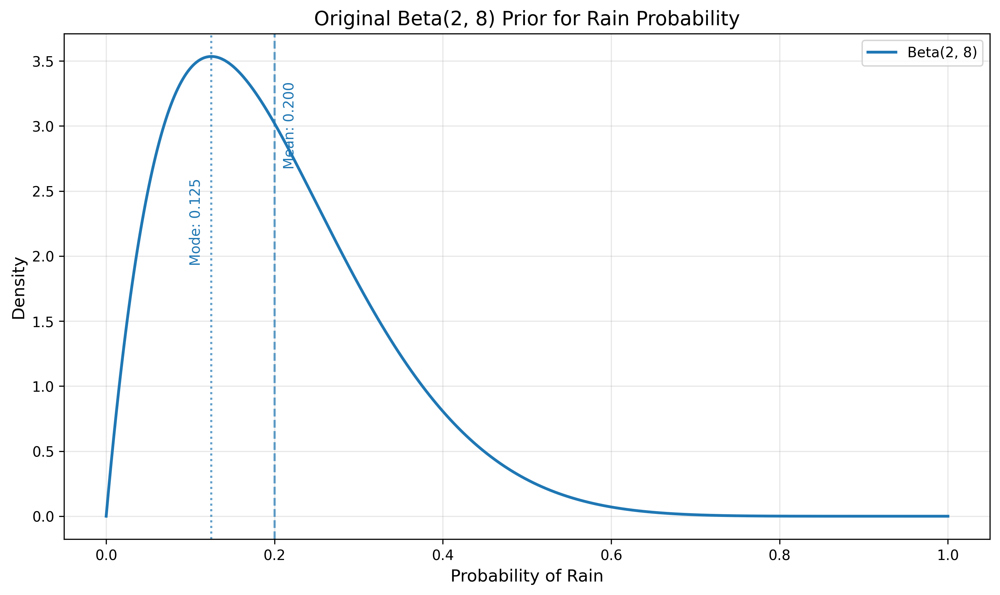
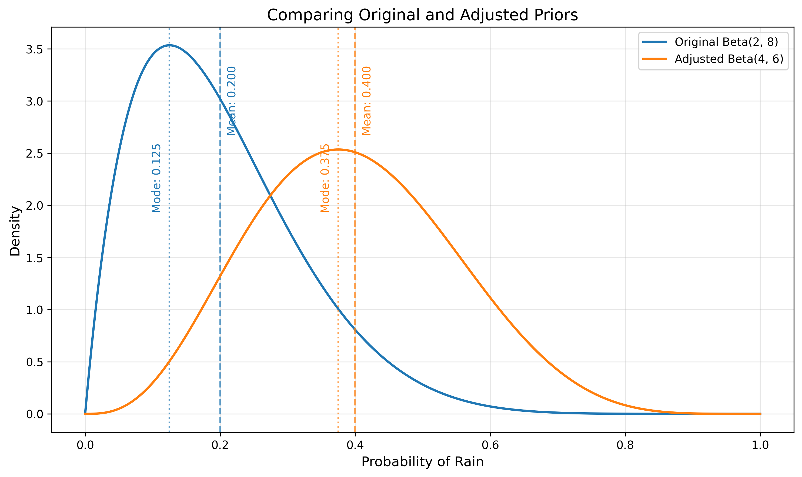
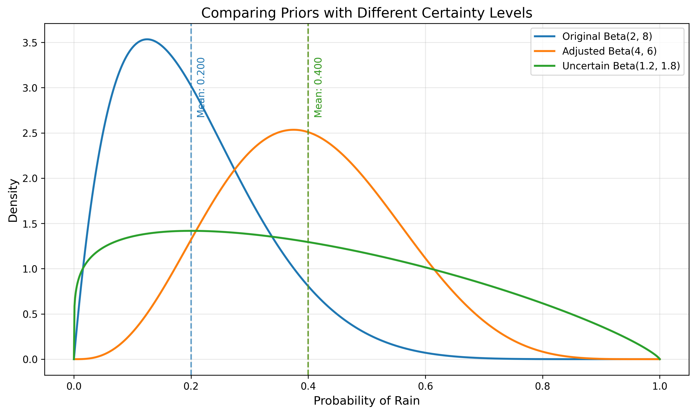
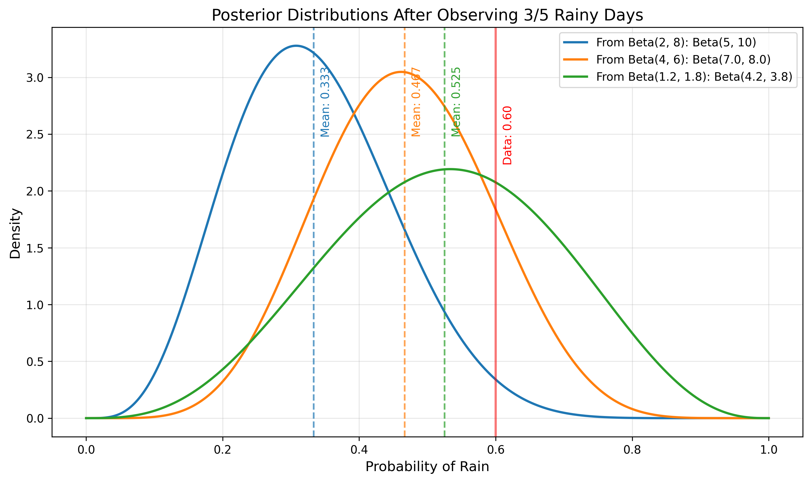
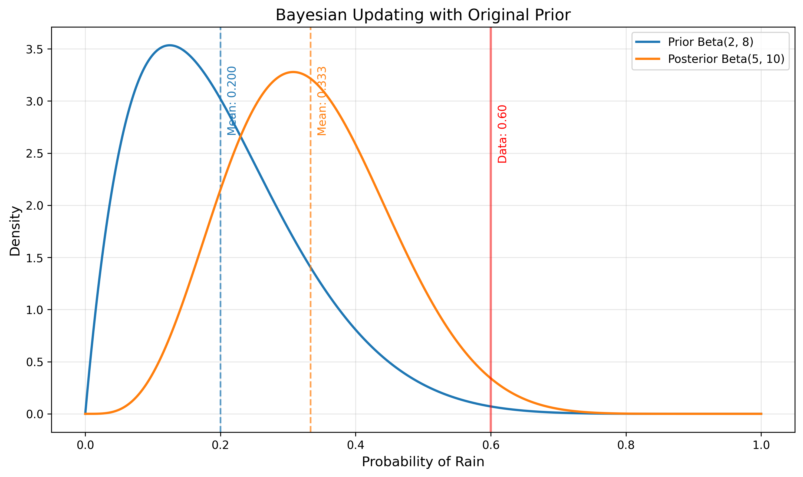
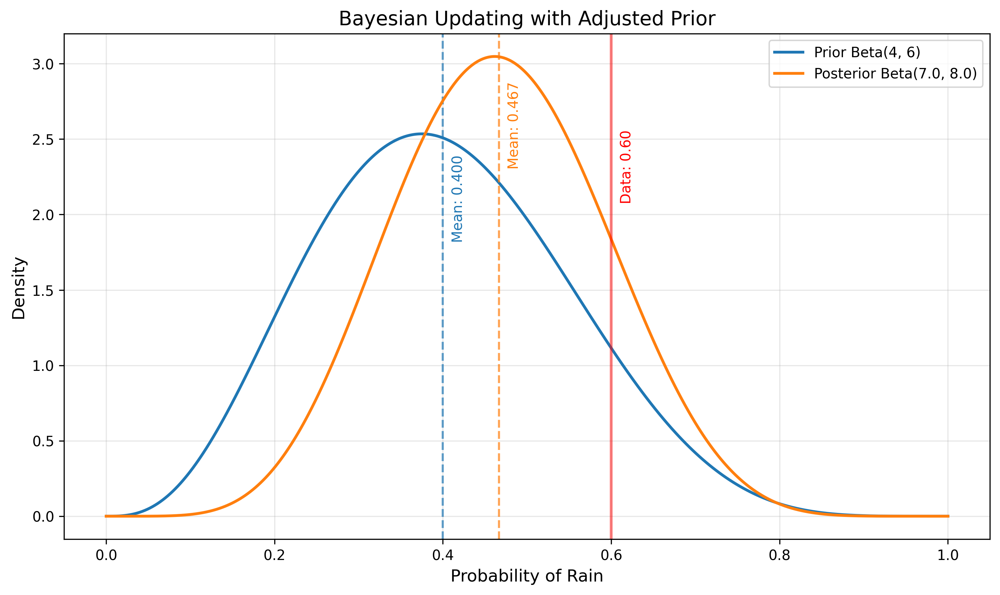
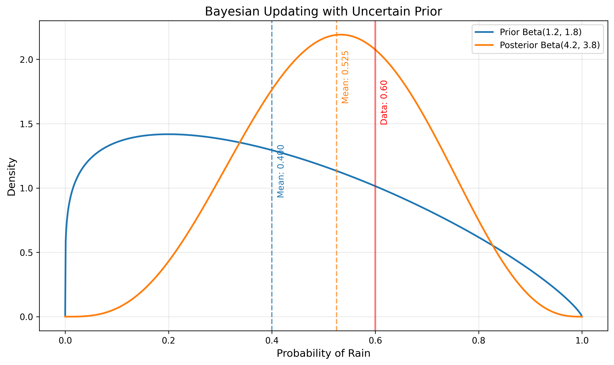
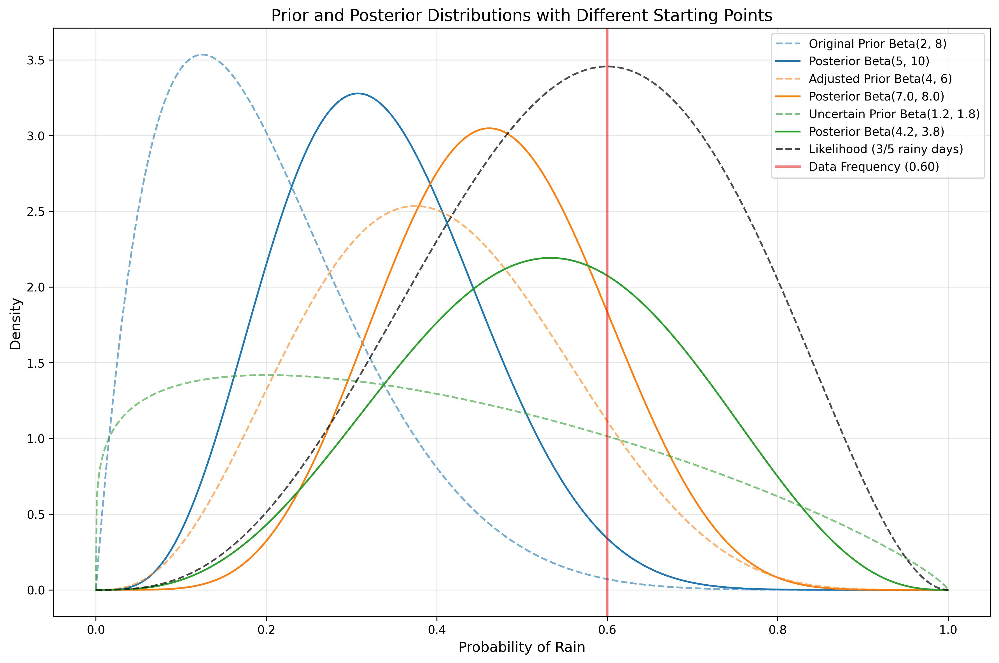

# Question 18: Updating Prior Distributions in Weather Forecasting

## Problem Statement
A meteorologist is applying Bayesian inference to forecast the probability of rain for tomorrow. Based on historical weather data for this time of year, she has chosen a $\text{Beta}(2, 8)$ prior distribution for the probability of rain. This prior distribution has a mean of $\frac{2}{2+8} = 0.2$, indicating that based on historical patterns alone, there is a 20% chance of rain tomorrow.

However, the meteorologist receives new information: a special weather report indicating that a storm system is approaching the area. This new information suggests a higher probability of rain than the historical average would indicate, but it hasn't been quantified precisely.

### Task
1. Explain why the meteorologist should consider changing her prior distribution (currently $\text{Beta}(2, 8)$) in light of this new information about the approaching storm system.
2. If the meteorologist wants to adjust her prior to reflect a 40% probability of rain (instead of the original 20% from the $\text{Beta}(2, 8)$ prior), while maintaining the same level of certainty, what new Beta parameters $(\alpha, \beta)$ should she use?
3. What would be a reasonable approach if she became more uncertain about the rain probability after hearing conflicting reports from different weather services? Provide specific Beta parameters that would represent this increased uncertainty while maintaining the expected 40% probability of rain.
4. If she observes rainy conditions on 3 out of the next 5 days, calculate the posterior distribution for both the original and adjusted priors. Compare how the different priors affect the final forecast and explain which prior leads to the most accurate posterior prediction.

## Understanding the Problem

In this problem, we are applying Bayesian updating to weather forecasting. The meteorologist starts with a $\text{Beta}(2, 8)$ prior for the probability of rain, which encodes her initial belief based on historical data. This prior has a mean of $\frac{\alpha}{\alpha+\beta} = \frac{2}{2+8} = 0.2$, indicating a 20% chance of rain.

The Beta distribution is the conjugate prior for the Bernoulli likelihood, making it ideal for binary events like rain/no-rain. It's defined by two parameters, $\alpha$ and $\beta$, which can be interpreted as "$\alpha - 1$" successes (rainy days) and "$\beta - 1$" failures (non-rainy days) in previous observations.

When new information arrives (the storm system), Bayesian reasoning dictates that the prior should be updated to incorporate this information, even before formal observations are made. The tasks involve understanding how to adjust the Beta distribution parameters to reflect:
- Updated beliefs about the probability of rain
- Different levels of certainty
- The impact of these choices on posterior distributions after observing actual data

## Solution

### Step 1: Evaluating the Initial Prior

The meteorologist's initial $\text{Beta}(2, 8)$ prior has the following properties:
- Mean (Expected probability of rain): $\frac{\alpha}{\alpha+\beta} = \frac{2}{10} = 0.2000$
- Mode (Most likely probability): $\frac{\alpha-1}{\alpha+\beta-2} = \frac{1}{8} = 0.125$
- Standard Deviation: $\sqrt{\frac{\alpha\beta}{(\alpha+\beta)^2(\alpha+\beta+1)}} = 0.1206$
- 95% Credible Interval: $(0.0281, 0.4825)$
- Effective Sample Size: $\alpha + \beta - 2 = 8$

The effective sample size ($\alpha + \beta - 2 = 8$) indicates that the prior has the same influence as 8 previous observations. This represents a moderately strong prior belief.

### Step 2: Adjusting the Prior to Reflect New Information

#### Why the Meteorologist Should Update Her Prior

The meteorologist should update her prior because the approaching storm system provides relevant information that isn't captured in the historical data alone. This is a key principle of Bayesian inference: when new information arrives, we should update our beliefs accordingly.

Maintaining the original prior would mean ignoring valuable information about current conditions, which would likely lead to poorer forecasts. The forecast should represent the best current belief about tomorrow's weather, integrating both historical patterns and current meteorological conditions.

#### Calculating the New Prior Parameters

To adjust the prior to reflect a 40% probability of rain while maintaining the same level of certainty:

1. The mean of a $\text{Beta}(\alpha, \beta)$ distribution is $\frac{\alpha}{\alpha+\beta}$
2. The total strength $(\alpha+\beta)$ represents the prior's certainty
3. For the original $\text{Beta}(2, 8)$ prior, the total strength is $\alpha+\beta = 10$
4. To maintain the same strength but change the mean to 0.4:
   $$\frac{\alpha}{\alpha+\beta} = 0.4$$
   $$\alpha+\beta = 10$$
   Solving: $\alpha = 0.4 \times 10 = 4$, $\beta = 10 - 4 = 6$

Therefore, the new prior should be $\text{Beta}(4, 6)$.

The new $\text{Beta}(4, 6)$ prior has the following properties:
- Mean (Expected probability): $\frac{\alpha}{\alpha+\beta} = \frac{4}{10} = 0.4000$
- Mode (Most likely probability): $\frac{\alpha-1}{\alpha+\beta-2} = \frac{3}{8} = 0.375$
- Standard Deviation: $\sqrt{\frac{\alpha\beta}{(\alpha+\beta)^2(\alpha+\beta+1)}} = 0.1477$
- 95% Credible Interval: $(0.1370, 0.7007)$
- Effective Sample Size: $\alpha + \beta - 2 = 8.0$

### Step 3: Handling Increased Uncertainty

If the meteorologist receives conflicting reports from different weather services, it would be reasonable to increase the uncertainty in her prior while maintaining the mean of 0.4.

To increase uncertainty, we reduce the total strength $(\alpha+\beta)$ while keeping the ratio $\alpha:\beta$ that gives us the desired mean. One approach is to use a $\text{Beta}(1.2, 1.8)$ prior:

- Mean: $\frac{\alpha}{\alpha+\beta} = \frac{1.2}{3} = 0.4000$ (same as the adjusted prior)
- Standard Deviation: $\sqrt{\frac{\alpha\beta}{(\alpha+\beta)^2(\alpha+\beta+1)}} = 0.2449$ (much higher than the adjusted prior's 0.1477)
- 95% Credible Interval: $(0.0268, 0.8877)$ (much wider than the adjusted prior)
- Effective Sample Size: $\alpha + \beta - 2 = 1.0$ (much lower than the adjusted prior's 8.0)

This prior maintains the expected probability of rain at 40% but expresses much less certainty about this value, allowing for a wider range of possible probabilities.

### Step 4: Calculating Posterior Distributions After Observing Data

After observing 3 rainy days out of 5, we can calculate the posterior distributions for each prior. For a $\text{Beta}(\alpha, \beta)$ prior with observed data of $s$ successes and $f$ failures, the posterior is $\text{Beta}(\alpha+s, \beta+f)$.

1. From Original Prior $\text{Beta}(2, 8)$:
   - Posterior: $\text{Beta}(2+3, 8+2) = \text{Beta}(5, 10)$
   - Mean: $\frac{\alpha}{\alpha+\beta} = \frac{5}{15} = 0.3333$
   - 95% Credible Interval: $(0.1276, 0.5810)$

2. From Adjusted Prior $\text{Beta}(4, 6)$:
   - Posterior: $\text{Beta}(4+3, 6+2) = \text{Beta}(7, 8)$
   - Mean: $\frac{\alpha}{\alpha+\beta} = \frac{7}{15} = 0.4667$
   - 95% Credible Interval: $(0.2304, 0.7114)$

3. From Uncertain Prior $\text{Beta}(1.2, 1.8)$:
   - Posterior: $\text{Beta}(1.2+3, 1.8+2) = \text{Beta}(4.2, 3.8)$
   - Mean: $\frac{\alpha}{\alpha+\beta} = \frac{4.2}{8} = 0.5250$
   - 95% Credible Interval: $(0.2036, 0.8347)$

### Step 5: Comparing the Effects of Different Priors

The impact of the prior choice is evident in the posterior distributions:

1. The original $\text{Beta}(2, 8)$ prior, with its low mean of 0.2, pulls the posterior mean down to 0.3333, despite the data showing 3/5 rainy days (60%).

2. The adjusted $\text{Beta}(4, 6)$ prior with a mean of 0.4 leads to a posterior mean of 0.4667, which is closer to but still below the observed frequency of 60%.

3. The uncertain $\text{Beta}(1.2, 1.8)$ prior allows the data to have more influence, resulting in a posterior mean of 0.5250, closest to the observed frequency.

The following visualizations show the Bayesian updating process for each prior:

## Visual Explanations

### Prior and Posterior Distributions with Different Starting Points

This comprehensive visualization shows all three priors (dashed lines) and their corresponding posteriors (solid lines) after observing the same data (3 rainy days out of 5). The black dashed line represents the likelihood function based on the observed data.

Key observations:
- The more certain priors (blue and orange) have narrower distributions and exert more influence on their posteriors
- The uncertain prior (green) is flatter and allows the data to have more influence
- All posteriors move toward the data, but the amount of movement depends on the prior's strength
- The likelihood function peaks at 0.6, corresponding to the observed frequency of 3/5

## Key Insights

### Theoretical Foundations
- **Prior Updates**: Bayesian analysis provides a formal framework for updating beliefs when new information arrives, even before collecting numerical data
- **Beta-Bernoulli Conjugacy**: The Beta distribution's conjugacy with the Bernoulli likelihood makes it ideal for binary events like rain forecasting
- **Parameter Interpretation**: In a $\text{Beta}(\alpha,\beta)$ distribution, the parameters can be interpreted as "$\alpha-1$ successes" and "$\beta-1$ failures" in previous observations
- **Certainty vs. Mean**: The total $(\alpha+\beta)$ represents the certainty or strength of the prior, while the ratio $\frac{\alpha}{\alpha+\beta}$ determines the mean

### Practical Applications
- **Weather Forecasting**: Meteorologists can use Bayesian methods to incorporate both historical data and current conditions
- **Balancing History and Current Conditions**: When conditions change (like an approaching storm), appropriate prior updates can improve forecasting accuracy
- **Uncertainty Management**: Different levels of certainty can be expressed through the prior's strength, allowing for more nuanced forecasting
- **Continuous Updating**: As new observations arrive, forecasts can be continuously refined through Bayesian updating

### Statistical Insights
- **Prior Influence**: Stronger priors (larger $\alpha+\beta$) have more influence on the posterior, while weaker priors allow data to dominate
- **Credible Intervals**: Bayesian analysis provides direct probability statements about parameter values through credible intervals
- **Mean vs. Mode**: For skewed distributions like Beta, understanding the difference between the mean (average) and mode (most likely value) is important
- **Parameter Effects**: Changing $\alpha$ and $\beta$ while maintaining their ratio preserves the mean but changes the variance

## Conclusion

This problem demonstrates the power and flexibility of Bayesian analysis in a practical weather forecasting context. By using the Beta distribution as a prior for rain probability, the meteorologist can:

1. Incorporate new information by adjusting the prior parameters
2. Express different levels of certainty while maintaining the same expected value
3. Rationally update forecasts as new observations arrive
4. Balance the influence of historical data with current conditions

The choice of prior is important but not arbitrary - it should reflect the best available information before observing data. The more uncertain the prior, the more influence the data will have on the posterior. This balancing of prior knowledge and observed data is at the heart of Bayesian inference.

In weather forecasting, where conditions can change rapidly, the ability to update beliefs systematically as new information arrives is particularly valuable. The Bayesian approach provides meteorologists with a principled framework for making and revising predictions in the face of uncertainty.