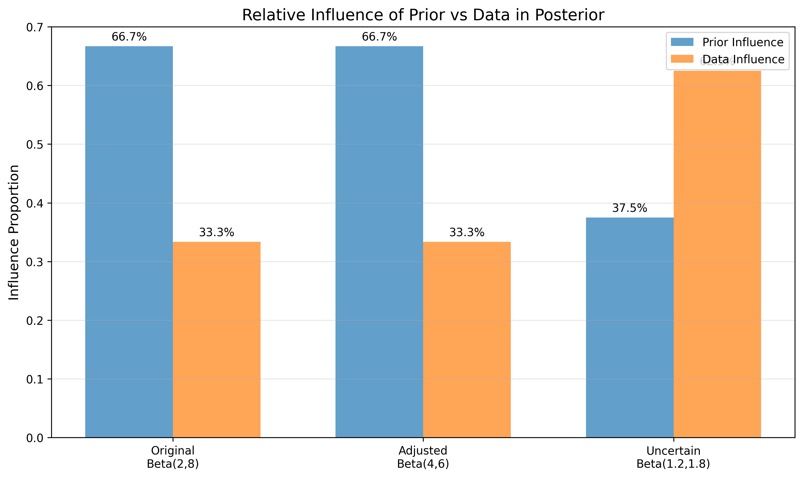
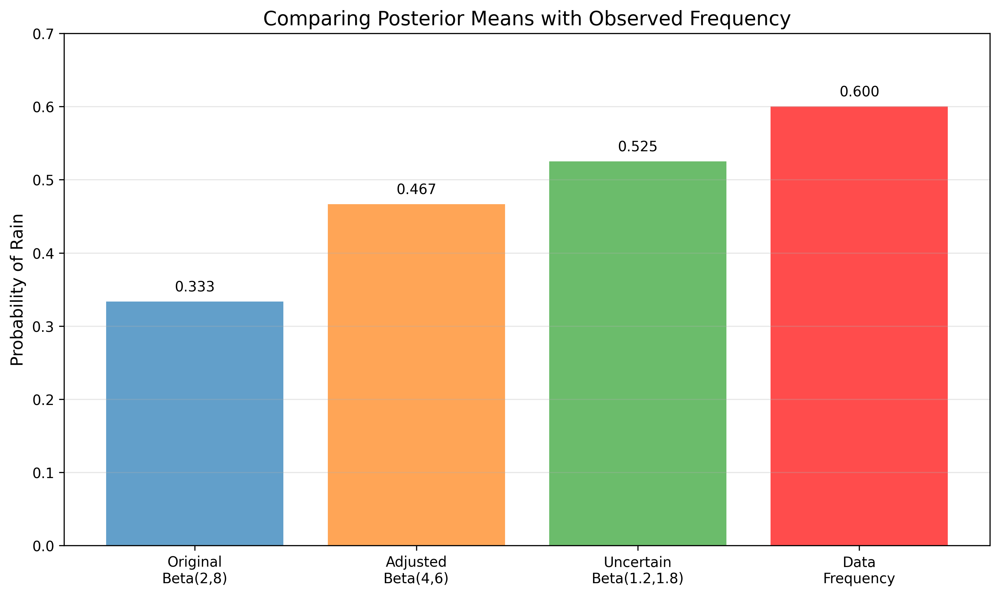

# Question 18: Updating Prior Distributions in Weather Forecasting

## Problem Statement
A meteorologist is applying Bayesian inference to forecast the probability of rain for tomorrow. Based on historical weather data for this time of year, she has chosen a $\text{Beta}(2, 8)$ prior distribution for the probability of rain. This prior distribution has a mean of $\frac{2}{2+8} = 0.2$, indicating that based on historical patterns alone, there is a 20% chance of rain tomorrow.

However, the meteorologist receives new information: a special weather report indicating that a storm system is approaching the area. This new information suggests a higher probability of rain than the historical average would indicate, but it hasn't been quantified precisely.

### Task
1. Explain why the meteorologist should consider changing her prior distribution (currently $\text{Beta}(2, 8)$) in light of this new information about the approaching storm system.
2. If the meteorologist wants to adjust her prior to reflect a 40% probability of rain (instead of the original 20% from the $\text{Beta}(2, 8)$ prior), while maintaining the same level of certainty, what new Beta parameters $(\alpha, \beta)$ should she use?
3. What would be a reasonable approach if she became more uncertain about the rain probability after hearing conflicting reports from different weather services? Provide specific Beta parameters that would represent this increased uncertainty while maintaining the expected 40% probability of rain.
4. If she observes rainy conditions on 3 out of the next 5 days, calculate the posterior distribution for both the original and adjusted priors. Compare how the different priors affect the final forecast and explain which prior leads to the most accurate posterior prediction.

## Understanding the Problem

In this problem, we are applying Bayesian updating to weather forecasting. The meteorologist starts with a $\text{Beta}(2, 8)$ prior for the probability of rain, which encodes her initial belief based on historical data. This prior has a mean of $\frac{\alpha}{\alpha+\beta} = \frac{2}{2+8} = 0.2$, indicating a 20% chance of rain.

The $\text{Beta}(2, 8)$ prior has the following properties:
- Mean: $\frac{\alpha}{\alpha+\beta} = \frac{2}{10} = 0.2000$
- Mode: $\frac{\alpha-1}{\alpha+\beta-2} = \frac{1}{8} = 0.125$
- Standard Deviation: $0.1206$
- 95% Credible Interval: $(0.0281, 0.4825)$
- Effective Sample Size: $\alpha + \beta - 2 = 8$

The Beta distribution is the conjugate prior for the Bernoulli likelihood, making it ideal for binary events like rain/no-rain. It's defined by two parameters, $\alpha$ and $\beta$, which can be interpreted as "$\alpha - 1$" successes (rainy days) and "$\beta - 1$" failures (non-rainy days) in previous observations.

## Solution

### Task 1: Why the Meteorologist Should Update Her Prior

The meteorologist should update her prior distribution because:

1. **Bayesian Principle**: When new relevant information becomes available, beliefs should be updated accordingly, even before collecting new numerical data.

2. **Specificity**: The new information (approaching storm system) is specific to this forecast period, while the original prior based on historical data represents average conditions.

3. **Ignoring Information**: Using only the historical prior when a storm is approaching would mean ignoring valuable information, leading to potentially inaccurate forecasts.

4. **Information Relevance**: The approaching storm directly affects the physical conditions that influence rain probability, making it highly relevant information.

5. **Expert Knowledge Integration**: Meteorological expertise about storm systems and their effects on local weather should be incorporated into the forecast.

When a storm system approaches, it fundamentally changes the physical conditions that determine rain probability. Using the historical-data-based prior alone would fail to account for these changed conditions, leading to a forecast that underestimates the probability of rain.

### Task 2: Calculating New Prior Parameters for 40% Probability

To adjust the prior to reflect a 40% probability of rain while maintaining the same level of certainty:

1. For a $\text{Beta}(\alpha, \beta)$ distribution, the mean is: $\mu = \frac{\alpha}{\alpha+\beta}$
2. The strength/certainty is represented by: $s = \alpha+\beta$
3. We want to maintain the same strength as the original prior: $\alpha+\beta = 2+8 = 10$
4. We want to adjust the mean to 40%: $\frac{\alpha}{\alpha+\beta} = 0.4$
5. Solving for $\alpha$ with these constraints:
   $$\frac{\alpha}{\alpha+\beta} = 0.4$$
   $$\alpha = 0.4(\alpha+\beta)$$
   $$\alpha = 0.4(10)$$
   $$\alpha = 4$$
6. And $\beta = 10-\alpha = 10-4 = 6$

Therefore, the new prior should be $\text{Beta}(4, 6)$.

The $\text{Beta}(4, 6)$ prior has the following properties:
- Mean: $\frac{\alpha}{\alpha+\beta} = \frac{4}{10} = 0.4000$
- Mode: $\frac{\alpha-1}{\alpha+\beta-2} = \frac{3}{8} = 0.375$
- Standard Deviation: $0.1477$
- 95% Credible Interval: $(0.1370, 0.7007)$
- Effective Sample Size: $\alpha + \beta - 2 = 8.0$

### Task 3: Handling Increased Uncertainty

If the meteorologist receives conflicting reports from different weather services, it would be reasonable to increase the uncertainty in her prior while maintaining the mean of 0.4.

To increase uncertainty while maintaining the same mean:
1. The mean of a $\text{Beta}(\alpha, \beta)$ is: $\mu = \frac{\alpha}{\alpha+\beta} = 0.4$
2. This gives us: $\alpha = 0.4(\alpha+\beta)$, or $\alpha = \frac{0.4\beta}{0.6}$
3. The strength $(\alpha+\beta)$ represents certainty - smaller values mean less certainty
4. We want $\frac{\alpha}{\alpha+\beta} = 0.4$ but with lower $\alpha+\beta$ than the original 10
5. If we choose $(\alpha+\beta) = 3$ (much smaller than 10):
   $$\alpha = 0.4(3) = 1.2$$
   $$\beta = 3-1.2 = 1.8$$
6. This gives $\text{Beta}(1.2, 1.8)$ with the same mean but much less certainty

The $\text{Beta}(1.2, 1.8)$ prior has the following properties:
- Mean: $\frac{\alpha}{\alpha+\beta} = \frac{1.2}{3} = 0.4000$ (same as the adjusted prior)
- Standard Deviation: $0.2449$ (much higher than the adjusted prior's $0.1477$)
- 95% Credible Interval: $(0.0268, 0.8877)$ (much wider than the adjusted prior)
- Effective Sample Size: $\alpha + \beta - 2 = 1.0$ (much lower than the adjusted prior's 8.0)

This uncertain prior maintains the expected probability of rain at 40% but expresses much less certainty about this value, allowing for a wider range of possible probabilities. This appropriately reflects the conflicting information the meteorologist has received.

### Task 4: Posterior Calculation and Comparison

After observing 3 rainy days out of 5, we calculate the posterior distributions for each prior using the conjugacy property of the Beta distribution.

For a $\text{Beta}(\alpha, \beta)$ prior with observed data of $s$ successes and $f$ failures:
$$\text{Posterior} = \text{Beta}(\alpha+s, \beta+f)$$

1. From Original Prior $\text{Beta}(2, 8)$:
   - Posterior: $\text{Beta}(2+3, 8+2) = \text{Beta}(5, 10)$
   - Mean: $\frac{\alpha}{\alpha+\beta} = \frac{5}{15} = 0.3333$ (vs data frequency 0.6000)
   - Difference from data: $0.2667$
   - 95% Credible Interval: $(0.1276, 0.5810)$
   - Prior influence: $66.67\%$, Data influence: $33.33\%$

2. From Adjusted Prior $\text{Beta}(4, 6)$:
   - Posterior: $\text{Beta}(4+3, 6+2) = \text{Beta}(7, 8)$
   - Mean: $\frac{\alpha}{\alpha+\beta} = \frac{7}{15} = 0.4667$ (vs data frequency 0.6000)
   - Difference from data: $0.1333$
   - 95% Credible Interval: $(0.2304, 0.7114)$
   - Prior influence: $66.67\%$, Data influence: $33.33\%$

3. From Uncertain Prior $\text{Beta}(1.2, 1.8)$:
   - Posterior: $\text{Beta}(1.2+3, 1.8+2) = \text{Beta}(4.2, 3.8)$
   - Mean: $\frac{\alpha}{\alpha+\beta} = \frac{4.2}{8} = 0.5250$ (vs data frequency 0.6000)
   - Difference from data: $0.0750$
   - 95% Credible Interval: $(0.2036, 0.8347)$
   - Prior influence: $37.50\%$, Data influence: $62.50\%$

Accuracy Ranking (closest to observed data frequency):
1. Uncertain Prior $\text{Beta}(1.2,1.8)$: posterior mean = 0.5250, difference = 0.0750
2. Adjusted Prior $\text{Beta}(4,6)$: posterior mean = 0.4667, difference = 0.1333
3. Original Prior $\text{Beta}(2,8)$: posterior mean = 0.3333, difference = 0.2667

The uncertain prior $\text{Beta}(1.2, 1.8)$ leads to the most accurate posterior prediction. Its posterior mean of 0.5250 is closest to the observed frequency of 0.6000. This is because this prior has the right balance between prior expectations and allowing the data to influence the estimate. The uncertain prior has a prior influence of only 37.5%, allowing the data to have a much stronger influence (62.5%) on the posterior.

The following visualizations show the Bayesian updating process for each prior:

### Comprehensive Visualization of All Priors and Posteriors

This comprehensive visualization shows all three priors (dashed lines) and their corresponding posteriors (solid lines) after observing the same data (3 rainy days out of 5). The black dashed line represents the likelihood function based on the observed data, and the red vertical line shows the observed frequency of 0.6.

## Key Insights

### Theoretical Foundations
- **Prior Updates**: Bayesian analysis provides a formal framework for updating beliefs when new information arrives, even before collecting numerical data
- **Beta-Bernoulli Conjugacy**: The Beta distribution's conjugacy with the Bernoulli likelihood makes it ideal for binary events like rain forecasting
- **Parameter Interpretation**: In a $\text{Beta}(\alpha,\beta)$ distribution, the parameters can be interpreted as "$\alpha-1$ successes" and "$\beta-1$ failures" in previous observations
- **Certainty vs. Mean**: The total $(\alpha+\beta)$ represents the certainty or strength of the prior, while the ratio $\frac{\alpha}{\alpha+\beta}$ determines the mean

### Practical Applications
- **Weather Forecasting**: Meteorologists can use Bayesian methods to incorporate both historical data and current conditions
- **Balancing History and Current Conditions**: When conditions change (like an approaching storm), appropriate prior updates can improve forecasting accuracy
- **Uncertainty Management**: Different levels of certainty can be expressed through the prior's strength, allowing for more nuanced forecasting
- **Continuous Updating**: As new observations arrive, forecasts can be continuously refined through Bayesian updating

### Statistical Insights
- **Prior Influence**: Stronger priors (larger $\alpha+\beta$) have more influence on the posterior, while weaker priors allow data to dominate
- **Credible Intervals**: Bayesian analysis provides direct probability statements about parameter values through credible intervals
- **Mean vs. Mode**: For skewed distributions like Beta, understanding the difference between the mean (average) and mode (most likely value) is important
- **Parameter Effects**: Changing $\alpha$ and $\beta$ while maintaining their ratio preserves the mean but changes the variance

## Conclusion

This problem demonstrates the power and flexibility of Bayesian analysis in a practical weather forecasting context. By using the Beta distribution as a prior for rain probability, the meteorologist can:

1. Incorporate new information by adjusting the prior parameters
2. Express different levels of certainty while maintaining the same expected value
3. Rationally update forecasts as new observations arrive
4. Balance the influence of historical data with current conditions

The most accurate posterior prediction came from the uncertain prior $\text{Beta}(1.2, 1.8)$, which allowed the data to have more influence (62.5%) while still incorporating the prior expectation of increased rain probability. This demonstrates that when forecasting with limited data (only 5 days), choosing a prior with the right level of certainty can be as important as choosing the right prior mean.

In weather forecasting, where conditions can change rapidly, the ability to update beliefs systematically as new information arrives is particularly valuable. The Bayesian approach provides meteorologists with a principled framework for making and revising predictions in the face of uncertainty.