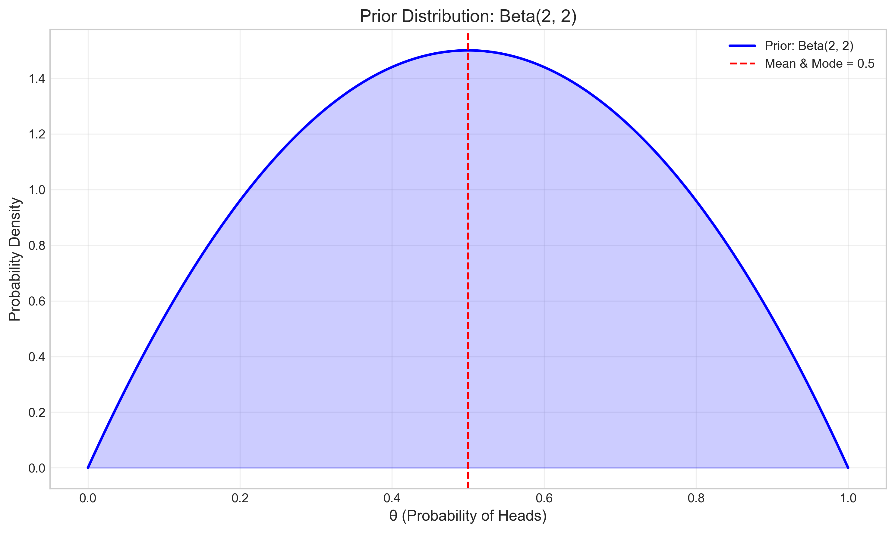
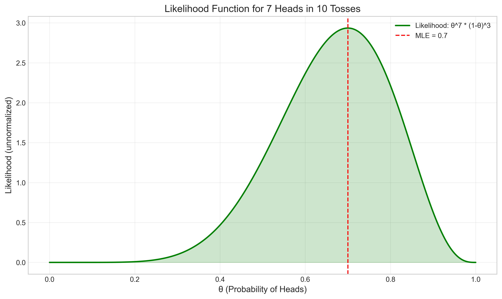
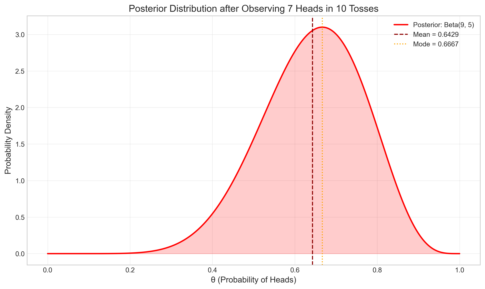
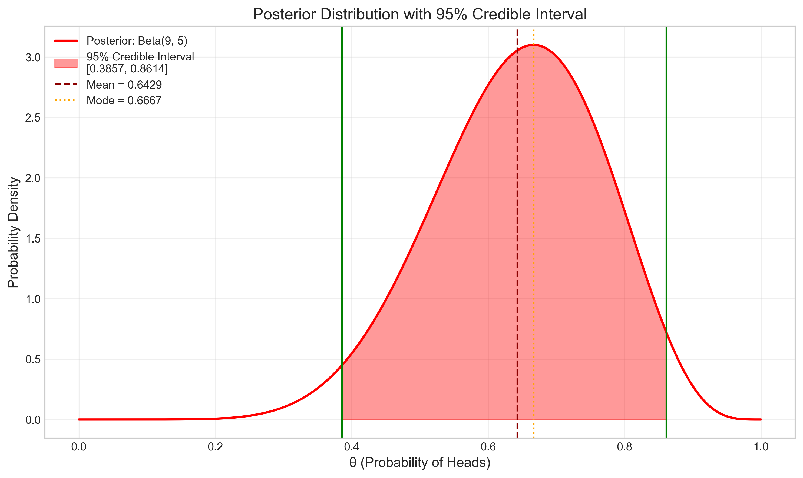
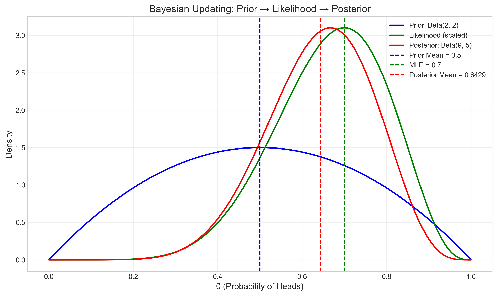
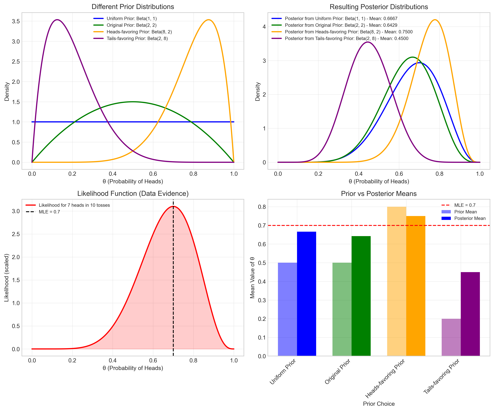

# Question 1: Bayesian Coin Flip Analysis

## Problem Statement
Suppose we have a coin with an unknown probability $\theta$ of landing heads. We want to estimate $\theta$ using Bayesian inference.

1. Assume a prior distribution for $\theta$ as $\text{Beta}(2, 2)$
2. We toss the coin 10 times and observe 7 heads and 3 tails

## Task
1. Write down the likelihood function for the observed data
2. Calculate the posterior distribution for $\theta$
3. Find the posterior mean, mode, and variance of $\theta$
4. Calculate the 95% credible interval for $\theta$

## Solution

To estimate the probability of a coin landing heads using Bayesian inference, we need to combine our prior beliefs with observed data to form a posterior distribution.

### Step 1: Understanding the Prior Distribution

We start with a Beta(2, 2) prior distribution for $\theta$. The Beta distribution is a conjugate prior for the Bernoulli likelihood, which makes the posterior calculations analytically tractable.

The probability density function (PDF) of Beta($\alpha$, $\beta$) is:

$$f(\theta; \alpha, \beta) = \frac{\theta^{\alpha-1} (1-\theta)^{\beta-1}}{B(\alpha, \beta)}$$

where $B(\alpha, \beta)$ is the Beta function, which acts as a normalizing constant.

For our Beta(2, 2) prior:

$$f(\theta; 2, 2) = \frac{\theta^{2-1} (1-\theta)^{2-1}}{B(2, 2)} = 6\theta(1-\theta)$$

This is a symmetric distribution centered at 0.5, reflecting a prior belief that the coin is likely fair but allowing for some uncertainty.

The Beta(2, 2) prior has the following properties:
- Mean = $\frac{\alpha}{\alpha+\beta} = \frac{2}{2+2} = 0.5$
- Mode = $\frac{\alpha-1}{\alpha+\beta-2} = \frac{2-1}{2+2-2} = \frac{1}{2} = 0.5$
- Variance = $\frac{\alpha\beta}{(\alpha+\beta)^2(\alpha+\beta+1)} = \frac{2 \times 2}{(2+2)^2(2+2+1)} = \frac{4}{80} = 0.05$

### Step 2: Formulating the Likelihood Function

For a sequence of coin flips, the likelihood function follows a binomial distribution:

$$L(\theta | \text{data}) = P(\text{data} | \theta) = \binom{n}{k} \theta^k (1-\theta)^{n-k}$$

where:
- $n$ is the number of trials (10 in our case)
- $k$ is the number of successes (7 heads)
- $\binom{n}{k}$ is the binomial coefficient

In our case:

$$L(\theta | 7 \text{ heads in } 10 \text{ tosses}) = \binom{10}{7} \theta^7 (1-\theta)^3$$

Since the binomial coefficient is a constant with respect to $\theta$, we can write:

$$L(\theta | \text{data}) \propto \theta^7 (1-\theta)^3$$

The likelihood function peaks at the maximum likelihood estimate (MLE), which is $\frac{k}{n} = \frac{7}{10} = 0.7$.

### Step 3: Calculating the Posterior Distribution

Using Bayes' theorem, the posterior distribution is proportional to the product of the likelihood and the prior:

$$P(\theta | \text{data}) \propto P(\text{data} | \theta) \times P(\theta)$$

With our Beta(2, 2) prior and the binomial likelihood:

$$P(\theta | \text{data}) \propto \theta^7 (1-\theta)^3 \times \theta^{2-1} (1-\theta)^{2-1}$$
$$P(\theta | \text{data}) \propto \theta^{7+2-1} (1-\theta)^{3+2-1}$$
$$P(\theta | \text{data}) \propto \theta^8 (1-\theta)^4$$

This is proportional to the PDF of a Beta(9, 5) distribution. Therefore:

$$P(\theta | \text{data}) = \text{Beta}(9, 5)$$

The posterior distribution has the following properties:
- Posterior Mean = $\frac{\alpha'}{\alpha'+\beta'} = \frac{9}{9+5} = \frac{9}{14} = 0.6429$
- Posterior Mode = $\frac{\alpha'-1}{\alpha'+\beta'-2} = \frac{9-1}{9+5-2} = \frac{8}{12} = 0.6667$
- Posterior Variance = $\frac{\alpha'\beta'}{(\alpha'+\beta')^2(\alpha'+\beta'+1)} = \frac{9 \times 5}{14^2 \times 15} = \frac{45}{2940} = 0.0153$
- Posterior Standard Deviation = $\sqrt{0.0153} = 0.1237$

### Step 4: Calculating the 95% Credible Interval

The 95% credible interval represents the range of values for $\theta$ that contains 95% of the posterior probability mass. For a Beta distribution, we can calculate this using the inverse cumulative distribution function (CDF).

For our Beta(9, 5) posterior:
- Lower bound (2.5th percentile): 0.3857
- Upper bound (97.5th percentile): 0.8614

Therefore, the 95% credible interval is [0.3857, 0.8614].

This means that given our prior beliefs and the observed data, we are 95% confident that the true probability of the coin landing heads lies between 0.3857 and 0.8614.

### Step 5: Comparing Prior, Likelihood, and Posterior

The figure below shows how our belief about $\theta$ was updated by incorporating the observed data.

- The prior (blue line) represents our initial belief centered at 0.5.
- The likelihood (green line) represents what the data suggests, with a peak at the MLE of 0.7.
- The posterior (red line) is a compromise between the prior and the likelihood, with a mean of 0.6429.

Notice that the posterior is shifted towards the likelihood compared to the prior, but not entirely to the MLE. This illustrates the Bayesian updating process, where the posterior is influenced by both prior beliefs and observed data.

### Step 6: Effect of Different Priors

The choice of prior can significantly impact the posterior distribution, especially with limited data. Let's compare how different priors would affect our inference:

The figure shows:
- Different prior distributions (top left)
- Resulting posterior distributions (top right)
- The likelihood function (bottom left)
- Comparison of prior and posterior means (bottom right)

With a uniform prior Beta(1, 1), the posterior mean (0.6667) is closer to the MLE (0.7) than with our original Beta(2, 2) prior (0.6429). This is because the uniform prior exerts less influence on the posterior.

With informative priors like Beta(8, 2) (strongly favoring heads) or Beta(2, 8) (strongly favoring tails), the posteriors are pulled more toward the respective prior means. However, even with these strongly informative priors, the posterior still shifts significantly toward the data's MLE.

## Key Insights

1. **Bayesian Updating**: The posterior distribution combines information from both the prior and the data. As we observe more data, the influence of the prior diminishes, and the posterior converges toward the likelihood.

2. **Conjugate Priors**: The Beta distribution is conjugate to the Binomial likelihood, which means the posterior follows the same distribution family as the prior but with updated parameters. This algebraic convenience makes the calculations tractable.

3. **Effect of Prior Choice**: Different priors lead to different posteriors, especially with limited data. However, as the amount of data increases, the posteriors from different priors converge.

4. **Posterior vs. MLE**: The posterior mean (0.6429) lies between the prior mean (0.5) and the MLE (0.7). This reflects the Bayesian compromise between prior knowledge and observed data.

5. **Credible Intervals**: Unlike frequentist confidence intervals, Bayesian credible intervals have a direct probability interpretation. We can say there is a 95% probability that the true value of $\theta$ lies within the credible interval, given our prior and the observed data.

## Conclusion

In this Bayesian analysis of a coin flip problem:

1. The likelihood function is $L(\theta | \text{data}) \propto \theta^7 (1-\theta)^3$
2. With a Beta(2, 2) prior, the posterior distribution is Beta(9, 5)
3. The posterior mean is 0.6429, the mode is 0.6667, and the variance is 0.0153
4. The 95% credible interval is [0.3857, 0.8614]

This example illustrates the power of Bayesian inference in providing a complete probabilistic description of uncertainty about the parameter $\theta$, rather than just a point estimate. The approach naturally incorporates prior knowledge and updates it with observed data, yielding a posterior distribution that quantifies our updated beliefs about the parameter. 