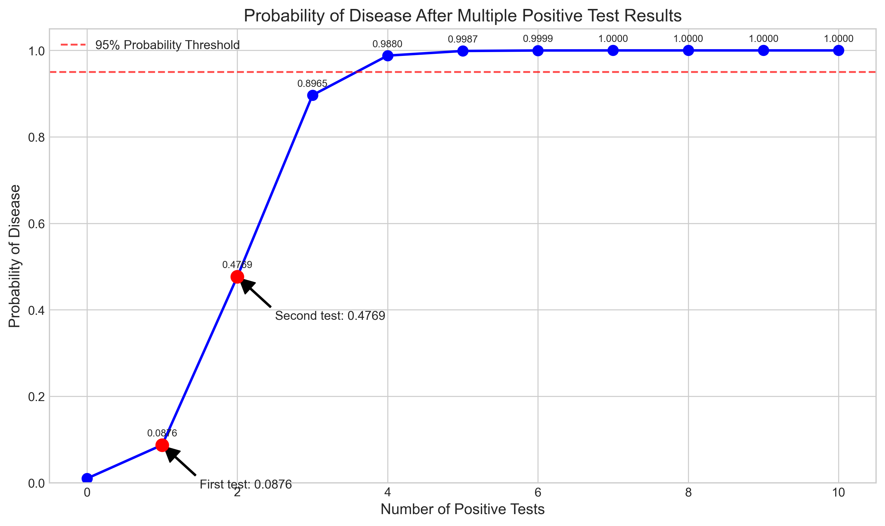
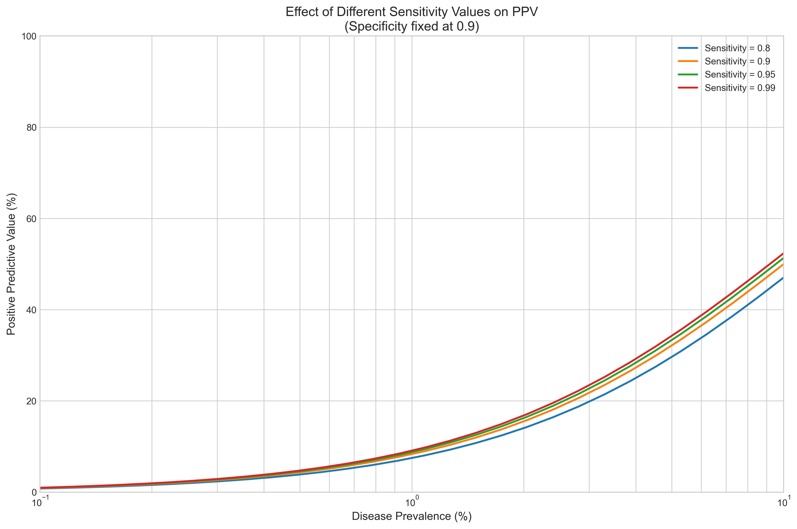

# Question 2: Bayesian Medical Diagnostics

## Problem Statement
Consider a diagnostic test for a disease that affects 1% of the population. The test has a true positive rate (sensitivity) of 95% and a true negative rate (specificity) of 90%.

## Task
1. Using Bayes' theorem, calculate the probability that a person has the disease given a positive test result
2. If we repeat the test on the same person and it comes back positive again, what is the updated probability that the person has the disease?
3. How many consecutive positive test results would be needed to have at least a 95% probability that the person has the disease?
4. Discuss how the prevalence of the disease affects the interpretation of test results

## Solution

### Step 1: Understanding the Problem

We are given:
- Disease prevalence: 1% of the population (prior probability)
- Test sensitivity (true positive rate): 95% - probability of a positive test given the person has the disease
- Test specificity (true negative rate): 90% - probability of a negative test given the person does not have the disease

We need to apply Bayes' theorem to find the probability of having the disease given a positive test result.

### Step 2: Applying Bayes' Theorem

Let's define our variables:
- $P(D) = 0.01$ (disease prevalence, prior probability)
- $P(+|D) = 0.95$ (sensitivity, probability of positive test given disease)
- $P(-|\neg D) = 0.90$ (specificity, probability of negative test given no disease)
- $P(+|\neg D) = 0.10$ (false positive rate, 1 - specificity)

Bayes' theorem states:
$$P(D|+) = \frac{P(+|D) \times P(D)}{P(+)}$$

Where $P(+)$ is the total probability of a positive test:
$$P(+) = P(+|D) \times P(D) + P(+|\neg D) \times P(\neg D)$$

Calculating $P(+)$:
$$P(+) = 0.95 \times 0.01 + 0.10 \times 0.99 = 0.0095 + 0.099 = 0.1085$$

Now we can calculate $P(D|+)$:
$$P(D|+) = \frac{0.95 \times 0.01}{0.1085} = \frac{0.0095}{0.1085} = 0.0876$$

Therefore, despite a positive test result, there's only an 8.76% chance the person has the disease.

This is visualized in the diagram below, where we see how the test results break down across a population of 10,000 people:

From the diagram, we can see:
- Among 10,000 people, about 100 will have the disease and 9,900 will not
- Of those with the disease, 95 will test positive (true positives)
- Of those without the disease, 990 will test positive (false positives)
- This gives us a positive predictive value (PPV) of $95/(95+990) = 8.76\%$

### Step 3: Updated Probability After Second Positive Test

For the second test, our prior probability is now the posterior from the first test: $P(D) = 0.0876$.

Applying Bayes' theorem again:
$$P(+) = 0.95 \times 0.0876 + 0.10 \times 0.9124 = 0.1744$$
$$P(D|+,+) = \frac{0.95 \times 0.0876}{0.1744} = 0.4769$$

After two positive tests, the probability of having the disease rises to 47.69%.

The graph below shows how the probability increases with consecutive positive test results:

We can see that the probability increases substantially with each additional positive test result.

### Step 4: Number of Tests Needed for 95% Confidence

To find how many consecutive positive tests are needed to reach 95% probability, we apply Bayes' theorem repeatedly.

The calculation shows that 4 consecutive positive tests are needed to reach a probability of 98.80%, which exceeds our 95% threshold.

### Step 5: Effect of Disease Prevalence on Test Interpretation

The prevalence of the disease has a major impact on the positive predictive value (PPV) of the test.

The graph shows that:
- For rare diseases (low prevalence), the PPV is very low even with good tests
- As prevalence increases, the PPV increases dramatically
- With our test characteristics (95% sensitivity, 90% specificity):
  - At 0.2% prevalence, PPV is only 1.9%
  - At 1% prevalence, PPV is 8.8%
  - At 5% prevalence, PPV is 32.9%

### Step 6: Impact of Test Characteristics on Interpretation

The sensitivity and specificity of the test also affect the PPV, but in different ways:

These graphs show that:
1. For rare diseases, improving sensitivity has relatively little impact on PPV
2. In contrast, improving specificity dramatically increases PPV for rare diseases

## Key Insights

1. **Base Rate Fallacy**: People often ignore the base rate (prevalence) when interpreting test results, leading to overestimation of the probability of disease after a positive test.

2. **Sequential Testing**: Multiple positive tests substantially increase confidence in a diagnosis, which explains why doctors often order confirmatory tests.

3. **Prevalence Matters**: The same test can have very different predictive values depending on the prevalence of the condition in the population being tested.

4. **Specificity is Critical for Rare Conditions**: For rare diseases, the specificity of a test is much more important than sensitivity in determining its usefulness.

5. **Practical Application**: 
   - Mass screening programs for rare diseases require extremely specific tests
   - Tests should be interpreted differently in high-risk vs. low-risk populations
   - Sequential testing is often more valuable than a single highly sensitive test

## Conclusion

Bayes' theorem provides a powerful framework for understanding how to interpret diagnostic test results correctly. The probability of disease given a positive test result is heavily influenced by the prevalence of the disease, not just the accuracy of the test. This explains why medical professionals often use sequential testing and consider patient risk factors when interpreting test results. 