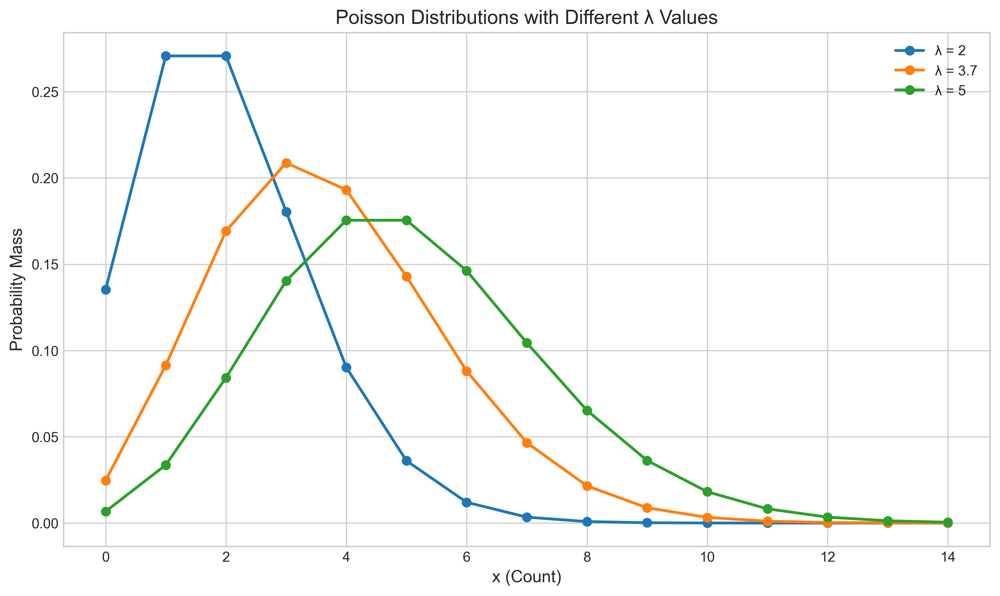
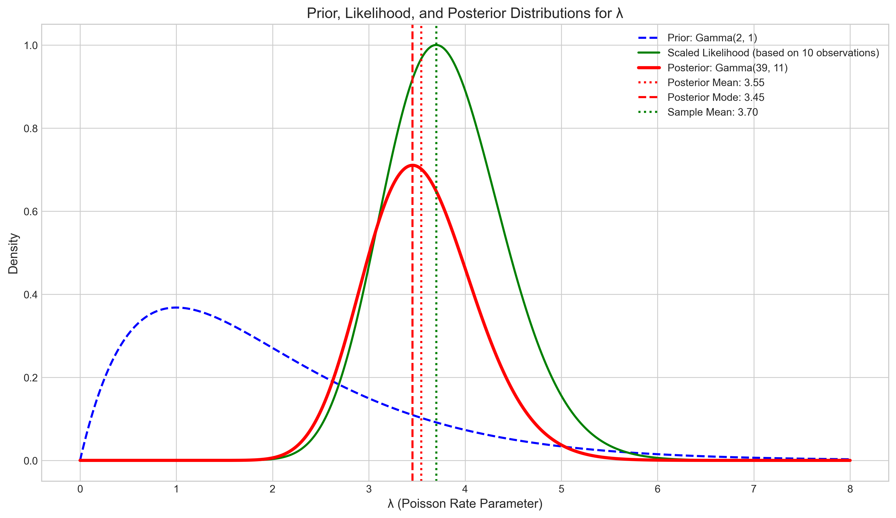
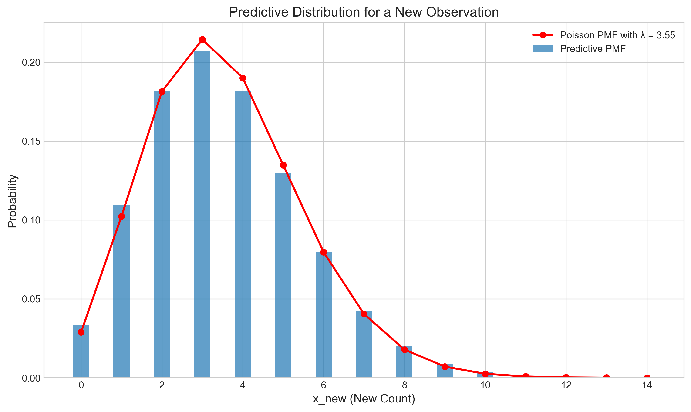
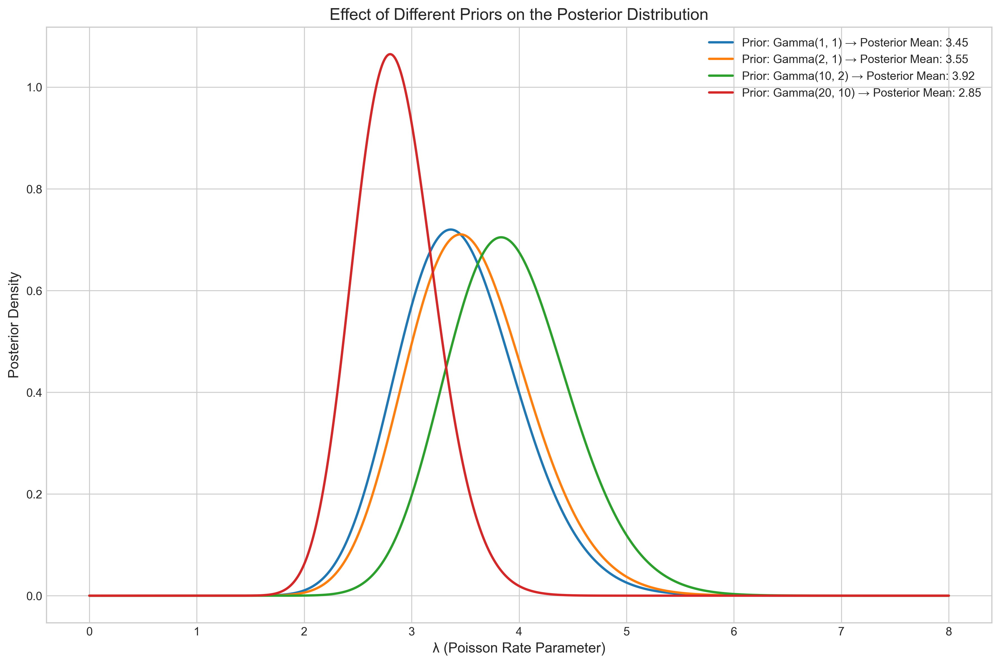
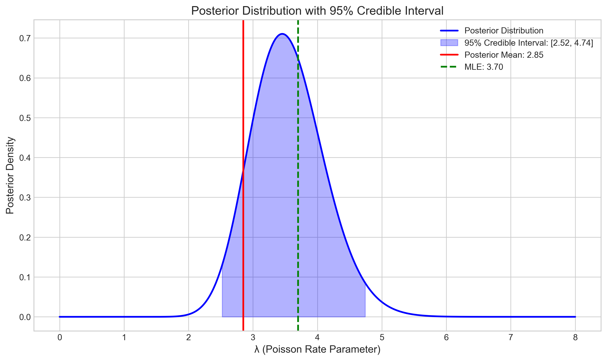

# Question 3: Poisson-Gamma Bayesian Model

## Problem Statement
Consider a Poisson likelihood with parameter $\lambda$ for count data. We observe data $X = \{3, 5, 2, 4, 6, 3, 4, 5, 2, 3\}$.

## Task
1. If we use a $\text{Gamma}(\alpha, \beta)$ prior for $\lambda$, derive the posterior distribution
2. Assuming a $\text{Gamma}(2, 1)$ prior, calculate the posterior distribution
3. Find the posterior mean, mode, and variance of $\lambda$
4. Calculate the predictive distribution for a new observation $X_{\text{new}}$

## Solution

### Step 1: Understanding the Problem

We have:
- Count data $X = \{3, 5, 2, 4, 6, 3, 4, 5, 2, 3\}$ assumed to follow a Poisson distribution with parameter $\lambda$
- A $\text{Gamma}(\alpha, \beta)$ prior for the Poisson rate parameter $\lambda$
- Sample size $n = 10$
- Sum of observations: $\sum_{i=1}^n x_i = 37$
- Sample mean: $\bar{x} = 3.70$

We need to leverage the conjugate relationship between the Poisson likelihood and Gamma prior to derive the posterior distribution, calculate its properties, and determine the predictive distribution for new observations.

### Step 2: Poisson-Gamma Conjugate Prior Relationship

The Poisson distribution describes the probability of observing $x$ events in a fixed interval when events occur at a constant rate $\lambda$:
- Likelihood: $p(x|\lambda) = \frac{e^{-\lambda} \cdot \lambda^x}{x!}$

The Gamma distribution is the conjugate prior for the Poisson likelihood:
- Prior: $p(\lambda) = \text{Gamma}(\alpha, \beta) = \frac{\beta^\alpha \cdot \lambda^{\alpha-1} \cdot e^{-\beta\lambda}}{\Gamma(\alpha)}$
  where $\alpha$ is the shape parameter and $\beta$ is the rate parameter

The following figure shows Poisson distributions with different $\lambda$ values, including our sample mean $\lambda = 3.7$:

### Step 3: Deriving the Posterior Distribution

Using Bayes' theorem, the posterior distribution is proportional to the product of the likelihood and the prior:
$$p(\lambda|X) \propto p(X|\lambda) \cdot p(\lambda)$$

For our Poisson model with $n$ independent observations, the likelihood is:
$$p(X|\lambda) = \prod_{i=1}^n p(x_i|\lambda) = \prod_{i=1}^n \frac{e^{-\lambda} \cdot \lambda^{x_i}}{x_i!} = \frac{e^{-n\lambda} \cdot \lambda^{\sum x_i}}{\prod x_i!}$$

Multiplying by the Gamma prior:
$$p(\lambda|X) \propto [e^{-n\lambda} \cdot \lambda^{\sum x_i}] \cdot \left[\frac{\beta^\alpha \cdot \lambda^{\alpha-1} \cdot e^{-\beta\lambda}}{\Gamma(\alpha)}\right]$$
$$\propto e^{-n\lambda} \cdot \lambda^{\sum x_i} \cdot \lambda^{\alpha-1} \cdot e^{-\beta\lambda}$$
$$\propto e^{-(n+\beta)\lambda} \cdot \lambda^{\alpha+\sum x_i-1}$$

This expression has the form of a Gamma distribution with updated parameters:
$$p(\lambda|X) = \text{Gamma}(\alpha + \sum x_i, \beta + n)$$

Therefore, the posterior distribution is:
$$p(\lambda|X) = \text{Gamma}(\alpha + \sum x_i, \beta + n)$$

This elegant result is why Gamma is considered the conjugate prior for the Poisson likelihood - the posterior has the same functional form as the prior, just with updated parameters.

### Step 4: Calculating the Posterior with Gamma(2, 1) Prior

Given our specific prior $\text{Gamma}(\alpha=2, \beta=1)$ and observed data $X = \{3, 5, 2, 4, 6, 3, 4, 5, 2, 3\}$:

Posterior parameters:
- $\alpha' = \alpha + \sum x_i = 2 + 37 = 39$
- $\beta' = \beta + n = 1 + 10 = 11$

Therefore, the posterior distribution is $\text{Gamma}(39, 11)$.

We can calculate the following posterior statistics:
- Posterior mean: $E[\lambda|X] = \frac{\alpha'}{\beta'} = \frac{39}{11} = 3.5455$
- Posterior mode: $\frac{\alpha'-1}{\beta'} = \frac{38}{11} = 3.4545$
- Posterior variance: $\frac{\alpha'}{\beta'^2} = \frac{39}{121} = 0.3223$
- Posterior standard deviation: $0.5677$

The following figure shows the prior, likelihood, and posterior distributions:

This figure illustrates how the posterior distribution (red line) combines information from both the prior (blue dashed line) and the likelihood function (green line). The posterior mean ($3.55$) is between the prior mean ($2.0$) and the sample mean ($3.7$), but closer to the sample mean because we have a substantial amount of data.

### Step 5: Calculating the Predictive Distribution

The predictive distribution gives the probability of observing a new data point $x_{new}$ given our current data $X$:
$$p(x_{new}|X) = \int p(x_{new}|\lambda) p(\lambda|X) d\lambda$$

For the Poisson-Gamma model, this integral has a closed-form solution - the Negative Binomial distribution:
$$p(x_{new}|X) = \text{NegBin}(r=\alpha', p=\frac{\beta'}{\beta'+1})$$

With our posterior parameters:
$$p(x_{new}|X) = \text{NegBin}(r=39, p=\frac{11}{12} = 0.9167)$$

The predictive distribution has:
- Mean: $\frac{r(1-p)}{p} = \frac{39(1-0.9167)}{0.9167} = 3.5455$ (same as posterior mean)
- Variance: $\frac{r(1-p)}{p^2} = \frac{39(1-0.9167)}{0.9167^2} = 3.8678$ (greater than posterior variance)

The probabilities for specific new observations are:
- $P(x_{new} = 0) = 0.0336$
- $P(x_{new} = 1) = 0.1092$
- $P(x_{new} = 2) = 0.1820$
- $P(x_{new} = 3) = 0.2072$
- $P(x_{new} = 4) = 0.1813$
- $P(x_{new} = 5) = 0.1300$

The following figure compares the predictive distribution (bars) with a Poisson distribution using $\lambda = $ posterior mean (red line):

Notice that the predictive distribution is wider than the Poisson distribution with $\lambda$ fixed at the posterior mean. This is because the predictive distribution incorporates uncertainty in the parameter $\lambda$, while the Poisson distribution assumes a fixed parameter value.

### Step 6: Effect of Different Priors

The choice of prior can influence the posterior distribution, especially with limited data. The following figure shows how different priors affect the resulting posterior:

This figure compares posteriors resulting from four different priors:
- $\text{Gamma}(1, 1)$ - a relatively uninformative prior
- $\text{Gamma}(2, 1)$ - our original prior
- $\text{Gamma}(10, 2)$ - a more informative prior centered at $\lambda=5$
- $\text{Gamma}(20, 10)$ - a very informative prior centered at $\lambda=2$

As shown, more informative priors pull the posterior means toward their respective prior means. However, with 10 observations, the data still significantly influences all posteriors.

### Step 7: Posterior Mean vs MLE and Credible Interval

The Maximum Likelihood Estimate (MLE) for a Poisson distribution is simply the sample mean: $\hat{\lambda} = 3.7$.

The Bayesian approach gives us:
- Posterior mean: $3.5455$
- 95% Credible interval: $[2.52, 4.74]$

The 95% credible interval represents the range within which we are 95% certain the true value of $\lambda$ lies, given our data and prior. Unlike frequentist confidence intervals, Bayesian credible intervals have a direct probability interpretation.

## Key Insights

1. **Conjugate Priors**: The Gamma distribution is the conjugate prior for the Poisson likelihood, resulting in a Gamma posterior. This mathematical convenience greatly simplifies Bayesian inference.

2. **Parameter Updating**: The posterior parameters $\alpha' = \alpha + \sum x_i$ and $\beta' = \beta + n$ show how Bayesian updating combines prior information ($\alpha, \beta$) with data information ($\sum x_i, n$).

3. **Posterior Mean Interpretation**: The posterior mean can be written as a weighted average:
   $$E[\lambda|X] = \frac{\frac{\alpha}{\beta} + \frac{\sum x_i}{n}}{\frac{1}{\beta} + 1} = w \cdot \left(\frac{\alpha}{\beta}\right) + (1-w) \cdot \left(\frac{\sum x_i}{n}\right)$$
   where $w = \frac{1}{\beta+1}$ represents the weight given to the prior mean, and $(1-w)$ is the weight given to the sample mean.

4. **Predictive Distribution**: The Negative Binomial predictive distribution has greater variance than a simple Poisson with $\lambda = $ posterior mean, as it accounts for both the inherent randomness in the Poisson process and the uncertainty in estimating $\lambda$.

5. **Prior Influence**: With small sample sizes, the prior has a stronger influence on the posterior. As sample size increases, the data dominates and the posterior converges to the frequentist result.

6. **Uncertainty Quantification**: The Bayesian approach naturally quantifies uncertainty through the full posterior distribution and provides interpretable credible intervals.

## Conclusion

The Poisson-Gamma model demonstrates the elegance of Bayesian inference with conjugate priors. For our count data, the posterior distribution is $\text{Gamma}(39, 11)$, with a mean of $3.55$, mode of $3.45$, and variance of $0.32$. The predictive distribution for future observations follows a Negative Binomial distribution, which accounts for both parameter uncertainty and inherent randomness. This Bayesian approach provides a comprehensive framework for inference about the Poisson rate parameter $\lambda$, incorporating prior knowledge and systematically updating our beliefs based on observed data. 