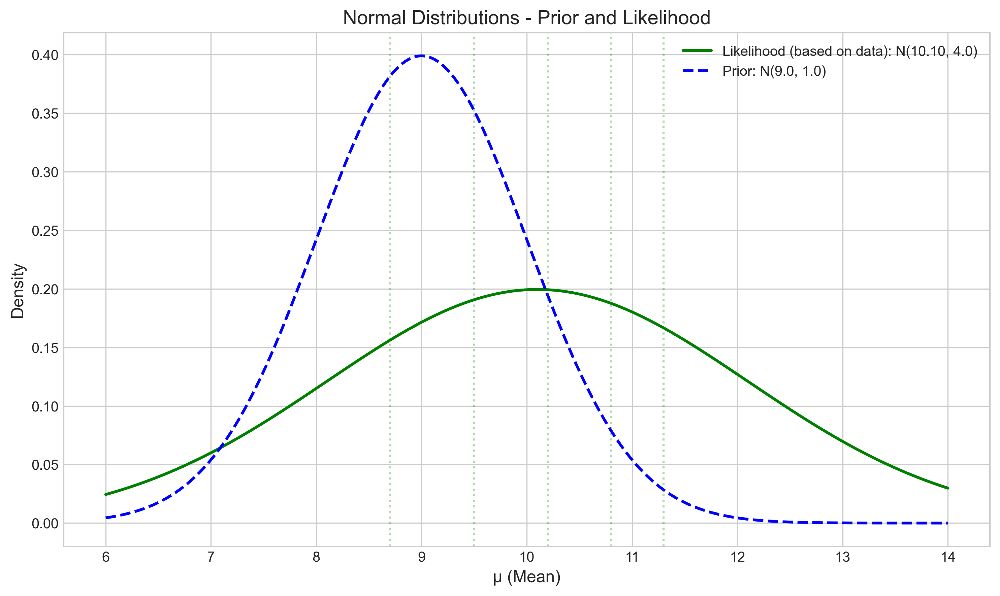
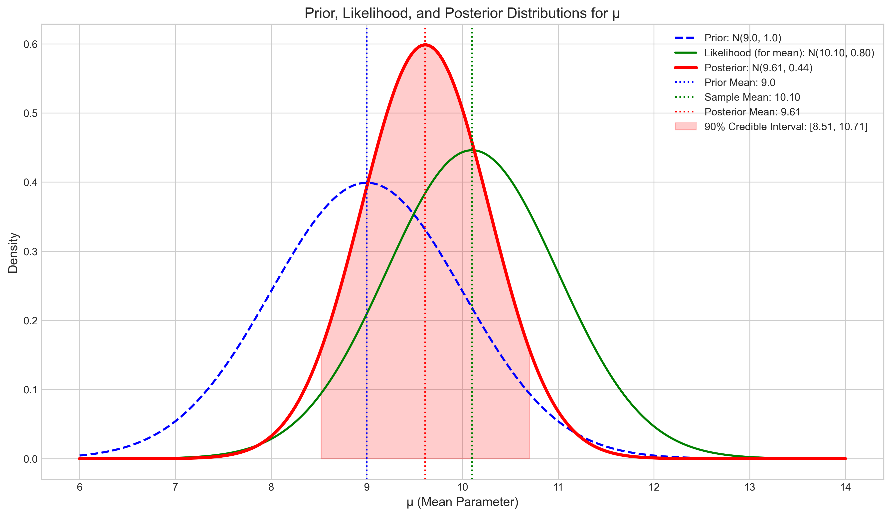
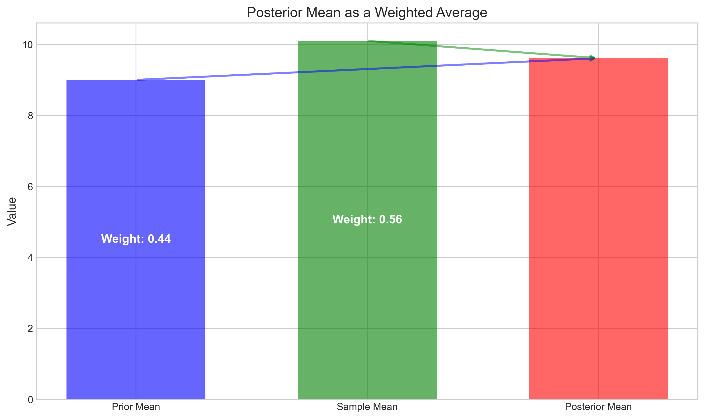
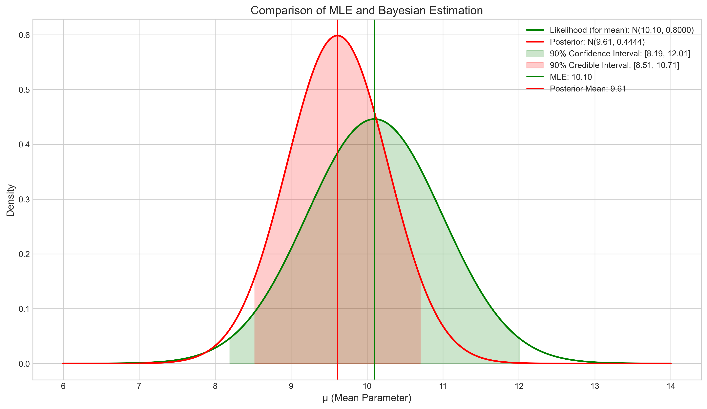
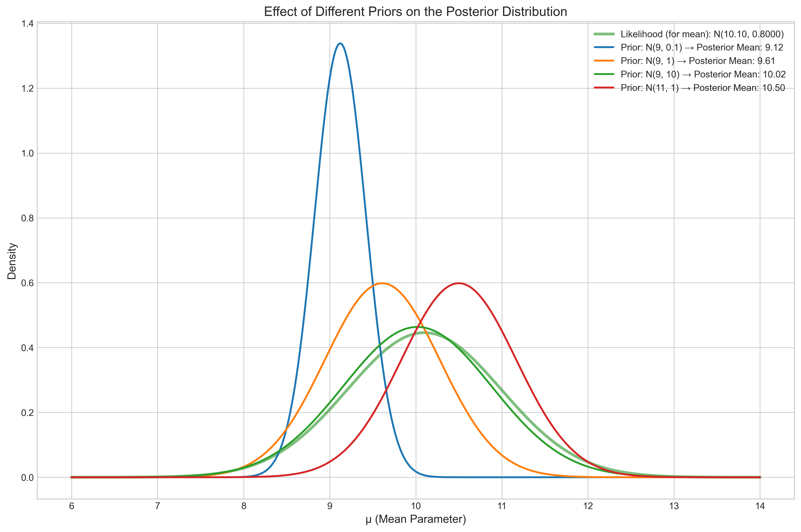
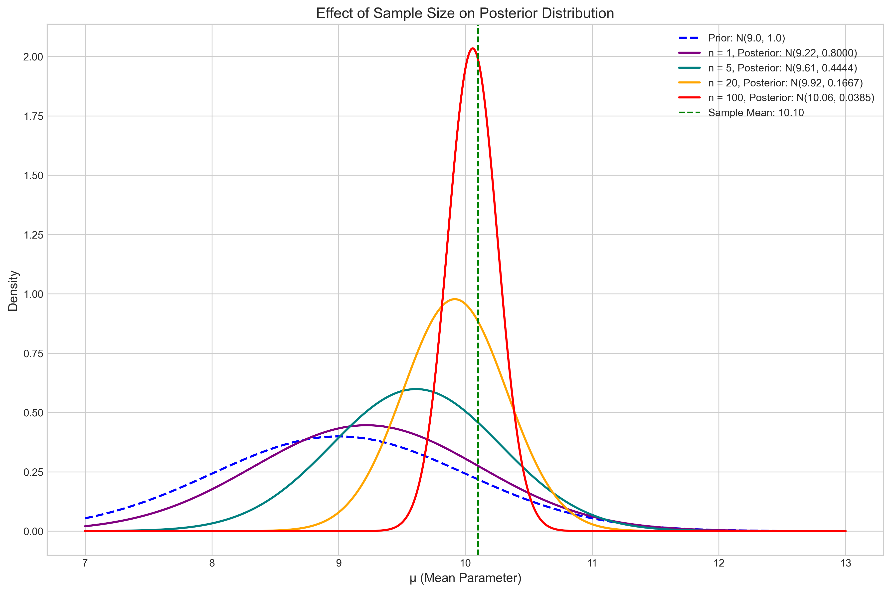

# Question 4: Normal Distribution Parameter Estimation

## Problem Statement
Consider the problem of estimating the mean μ of a normal distribution with known variance σ² = 4. We observe data X = {10.2, 8.7, 9.5, 11.3, 10.8}.

## Task
1. If we use a normal prior N(9, 1) for μ, derive the posterior distribution
2. Calculate the posterior mean and variance
3. Find the 90% credible interval for μ
4. Compare the Bayesian estimate with the maximum likelihood estimate (MLE) and discuss the differences between the two approaches

## Solution

### Step 1: Understanding the Problem

We have:
- Data X = {10.2, 8.7, 9.5, 11.3, 10.8} from a normal distribution
- Known variance σ² = 4
- Normal prior for μ: N(9, 1)
- Sample size: n = 5
- Sample mean: x̄ = 10.1
- Sample variance: s² = 1.065

We need to apply Bayesian inference to estimate the mean parameter μ, taking advantage of the conjugate relationship between normal likelihood and normal prior.

### Step 2: Normal-Normal Conjugate Prior Relationship

For a normal likelihood with known variance σ²:
- Likelihood: p(x|μ) = N(x|μ, σ²)
- Prior: p(μ) = N(μ|μ₀, σ₀²)

The normal distribution is self-conjugate for its mean parameter when the variance is known. After observing data X, the posterior distribution is:
p(μ|X) = N(μ|μₙ, σₙ²)

Where:
- μₙ = (μ₀/σ₀² + n·x̄/σ²) / (1/σ₀² + n/σ²)
- σₙ² = 1 / (1/σ₀² + n/σ²)

The following figure shows the prior distribution alongside the likelihood function based on our data:

### Step 3: Deriving the Posterior Distribution

Using Bayes' theorem:
p(μ|X) ∝ p(X|μ) · p(μ)

For n independent observations from a normal distribution:
p(X|μ) = ∏ p(xᵢ|μ) = (2πσ²)^(-n/2) · exp[-Σ(xᵢ-μ)²/(2σ²)]

This can be rewritten as:
p(X|μ) = (2πσ²)^(-n/2) · exp[-(n(x̄-μ)² + Σ(xᵢ-x̄)²)/(2σ²)]

Multiplying by the prior and focusing on terms involving μ:
p(μ|X) ∝ exp[-(n(x̄-μ)²)/(2σ²)] · exp[-(μ-μ₀)²/(2σ₀²)]
      ∝ exp[-((n/σ²)(x̄-μ)² + (1/σ₀²)(μ-μ₀)²)/2]

After completing the square and rearranging, we get a normal distribution with:
- σₙ² = 1 / (1/σ₀² + n/σ²)
- μₙ = σₙ² · (μ₀/σ₀² + n·x̄/σ²)

### Step 4: Calculating the Posterior Distribution

With our specific values:
- Prior: N(μ₀=9, σ₀²=1)
- Data: X = {10.2, 8.7, 9.5, 11.3, 10.8}
- Sample mean: x̄ = 10.1
- Known variance: σ² = 4
- Sample size: n = 5

We can calculate:
- Prior precision: 1/σ₀² = 1
- Data precision: n/σ² = 5/4 = 1.25
- Posterior precision: 1 + 1.25 = 2.25
- Posterior variance: σₙ² = 1/2.25 = 0.4444
- Posterior mean: μₙ = 0.4444 · (9·1 + 10.1·1.25) = 9.6111

Therefore, our posterior distribution is:
p(μ|X) = N(9.6111, 0.4444)

The 90% credible interval for μ is [8.5145, 10.7077].

The following figure shows the prior, likelihood, and posterior distributions:

### Step 5: Posterior Mean as a Weighted Average

An intuitive way to understand the posterior mean is as a precision-weighted average of the prior mean and the sample mean:
μₙ = w₁·μ₀ + w₂·x̄

Where:
- w₁ = (1/σ₀²)/(1/σ₀² + n/σ²) = 0.4444 (44.4% weight to prior)
- w₂ = (n/σ²)/(1/σ₀² + n/σ²) = 0.5556 (55.6% weight to data)

So:
μₙ = 0.4444 × 9.0 + 0.5556 × 10.1 = 4.0000 + 5.6111 = 9.6111

This weighted average interpretation is visualized below:

The more precise source of information (lower variance) gets more weight in determining the posterior mean.

### Step 6: Comparing Bayesian Estimate with MLE

The Maximum Likelihood Estimate (MLE) for the mean of a normal distribution is simply the sample mean:
MLE = x̄ = 10.1

Comparing the Bayesian and frequentist approaches:

1. Point Estimates:
   - MLE: μ̂ = 10.1
   - Bayesian posterior mean: 9.6111

2. Measures of Uncertainty:
   - Standard error of MLE: SE(μ̂) = σ/√n = 0.8944
   - Posterior standard deviation: 0.6667

3. Intervals:
   - 90% Confidence interval (frequentist): [8.1932, 12.0068]
   - 90% Credible interval (Bayesian): [8.5145, 10.7077]

Key differences:
1. The Bayesian approach incorporates prior information, pulling the estimate toward the prior mean (9.0).
2. The Bayesian credible interval is narrower than the frequentist confidence interval, reflecting the additional information from the prior.
3. The credible interval has a direct probability interpretation: "There is a 90% probability that μ lies within this interval, given our data and prior."
4. The confidence interval has a frequency interpretation: "If we repeated the experiment many times, 90% of the computed intervals would contain the true μ."

### Step 7: Effect of Different Priors

The choice of prior can significantly impact the posterior distribution, especially with small sample sizes:

This figure compares posteriors resulting from four different priors:
- A strong prior centered at μ = 9 (higher precision/smaller variance)
- Our original prior N(9, 1)
- A weak prior centered at μ = 9 (lower precision/larger variance)
- A strong prior centered at a different value (μ = 11)

As the prior becomes more informative (smaller variance), it exerts more influence on the posterior distribution. A prior centered far from the data will pull the posterior mean away from the MLE.

### Step 8: Effect of Sample Size

As sample size increases, the influence of the prior diminishes:

With just one observation, the posterior is heavily influenced by the prior. With 100 observations, the posterior is virtually centered at the sample mean, and the prior has minimal impact. This demonstrates how Bayesian inference naturally transitions from prior-dominated to data-dominated as more evidence is accumulated.

## Key Insights

1. **Conjugate Prior**: The normal distribution is self-conjugate for its mean parameter when the variance is known, leading to a normal posterior distribution.

2. **Precision Weighting**: The posterior mean is a precision-weighted average of the prior mean and the sample mean, where precision is the reciprocal of variance (1/σ²).

3. **Uncertainty Reduction**: The posterior variance is always smaller than both the prior variance and the variance of the MLE, reflecting the combined information from both sources.

4. **Prior Influence**: The impact of the prior depends on:
   - Its precision relative to the data precision
   - The sample size (more data = less prior influence)
   - The discrepancy between the prior mean and the sample mean

5. **Interval Interpretation**: Bayesian credible intervals have direct probability interpretations about the parameter, unlike frequentist confidence intervals which make statements about the procedure.

6. **Convergence**: As sample size increases, Bayesian and frequentist approaches converge - the posterior mean approaches the MLE, and credible intervals approach confidence intervals.

## Conclusion

In this Bayesian estimation problem, we've derived a posterior distribution N(9.6111, 0.4444) for the mean of a normal distribution. This posterior combines our prior belief N(9, 1) with the observed data (sample mean 10.1), giving slightly more weight to the data (55.6%) than to the prior (44.4%). The 90% credible interval [8.5145, 10.7077] is narrower than the corresponding frequentist confidence interval, reflecting the additional information incorporated from the prior. 

The Bayesian approach allows us to formally incorporate prior knowledge and provides a more intuitive framework for making probability statements about parameters. However, the results are sensitive to the choice of prior, particularly with small sample sizes. As sample size increases, both approaches converge to similar conclusions, with the data eventually dominating over any reasonable prior. 