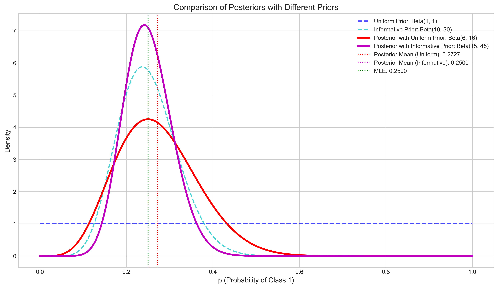

# Question 5: Bayesian Classification Probability

## Problem Statement
For a simple classification problem, we want to estimate the probability $p$ of an observation belonging to class 1. We have observed 5 instances belonging to class 1 out of 20 total observations.

## Task
1. If we use a uniform prior ($\text{Beta}(1,1)$) for $p$, what is the posterior distribution?
2. What is the posterior mean of $p$?
3. How would the posterior change if we had used an informative prior $\text{Beta}(10,30)$?
4. Explain the practical significance of using an informative prior versus a uniform prior in this context.

## Solution

### Step 1: Understanding the Problem

We have:
- Binary classification problem with parameter $p$ = probability of class 1
- Observed data: 5 successes (class 1) and 15 failures (class 0) out of 20 trials
- Sample proportion: $\hat{p} = 5/20 = 0.25$
- Two different prior distributions to consider:
  * Uniform prior: $\text{Beta}(1,1)$
  * Informative prior: $\text{Beta}(10,30)$

We need to:
1. Calculate the posterior distribution with the uniform prior
2. Find the posterior mean with the uniform prior
3. Derive the posterior with the informative prior and compare results
4. Explain the practical implications of prior choice

### Step 2: Beta-Binomial Conjugate Prior Relationship

The binomial likelihood function for $k$ successes out of $n$ trials with probability $p$ is:

$$P(X=k|p,n) = \binom{n}{k} p^k (1-p)^{n-k}$$

The Beta distribution is the conjugate prior for the binomial likelihood:

$$P(p) = \frac{p^{\alpha-1}(1-p)^{\beta-1}}{B(\alpha,\beta)}$$

where $B(\alpha,\beta)$ is the Beta function.

When we combine a Beta prior with a binomial likelihood, the posterior distribution is:

$$P(p|X=k) \propto P(X=k|p) \times P(p)$$
$$P(p|X=k) \propto p^k(1-p)^{n-k} \times p^{\alpha-1}(1-p)^{\beta-1}$$
$$P(p|X=k) \propto p^{\alpha+k-1}(1-p)^{\beta+n-k-1}$$

This is a Beta distribution with updated parameters:

$$P(p|X=k) = \text{Beta}(\alpha+k, \beta+n-k)$$

### Step 3: Calculating Posterior with Uniform Prior

Starting with a uniform prior $\text{Beta}(1,1)$ and our observed data (5 successes out of 20 trials):

Posterior parameters:
- $\alpha' = \alpha + k = 1 + 5 = 6$
- $\beta' = \beta + n - k = 1 + 20 - 5 = 16$

Therefore, the posterior distribution is:

$$P(p|\text{data}) = \text{Beta}(6, 16)$$

The posterior mean is:

$$E[p|\text{data}] = \frac{\alpha'}{\alpha' + \beta'} = \frac{6}{6 + 16} = \frac{6}{22} \approx 0.2727$$

The posterior mode (maximum a posteriori estimate) is:

$$\text{Mode}[p|\text{data}] = \frac{\alpha' - 1}{\alpha' + \beta' - 2} = \frac{5}{20} = 0.25$$

The posterior variance is:

$$\text{Var}[p|\text{data}] = \frac{\alpha' \beta'}{(\alpha' + \beta')^2 (\alpha' + \beta' + 1)} = \frac{6 \times 16}{22^2 \times 23} \approx 0.0086$$

The 95% credible interval is approximately $[0.1128, 0.4717]$.

This figure shows the uniform prior (blue dashed line), the scaled likelihood (green line), and the resulting posterior distribution (red line). The posterior combines information from both sources, with the likelihood dominating due to its stronger information content.

### Step 4: Calculating Posterior with Informative Prior

Now we calculate the posterior using the informative prior $\text{Beta}(10,30)$:

Prior mean:
$$E[p] = \frac{\alpha}{\alpha + \beta} = \frac{10}{10 + 30} = \frac{10}{40} = 0.25$$

Posterior parameters:
- $\alpha' = \alpha + k = 10 + 5 = 15$
- $\beta' = \beta + n - k = 30 + 20 - 5 = 45$

Therefore, the posterior distribution is:

$$P(p|\text{data}) = \text{Beta}(15, 45)$$

The posterior mean is:

$$E[p|\text{data}] = \frac{\alpha'}{\alpha' + \beta'} = \frac{15}{15 + 45} = \frac{15}{60} = 0.25$$

The posterior mode is:

$$\text{Mode}[p|\text{data}] = \frac{\alpha' - 1}{\alpha' + \beta' - 2} = \frac{14}{58} \approx 0.2414$$

The posterior variance is:

$$\text{Var}[p|\text{data}] = \frac{\alpha' \beta'}{(\alpha' + \beta')^2 (\alpha' + \beta' + 1)} = \frac{15 \times 45}{60^2 \times 61} \approx 0.0031$$

The 95% credible interval is approximately $[0.1498, 0.3659]$.

This figure compares the posteriors resulting from both priors. The informative prior (purple line) leads to a more concentrated posterior distribution with a narrower credible interval than the uniform prior (red line).

### Step 5: Interpreting Prior Influence

We can understand the relative influence of the prior and data by comparing their effective sample sizes:

1. Uniform Prior $\text{Beta}(1,1)$:
   - Prior weight: $\alpha + \beta = 1 + 1 = 2$ (equivalent to 2 pseudo-observations)
   - Data weight: $n = 20$ (20 actual observations)
   - Relative prior influence: $\frac{2}{2 + 20} \approx 9.09\%$
   - Relative data influence: $\frac{20}{2 + 20} \approx 90.91\%$

2. Informative Prior $\text{Beta}(10,30)$:
   - Prior weight: $\alpha + \beta = 10 + 30 = 40$ (equivalent to 40 pseudo-observations)
   - Data weight: $n = 20$ (20 actual observations)
   - Relative prior influence: $\frac{40}{40 + 20} \approx 66.67\%$
   - Relative data influence: $\frac{20}{40 + 20} \approx 33.33\%$

This visualization shows how the informative prior carries much more weight than the uniform prior. With the informative prior, the prior information (40 pseudo-observations) outweighs the data (20 observations), whereas with the uniform prior, the data dominates the inference.

### Step 6: Effect of Increasing Sample Size

As the sample size increases, the influence of the prior diminishes:

This figure shows how posteriors from both priors converge as the sample size increases from 20 to 500 observations (maintaining the same proportion of successes). With large samples, the data overwhelms the prior, and the choice of prior becomes less important.

### Step 7: Practical Significance for Decision Making

The choice of prior can significantly impact decision-making, especially with limited data. Consider three decision thresholds (0.2, 0.3, and 0.4) and how the posterior probabilities of exceeding these thresholds differ between priors:

With a threshold of 0.2, the probability that $p > 0.2$ is 0.77 with the uniform prior and 0.84 with the informative prior. Both priors suggest a high probability of exceeding this threshold.

With a threshold of 0.3, the probability that $p > 0.3$ is 0.36 with the uniform prior and only 0.18 with the informative prior. This discrepancy could lead to different decisions depending on which prior is used.

With a threshold of 0.4, the probability that $p > 0.4$ is 0.10 with the uniform prior and merely 0.01 with the informative prior. The informative prior strongly suggests that $p$ is below 0.4.

## Key Insights

1. **Conjugate Prior Relationship**: The Beta distribution is the conjugate prior for the binomial likelihood, leading to a Beta posterior distribution with parameters that are simple functions of the prior parameters and observed data.

2. **Posterior as Weighted Average**: The posterior mean can be expressed as a weighted average of the prior mean and the MLE (sample proportion):
   $$E[p|\text{data}] = w \cdot E[p] + (1-w) \cdot \hat{p}$$
   where $w = \frac{\alpha + \beta}{\alpha + \beta + n}$ is the weight given to the prior.

3. **Informative vs. Uniform Priors**:
   - The uniform prior $\text{Beta}(1,1)$ represents complete prior ignorance about $p$.
   - The informative prior $\text{Beta}(10,30)$ encodes a strong belief that $p$ is around 0.25.
   - With our data, the uniform prior leads to a posterior mean of 0.2727, while the informative prior gives 0.25.
   - The informative prior gives a narrower credible interval, reflecting greater certainty.

4. **Prior Influence Depends on Sample Size**:
   - With small samples, the prior has substantial influence.
   - As sample size increases, the data dominates and posteriors converge regardless of prior.

5. **Practical Applications**:
   - Informative priors are valuable when reliable prior knowledge exists or when data is limited.
   - They can help correct for class imbalance and provide regularization.
   - Uniform priors are preferred when maximal objectivity is required or when prior knowledge is lacking.
   - The choice of prior should consider the decision-making context and the costs of different types of errors.

## Conclusion

In this classification problem, we've seen how Bayesian inference allows us to combine prior knowledge with observed data to estimate the probability parameter $p$. The uniform prior $\text{Beta}(1,1)$ resulted in a posterior $\text{Beta}(6,16)$ with mean 0.2727, while the informative prior $\text{Beta}(10,30)$ gave a posterior $\text{Beta}(15,45)$ with mean 0.25.

The informative prior had a much stronger influence (66.67% vs. 9.09%), resulting in a posterior that was less affected by the data and had a narrower credible interval. This demonstrates how prior choice can significantly impact inference and decision-making, especially with limited data.

The appropriate choice of prior depends on the specific context, including the reliability of prior knowledge, the amount of available data, and the consequences of different types of errors. As data accumulates, the influence of the prior diminishes, and both approaches converge to the true parameter value. 