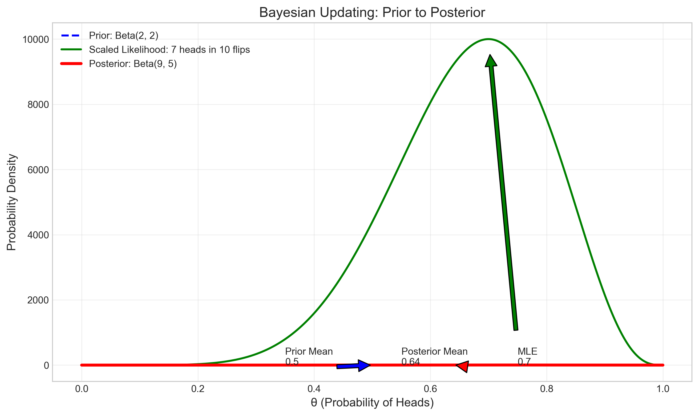
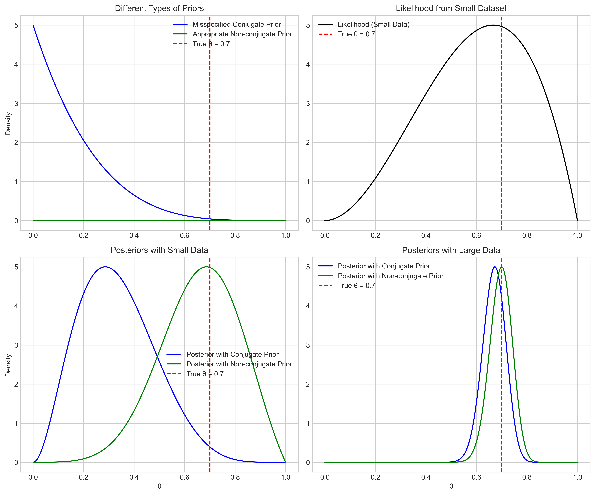
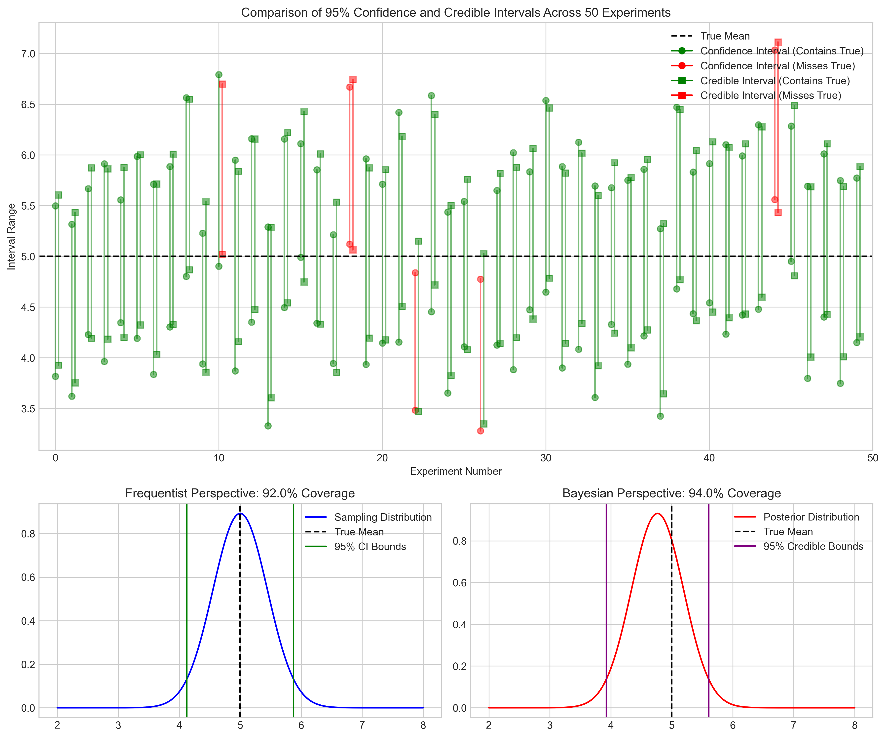
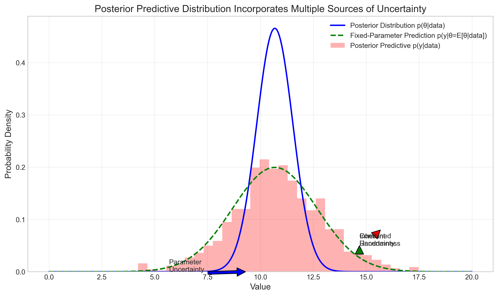
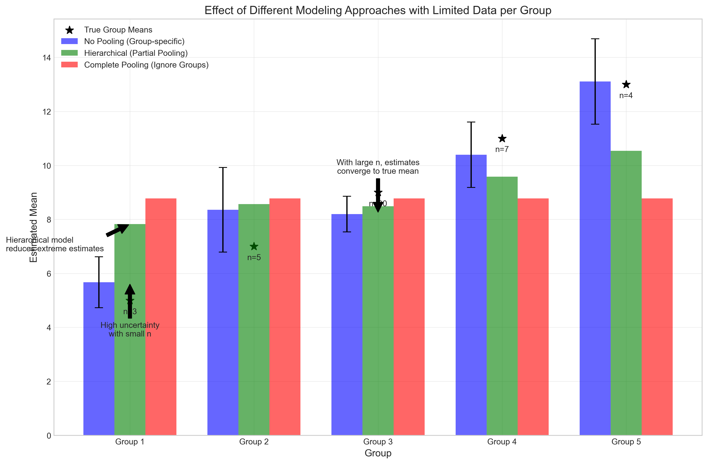

# Question 6: Bayesian Statistics Concepts

## Problem Statement
Evaluate whether each of the following statements is TRUE or FALSE. Justify your answer with a brief explanation.

1. In Bayesian statistics, the posterior distribution represents our updated belief about a parameter after observing data.
2. Conjugate priors always lead to the most accurate Bayesian inference results.
3. Bayesian credible intervals and frequentist confidence intervals have identical interpretations.
4. The posterior predictive distribution incorporates both the uncertainty in the parameter estimates and the inherent randomness in generating new data.
5. Hierarchical Bayesian models are useful only when we have a large amount of data.

## Solution

### Statement 1: Posterior as Updated Belief

**Evaluation: TRUE**

The posterior distribution is a foundational concept in Bayesian statistics. It represents our updated belief about a parameter after we have observed data. This is achieved through Bayes' theorem:

$$P(\theta|\text{data}) \propto P(\text{data}|\theta) \times P(\theta)$$

Where:
- $P(\theta|\text{data})$ is the posterior distribution - our updated belief about parameter $\theta$ given the observed data
- $P(\text{data}|\theta)$ is the likelihood function - how probable the observed data is for different values of $\theta$
- $P(\theta)$ is the prior distribution - our initial belief about parameter $\theta$ before seeing the data

The posterior distribution mathematically combines our prior knowledge with the information from the data to form an updated belief.

As shown in the figure above, for a coin flip example with a Beta(2,2) prior and 7 heads in 10 tosses:
- The prior distribution (blue dashed line) represents our initial belief centered at 0.5
- The likelihood function (green line) represents what the data suggests, with a maximum at 0.7
- The posterior distribution (red line) combines both sources of information, giving a distribution centered around 0.64
- The posterior mean lies between the prior mean and the maximum likelihood estimate (MLE), demonstrating how Bayesian inference balances prior knowledge with observed data

### Statement 2: Conjugate Priors and Accuracy

**Evaluation: FALSE**

While conjugate priors provide mathematical convenience, they don't always lead to the most accurate Bayesian inference results. The accuracy of inference depends primarily on how well the prior represents actual prior knowledge.

Conjugate priors are chosen so that the posterior distribution follows the same parametric form as the prior distribution. For example:
- Beta distribution is conjugate to the Binomial likelihood
- Gamma distribution is conjugate to the Poisson likelihood
- Normal distribution is conjugate to the Normal likelihood (with known variance)

However, accuracy depends on several factors:

1. **Representativeness of the prior**: If our true prior beliefs don't match the conjugate form, forcing a conjugate prior may reduce accuracy
2. **Quality of prior information**: Non-conjugate priors that better represent actual knowledge can lead to more accurate results
3. **Sample size**: With large datasets, the likelihood dominates and the choice of prior becomes less important
4. **Model complexity**: In complex models, conjugate priors might be too restrictive to capture the true parameter relationships

The figure demonstrates how a misspecified conjugate prior (blue line) can lead to less accurate results than an appropriate non-conjugate prior (green line) when data is limited. With small datasets (top row), the posterior with a non-conjugate prior that better represents our knowledge is centered closer to the true parameter value. As the amount of data increases (bottom row), both approaches converge to similar posteriors that are dominated by the likelihood.

### Statement 3: Bayesian vs. Frequentist Intervals

**Evaluation: FALSE**

Bayesian credible intervals and frequentist confidence intervals have fundamentally different interpretations, reflecting the distinct philosophical approaches of Bayesian and frequentist statistics.

**Bayesian 95% credible interval:**
- A range within which the parameter has a 95% probability of lying, given the observed data and prior
- Makes direct probability statements about where the parameter is likely to be
- Is conditional on the observed data
- Example interpretation: "Given our data, there's a 95% probability that the parameter lies within this interval"

**Frequentist 95% confidence interval:**
- A range calculated using a procedure that will contain the true parameter in 95% of repeated experiments
- Makes statements about the procedure, not the parameter directly
- Is based on hypothetical repeated sampling
- Example interpretation: "If we repeat the experiment many times, 95% of the calculated intervals will contain the true parameter"

The figure illustrates this key difference by showing multiple experiments. The top panel shows 50 experiments with both credible intervals (squares) and confidence intervals (circles) calculated for each. Green indicates intervals that contain the true value, while red shows intervals that miss it.

The bottom panels illustrate the different philosophical approaches:
- The frequentist approach (left) focuses on the sampling distribution of the estimator
- The Bayesian approach (right) focuses on the posterior distribution of the parameter given the observed data

While in some cases (particularly with uninformative priors and large sample sizes) the numerical values of these intervals may be similar, their interpretations remain fundamentally different.

### Statement 4: Posterior Predictive Distribution

**Evaluation: TRUE**

The posterior predictive distribution incorporates both the uncertainty in parameter estimates and the inherent randomness in generating new data. It provides a comprehensive framework for predicting new observations while accounting for all sources of uncertainty.

The posterior predictive distribution is given by:

$$p(y_{\text{new}} | \text{data}) = \int p(y_{\text{new}} | \theta) \, p(\theta | \text{data}) \, d\theta$$

This integral has a clear interpretation:
1. **Parameter uncertainty** is addressed by integrating over the posterior distribution $p(\theta | \text{data})$
2. **Inherent randomness** is captured through the likelihood function $p(y_{\text{new}} | \theta)$ which models the stochastic data-generating process

The figure illustrates these two sources of uncertainty:
- The blue curve represents the posterior distribution of the parameter (parameter uncertainty)
- The green dashed curve shows what predictions would look like using just the posterior mean (inherent randomness only)
- The red histogram shows the full posterior predictive distribution, which is wider because it incorporates both sources of uncertainty

This approach provides more realistic uncertainty quantification for future observations compared to predictions based solely on point estimates of parameters.

### Statement 5: Hierarchical Bayesian Models

**Evaluation: FALSE**

Contrary to the statement, hierarchical Bayesian models are particularly valuable when we have limited data per group or entity, not only when we have large amounts of data.

Hierarchical (or multilevel) models provide the following benefits:

1. **Information sharing**: They allow sharing of information across groups through partial pooling
2. **Reduced overfitting**: They reduce overfitting for groups with small sample sizes
3. **Regularization**: They provide more regularized and stable estimates when data is sparse
4. **Balanced approach**: They strike a balance between complete pooling (treating all groups as identical) and no pooling (treating all groups as independent)

The figure demonstrates how hierarchical models (green bars) provide better estimates than no-pooling models (blue bars) when we have limited data per group. Notice how:
- Groups with small sample sizes (e.g., Groups 1 and 5) have high uncertainty under no pooling
- The hierarchical approach pulls estimates for small groups toward the overall mean (partial pooling)
- For larger groups (e.g., Group 3), estimates from all methods converge

In fact, with large amounts of data for each group, simple non-hierarchical models may perform adequately. It's precisely when we have limited data that hierarchical models provide the greatest benefit by borrowing strength across groups.

## Key Insights

1. **Bayesian Updating**: The posterior distribution represents updated beliefs that combine prior knowledge with observed data through Bayes' theorem. This allows for the natural incorporation of prior knowledge and sequential updating as new data arrives.

2. **Prior Selection**: While conjugate priors offer mathematical convenience, the choice of prior should be based on actual domain knowledge rather than just computational simplicity. As data increases, the impact of the prior choice diminishes.

3. **Probability Interpretation**: Bayesian statistics allows direct probability statements about parameters, unlike frequentist statistics which makes statements about procedures over hypothetical repeated sampling.

4. **Comprehensive Uncertainty**: Bayesian methods naturally account for all sources of uncertainty in predictions, leading to more realistic assessments of predictive uncertainty.

5. **Hierarchical Modeling**: Hierarchical models are particularly valuable for analyzing grouped data with limited samples per group, as they balance between pooling and independence to improve estimation.

## Conclusion

Understanding these fundamental concepts in Bayesian statistics is essential for correctly applying Bayesian methods in machine learning and statistical analysis. The Bayesian approach offers a coherent framework for incorporating prior knowledge, updating beliefs based on data, and quantifying uncertainty in both parameter estimates and predictions.

| Statement | Evaluation |
|-----------|------------|
| 1. In Bayesian statistics, the posterior distribution represents our updated belief about a parameter after observing data. | TRUE |
| 2. Conjugate priors always lead to the most accurate Bayesian inference results. | FALSE |
| 3. Bayesian credible intervals and frequentist confidence intervals have identical interpretations. | FALSE |
| 4. The posterior predictive distribution incorporates both the uncertainty in the parameter estimates and the inherent randomness in generating new data. | TRUE |
| 5. Hierarchical Bayesian models are useful only when we have a large amount of data. | FALSE | 