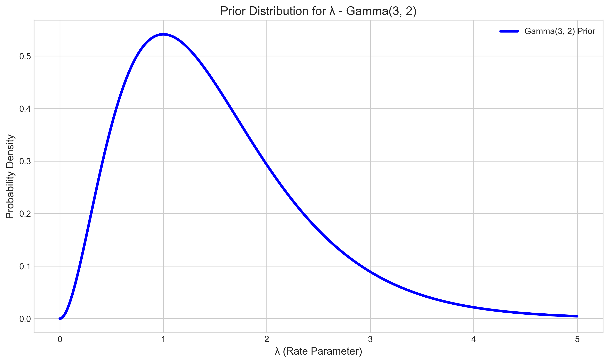
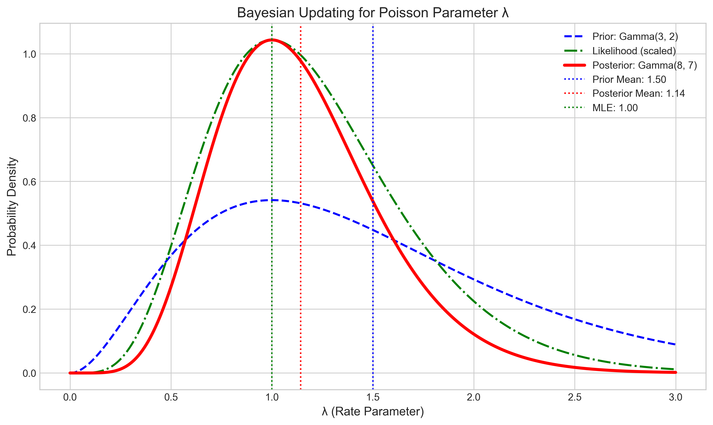
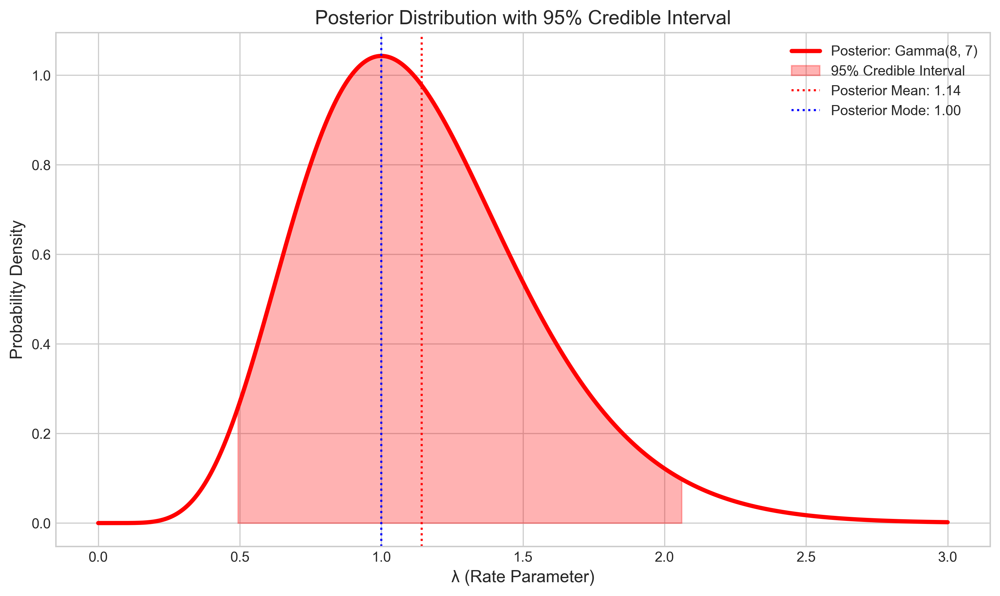
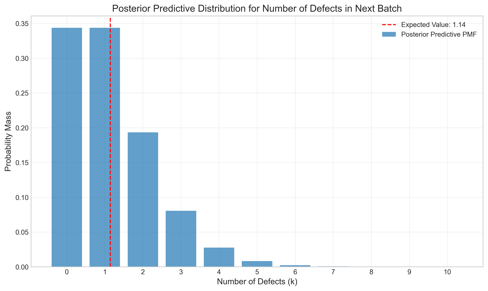
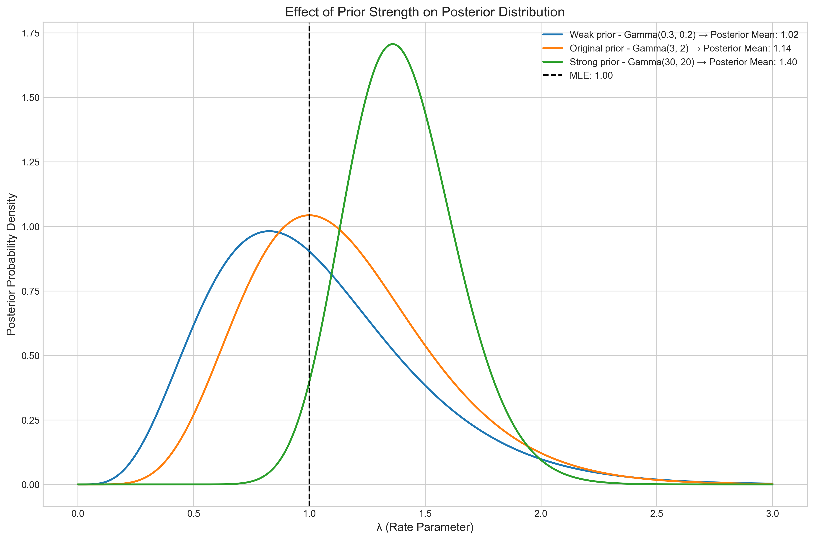

# Question 7: Bayesian Analysis of Manufacturing Process Defects

## Problem Statement
Consider a scenario where we are modeling the number of defects in a manufacturing process using a Poisson distribution with parameter $\lambda$.

## Tasks
1. What is the conjugate prior for a Poisson likelihood?
2. If our prior for $\lambda$ is $\text{Gamma}(3, 2)$ and we observe the following defect counts in 5 batches: $\{1, 0, 2, 1, 1\}$, what is the resulting posterior distribution?
3. Calculate the posterior mean of $\lambda$.
4. What is the advantage of using a conjugate prior in this specific scenario?

## Solution

### Task 1: Conjugate Prior for Poisson Likelihood

To determine the conjugate prior for the Poisson distribution, we need to analyze the form of the Poisson likelihood function and find a distribution whose kernel has a compatible form that will result in a posterior from the same family as the prior.

The Poisson probability mass function is:
$P(X = k | \lambda) = \frac{\lambda^k e^{-\lambda}}{k!}$

When we consider a sample of observations $x_1, x_2, \ldots, x_n$ and look at the likelihood as a function of $\lambda$, we get:

$L(\lambda | \text{data}) \propto \lambda^{\sum_{i=1}^{n} x_i} \cdot e^{-n\lambda}$

This has the form $\lambda^a \cdot e^{-b\lambda}$, which matches the kernel of a Gamma distribution. Therefore, the conjugate prior for the Poisson likelihood is the **Gamma distribution**.

The Gamma PDF is:
$p(\lambda | \alpha, \beta) = \frac{\beta^\alpha}{\Gamma(\alpha)} \lambda^{\alpha-1} e^{-\beta\lambda}$

When we combine this prior with the Poisson likelihood, the posterior will also be Gamma distributed, making calculations analytically tractable.

### Task 2: Resulting Posterior Distribution

For a Poisson-Gamma model, the Bayesian updating follows a simple rule:

If the prior is $\text{Gamma}(\alpha, \beta)$ and we observe data $x_1, x_2, \ldots, x_n$ from $\text{Poisson}(\lambda)$, then the posterior is:

$\text{Gamma}(\alpha + \sum_{i=1}^{n} x_i, \beta + n)$

Applying this to our problem:
- Prior: $\text{Gamma}(\alpha=3, \beta=2)$
- Data: $\{1, 0, 2, 1, 1\}$
- Sum of observations: $\sum x_i = 1 + 0 + 2 + 1 + 1 = 5$
- Number of observations: $n = 5$

Therefore, the posterior distribution is:
$\text{Gamma}(\alpha + \sum x_i, \beta + n) = \text{Gamma}(3 + 5, 2 + 5) = \text{Gamma}(8, 7)$

The figure above shows the prior (blue dashed line), the likelihood (green dash-dot line), and the resulting posterior (red solid line). We can see how the posterior combines information from both the prior and the data, resulting in a distribution that is more concentrated than either one alone.

### Task 3: Posterior Mean of λ

For a Gamma distribution with parameters $\alpha$ and $\beta$, the mean is given by:
$E[\lambda] = \frac{\alpha}{\beta}$

Therefore, the posterior mean of $\lambda$ is:
$E[\lambda|\text{data}] = \frac{\alpha'}{\beta'} = \frac{8}{7} \approx 1.143$

The posterior distribution $\text{Gamma}(8, 7)$ has:
- Mean: $\frac{8}{7} \approx 1.143$
- Mode: $\frac{8-1}{7} = 1.000$
- Variance: $\frac{8}{7^2} \approx 0.163$
- Standard deviation: $\approx 0.404$

The 95% credible interval for $\lambda$ is $[0.493, 2.060]$, which means that we can be 95% confident that the true defect rate lies in this range.

### Task 4: Advantages of Using a Conjugate Prior

Using a conjugate prior in this scenario offers several important advantages:

1. **Analytical Tractability**: The posterior has a closed-form solution (Gamma distribution), making mathematical analysis straightforward without the need for complex numerical methods.

2. **Computational Efficiency**: No need for numerical integration or Markov Chain Monte Carlo (MCMC) methods, which can be computationally intensive, especially for large datasets.

3. **Interpretability**: Prior and posterior parameters have intuitive meanings:
   - $\alpha$ can be interpreted as "equivalent prior defects"
   - $\beta$ can be interpreted as "equivalent prior batches"

4. **Sequential Updating**: Easy to update as new data arrives - just update the parameters. If we receive more batches, we simply add to the existing parameters rather than recalculating everything.

5. **Predictive Distribution**: The posterior predictive distribution (which tells us the probability of observing a certain number of defects in the next batch) also has a closed-form solution as a Negative Binomial distribution.

The posterior predictive distribution follows a Negative Binomial distribution with parameters $r=8$ and $p=\frac{7}{8} \approx 0.875$, which gives us a complete probabilistic forecast for future defect counts.

### Effect of Prior Strength

It's worth noting how the strength of the prior affects the posterior distribution. The figure below shows how different prior strengths (but with the same prior mean) affect the resulting posterior distribution:

With a weak prior (Gamma(0.3, 0.2)), the posterior is heavily influenced by the data. With a strong prior (Gamma(30, 20)), the posterior remains close to the prior even after observing the data. Our original prior (Gamma(3, 2)) represents a moderate strength that balances prior knowledge with the information from the observed data.

## Conclusion

1. The conjugate prior for a Poisson likelihood is the Gamma distribution.
2. With a prior of Gamma(3, 2) and observations {1, 0, 2, 1, 1}, the posterior distribution is Gamma(8, 7).
3. The posterior mean of λ is 8/7 ≈ 1.143.
4. Using a conjugate prior provides analytical tractability, computational efficiency, interpretability, ease of sequential updating, and a closed-form posterior predictive distribution.

This Bayesian approach provides a complete probabilistic framework for modeling the manufacturing defect process, allowing us to make informed decisions that account for the uncertainty in our knowledge of the defect rate. 