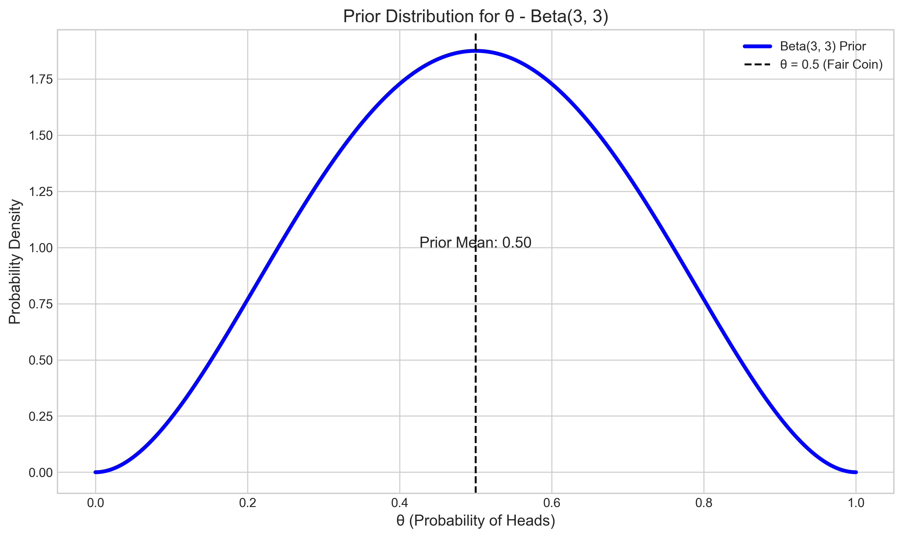
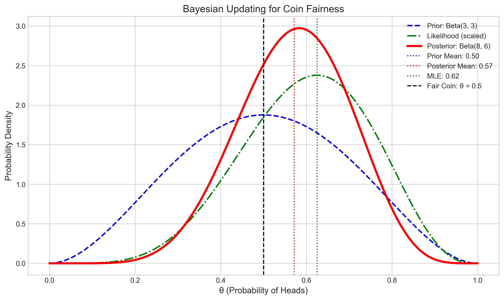
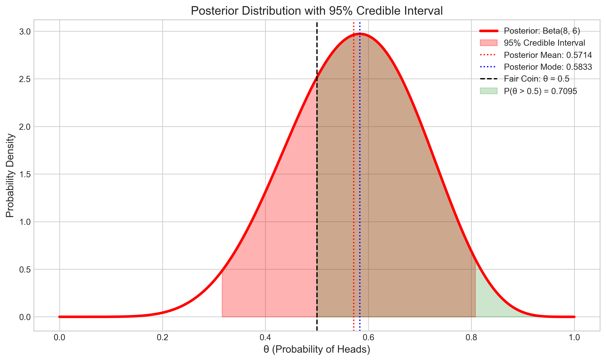
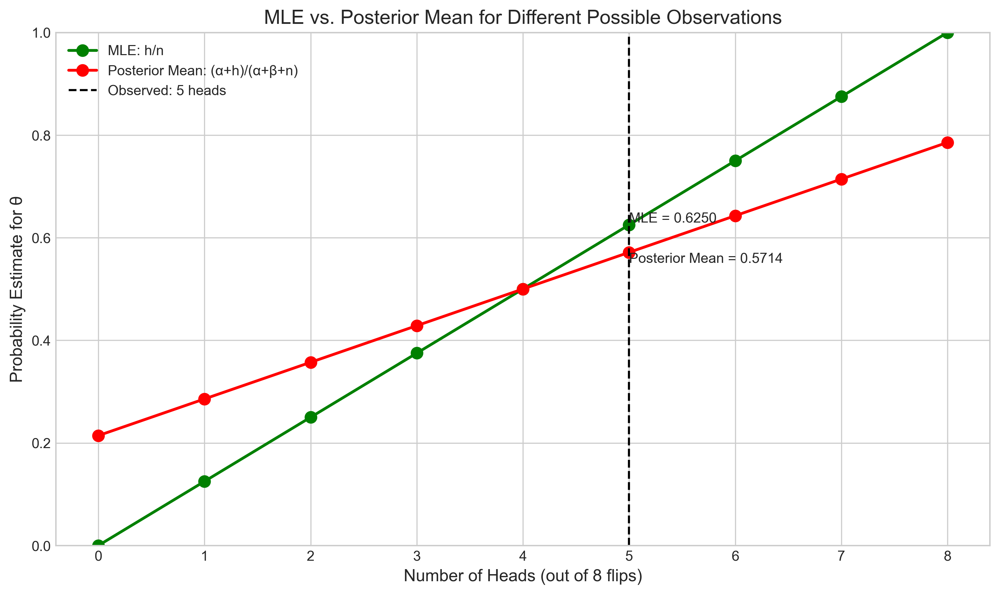
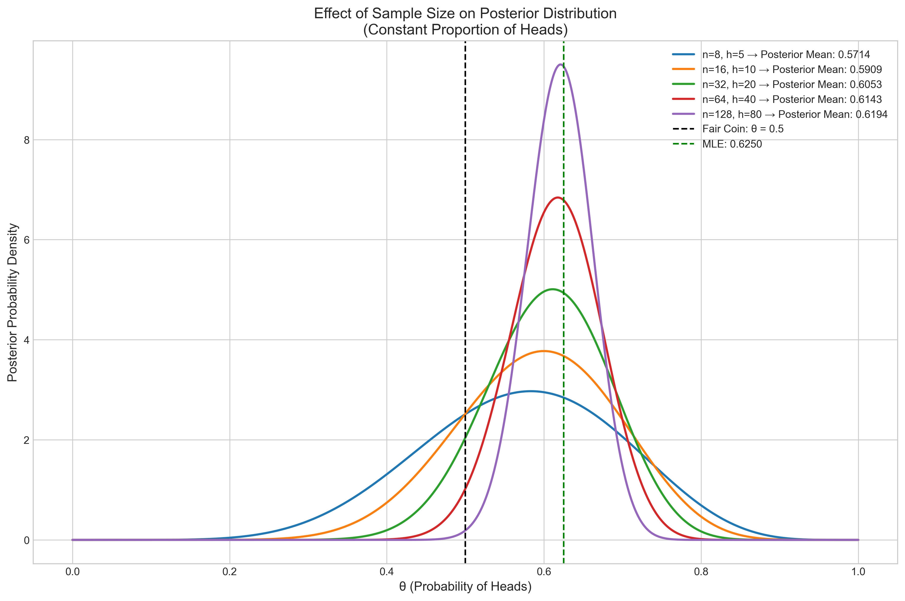
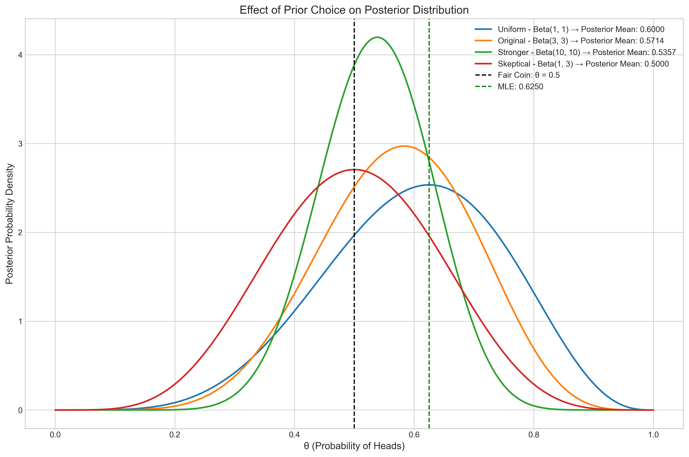

# Question 8: Bayesian Inference for Coin Fairness

## Problem Statement
Consider a Bayesian inference problem where we want to determine if a coin is fair.

## Tasks
1. If our prior belief is represented by a $\text{Beta}(3,3)$ distribution and we observe 5 heads out of 8 coin flips, what is the posterior distribution?
2. What is the posterior mean probability of the coin showing heads?
3. How does this posterior mean compare to the maximum likelihood estimate $(5/8)$?

## Solution

### Task 1: Finding the Posterior Distribution

In Bayesian inference for a binomial process like coin flipping, the Beta distribution is the conjugate prior for the parameter $\theta$, which represents the probability of heads. 

The Beta distribution is a natural choice for modeling a probability parameter because:
1. It is defined on the interval $[0,1]$, which matches the range of probability values
2. It can express a wide variety of shapes, allowing us to represent different prior beliefs

For our problem, the prior belief is represented by $\text{Beta}(3,3)$, which is symmetric around 0.5. This represents a prior belief that the coin is fair with some uncertainty. The parameters $\alpha=3$ and $\beta=3$ can be interpreted as having previously observed $(\alpha-1) + (\beta-1) = 4$ virtual coin flips with equal numbers of heads and tails.

When we observe data from a binomial process (like coin flips), the Bayesian updating rule for a Beta prior is straightforward:

If the prior is $\text{Beta}(\alpha, \beta)$ and we observe $h$ heads and $t$ tails, then the posterior is:

$\text{Beta}(\alpha + h, \beta + t)$

In our problem:
- Prior: $\text{Beta}(\alpha=3, \beta=3)$
- Observed data: 5 heads, 3 tails from 8 coin flips

Therefore, the posterior distribution is:
$\text{Beta}(\alpha + h, \beta + t) = \text{Beta}(3 + 5, 3 + 3) = \text{Beta}(8, 6)$

The figure above shows how Bayesian updating works in this problem. The prior belief (blue dashed line) is combined with the likelihood function from the observed data (green dash-dot line) to produce the posterior distribution (red solid line). The posterior represents our updated belief about the coin's fairness after observing the data.

### Task 2: Calculating the Posterior Mean

For a Beta distribution with parameters $\alpha$ and $\beta$, the mean is given by:

$E[\theta] = \frac{\alpha}{\alpha + \beta}$

Therefore, the posterior mean is:

$E[\theta|\text{data}] = \frac{\alpha'}{\alpha' + \beta'} = \frac{8}{8 + 6} = \frac{8}{14} \approx 0.5714$

This means that after observing 5 heads in 8 flips, our best estimate for the probability of heads is approximately 0.5714 or 57.14%.

The posterior distribution also gives us more information about our uncertainty:

- Posterior mode: $\frac{\alpha' - 1}{\alpha' + \beta' - 2} = \frac{8 - 1}{8 + 6 - 2} = \frac{7}{12} \approx 0.5833$
- Posterior variance: $\frac{\alpha' \beta'}{(\alpha' + \beta')^2 (\alpha' + \beta' + 1)} \approx 0.0163$
- Posterior standard deviation: $\approx 0.1278$
- 95% credible interval: $[0.3158, 0.8078]$

The figure above shows the posterior distribution with the 95% credible interval shaded in red. This interval means we are 95% confident that the true probability of heads lies between 0.3158 and 0.8078. The green shaded area represents the probability that the coin is biased toward heads ($\theta > 0.5$), which is approximately 70.95%.

### Task 3: Comparison with the Maximum Likelihood Estimate

The maximum likelihood estimate (MLE) for the probability of heads is simply the observed proportion:

$\text{MLE} = \frac{h}{h+t} = \frac{5}{8} = 0.6250$

Comparing this with our posterior mean:
- MLE: 0.6250
- Posterior Mean: 0.5714
- Difference: -0.0536

The posterior mean is slightly lower than the MLE. This "shrinkage" effect is due to the influence of the prior, which pulls the estimate toward 0.5 (the prior mean). The amount of shrinkage depends on the relative strength of the prior compared to the data.

The figure above compares how the MLE and the posterior mean would change for different possible observations. For all possible outcomes, the posterior mean (red line) is shrunk toward the prior mean (0.5) compared to the MLE (green line). At our observed value of 5 heads, we can see the difference between the two estimates.

We can quantify the relative influence of the prior and the data in the posterior:
- Effective sample size of the prior: 4
- Data sample size: 8
- In the posterior, the data carries approximately 66.67% of the weight, while the prior carries approximately 33.33% of the weight.

### Effect of Sample Size

As the sample size increases while maintaining the same proportion of heads (5/8 = 0.625), the influence of the prior diminishes, and the posterior distribution becomes more concentrated around the observed proportion.

The figure above shows how the posterior distribution changes with increasing sample sizes, all with the same proportion of heads (0.625). With larger sample sizes, the posterior becomes more narrowly peaked around the MLE (0.625), and the effect of the prior becomes less noticeable.

### Prior Sensitivity Analysis

Different prior beliefs can lead to different posterior distributions even with the same observed data.

The figure shows how different priors affect the posterior distribution:
- Uniform Prior (Beta(1,1)): No prior bias, resulting in a posterior mean closest to the MLE (0.625)
- Original Prior (Beta(3,3)): Moderate belief in a fair coin, resulting in some shrinkage toward 0.5
- Stronger Prior (Beta(10,10)): Strong belief in a fair coin, resulting in significant shrinkage toward 0.5
- Skeptical Prior (Beta(1,3)): Prior belief that the coin is biased against heads, pulling the posterior mean lower

## Conclusion

1. The posterior distribution after observing 5 heads out of 8 coin flips with a Beta(3,3) prior is Beta(8,6).
2. The posterior mean probability of the coin showing heads is 8/14 ≈ 0.5714.
3. The posterior mean (0.5714) is lower than the MLE (0.6250) by 0.0536. This difference occurs because:
   - The prior Beta(3,3) is centered at 0.5, representing a belief that the coin is fair
   - The data (5/8 heads) suggests a bias toward heads
   - The posterior combines these two sources of information, with the prior pulling the estimate toward 0.5
   - As we collect more data, the posterior would converge toward the MLE

This example illustrates how Bayesian inference naturally balances prior beliefs with observed data to form updated beliefs, with the relative influence depending on the strength of the prior and the amount of data collected. 