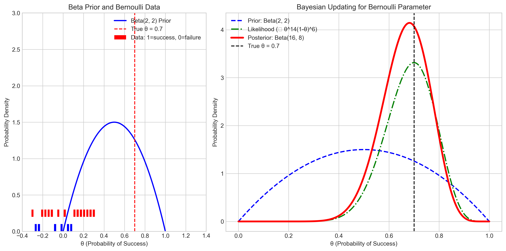
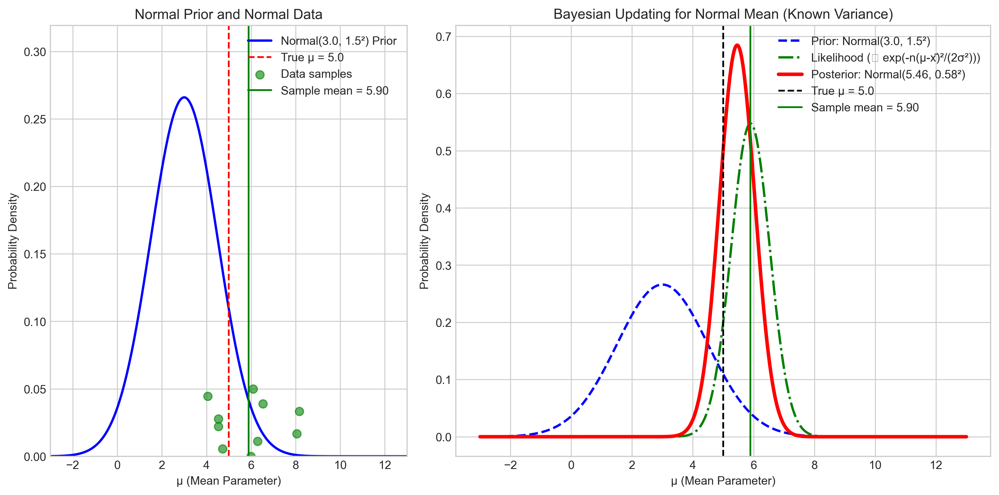
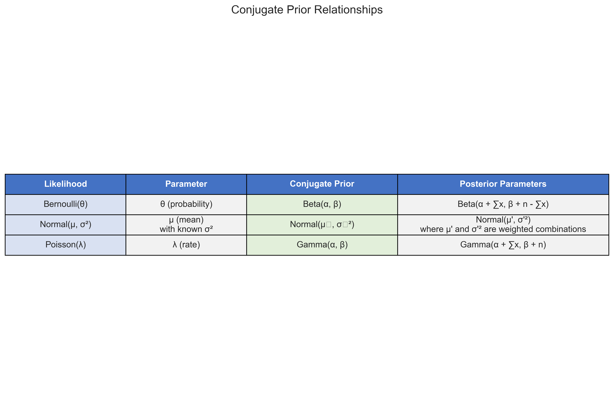

# Question 9: Conjugate Priors for Common Likelihoods

## Problem Statement
For each of the following likelihoods, identify the corresponding conjugate prior:

1. Bernoulli likelihood (for binary outcomes)
2. Normal likelihood with known variance (for the mean parameter)
3. Poisson likelihood (for the rate parameter)

## Solution

### Introduction to Conjugate Priors

In Bayesian statistics, a conjugate prior is a prior distribution that, when combined with the likelihood function, yields a posterior distribution of the same family as the prior. This mathematical convenience makes Bayesian computations much more tractable, as it allows for closed-form solutions for the posterior distribution without requiring numerical integration or sampling methods.

The concept of conjugate priors is particularly important for practical applications of Bayesian inference, as it:
- Simplifies the mathematical analysis
- Reduces computational complexity
- Allows for intuitive parameter interpretation
- Enables sequential updating as new data becomes available

Let's identify the conjugate priors for each of the specified likelihood functions.

### 1. Bernoulli Likelihood: Beta Prior

The Bernoulli distribution models binary outcomes (success/failure) with probability parameter $\theta$.

**Bernoulli Probability Mass Function:**
$P(X = x | \theta) = \theta^x (1-\theta)^{(1-x)}$, where $x \in \{0, 1\}$

For $n$ independent Bernoulli trials with $s$ successes, the likelihood function is:
$L(\theta | \text{data}) \propto \theta^s (1-\theta)^{n-s}$

This likelihood has the form $\theta^a (1-\theta)^b$, which matches the kernel of a Beta distribution. Therefore, the **conjugate prior for the Bernoulli likelihood is the Beta distribution**.

**Beta Prior PDF:**
$p(\theta | \alpha, \beta) = \frac{\theta^{\alpha-1} (1-\theta)^{\beta-1}}{B(\alpha, \beta)}$, where $B(\alpha, \beta)$ is the Beta function

When we combine this prior with the Bernoulli likelihood, the posterior is:
$p(\theta | \text{data}) \propto \theta^{\alpha+s-1} (1-\theta)^{\beta+n-s-1}$, which is a $\text{Beta}(\alpha+s, \beta+n-s)$ distribution.

The figure above demonstrates the Bayesian updating process with a Bernoulli likelihood and Beta prior. The left panel shows the prior distribution and the observed data. The right panel shows how the prior combines with the likelihood to form the posterior distribution.

This conjugate relationship extends to the Binomial distribution (multiple Bernoulli trials), where the Beta prior is also conjugate to the Binomial likelihood.

### 2. Normal Likelihood (Known Variance): Normal Prior

The Normal (Gaussian) distribution is characterized by a mean parameter $\mu$ and variance parameter $\sigma^2$. In this case, we're considering inference on the mean $\mu$ when the variance $\sigma^2$ is known.

**Normal Probability Density Function:**
$P(X = x | \mu, \sigma^2) = \frac{1}{\sqrt{2\pi\sigma^2}} \exp\left(-\frac{(x-\mu)^2}{2\sigma^2}\right)$

For $n$ independent observations from a Normal distribution with known variance $\sigma^2$, the likelihood function (with respect to $\mu$) is:
$L(\mu | \text{data}, \sigma^2) \propto \exp\left(-\frac{\sum_{i=1}^n(x_i-\mu)^2}{2\sigma^2}\right)$

Through algebraic manipulation, this can be rewritten as:
$L(\mu | \text{data}, \sigma^2) \propto \exp\left(-\frac{n}{2\sigma^2}\left(\mu - \frac{\sum_{i=1}^n x_i}{n}\right)^2\right)$

This has the form $\exp\left(-\frac{a}{2}(\mu-b)^2\right)$, which matches the kernel of a Normal distribution. Therefore, the **conjugate prior for the Normal likelihood (with known variance) is the Normal distribution**.

**Normal Prior PDF:**
$p(\mu | \mu_0, \sigma_0^2) = \frac{1}{\sqrt{2\pi\sigma_0^2}} \exp\left(-\frac{(\mu-\mu_0)^2}{2\sigma_0^2}\right)$

When we combine this prior with the Normal likelihood, the posterior is also Normal with parameters that are precision-weighted combinations of the prior parameters and data statistics.

The figure above illustrates the Bayesian updating process with a Normal likelihood and Normal prior. The left panel shows the prior distribution and the observed data points. The right panel shows how the prior combines with the likelihood to form the posterior distribution. Both the likelihood and posterior are centered around the sample mean, while the prior is centered at its own mean. The posterior represents a compromise between the prior and the data.

### 3. Poisson Likelihood: Gamma Prior

The Poisson distribution models count data and is characterized by a rate parameter $\lambda$.

**Poisson Probability Mass Function:**
$P(X = k | \lambda) = \frac{\lambda^k e^{-\lambda}}{k!}$, where $k$ is a non-negative integer

For $n$ independent observations from a Poisson distribution, the likelihood function is:
$L(\lambda | \text{data}) \propto \lambda^{\sum_{i=1}^n k_i} e^{-n\lambda}$

This has the form $\lambda^a e^{-b\lambda}$, which matches the kernel of a Gamma distribution. Therefore, the **conjugate prior for the Poisson likelihood is the Gamma distribution**.

**Gamma Prior PDF:**
$p(\lambda | \alpha, \beta) = \frac{\beta^\alpha}{\Gamma(\alpha)} \lambda^{\alpha-1} e^{-\beta\lambda}$, where $\Gamma(\alpha)$ is the Gamma function

When we combine this prior with the Poisson likelihood, the posterior is:
$p(\lambda | \text{data}) \propto \lambda^{\alpha+\sum k_i-1} e^{-(\beta+n)\lambda}$, which is a $\text{Gamma}(\alpha+\sum k_i, \beta+n)$ distribution.

The figure above demonstrates the Bayesian updating process with a Poisson likelihood and Gamma prior. The left panel shows the prior distribution and a histogram of the observed data. The right panel shows how the prior combines with the likelihood to form the posterior distribution.

### Summary of Conjugate Prior Relationships

The following table summarizes the conjugate prior relationships for the three likelihood functions:

## Conclusion

Conjugate priors are a powerful concept in Bayesian statistics that provide analytical tractability for posterior calculations. For the likelihoods in question:

1. **Bernoulli likelihood**: The conjugate prior is the **Beta distribution**
2. **Normal likelihood with known variance**: The conjugate prior is the **Normal distribution**
3. **Poisson likelihood**: The conjugate prior is the **Gamma distribution**

Each of these conjugate relationships allows for closed-form solutions for the posterior distribution, making the Bayesian inference process more efficient and interpretable. The posterior parameters have intuitive interpretations in terms of the prior "virtual" observations combined with the actual observed data.

While modern computational methods like Markov Chain Monte Carlo (MCMC) have reduced the necessity of using conjugate priors (by allowing numerical approximation of posterior distributions for arbitrary prior-likelihood combinations), conjugate priors remain valuable for their mathematical elegance, computational efficiency, and conceptual clarity in understanding Bayesian updating. 