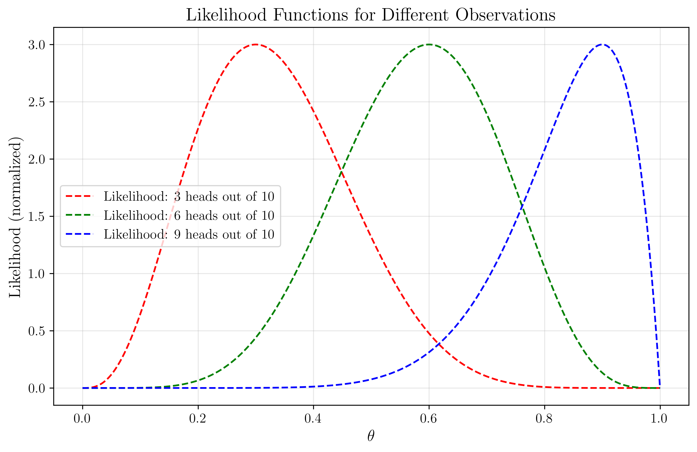

# Lecture 2.5: Bayesian Approach to ML Quiz

## Overview
This quiz contains 18 questions from different topics covered in section 2.5 of the lectures on Bayesian Framework.

## Question 1

### Problem Statement
Suppose we have a coin with an unknown probability $\theta$ of landing heads. We want to estimate $\theta$ using Bayesian inference.

1. Assume a prior distribution for $\theta$ as $\text{Beta}(2, 2)$
2. We toss the coin 10 times and observe 7 heads and 3 tails

#### Task
1. Write down the likelihood function for the observed data
2. Calculate the posterior distribution for $\theta$
3. Find the posterior mean, mode, and variance of $\theta$
4. Calculate the 95% credible interval for $\theta$

For a detailed explanation of this problem, including step-by-step solutions and key insights, see [Question 1: Bayesian Coin Flip Analysis](L2_5_1_explanation.md).

## Question 2

### Problem Statement
Consider a diagnostic test for a disease that affects 1% of the population. The test has a true positive rate (sensitivity) of 95% and a true negative rate (specificity) of 90%.

#### Task
1. Using Bayes' theorem, calculate the probability that a person has the disease given a positive test result
2. If we repeat the test on the same person and it comes back positive again, what is the updated probability that the person has the disease?
3. How many consecutive positive test results would be needed to have at least a 95% probability that the person has the disease?
4. Discuss how the prevalence of the disease affects the interpretation of test results

For a detailed explanation of this problem, including step-by-step solutions and key insights, see [Question 2: Bayesian Medical Diagnostics](L2_5_2_explanation.md).

## Question 3

### Problem Statement
Consider a Poisson likelihood with parameter $\lambda$ for count data. We observe data $X = \{3, 5, 2, 4, 6, 3, 4, 5, 2, 3\}$.

#### Task
1. If we use a $\text{Gamma}(\alpha, \beta)$ prior for $\lambda$, derive the posterior distribution
2. Assuming a $\text{Gamma}(2, 1)$ prior, calculate the posterior distribution
3. Find the posterior mean, mode, and variance of $\lambda$
4. Calculate the predictive distribution for a new observation $X_{\text{new}}$

For a detailed explanation of this problem, including step-by-step solutions and key insights, see [Question 3: Poisson-Gamma Bayesian Model](L2_5_3_explanation.md).

## Question 4

### Problem Statement
Consider the problem of estimating the mean $\mu$ of a normal distribution with known variance $\sigma^2 = 4$. We observe data $X = \{10.2, 8.7, 9.5, 11.3, 10.8\}$.

#### Task
1. If we use a normal prior $N(9, 1)$ for $\mu$, derive the posterior distribution
2. Calculate the posterior mean and variance
3. Find the 90% credible interval for $\mu$
4. Compare the Bayesian estimate with the maximum likelihood estimate (MLE) and discuss the differences between the two approaches

For a detailed explanation of this problem, including step-by-step solutions and key insights, see [Question 4: Normal Distribution Parameter Estimation](L2_5_4_explanation.md).

## Question 5

### Problem Statement
For a simple classification problem, we want to estimate the probability $p$ of an observation belonging to class 1. We have observed 5 instances belonging to class 1 out of 20 total observations.

#### Task
1. If we use a uniform prior ($\text{Beta}(1,1)$) for $p$, what is the posterior distribution?
2. What is the posterior mean of $p$?
3. How would the posterior change if we had used an informative prior $\text{Beta}(10,30)$?
4. Explain the practical significance of using an informative prior versus a uniform prior in this context.

For a detailed explanation of this problem, including step-by-step solutions and key insights, see [Question 5: Bayesian Classification Probability](L2_5_5_explanation.md).

## Question 6

### Problem Statement
Evaluate whether each of the following statements is TRUE or FALSE. Justify your answer with a brief explanation.

#### Task
1. In Bayesian statistics, the posterior distribution represents our updated belief about a parameter after observing data.
2. Conjugate priors always lead to the most accurate Bayesian inference results.
3. Bayesian credible intervals and frequentist confidence intervals have identical interpretations.
4. The posterior predictive distribution incorporates both the uncertainty in the parameter estimates and the inherent randomness in generating new data.
5. Hierarchical Bayesian models are useful only when we have a large amount of data.

For a detailed explanation of this problem, including step-by-step solutions and key insights, see [Question 6: Bayesian Statistics Concepts](L2_5_6_explanation.md).

## Question 7

### Problem Statement
Consider a scenario where we are modeling the number of defects in a manufacturing process using a Poisson distribution with parameter $\lambda$.

#### Task
1. What is the conjugate prior for a Poisson likelihood?
2. If our prior for $\lambda$ is $\text{Gamma}(3, 2)$ and we observe the following defect counts in 5 batches: $\{1, 0, 2, 1, 1\}$, what is the resulting posterior distribution?
3. Calculate the posterior mean of $\lambda$.
4. What is the advantage of using a conjugate prior in this specific scenario?

For a detailed explanation of this problem, including step-by-step solutions and key insights, see [Question 7: Bayesian Manufacturing Process Analysis](L2_5_7_explanation.md).

## Question 8

### Problem Statement
Consider a Bayesian inference problem where we want to determine if a coin is fair.

#### Task
1. If our prior belief is represented by a $\text{Beta}(3,3)$ distribution and we observe 5 heads out of 8 coin flips, what is the posterior distribution?
2. What is the posterior mean probability of the coin showing heads?
3. How does this posterior mean compare to the maximum likelihood estimate $(5/8)$?

For a detailed explanation of this problem, including step-by-step solutions and key insights, see [Question 8: Prior and Posterior Comparison](L2_5_8_explanation.md).

## Question 9

### Problem Statement
For each of the following likelihoods, identify the corresponding conjugate prior:

#### Task
1. Bernoulli likelihood (for binary outcomes)
2. Normal likelihood with known variance (for the mean parameter)
3. Poisson likelihood (for the rate parameter)

For a detailed explanation of this problem, including step-by-step solutions and key insights, see [Question 9: Conjugate Prior Identification](L2_5_9_explanation.md).

## Question 10

### Problem Statement
Consider a simple hierarchical Bayesian model for analyzing students' test scores across different schools.

#### Task
1. Describe the basic structure of a two-level hierarchical Bayesian model for this scenario
2. Explain one advantage of using a hierarchical model versus a non-hierarchical model in this context
3. Identify a scenario where empirical Bayes might be used instead of a fully Bayesian approach

For a detailed explanation of this problem, including step-by-step solutions and key insights, see [Question 10: Hierarchical Bayesian Modeling](L2_5_10_explanation.md).

## Question 11

### Problem Statement
A soil scientist is developing a Bayesian model to predict soil nutrient content. Based on previous studies at similar sites, the nutrient concentration follows a normal distribution with unknown mean $\mu$.

#### Task
1. If the scientist uses a normal prior for $\mu$ with mean 25 ppm and variance 4, and then collects 6 samples with measurements $\{22, 27, 24, 23, 26, 25\}$ ppm and known measurement variance $\sigma^2 = 9$, what is the posterior distribution for $\mu$?
2. Calculate the posterior mean and variance.
3. Compare how the posterior would differ if an uninformative prior had been used instead.

For a detailed explanation of this problem, including step-by-step solutions and key insights, see [Question 11: Informative vs Noninformative Priors](L2_5_11_explanation.md).

## Question 12

### Problem Statement
In astronomy, researchers are modeling the number of exoplanets in different star systems. They believe the count follows a Poisson distribution with an unknown rate parameter $\lambda$.

#### Task
1. Given that Gamma is the conjugate prior for the Poisson distribution, express the posterior distribution if the prior is $\text{Gamma}(\alpha=2, \beta=0.5)$ and observations from 5 star systems show $\{3, 1, 4, 2, 5\}$ exoplanets.
2. What is the posterior mean of $\lambda$?
3. What is the posterior predictive probability of finding exactly 3 exoplanets in the next observed star system?

For a detailed explanation of this problem, including step-by-step solutions and key insights, see [Question 12: Posterior Predictive Distribution](L2_5_12_explanation.md).

## Question 13

### Problem Statement
A music streaming service is analyzing user preferences across different genres. They want to apply a hierarchical Bayesian model to understand listening patterns.

#### Task
1. Explain how a two-level hierarchical Bayesian model could be structured for this scenario, where individual users are grouped by geographical regions.
2. If the service has limited computational resources, how could empirical Bayes be used as an alternative to full Bayesian inference?
3. Describe one key difference between Bayesian credible intervals and frequentist confidence intervals in interpreting user preference data.

For a detailed explanation of this problem, including step-by-step solutions and key insights, see [Question 13: Hierarchical Models and Empirical Bayes](L2_5_13_explanation.md).

## Question 14

### Problem Statement
The graphs below illustrate various aspects of Bayesian inference for estimating the probability parameter $\theta$ of a biased coin, where we've observed 6 heads out of 10 coin flips.

#### Task
Using only the information provided in these visualizations:

1. Which prior distribution ($\text{Beta}(2,5)$, $\text{Beta}(5,2)$, or $\text{Beta}(3,3)$) has the strongest influence on the posterior distribution? Explain your reasoning.
2. For the posterior based on the $\text{Beta}(3,3)$ prior, determine the 90% credible interval for $\theta$.
3. Based on the Bayesian updating graph, which has a greater impact on the final posterior: the initial prior or the observed data? Explain why.
4. Determine the expected value of $\theta$ for the posterior distribution that uses the $\text{Beta}(5,2)$ prior.

For a detailed explanation of this problem, including step-by-step solutions and key insights, see [Question 14: Visual Bayesian Inference and Prior Selection](L2_5_14_explanation.md).

## [⭐] Question 15

### Problem Statement
Consider a Naive Bayes classifier for predicting heart disease based on two features: diabetes status and smoking status. The following table shows the training data:

| Diabetes (D) | Smoke (S) | Heart Disease (H) |
|:------------:|:---------:|:-----------------:|
| Y | N | Y |
| Y | N | N |
| N | Y | N |
| N | Y | N |
| N | N | N |
| N | Y | Y |
| N | N | N |
| N | Y | Y |
| N | N | N |
| Y | N | N |

From this data, we can calculate:
- $P(H = \text{Yes}) = 0.3$ (3 out of 10 patients)
- $P(H = \text{No}) = 0.7$ (7 out of 10 patients)
- $P(D = \text{Yes}|H = \text{Yes}) = \frac{1}{3}$ (1 out of 3 patients with heart disease)
- $P(S = \text{Yes}|H = \text{Yes}) = \frac{2}{3}$ (2 out of 3 patients with heart disease)
- $P(D = \text{Yes}|H = \text{No}) = \frac{2}{7}$ (2 out of 7 patients without heart disease)
- $P(S = \text{Yes}|H = \text{No}) = \frac{2}{7}$ (2 out of 7 patients without heart disease)

#### Task
1. For a new patient with diabetes who also smokes ($x = [\text{Yes}, \text{Yes}]$), calculate:
   - $P(H = \text{Yes}|x) \propto P(H = \text{Yes})P(D = \text{yes}|H = \text{Yes})P(S = \text{yes}|H = \text{Yes})$
   - $P(H = \text{No}|x) \propto P(H = \text{No})P(D = \text{yes}|H = \text{No})P(S = \text{yes}|H = \text{No})$
2. Based on your calculations, what would be the predicted class for this patient?
3. Explain why we use proportionality ($\propto$) instead of equality ($=$) in the calculations.
4. What assumption does Naive Bayes make about the features D and S? Is this assumption realistic in this medical context?

For a detailed explanation of this problem, including step-by-step solutions and key insights, see [Question 15: Naive Bayes Classification](L2_5_15_explanation.md).

## Question 16

### Problem Statement
In a two-class, two-dimensional classification task, the feature vectors are generated by two normal distributions sharing the same covariance matrix
$$\Sigma = \begin{bmatrix} 2 & 0.5 \\ 0.5 & 3 \end{bmatrix}$$
and the mean vectors are $\mu_1 = \begin{bmatrix} -1 \\ -1 \end{bmatrix}$, $\mu_2 = \begin{bmatrix} 2 \\ 2 \end{bmatrix}$, respectively.

#### Task
1. Classify the vector $\begin{bmatrix} 1.0 \\ 0.2 \end{bmatrix}$ according to the Bayesian classifier.
2. Draw a creative analogy between the prior, likelihood, and posterior distributions in Bayesian inference and a real-world scenario (such as courtroom judgment, medical diagnosis, or weather prediction).

For a detailed explanation of this problem, including step-by-step solutions and key insights, see [Question 16: Bayesian Classification with Normal Distributions](L2_5_16_explanation.md).

## Question 17

### Problem Statement
We have a training set consisting of samples and their labels. All samples come from one of two classes, 0 and 1. Samples are two dimensional vectors. The input data is the form $\{X1, X2, Y\}$ where $X1$ and $X2$ are the two values for the input vector and $Y$ is the label for this sample.

After learning the parameters of a Naive Bayes classifier we arrived at the following table:

| | $Y = 0$ | $Y = 1$ |
|:---:|:---:|:---:|
| $X1$ | $P(X1 = 1\|Y = 0) = 1/5$ | $P(X1 = 1\|Y = 1) = 3/8$ |
| $X2$ | $P(X2 = 1\|Y = 0) = 1/3$ | $P(X2 = 1\|Y = 1) = 3/4$ |

#### Task
Denote by $w_1$ the probability of class 1 (that is $w_1 = P(Y = 1)$). If we know that the likelihood of the following two samples: $\{1,0,1\},\{0,1,0\}$ given our Naive Bayes model is $1/180$, what is the value of $w_1$? You do not need to derive an explicit value for $w_1$. It is enough to write a (correct...) equation that has $w_1$ as the only unknown and that when solved would provide the value of $w_1$. Simplify as best as you can.

For a detailed explanation of this problem, including step-by-step solutions and key insights, see [Question 17: Naive Bayes Parameter Estimation](L2_5_17_explanation.md).

## Question 18

## Problem Statement
A meteorologist is applying Bayesian inference to forecast the probability of rain for tomorrow. Based on historical weather data for this time of year, she has chosen a $\text{Beta}(2, 8)$ prior distribution for the probability of rain. This prior distribution has a mean of $\frac{2}{2+8} = 0.2$, indicating that based on historical patterns alone, there is a 20% chance of rain tomorrow.

However, the meteorologist receives new information: a special weather report indicating that a storm system is approaching the area. This new information suggests a higher probability of rain than the historical average would indicate, but it hasn't been quantified precisely.

### Task
1. Explain why the meteorologist should consider changing her prior distribution (currently $\text{Beta}(2, 8)$) in light of this new information about the approaching storm system.
2. If the meteorologist wants to adjust her prior to reflect a 40% probability of rain (instead of the original 20% from the $\text{Beta}(2, 8)$ prior), while maintaining the same level of certainty, what new Beta parameters $(\alpha, \beta)$ should she use?
3. What would be a reasonable approach if she became more uncertain about the rain probability after hearing conflicting reports from different weather services? Provide specific Beta parameters that would represent this increased uncertainty while maintaining the expected 40% probability of rain.
4. If she observes rainy conditions on 3 out of the next 5 days, calculate the posterior distribution for both the original and adjusted priors. Compare how the different priors affect the final forecast and explain which prior leads to the most accurate posterior prediction.

For a detailed explanation of this problem, including step-by-step solutions and key insights, see [Question 18: Updating Prior Distributions in Weather Forecasting](L2_5_18_explanation.md).