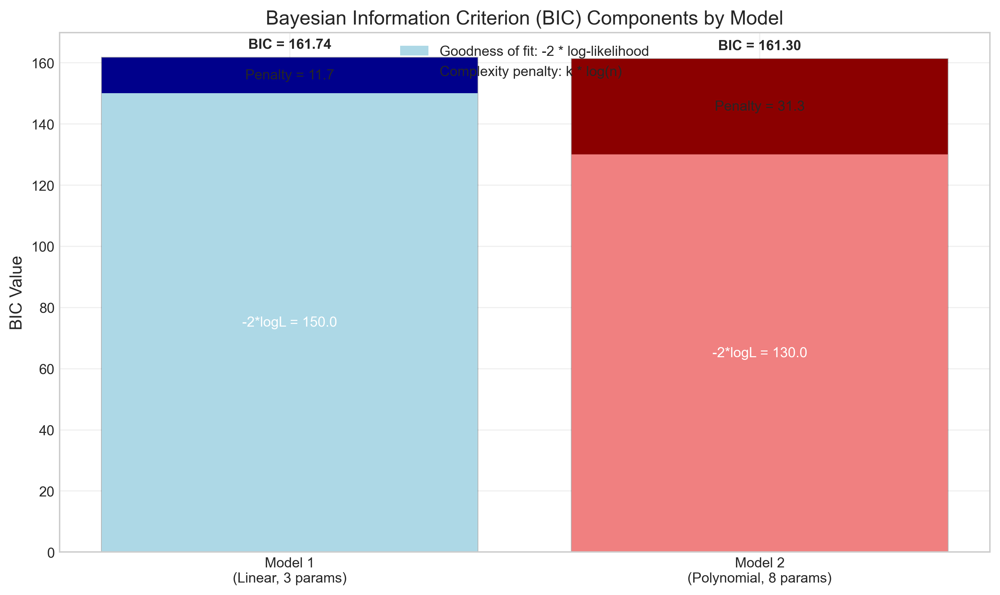
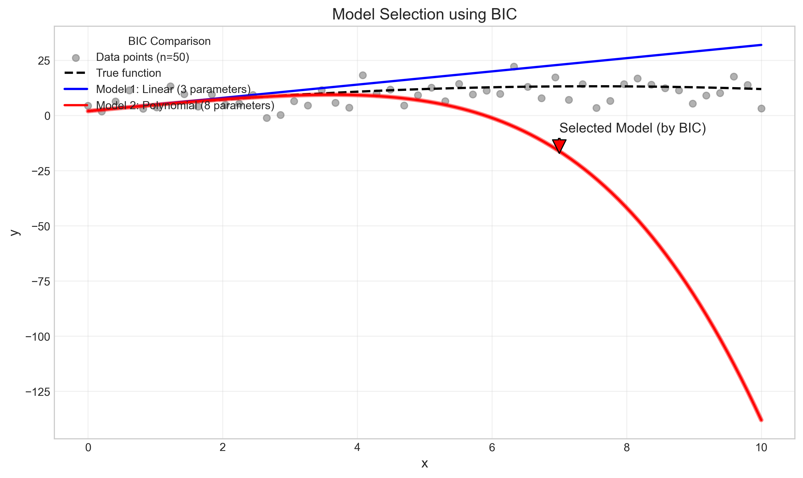
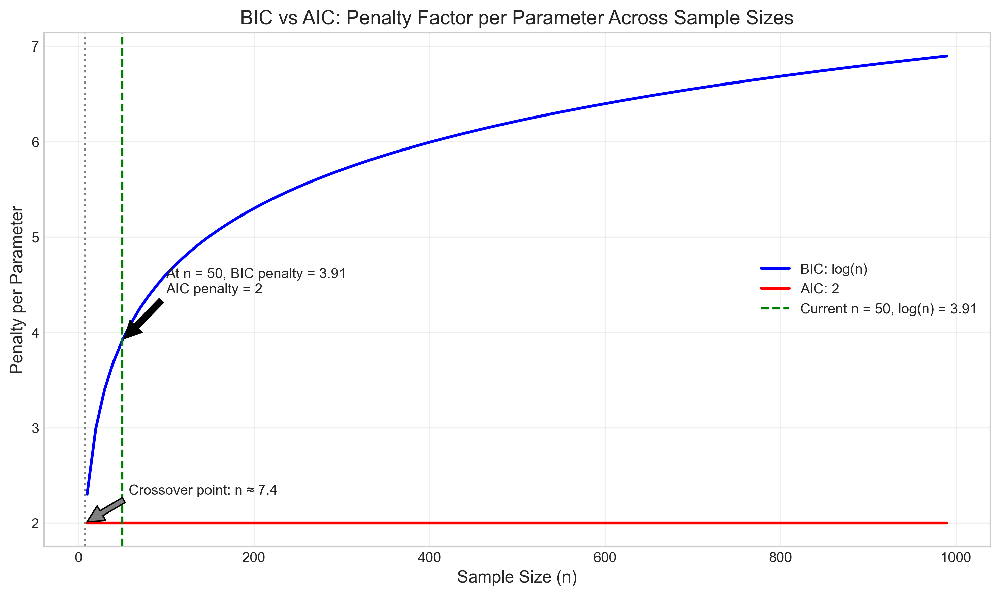
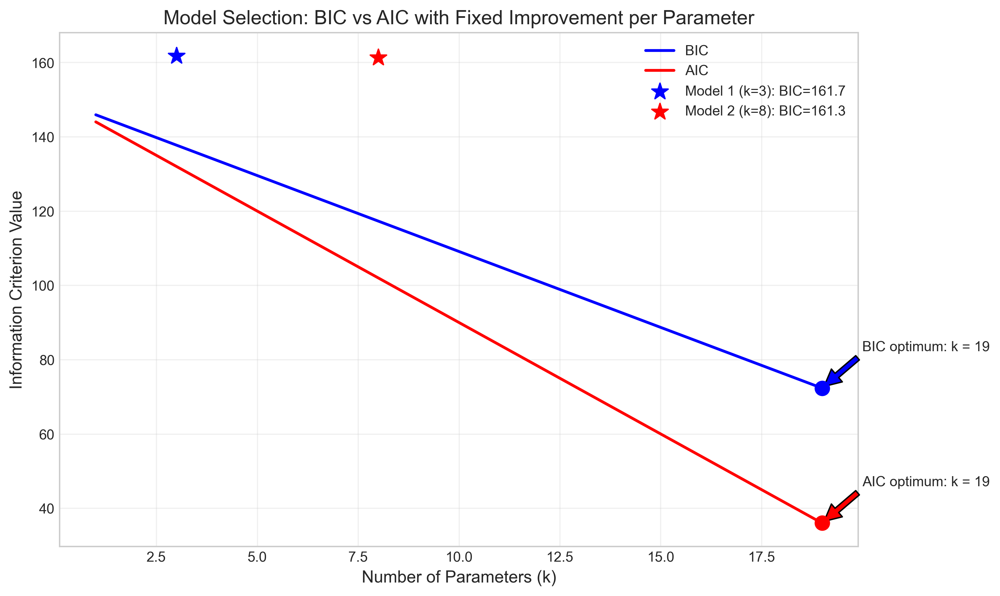

# Question 10: Bayesian Information Criterion

## Problem Statement
Consider comparing two models:
- $M_1$: Linear regression with 3 parameters
- $M_2$: Polynomial regression with 8 parameters

Both models are fit to $n = 50$ data points, with resulting maximum log-likelihoods:
$\log p(D|M_1, \hat{\theta}_1) = -75$
$\log p(D|M_2, \hat{\theta}_2) = -65$

### Task
1. Calculate the BIC value for each model
2. Which model would be selected according to BIC? Explain why
3. How does BIC penalize model complexity compared to AIC (Akaike Information Criterion)?

## Solution

### Step 1: Calculate the BIC value for each model

The Bayesian Information Criterion (BIC) is defined as:

$$\text{BIC} = -2 \times \log\text{-likelihood} + k \times \log(n)$$

Where:
- $\log\text{-likelihood}$ is the maximum log-likelihood of the model
- $k$ is the number of parameters in the model
- $n$ is the number of data points

For Model $M_1$ (Linear regression with 3 parameters):
$$\text{BIC}_1 = -2 \times (-75) + 3 \times \log(50)$$
$$\text{BIC}_1 = 150 + 3 \times 3.912$$
$$\text{BIC}_1 = 150 + 11.736$$
$$\text{BIC}_1 = 161.736$$

For Model $M_2$ (Polynomial regression with 8 parameters):
$$\text{BIC}_2 = -2 \times (-65) + 8 \times \log(50)$$
$$\text{BIC}_2 = 130 + 8 \times 3.912$$
$$\text{BIC}_2 = 130 + 31.296$$
$$\text{BIC}_2 = 161.296$$

The BIC difference (BIC$_2$ - BIC$_1$) is:
$$\Delta \text{BIC} = 161.296 - 161.736 = -0.440$$

The figure above illustrates the components of the BIC calculation for each model. The BIC value consists of two parts:
1. The goodness-of-fit term (-2 × log-likelihood): Lower values indicate better fit
2. The complexity penalty (k × log(n)): Higher values penalize more complex models

### Step 2: Which model would be selected according to BIC?

According to the BIC principle, the model with the lower BIC value is preferred. In this case:
- BIC for Model $M_1$ = 161.736
- BIC for Model $M_2$ = 161.296

Since BIC$_2$ < BIC$_1$ (with a difference of -0.440), Model $M_2$ (the polynomial regression model) would be selected.

This result might seem counterintuitive at first because BIC is known for penalizing model complexity more heavily than other criteria. However, in this specific case, the improvement in fit (the difference in log-likelihoods) is substantial enough to overcome the additional complexity penalty.

Model $M_2$ has a log-likelihood of -65, which is 10 units higher than Model $M_1$'s log-likelihood of -75. This translates to a 20-point advantage in the goodness-of-fit term of BIC. Meanwhile, the additional complexity penalty for $M_2$ is about 19.56 points (5 additional parameters × 3.912). Since 20 > 19.56, Model $M_2$ ends up with a slightly lower (better) BIC value.

### Step 3: How does BIC penalize model complexity compared to AIC?

The Akaike Information Criterion (AIC) is defined as:

$$\text{AIC} = -2 \times \log\text{-likelihood} + 2 \times k$$

The key difference between BIC and AIC is in how they penalize model complexity:
- AIC uses a fixed penalty of 2 per parameter
- BIC uses a penalty of log(n) per parameter, which increases with sample size

Let's compare the penalties for our models:

For Model $M_1$ (k = 3, n = 50):
- AIC penalty = 2 × 3 = 6
- BIC penalty = 3 × log(50) = 3 × 3.912 = 11.736
- Ratio (BIC/AIC) = 11.736/6 = 1.956

For Model $M_2$ (k = 8, n = 50):
- AIC penalty = 2 × 8 = 16
- BIC penalty = 8 × log(50) = 8 × 3.912 = 31.296
- Ratio (BIC/AIC) = 31.296/16 = 1.956

For our sample size of n = 50, the BIC penalty is approximately 1.956 times stronger than the AIC penalty. This ratio depends only on the sample size, not the number of parameters.

The figure above shows how the penalty factor per parameter changes with sample size for both BIC and AIC. For BIC, the penalty increases logarithmically with sample size, while for AIC, it remains constant at 2. The crossover point occurs at n ≈ 7.4 (where log(n) = 2). For any sample size larger than this, BIC penalizes complexity more heavily than AIC.

In our case, with n = 50, we can also calculate AIC values:
- AIC for Model $M_1$ = -2 × (-75) + 2 × 3 = 156
- AIC for Model $M_2$ = -2 × (-65) + 2 × 8 = 146
- ΔAIC (AIC$_2$ - AIC$_1$) = -10

The figure above illustrates how BIC and AIC behave differently as the number of parameters increases, assuming a fixed improvement in fit per additional parameter. BIC tends to select simpler models (those with fewer parameters) compared to AIC, especially as sample size increases.

## Key Insights

1. **Trade-off Mechanism**: Both BIC and AIC formalize the trade-off between model fit and complexity, but with different emphases. BIC applies a stronger penalty for complexity when the sample size is moderate to large.

2. **Sample Size Dependence**: Unlike AIC, BIC's penalty term depends on the sample size. As the sample size increases, BIC becomes increasingly conservative in adding parameters.

3. **Asymptotic Properties**:
   - BIC is consistent: As sample size approaches infinity, it will select the true model (if it exists in the candidate set)
   - AIC is efficient: It aims to minimize prediction error, even if the true model isn't in the candidate set

4. **Relative Penalty Strength**: For n = 50, the BIC penalty per parameter is about 1.956 times stronger than the AIC penalty. This ratio increases logarithmically with sample size.

5. **Model Selection Behavior**:
   - BIC tends to select simpler models (may underfit if sample size is large)
   - AIC tends to select more complex models (may overfit if sample size is small)

6. **Approximation to Bayesian Model Selection**: BIC provides an approximation to the logarithm of the Bayes factor, which is used in Bayesian model comparison. It approximates the integrated likelihood under certain conditions.

7. **Practical Implications**: In practice, when deciding between competing models:
   - If the primary goal is to identify the true model (assuming it exists in the set), BIC is preferred
   - If the primary goal is prediction accuracy, AIC may be more appropriate

## Conclusion

In this problem, we compared two regression models using the Bayesian Information Criterion. Despite having more parameters, the polynomial regression model (M₂) was selected by BIC because its substantially better fit to the data outweighed the increased complexity penalty.

The BIC penalizes model complexity more strongly than AIC when the sample size exceeds about 7.4, with the difference growing as sample size increases. For our sample size of n = 50, the BIC penalty per parameter is nearly twice that of AIC, illustrating BIC's inherent preference for parsimony.

This example highlights how BIC balances the trade-off between model fit and complexity, favoring simpler models unless more complex ones demonstrate substantially better explanatory power. This property makes BIC particularly valuable in scenarios where identifying the true underlying model is the primary objective. 