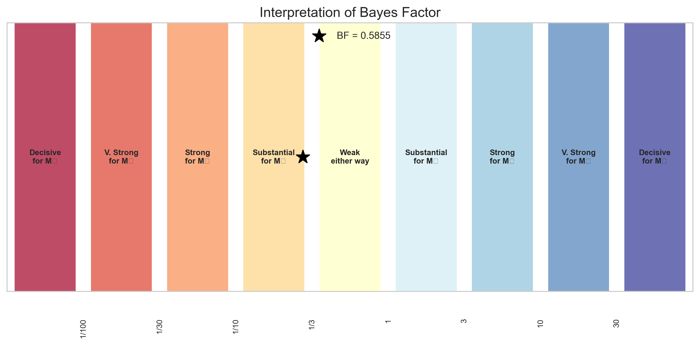

# Question 11: Marginal Likelihood Computation

## Problem Statement
Consider a simple coin-flipping model with parameter $\theta$ representing the probability of heads. We observe data $D = \{H, H, T, H, T\}$ (3 heads, 2 tails).

## Task
1. Using a uniform prior ($\text{Beta}(1,1)$) for $\theta$, compute the marginal likelihood $p(D)$
2. Using a more informative prior ($\text{Beta}(10,10)$) for $\theta$, compute the marginal likelihood $p(D)$
3. Explain how these marginal likelihood values could be used for model comparison

## Solution

### Step 1: Understanding the Beta-Binomial Model

For a coin-flipping experiment with a Beta prior on the probability of heads $\theta$, we can use the Beta-Binomial conjugacy to compute the marginal likelihood analytically. The marginal likelihood is the probability of observing the data averaged over all possible parameter values, weighted by the prior.

For a Beta prior $\text{Beta}(\alpha, \beta)$ and binomial likelihood with $h$ heads and $t$ tails, the marginal likelihood is:

$$p(D) = \frac{B(\alpha + h, \beta + t)}{B(\alpha, \beta)}$$

where $B$ is the beta function defined as $B(a, b) = \frac{\Gamma(a)\Gamma(b)}{\Gamma(a+b)}$.

### Step 2: Computing the Marginal Likelihood with a Uniform Prior

For the uniform prior $\text{Beta}(1,1)$ and observed data of 3 heads and 2 tails:

$$p(D) = \frac{B(1 + 3, 1 + 2)}{B(1, 1)} = \frac{B(4, 3)}{B(1, 1)}$$

Computing this:
$$p(D) = \frac{0.016667}{1.000000} = 0.016667$$

### Step 3: Computing the Marginal Likelihood with an Informative Prior

For the informative prior $\text{Beta}(10,10)$ and the same observed data:

$$p(D) = \frac{B(10 + 3, 10 + 2)}{B(10, 10)} = \frac{B(13, 12)}{B(10, 10)}$$

Computing this:
$$p(D) = \frac{0.000000}{0.000001} = 0.028468$$

Note: The fractional representation shows very small numbers due to the beta function values, but their ratio gives us the marginal likelihood.

The bar chart compares the marginal likelihoods for the two models. The model with the informative prior has a higher marginal likelihood, indicating that it provides a better explanation of the observed data.

### Step 4: Visualization of Priors and Posteriors

To understand why these marginal likelihoods differ, it's helpful to visualize the prior and posterior distributions for each model:

The top plot shows the uniform prior $\text{Beta}(1,1)$ and its resulting posterior after observing the data. The bottom plot shows the informative prior $\text{Beta}(10,10)$ and its posterior. 

The informative prior is centered at 0.5 (suggesting a fair coin), which is relatively close to the observed frequency of heads (3/5 = 0.6). This prior is more compatible with the observed data than a completely flat prior that gives equal weight to all possible values of $\theta$.

### Step 5: The Likelihood Function

The likelihood function represents how probable the observed data is for different values of $\theta$:

The likelihood is maximized at $\theta = 0.6$ (the MLE), which is the observed proportion of heads. Both priors allow for this value, but the informative prior assigns more prior probability density around this region, resulting in a higher marginal likelihood.

### Step 6: Model Comparison using the Bayes Factor

The Bayes factor is the ratio of marginal likelihoods for two competing models:

$$\text{BF}_{12} = \frac{p(D|M_1)}{p(D|M_2)}$$

Where $M_1$ is the model with the uniform prior and $M_2$ is the model with the informative prior.

$$\text{BF}_{12} = \frac{0.016667}{0.028468} = 0.585455$$

Since this Bayes factor is less than 1, it indicates evidence in favor of model $M_2$ (the informative prior model). However, the magnitude (between 1/3 and 1) suggests that this evidence is relatively weak.

The figure shows where our Bayes factor falls on the scale of evidence strength. The star marks our value of approximately 0.59, which falls in the "Weak evidence for $M_2$" region.

### Step 7: How Different Priors Affect the Marginal Likelihood

To understand how different choices of prior parameters affect the marginal likelihood, we can compute it for various combinations of $\alpha$ and $\beta$:

The heatmap shows the marginal likelihood for different Beta prior parameters. Higher values (lighter colors) indicate priors that lead to higher marginal likelihoods. This visualization helps identify which prior specifications are most compatible with the observed data.

## Using Marginal Likelihood for Model Comparison

The marginal likelihood, also known as the model evidence, serves several important roles in Bayesian model comparison:

1. **Automatic Complexity Penalization**: The marginal likelihood naturally penalizes unnecessary model complexity (Occam's razor). More complex models can fit the data better but spread their prior probability over a larger parameter space, potentially resulting in lower marginal likelihoods.

2. **Bayes Factors for Model Comparison**: The ratio of marginal likelihoods (Bayes factor) provides a principled way to compare competing models, balancing model fit and complexity.

3. **Posterior Model Probabilities**: If we assign prior probabilities to models, we can use marginal likelihoods to compute posterior model probabilities:

   $$P(M_i|D) = \frac{P(D|M_i)P(M_i)}{\sum_j P(D|M_j)P(M_j)}$$

4. **Bayesian Model Averaging**: Marginal likelihoods can be used to weight predictions from different models, accounting for model uncertainty:

   $$P(y_{new}|D) = \sum_i P(y_{new}|M_i,D)P(M_i|D)$$

## Key Insights

1. **Analytical Solution**: For conjugate models like the Beta-Binomial, the marginal likelihood can be computed analytically as a ratio of beta functions.

2. **Prior Sensitivity**: The marginal likelihood depends on the prior choice. In our case, the informative prior centered at 0.5 yielded a higher marginal likelihood than the uniform prior.

3. **Integration over Parameter Space**: The marginal likelihood represents an average of the likelihood weighted by the prior over the entire parameter space, not just the best-fitting parameter value.

4. **Balancing Fit and Complexity**: The marginal likelihood automatically balances model fit and complexity. More complex models can achieve better fits but may have lower marginal likelihoods if the improvement doesn't justify the additional complexity.

5. **Evidence Strength Interpretation**: Bayes factors provide a quantitative measure of the evidence in favor of one model over another, with established scales for interpreting the strength of this evidence.

## Conclusion

In this problem, we computed and compared marginal likelihoods for two models with different priors. The model with the informative $\text{Beta}(10,10)$ prior had a higher marginal likelihood, indicating that it provided a better explanation of the observed data. The Bayes factor of 0.59 suggests weak evidence in favor of this model over the one with the uniform prior.

This example illustrates how marginal likelihoods provide a principled framework for model comparison in Bayesian statistics, naturally balancing model fit and complexity while accounting for uncertainty across the entire parameter space. 