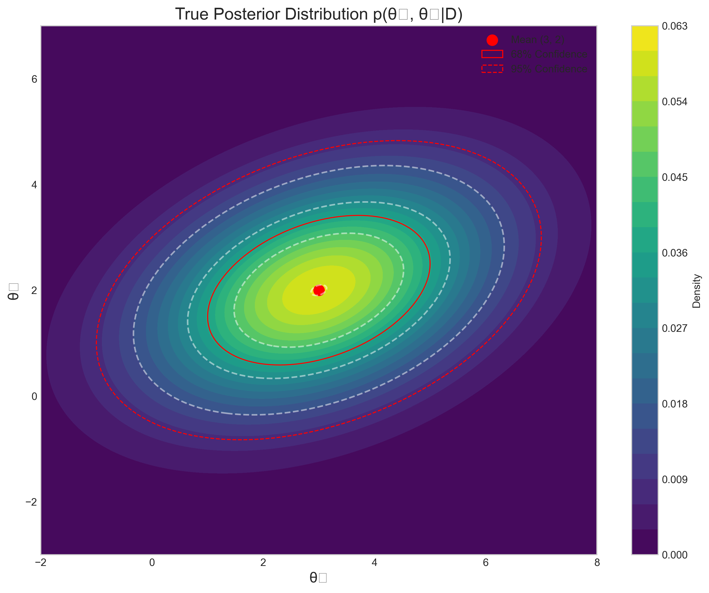
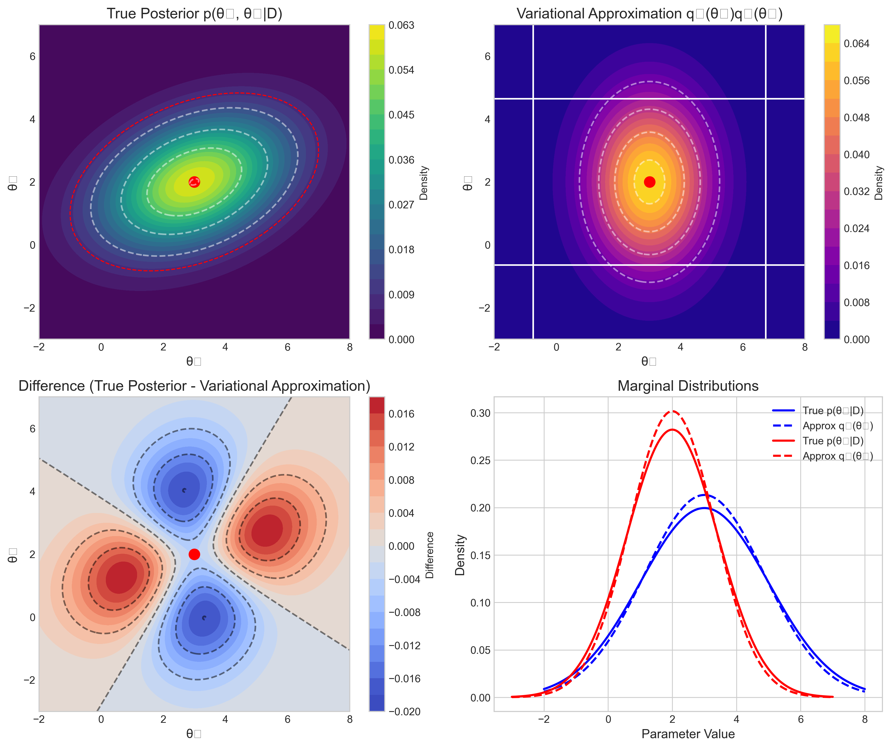
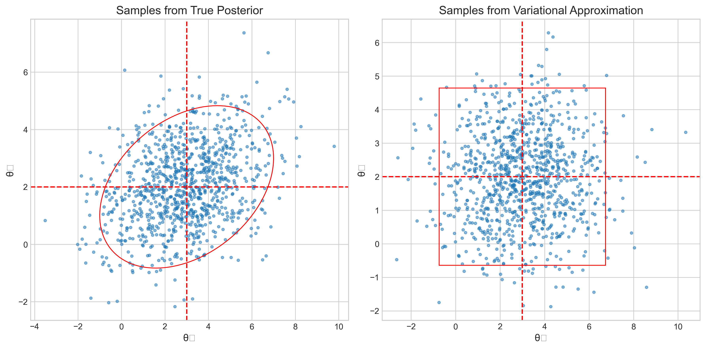
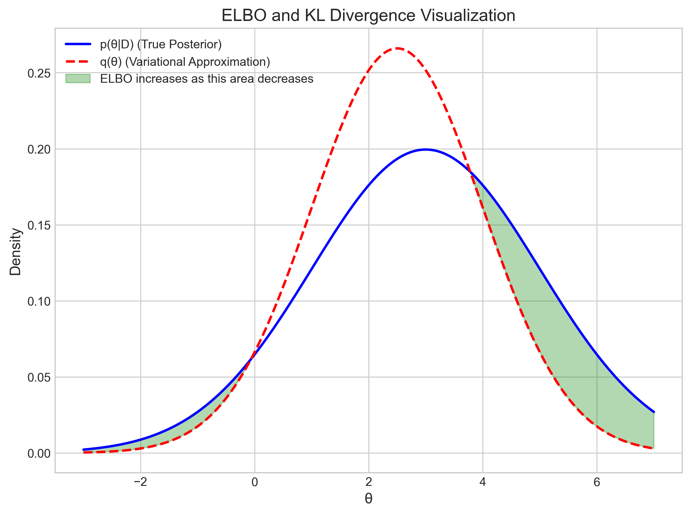

# Question 12: Variational Inference

## Problem Statement
Consider a bivariate normal posterior distribution for parameters $\theta_1$ and $\theta_2$:

$$p(\theta_1, \theta_2|D) \propto \exp\left(-\frac{1}{2}\begin{pmatrix}\theta_1 - 3 \\ \theta_2 - 2\end{pmatrix}^T \begin{pmatrix}4 & 1 \\ 1 & 2\end{pmatrix}^{-1} \begin{pmatrix}\theta_1 - 3 \\ \theta_2 - 2\end{pmatrix}\right)$$

### Task
1. Write a factorized variational approximation $q(\theta_1, \theta_2) = q_1(\theta_1)q_2(\theta_2)$ where both $q_1$ and $q_2$ are normal distributions
2. Explain the key limitation of this factorized approximation for this particular posterior
3. Briefly describe how the ELBO (Evidence Lower BOund) is used in variational inference

## Solution

### Step 1: Analyzing the True Posterior Distribution

The posterior distribution is a bivariate normal with parameters:
- Mean vector: $\mu = [3, 2]$
- Covariance matrix: $\Sigma = \begin{bmatrix} 4 & 1 \\ 1 & 2 \end{bmatrix}$
- Precision matrix: $\Lambda = \Sigma^{-1} = \begin{bmatrix} 0.2857 & -0.1429 \\ -0.1429 & 0.5714 \end{bmatrix}$
- Correlation coefficient: $\rho = \frac{\Sigma_{12}}{\sqrt{\Sigma_{11}\Sigma_{22}}} = \frac{1}{\sqrt{4 \cdot 2}} = 0.3536$

The true posterior is visualized below, showing its elliptical contours that capture the correlation between the parameters:

The elliptical shape of the contours indicates the presence of correlation between $\theta_1$ and $\theta_2$. The correlation coefficient of 0.3536 indicates a moderate positive correlation.

### Step 2: Deriving the Factorized Variational Approximation

For a factorized variational approximation, we assume that the posterior can be approximated as:

$$q(\theta_1, \theta_2) = q_1(\theta_1)q_2(\theta_2)$$

Where both $q_1$ and $q_2$ are normal distributions.

To find the optimal factorized approximation, we can apply the mean-field variational inference approach. For a multivariate Gaussian posterior, the optimal factorized approximation has the following form:

1. $q_1(\theta_1) = \mathcal{N}(\theta_1|\mu_1, \sigma_1^2)$
2. $q_2(\theta_2) = \mathcal{N}(\theta_2|\mu_2, \sigma_2^2)$

Where:
- $\mu_1 = 3$ (same as the original mean)
- $\sigma_1^2 = \frac{1}{\Lambda_{11}} = \frac{1}{0.2857} = 3.50$
- $\mu_2 = 2$ (same as the original mean)
- $\sigma_2^2 = \frac{1}{\Lambda_{22}} = \frac{1}{0.5714} = 1.75$

Therefore, our factorized variational approximation is:
- $q_1(\theta_1) = \mathcal{N}(\theta_1|3.00, 3.50)$
- $q_2(\theta_2) = \mathcal{N}(\theta_2|2.00, 1.75)$

### Step 3: Comparing the True Posterior and Variational Approximation

The comparison between the true posterior and the factorized variational approximation is shown below:

The figure shows:
1. Top left: The true posterior with its characteristic elliptical contours
2. Top right: The factorized approximation with rectangular (axis-aligned) contours
3. Bottom left: The difference between the true posterior and the approximation
4. Bottom right: The marginal distributions for both parameters

We can also visualize samples from both distributions to see the difference in their structure:

The true posterior samples (left) show the correlation structure, while the variational approximation samples (right) lack this correlation, resulting in an independent, rectangular pattern.

### Step 4: Key Limitations of the Factorized Approximation

The key limitation of the factorized approximation is that it cannot capture correlations between variables. In this particular posterior, $\theta_1$ and $\theta_2$ have a correlation coefficient of 0.3536, but the factorized approximation $q(\theta_1, \theta_2) = q_1(\theta_1)q_2(\theta_2)$ assumes independence between the parameters.

This leads to several issues:

1. **Information Loss**: The KL divergence between the approximation and the true posterior is 0.0761, quantifying the information lost when using the factorized approximation.

2. **Incorrect Uncertainty Representation**: The factorized approximation cannot represent the correct joint uncertainty, resulting in over-confidence in some regions and under-confidence in others.

3. **Rectangular Confidence Regions**: The confidence regions for the factorized approximation are axis-aligned rectangles instead of ellipses, which incorrectly represent the joint probability.

4. **Correlation Blindness**: The more strongly correlated the variables are in the true posterior, the worse the factorized approximation becomes.

In cases where correlations between parameters are strong and important for the task at hand, more expressive variational families should be considered, such as full-covariance Gaussians or normalizing flows.

### Step 5: The ELBO in Variational Inference

The Evidence Lower Bound (ELBO) is a central concept in variational inference:

The ELBO is defined as:

$$\text{ELBO} = \mathbb{E}_q[\log p(\theta, D)] - \mathbb{E}_q[\log q(\theta)]$$

Which can be rewritten as:

$$\text{ELBO} = \log p(D) - \text{KL}(q(\theta) \| p(\theta|D))$$

Since the KL divergence is always non-negative, the ELBO provides a lower bound on the log evidence (log marginal likelihood) $\log p(D)$.

In variational inference, we maximize the ELBO with respect to the variational parameters. This is equivalent to minimizing the KL divergence between the approximation $q(\theta)$ and the true posterior $p(\theta|D)$.

ELBO maximization can be implemented through:
1. Coordinate ascent (iteratively updating each component of $q$)
2. Gradient-based optimization
3. Stochastic variational inference (for large datasets)

For our factorized approximation $q(\theta_1, \theta_2) = q_1(\theta_1)q_2(\theta_2)$, the ELBO calculation would involve taking expectations over both $q_1$ and $q_2$.

## Key Insights

1. **Mean-Field Approximation Simplicity**: The factorized (mean-field) variational approximation provides a computationally tractable solution by assuming independence between parameters, but this comes at the cost of ignoring correlations.

2. **Correlation vs. Independence**: For correlated posteriors, the factorized approximation introduces systematic bias by forcing an independence structure that doesn't exist in the true posterior.

3. **Variational Inference Trade-offs**: Variational inference trades off accuracy for computational efficiency. The factorized approximation is extremely efficient but can be inaccurate when correlations are important.

4. **ELBO as Optimization Objective**: The ELBO provides a principled objective function for finding the best approximation within a chosen variational family.

5. **Structured Approximations**: For better accuracy, one might need to use more structured approximations that can capture parameter correlations, such as full-covariance Gaussian distributions or normalizing flows.

## Conclusion

In this problem, we've derived a factorized variational approximation for a bivariate normal posterior distribution. While the approximation preserves the marginal means and variances, it completely ignores the correlation between the parameters. The KL divergence of 0.0761 quantifies this approximation error.

The factorized approximation is:
- $q_1(\theta_1) = \mathcal{N}(\theta_1|3.00, 3.50)$
- $q_2(\theta_2) = \mathcal{N}(\theta_2|2.00, 1.75)$

The key limitation is that the factorized structure imposes independence between $\theta_1$ and $\theta_2$, which contradicts the correlation present in the true posterior. This limitation becomes more severe as the correlation in the true posterior increases.

Variational inference using the ELBO allows us to find the optimal approximation within our chosen variational family, balancing computational efficiency with approximation accuracy. For problems where parameter correlations are important, more expressive variational families should be considered. 