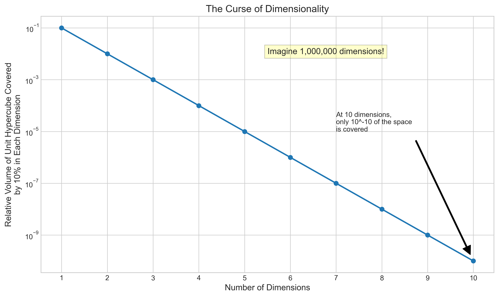
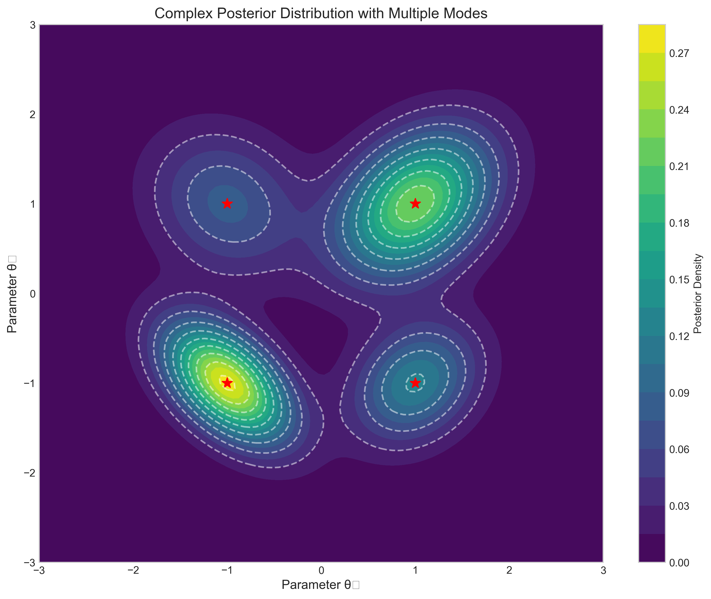
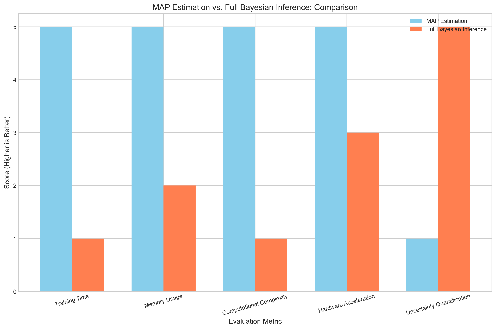
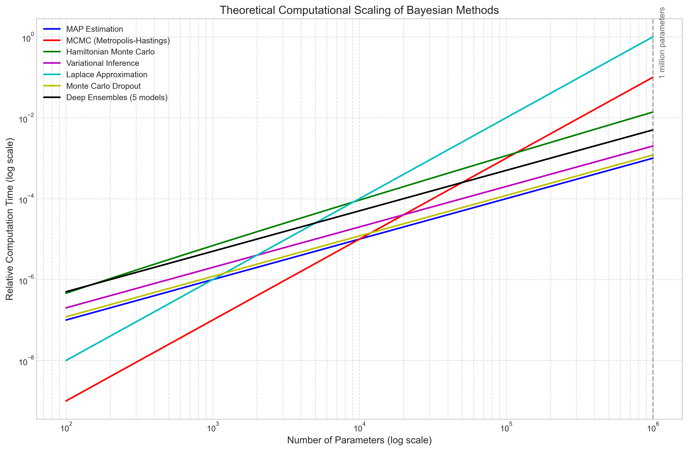
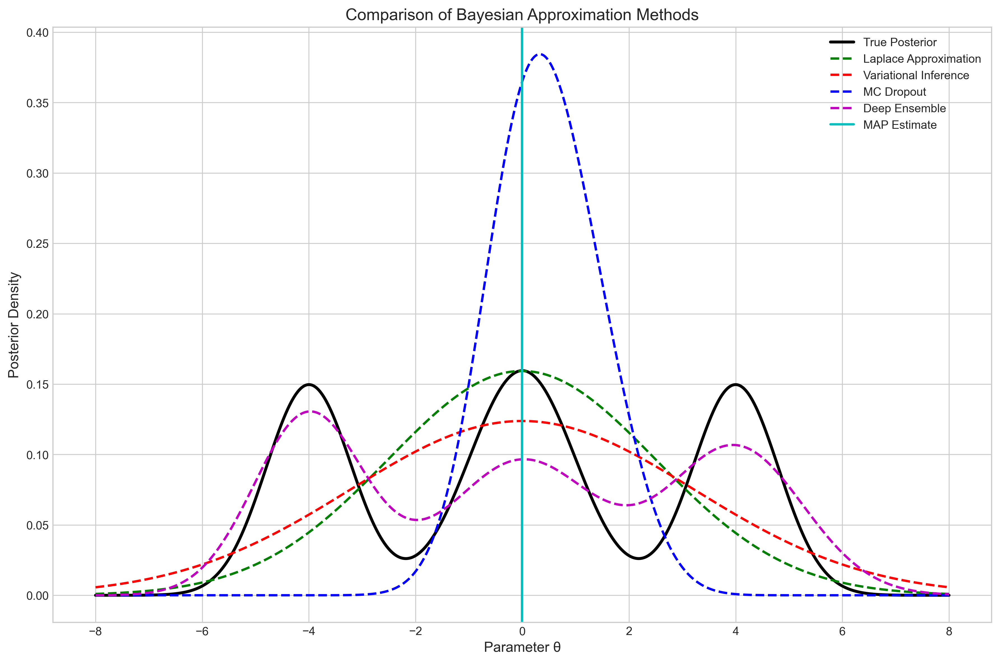

# Question 13: Computational Considerations for Bayesian Inference in Deep Neural Networks

## Problem Statement
You wish to apply full Bayesian inference to a deep neural network with 1 million parameters.

### Task
1. Identify and briefly explain two major computational challenges in applying full Bayesian inference to this model
2. Compare the computational requirements of MAP estimation versus full Bayesian inference for this model
3. Suggest one practical approximation method that could make Bayesian inference more tractable for this model

## Solution

### Computational Challenges in Full Bayesian Inference

When applying full Bayesian inference to a deep neural network with 1 million parameters, two major computational challenges arise:

#### Challenge 1: High-Dimensional Integration

Full Bayesian inference requires computing integrals over the entire parameter space to obtain the posterior distribution and make predictions. For a neural network with 1 million parameters, this means computing integrals in a 1-million dimensional space, which is computationally intractable using traditional numerical integration methods.

The curse of dimensionality makes the volume of the parameter space grow exponentially with the number of dimensions, making exhaustive exploration impossible. As shown in the figure below, even in relatively low dimensions, the fraction of the space covered by sampling becomes negligible:

At just 10 dimensions, if we try to cover 10% of each dimension, we end up covering only 10^(-10) of the total space. For 1 million dimensions, the situation is astronomically worse.

#### Challenge 2: Posterior Landscape Complexity

Neural networks generally have complex, multi-modal posterior distributions with complicated dependencies between parameters. This makes it difficult to:
- Efficiently sample from the posterior distribution
- Design appropriate proposal distributions for MCMC methods
- Ensure convergence to the true posterior

The figure below illustrates a simplified example of a complex posterior landscape with multiple modes (in just 2 dimensions):

Neural networks can have many local optima, saddle points, and flat regions in the parameter space, making the posterior landscape difficult to navigate. Additionally, parameters in neural networks are often highly correlated, which can cause slow mixing in standard MCMC samplers like Metropolis-Hastings or Gibbs sampling.

### Comparing MAP vs. Full Bayesian Inference

#### MAP Estimation

Maximum A Posteriori (MAP) estimation finds a single point estimate that maximizes the posterior distribution: θ_MAP = argmax_θ p(θ|D)

Computational characteristics:
1. Optimization problem that can be solved using gradient-based methods
2. Similar computational complexity to standard neural network training
3. Only requires computing gradients of log posterior w.r.t. parameters
4. Can leverage highly optimized deep learning libraries and hardware (GPUs, TPUs)
5. Memory requirements scale linearly with the number of parameters

#### Full Bayesian Inference

Full Bayesian inference computes the entire posterior distribution p(θ|D) and integrates over it to make predictions: p(y|x,D) = ∫ p(y|x,θ) p(θ|D) dθ

Computational characteristics:
1. Requires sampling from a high-dimensional posterior or approximating it
2. MCMC methods need many iterations to converge and provide independent samples
3. Need to store multiple samples of parameter vectors (high memory requirements)
4. Integration over posterior adds significant computation for predictions
5. Many evaluations of the likelihood function required
6. Computational and memory requirements scale poorly with model size

The following figure compares MAP estimation and full Bayesian inference across various metrics:

**Explanations for comparison metrics:**
- **Training Time**: MAP is much faster
- **Memory Usage**: MAP requires less memory
- **Computational Complexity**: MAP has lower computational complexity
- **Hardware Acceleration**: MAP can use GPUs/TPUs more efficiently
- **Uncertainty Quantification**: Bayesian provides full uncertainty

The theoretical computational scaling of different Bayesian methods with model size is shown below:

### Practical Approximation Methods

To make Bayesian inference more tractable for large neural networks, several approximation methods can be used:

#### 1. Variational Inference

Variational Inference (VI) approximates the posterior p(θ|D) with a simpler distribution q(θ) by minimizing the KL divergence between them. This transforms the integration problem into an optimization problem, which is more tractable for large models.

**Advantages:**
- Scales better to large networks than MCMC
- Can leverage gradient-based optimization and GPU acceleration
- Provides uncertainty estimates

**Limitations:**
- Quality of approximation depends on the chosen variational family
- Typically underestimates uncertainty
- May not capture multi-modality

#### 2. Monte Carlo Dropout

MC Dropout interprets dropout in neural networks as a variational approximation to a Gaussian process. By keeping dropout active during inference, each forward pass samples from an approximate posterior.

**Advantages:**
- Extremely simple to implement in existing networks
- Minimal computational overhead compared to standard training
- Provides reasonable uncertainty estimates

**Limitations:**
- Limited flexibility in the approximate posterior
- Uncertainty quality depends on dropout rate and network architecture
- Not suitable for all types of neural networks

#### 3. Laplace Approximation

Laplace approximation fits a Gaussian approximation to the posterior by using the Hessian at the MAP estimate. This provides a local approximation of uncertainty.

**Advantages:**
- Builds directly on MAP estimate
- Relatively straightforward to implement
- Can provide good local uncertainty estimates

**Limitations:**
- Requires computing the Hessian, which can be expensive
- Only provides a local approximation near the MAP
- Cannot capture multi-modality

#### 4. Deep Ensembles

Trains multiple neural networks with different random initializations and combines their predictions. While not strictly Bayesian, it provides a practical approach to uncertainty quantification.

**Advantages:**
- Simple to implement
- Can capture some multi-modality
- Often competitive with or superior to formal Bayesian methods

**Limitations:**
- Computationally expensive (requires training multiple networks)
- Storage requirements scale linearly with the number of ensemble members
- Not a formal Bayesian approach (though can be interpreted as such)

#### 5. Stochastic Gradient MCMC

Methods like Stochastic Gradient Langevin Dynamics (SGLD) combine stochastic gradient descent with Langevin dynamics to sample from the posterior using mini-batches of data.

**Advantages:**
- More scalable than traditional MCMC
- Can leverage mini-batch processing
- Theoretically converges to the true posterior

**Limitations:**
- Slower than variational methods
- Samples may be correlated
- Requires careful tuning of hyperparameters

The figure below compares how these different methods approximate a complex posterior distribution:

## Key Insights

1. **Computational Intractability of Exact Inference**: Exact Bayesian inference in high-dimensional models like deep neural networks is computationally intractable due to the curse of dimensionality and the complexity of the posterior landscape.

2. **Efficiency vs. Uncertainty Trade-off**: MAP estimation is computationally efficient but provides no uncertainty estimates, while full Bayesian inference provides complete uncertainty quantification but is computationally expensive. Approximate Bayesian methods offer different trade-offs along this spectrum.

3. **Scalable Approximations**: For large neural networks with millions of parameters, practical approaches like MC Dropout, Variational Inference, or Deep Ensembles become necessary to approximate Bayesian inference.

4. **Method Selection Depends on Requirements**: The best approximation method depends on specific requirements such as computational budget, importance of uncertainty quantification, need for capturing multi-modality, and available implementation tools.

5. **Modern Advances**: Recent advances in scalable Bayesian methods (like SG-MCMC and variational inference with normalizing flows) are making Bayesian deep learning more practical, though still more computationally demanding than point estimates.

## Recommendations

For a neural network with 1 million parameters:
- Start with MC Dropout if you already use dropout in your network
- Use Deep Ensembles if you can afford the computational cost and need reliable uncertainty
- Consider variational inference if you need a more formal Bayesian approach with scalability
- Use Laplace approximation if you need a quick uncertainty estimate around your MAP solution
- Consider SG-MCMC methods if you need more thorough posterior exploration at scale

The best approach depends on your specific requirements regarding:
- Computational budget
- Importance of uncertainty quantification
- Need for capturing multi-modality
- Available implementation tools
- Domain-specific requirements

## Conclusion

While full Bayesian inference provides the most complete treatment of uncertainty in deep neural networks, computational challenges make it impractical for models with millions of parameters. Various approximation methods exist that make Bayesian inference more tractable, each with their own strengths and limitations. The choice of method depends on the specific requirements of the application, balancing computational efficiency with the quality of uncertainty estimates. 