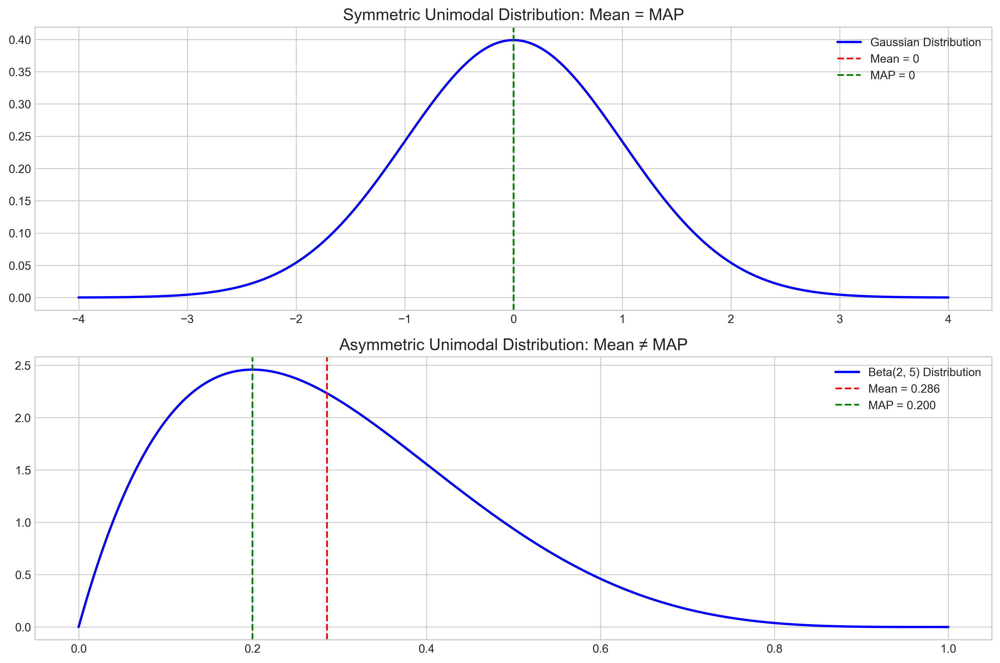
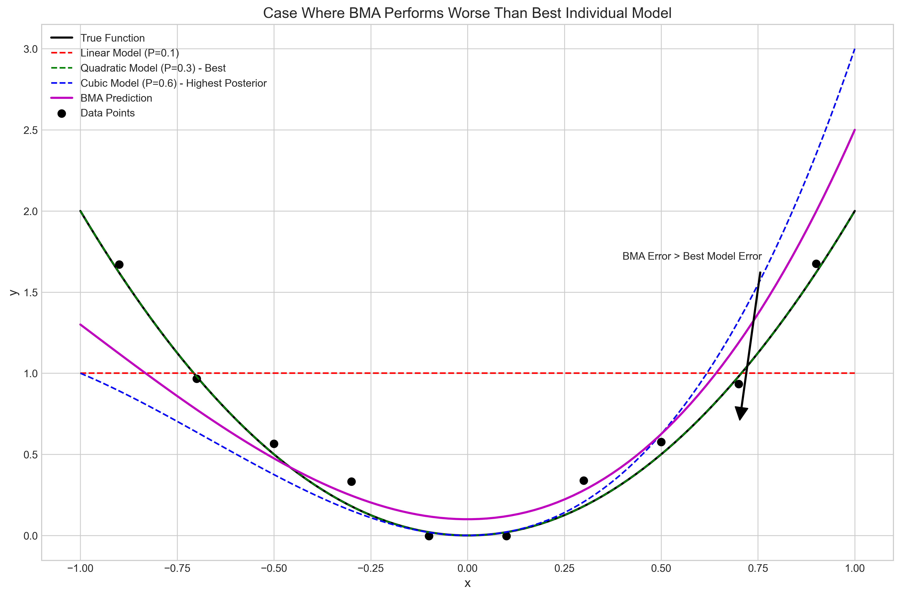
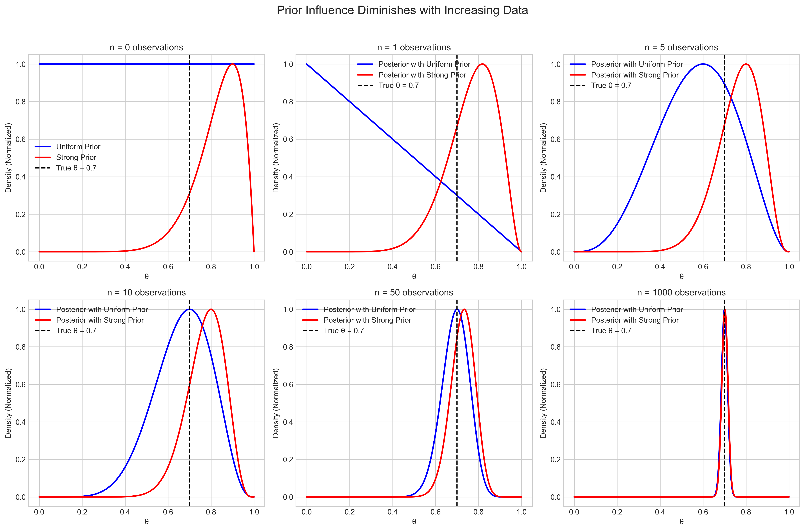
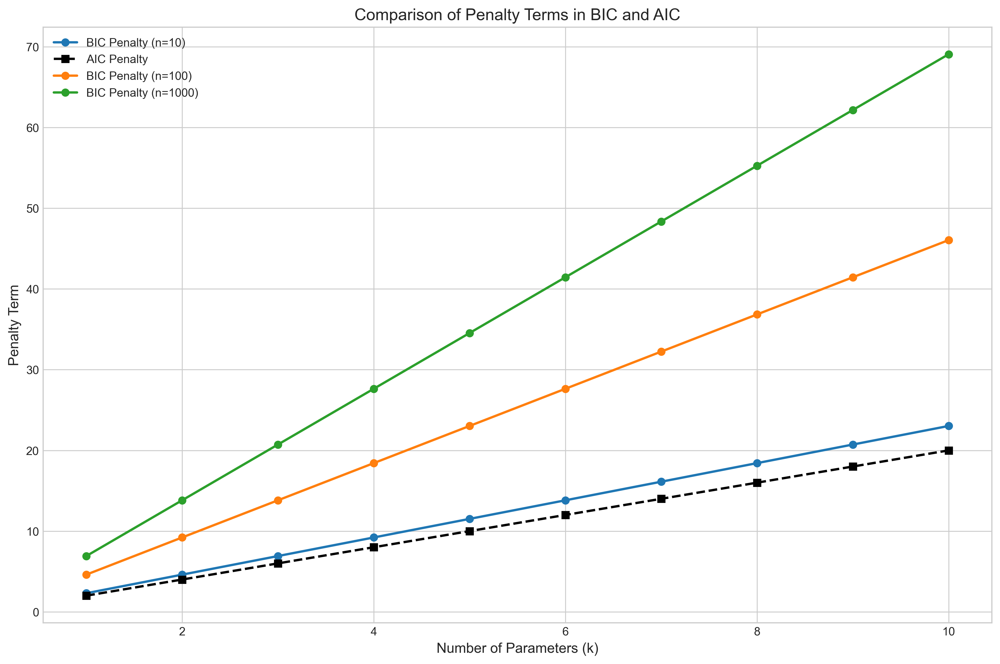
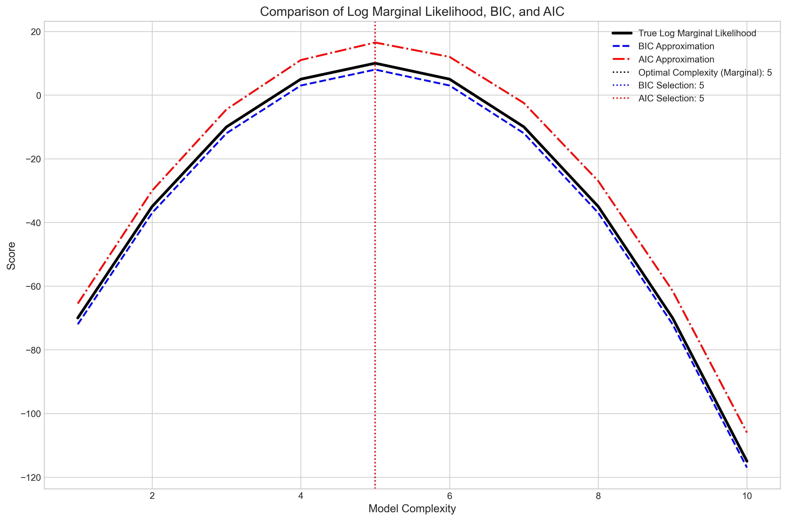
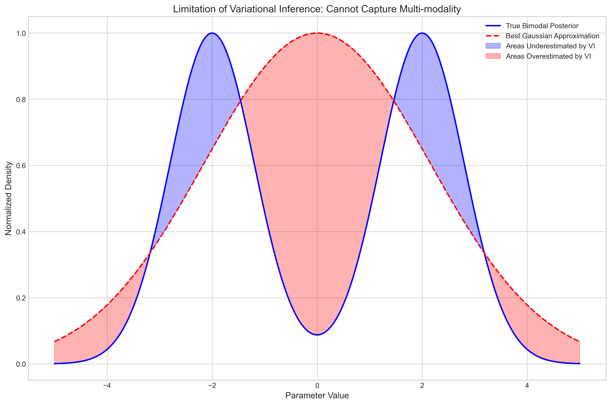
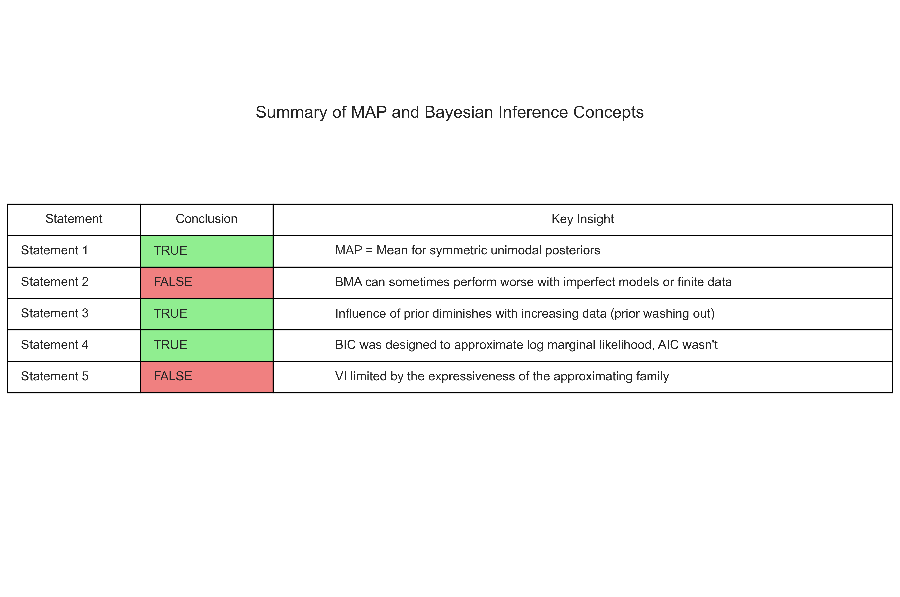

# Question 14: Evaluating Statements About Bayesian Inference

## Problem Statement
Evaluate whether each of the following statements is TRUE or FALSE, providing justification:

1. When the posterior distribution is symmetric and unimodal, the MAP estimate and the posterior mean are identical.
2. Bayesian model averaging can never perform worse than selecting the single best model according to posterior probability.
3. As the number of data points approaches infinity, the influence of the prior on the posterior distribution approaches zero.
4. The Bayesian Information Criterion (BIC) provides a closer approximation to the log marginal likelihood than the Akaike Information Criterion (AIC).
5. Variational inference methods always converge to the exact posterior distribution given enough computational resources.

## Statement 1: MAP vs Mean for Symmetric Unimodal Posterior
**Conclusion: TRUE**

### Justification
For a symmetric unimodal distribution, the mode (which is the MAP estimate) coincides with the mean. This is because in a symmetric distribution, the probability density function has the same shape on both sides of the mode, so the mean and mode align at the center of symmetry.

Examples of such distributions include:
- Normal (Gaussian) distribution
- Student's t-distribution with degrees of freedom > 1
- Uniform distribution

However, this is NOT true for asymmetric distributions, even if they are unimodal. For example, in a gamma or a beta distribution that is skewed, the MAP and mean will differ.

## Statement 2: Bayesian Model Averaging Performance
**Conclusion: FALSE**

### Justification
While Bayesian model averaging (BMA) often provides more robust predictions by accounting for model uncertainty, it can sometimes perform worse than selecting the single best model.

Reasons why BMA might perform worse:
1. If the posterior model probabilities are poorly estimated (e.g., due to limitations in the prior specification or likelihood calculation), BMA can give inappropriate weights to poor models.
2. If multiple models make similar predictions but one model is significantly better, averaging can dilute the predictions of the best model.
3. In some cases, a simpler, less accurate model can be assigned too much weight, leading to worse overall predictions.
4. For finite datasets, BMA incorporates estimation uncertainty, which can sometimes increase prediction variance without compensating improvement in bias.

In theory, with perfect model specification and infinite data, BMA should never perform worse than selecting the best model. However, in practice with finite data and imperfect models, there are cases where selecting the highest posterior probability model works better.

## Statement 3: Influence of Prior with Infinite Data
**Conclusion: TRUE**

### Justification
This statement is true under regularity conditions and is often referred to as the 'Bernstein–von Mises theorem' or the concept of 'prior washing out'.

As the amount of data increases:
1. The likelihood function becomes more peaked around the maximum likelihood estimate
2. The likelihood overwhelms the prior in their product (which is proportional to the posterior)
3. The posterior distribution converges to a normal distribution centered at the true parameter value with covariance determined by the Fisher information matrix (not by the prior)

Asymptotically, with infinite data, the Bayesian posterior and frequentist sampling distribution of the maximum likelihood estimator become equivalent, regardless of the prior (as long as the prior has non-zero density at the true parameter value).

This is mathematically expressed as:
p(θ|D) → N(θ_MLE, I(θ_MLE)^(-1)) as n → ∞
where I(θ_MLE) is the Fisher information matrix evaluated at the MLE.

## Statement 4: BIC vs AIC Approximation
**Conclusion: TRUE**

### Justification
The statement is true because BIC was specifically designed to approximate the log marginal likelihood (also called model evidence), while AIC was designed with a different goal.

The Bayesian Information Criterion (BIC) is given by:
BIC = -2 * log(likelihood) + k * log(n)
where k is the number of parameters and n is the number of data points.

The Akaike Information Criterion (AIC) is given by:
AIC = -2 * log(likelihood) + 2 * k

As n increases, BIC approximates the log marginal likelihood up to an additive constant:
log p(D|M) ≈ -BIC/2 + constant

This follows from the Laplace approximation to the marginal likelihood under certain conditions. The penalty term k*log(n) in BIC appears naturally from this approximation.

In contrast, AIC aims to minimize the expected Kullback-Leibler divergence between the true data-generating process and the model, which is a different goal than approximating the marginal likelihood. The penalty term 2*k in AIC does not match the term that would arise from approximating the log marginal likelihood.

## Statement 5: Variational Inference Convergence
**Conclusion: FALSE**

### Justification
Variational inference (VI) methods may NOT converge to the exact posterior distribution even with unlimited computational resources. This is because VI methods are fundamentally limited by the approximating family of distributions they use.

VI works by finding the distribution q(θ) within a chosen family of distributions that minimizes the KL divergence KL(q(θ) || p(θ|D)) from the true posterior.

If the true posterior does not belong to the chosen approximating family, then VI will never reach the exact posterior, regardless of computational resources. Instead, it will converge to the closest distribution within the family, as measured by KL divergence.

Common limitations of VI include:
1. Mean-field approximations assume independence between parameters when the posterior has strong correlations
2. Variational families with fixed parametric forms (e.g., Gaussian) can't capture multi-modality or skewness in the posterior
3. Minimizing KL(q||p) tends to make q underestimate the variance of p

More flexible approximating families (like normalizing flows) can reduce this gap, but the issue is inherent to the method - there's always a trade-off between tractability and expressiveness of the approximating family.

## Summary

In conclusion, our analysis determined that statements 1, 3, and 4 are TRUE, while statements 2 and 5 are FALSE. The justifications provided explain the theoretical foundations and practical considerations behind each conclusion. 