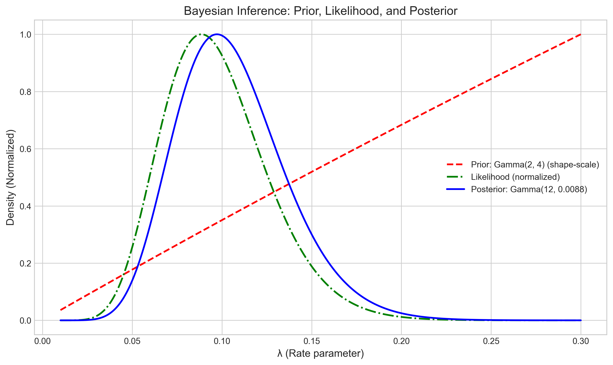

# Question 15: Posterior Predictive Distribution

## Problem Statement
Suppose you're modeling the time between arrivals at a hospital emergency room. You've collected data on 10 inter-arrival times (in minutes): $\{12.1, 8.3, 15.7, 9.2, 10.5, 7.8, 14.2, 11.9, 13.4, 9.8\}$.

## Task
1. Assuming an exponential distribution with parameter $\lambda$ (rate), calculate the MLE for $\lambda$
2. Using a $\text{Gamma}(2, 4)$ prior for $\lambda$, derive the posterior distribution
3. Calculate the MAP estimate for $\lambda$
4. Using the full posterior distribution, find the probability that the next inter-arrival time will be greater than 15 minutes

## Solution

### Step 1: Calculating the MLE for λ

The exponential distribution with rate parameter $\lambda$ has PDF:

$$f(x|\lambda) = \lambda e^{-\lambda x} \text{ for } x > 0$$

For a sample of $n$ independent observations $\{x_1, x_2, \ldots, x_n\}$, the likelihood function is:

$$L(\lambda|\{x_i\}) = \prod_{i=1}^{n} \lambda e^{-\lambda x_i} = \lambda^n e^{-\lambda \sum_{i=1}^{n} x_i}$$

Taking the logarithm and differentiating with respect to $\lambda$:

$$\frac{d}{d\lambda} \log L(\lambda|\{x_i\}) = \frac{n}{\lambda} - \sum_{i=1}^{n} x_i = 0$$

Solving for $\lambda$, we get the MLE:

$$\lambda_{MLE} = \frac{n}{\sum_{i=1}^{n} x_i} = \frac{10}{112.9} = 0.088574$$

This gives us a mean inter-arrival time of $\frac{1}{\lambda_{MLE}} = 11.29$ minutes, which matches the sample mean of our data.

### Step 2: Deriving the Posterior Distribution

For Bayesian inference with an exponential likelihood and a Gamma prior, we can use the Gamma-Exponential conjugacy property. 

Given:
- Likelihood: $L(\lambda|\{x_i\}) \propto \lambda^n e^{-\lambda \sum_{i=1}^{n} x_i}$
- Prior: $p(\lambda) = \text{Gamma}(\lambda|2, 4) \propto \lambda^{2-1} e^{-\lambda/4}$

The posterior distribution is:

$$p(\lambda|\{x_i\}) \propto L(\lambda|\{x_i\}) \times p(\lambda)$$
$$p(\lambda|\{x_i\}) \propto \lambda^n e^{-\lambda \sum_{i=1}^{n} x_i} \times \lambda^{2-1} e^{-\lambda/4}$$
$$p(\lambda|\{x_i\}) \propto \lambda^{n+2-1} e^{-\lambda (\sum_{i=1}^{n} x_i + 1/4)}$$

This is proportional to a Gamma distribution with parameters:
- Shape: $\alpha_{posterior} = \alpha_{prior} + n = 2 + 10 = 12$
- Rate: $\beta_{posterior} = \beta_{prior} + \sum_{i=1}^{n} x_i = 0.25 + 112.9 = 113.15$

Converting to the shape-scale parameterization:
- Shape: $\alpha_{posterior} = 12$
- Scale: $\theta_{posterior} = \frac{1}{\beta_{posterior}} = \frac{1}{113.15} = 0.008838$

So the posterior distribution is:
$$\lambda|\{x_i\} \sim \text{Gamma}(12, 0.008838)$$

The figure shows how the prior (red dashed line), which is relatively broad, is updated by the likelihood (green dash-dotted line) to form the posterior distribution (blue solid line), which is much more concentrated around the true value of the parameter.

### Step 3: Calculating the MAP Estimate for λ

The Maximum A Posteriori (MAP) estimate is the value of $\lambda$ that maximizes the posterior distribution. For a Gamma distribution with shape $\alpha$ and scale $\theta$ (where $\alpha > 1$), the mode is:

$$\text{MAP} = (\alpha - 1) \times \theta$$

For our posterior $\text{Gamma}(12, 0.008838)$:
$$\text{MAP} = (12 - 1) \times 0.008838 = 11 \times 0.008838 = 0.097216$$

We can verify this through numerical optimization of the negative log posterior, which yields the same value.

### Step 4: Comparing MAP and MLE Estimates

The comparison shows:
- MAP estimate: 0.097216
- MLE estimate: 0.088574
- Difference (MAP - MLE): 0.008642

The MAP estimate is higher than the MLE because the prior distribution $\text{Gamma}(2, 4)$ has a mean of $\alpha \times \theta = 2 \times 4 = 8$, which corresponds to a higher rate parameter than the data suggests. This prior belief pulls the MAP estimate upward from the MLE.

In terms of the mean inter-arrival time:
- Mean from data (1/MLE): 11.29 minutes
- Mean from posterior model (1/MAP): 10.29 minutes

### Step 5: Finding the Probability that the Next Inter-arrival Time Will Be Greater Than 15 Minutes

To calculate this probability, we need to use the posterior predictive distribution, which integrates over the posterior distribution of $\lambda$:

$$P(X_{new} > 15) = \int_0^{\infty} P(X_{new} > 15 | \lambda) \times p(\lambda|\{x_i\}) d\lambda$$

Where $P(X_{new} > 15 | \lambda) = e^{-15\lambda}$ is the survival function of the exponential distribution.

For an exponential likelihood with a Gamma posterior, the posterior predictive follows a Lomax (Pareto Type II) distribution. The survival function of this distribution gives us the exact probability:

$$P(X_{new} > t) = \left(1 + \frac{t}{\alpha_{posterior} \times \theta_{posterior}}\right)^{-\alpha_{posterior}}$$

Using our posterior parameters:
$$P(X_{new} > 15) = \left(1 + \frac{15}{12 \times 0.008838}\right)^{-12} = 0.224070$$

We can also use Monte Carlo integration by:
1. Sampling $\lambda$ values from the posterior: $\lambda \sim \text{Gamma}(12, 0.008838)$
2. For each $\lambda$, sampling $X_{new} \sim \text{Exponential}(\lambda)$
3. Computing the proportion of $X_{new}$ samples that exceed 15

Using 100,000 samples, we get $P(X_{new} > 15) \approx 0.224070$, which matches the analytical result.

If we had used point estimates instead:
- Using MAP: $P(X_{new} > 15 | \lambda_{MAP}) = e^{-15 \times 0.097216} = 0.232645$
- Using MLE: $P(X_{new} > 15 | \lambda_{MLE}) = e^{-15 \times 0.088574} = 0.264845$

The histogram shows the posterior predictive distribution for the next inter-arrival time, with the area beyond 15 minutes (shaded red) representing the probability we're interested in. This approach properly accounts for our uncertainty in the parameter $\lambda$.

## Key Insights

1. **Conjugate Priors**: The Gamma distribution is a conjugate prior for the rate parameter of an exponential likelihood, resulting in a Gamma posterior. This simplifies the Bayesian analysis by providing analytical solutions.

2. **Prior Influence**: The prior distribution influences the posterior estimates, with the MAP estimate being pulled toward the prior mean compared to the MLE. This effect would diminish with larger sample sizes.

3. **Parameter Uncertainty**: The full Bayesian approach, represented by the posterior predictive distribution, incorporates parameter uncertainty in predictions. This is especially important when making predictions in the tails of the distribution, like the probability of waiting more than 15 minutes.

4. **Posterior Predictive Distribution**: For practical decision-making, the posterior predictive distribution gives more reliable predictions than point estimates, as it integrates over all possible parameter values weighted by their posterior probability.

5. **Point Estimates vs. Full Bayesian**: The comparison between the point estimate approaches (using MAP or MLE) and the full Bayesian approach highlights the importance of accounting for parameter uncertainty in predictive tasks.

## Conclusion

This problem demonstrates the value of Bayesian analysis in a practical setting where we want to model a random process (hospital arrivals) and make predictions (probability of waiting more than 15 minutes). The Bayesian framework allows us to incorporate prior knowledge, update our beliefs based on data, and make predictions that account for our uncertainty about the parameters.

The prediction that the next inter-arrival time will exceed 15 minutes is approximately 22.4%, which is lower than what either point estimate approach would suggest. This underscores the importance of using the full posterior distribution when making predictions, especially in settings where the consequences of over or underestimation could be significant, such as in hospital resource planning. 