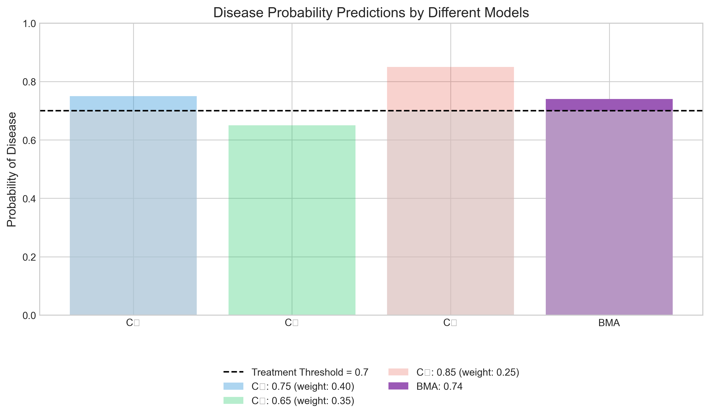
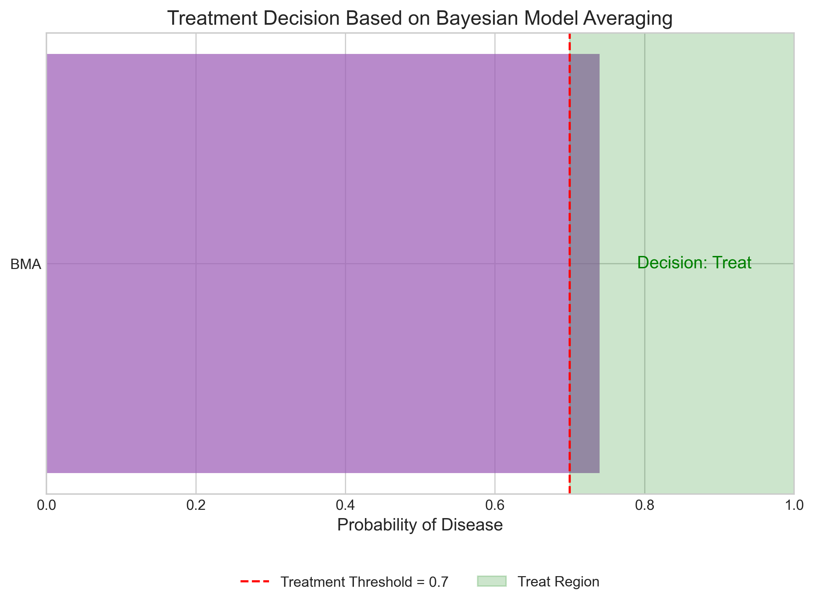
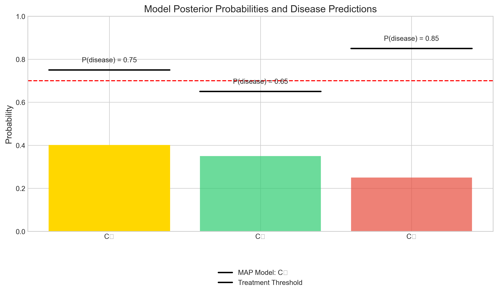
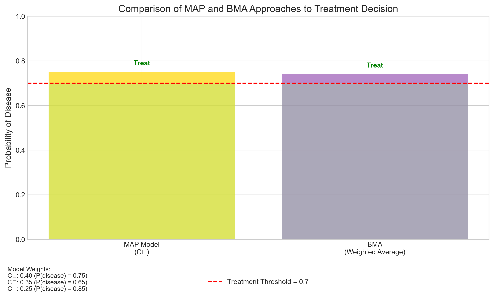
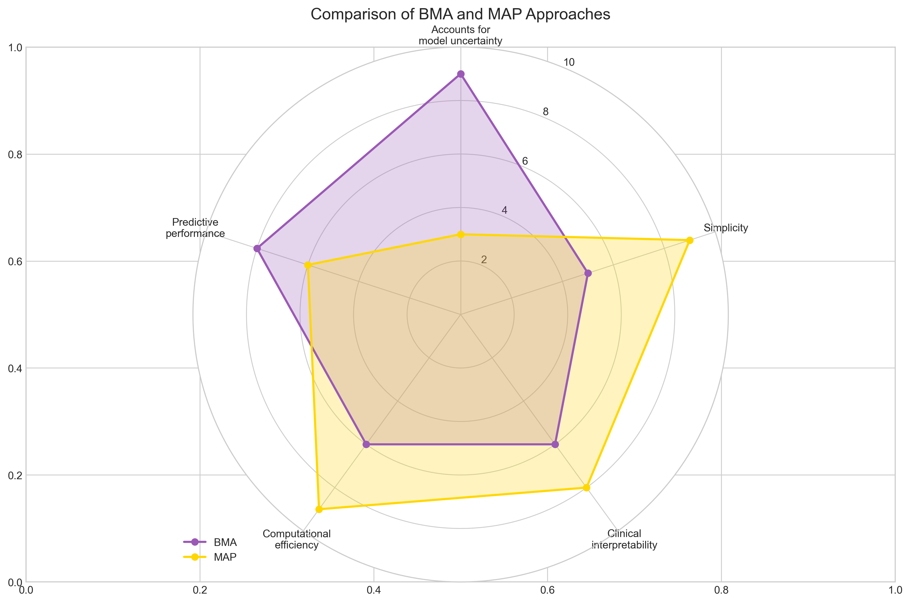

# Question 16: Bayesian Model Averaging in Practice

## Problem Statement
You're comparing three different classifiers $C_1$, $C_2$, and $C_3$ for a medical diagnosis problem. After testing, you assign posterior probabilities $P(C_1|D) = 0.4$, $P(C_2|D) = 0.35$, and $P(C_3|D) = 0.25$. For a new patient with symptoms $\mathbf{x}$, the models predict the probability of disease as:
- $C_1$: $P(\text{disease}|\mathbf{x}, C_1) = 0.75$
- $C_2$: $P(\text{disease}|\mathbf{x}, C_2) = 0.65$
- $C_3$: $P(\text{disease}|\mathbf{x}, C_3) = 0.85$

### Task
1. Calculate the model-averaged probability of disease for this patient using Bayesian Model Averaging
2. If the treatment threshold is 0.7 (treat if probability > 0.7), what would be your decision using Bayesian Model Averaging?
3. If you had to select a single model using the MAP approach, which model would you choose and what would be your treatment decision?
4. Briefly explain one advantage and one disadvantage of using Bayesian Model Averaging in this medical context

## Solution

### Step 1: Calculating the Model-Averaged Probability using Bayesian Model Averaging

Bayesian Model Averaging (BMA) computes the weighted average of predictions from multiple models, where the weights are the posterior probabilities of each model. The formula for BMA is:

$$P(\text{disease}|\mathbf{x}, D) = \sum_{k=1}^{K} P(\text{disease}|\mathbf{x}, C_k) \times P(C_k|D)$$

Given:
- $P(C_1|D) = 0.4$, $P(C_2|D) = 0.35$, $P(C_3|D) = 0.25$
- $P(\text{disease}|\mathbf{x}, C_1) = 0.75$
- $P(\text{disease}|\mathbf{x}, C_2) = 0.65$
- $P(\text{disease}|\mathbf{x}, C_3) = 0.85$

Calculating the model-averaged probability:

$$P(\text{disease}|\mathbf{x}, D) = 0.4 \times 0.75 + 0.35 \times 0.65 + 0.25 \times 0.85$$
$$P(\text{disease}|\mathbf{x}, D) = 0.3 + 0.2275 + 0.2125 = 0.74$$

The figure shows the probability predictions from each model, with the opacity of each bar representing the model's posterior probability (weight). The Bayesian Model Averaging result combines these weighted predictions into a single probability of 0.74.

### Step 2: Determining the Treatment Decision using BMA

Given a treatment threshold of 0.7 (treat if probability > 0.7):

- BMA probability: $P(\text{disease}|\mathbf{x}, D) = 0.74$
- Treatment threshold: 0.7
- Decision: Since $0.74 > 0.7$, the decision is to **treat** the patient.

The figure shows the BMA probability relative to the treatment threshold. The BMA probability falls in the "Treat" region (green), indicating that treatment is recommended based on the model-averaged probability.

### Step 3: Selecting a Single Model using MAP

The Maximum A Posteriori (MAP) approach selects the single model with the highest posterior probability. From the given posterior probabilities:

- $P(C_1|D) = 0.4$
- $P(C_2|D) = 0.35$
- $P(C_3|D) = 0.25$

The model with the highest posterior probability is $C_1$ with $P(C_1|D) = 0.4$.

Using this model for prediction:
- $P(\text{disease}|\mathbf{x}, C_1) = 0.75$
- Treatment threshold: 0.7
- Decision: Since $0.75 > 0.7$, the decision is to **treat** the patient.

The figure shows the posterior probabilities of each model, with $C_1$ highlighted as the MAP model. The horizontal lines represent each model's disease probability prediction, with the treatment threshold shown as a red dashed line. The MAP model ($C_1$) predicts a probability above the threshold, leading to a "treat" decision.

### Step 4: Comparing BMA and MAP Approaches

In this case, both approaches lead to the same treatment decision:
- BMA probability: 0.74 → Decision: Treat
- MAP model ($C_1$) probability: 0.75 → Decision: Treat

However, it's important to note that the probability estimates differ slightly. In borderline cases where the probabilities are close to the treatment threshold, these small differences could lead to different treatment decisions.

### Step 5: Advantages and Disadvantages of BMA in a Medical Context

The radar chart compares BMA and MAP approaches across five important dimensions relevant to medical decision-making.

**Advantages of Bayesian Model Averaging:**

1. **Accounts for model uncertainty**: BMA incorporates predictions from all models weighted by their posterior probabilities, rather than relying on a single model. This is especially important in medical contexts where no single diagnostic model may capture all aspects of a complex disease.

2. **Reduces the risk of selecting an incorrect model**: By averaging across multiple models, BMA mitigates the risk of choosing an incorrect model that might happen to have high posterior probability due to chance.

3. **More robust predictions**: BMA can provide more stable and reliable predictions compared to selecting a single model, particularly when no single model is clearly superior to the others.

4. **Reflects full uncertainty**: BMA provides a more honest reflection of the uncertainty in the diagnosis, which is crucial information for medical decision-making.

5. **Integration of multiple sources**: Allows incorporation of predictions from multiple diagnostic tools or expert opinions in a principled way.

**Disadvantages of Bayesian Model Averaging:**

1. **Complexity**: BMA is more complex to implement and explain to medical practitioners who may prefer simple, interpretable rules.

2. **"Middle ground" predictions**: BMA may produce probability estimates in the middle range that don't clearly fall on either side of the treatment threshold, potentially making decisions less clear-cut.

3. **Dilution of accurate predictions**: If one model is substantially more accurate than others, averaging can dilute its accurate predictions with less accurate ones.

4. **Computational overhead**: The computational complexity increases with the number of models, which can be a limitation in real-time clinical settings.

5. **Requires good posterior estimates**: BMA requires reliable estimates of model posterior probabilities, which may be difficult to obtain in practice.

## Key Insights

1. **Balance Between Uncertainty and Decisiveness**: Medical decisions require both acknowledging uncertainty (which BMA does well) and providing clear recommendations (which MAP can do more definitively). The choice between approaches depends on what's valued more in a specific context.

2. **Decision Sensitivity**: In this case, both approaches recommended treatment, but the probabilities were different (0.74 vs 0.75). In cases where probabilities are closer to the decision threshold, these small differences could lead to different clinical decisions.

3. **Model Diversity Matters**: The value of BMA increases when the models represent truly different approaches to diagnosis. In this example, $C_2$ predicts below the threshold (0.65) while $C_1$ and $C_3$ predict above (0.75 and 0.85, respectively), showing meaningful diversity in the models' perspectives.

4. **Decision Thresholds**: The selection of the treatment threshold (0.7 in this case) is a critical factor that interacts with the choice of probabilistic approach. Neither BMA nor MAP addresses the fundamental question of where this threshold should be set.

5. **Practical Implementation**: While BMA has theoretical advantages, the MAP approach may be more practical in clinical settings where simple decision rules are preferred and easier to implement and explain.

## Conclusion

This problem demonstrates the application of Bayesian Model Averaging in a medical diagnosis context. BMA provides a principled way to combine predictions from multiple models while accounting for our uncertainty about which model is best. While both BMA and MAP approaches led to the same treatment decision in this case, they represent different philosophical approaches to handling model uncertainty.

In medical contexts, the choice between BMA and MAP depends on factors such as the stakes of the decision, the diversity and quality of available models, the clarity needed for clinical guidelines, and the tolerance for false positives versus false negatives. BMA generally provides a more comprehensive representation of uncertainty, while MAP offers simplicity and clarity at the cost of ignoring model uncertainty.

The model-averaged probability of disease for this patient is 0.74, which exceeds the treatment threshold of 0.7, leading to a recommendation for treatment. This matches the recommendation that would have been made using the MAP model ($C_1$), which has a predicted probability of 0.75. 