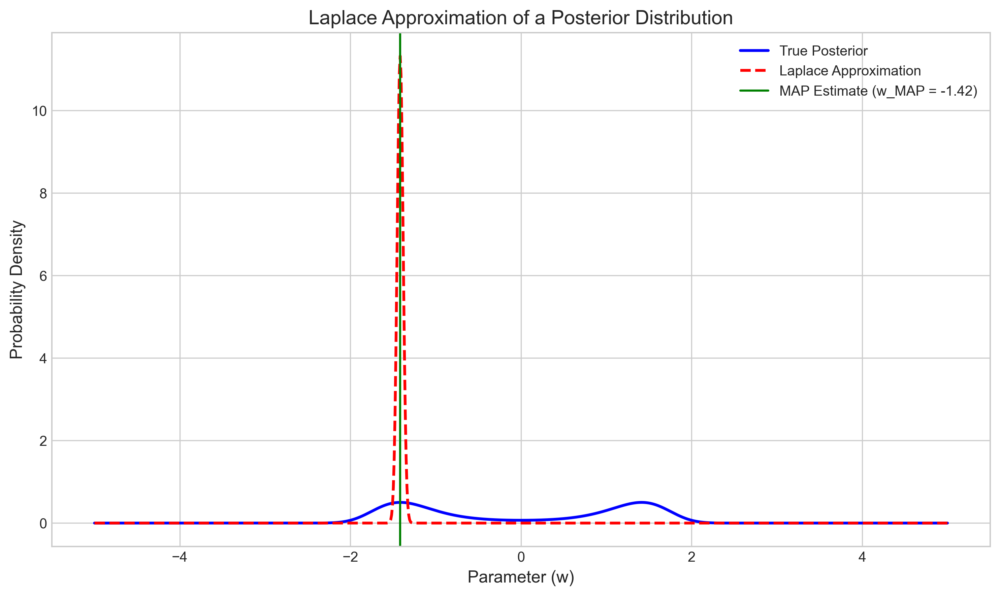
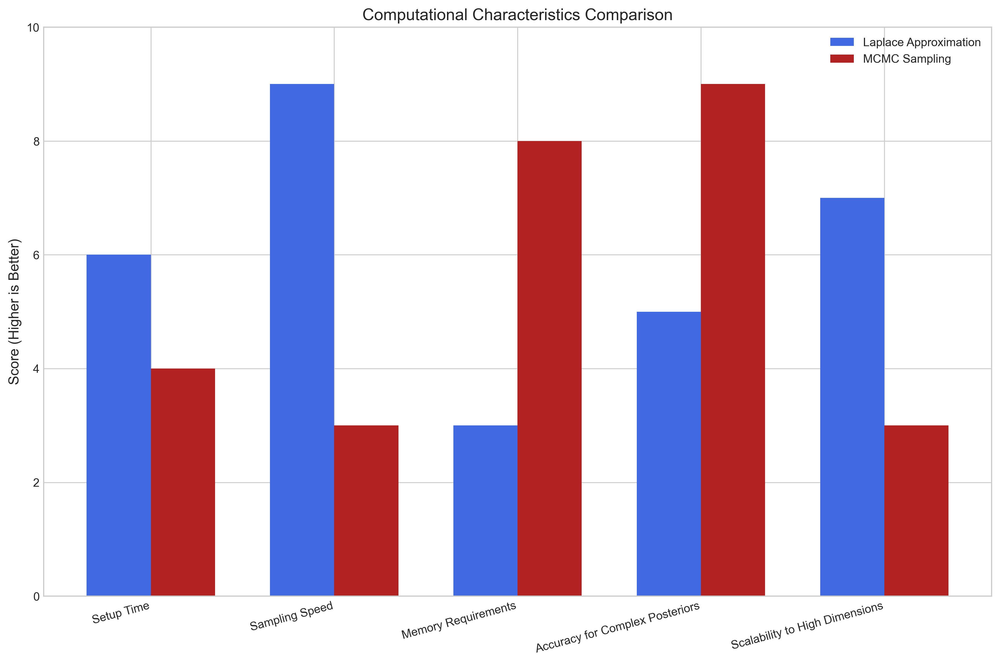
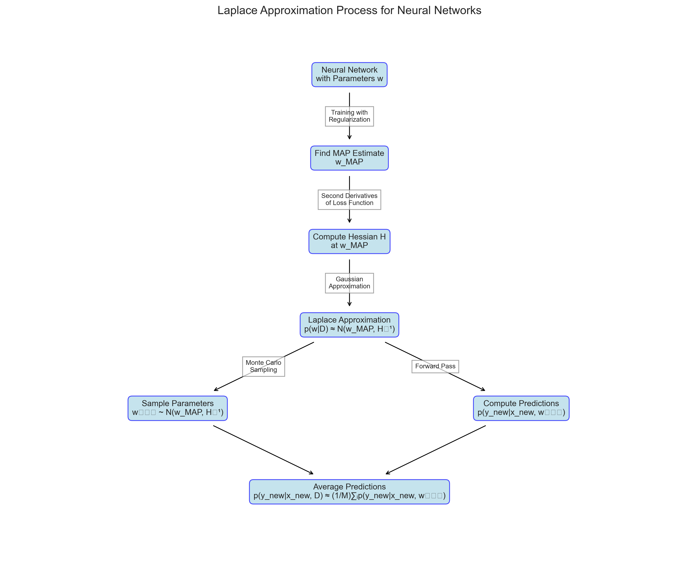

# Question 17: Laplace Approximation

## Problem Statement
You have a neural network with weights $\mathbf{w}$ and a dataset $\mathcal{D}$. The log-likelihood is $\log p(\mathcal{D}|\mathbf{w})$ and you want to approximate the posterior $p(\mathbf{w}|\mathcal{D})$ using Laplace approximation.

## Task
1. Explain the key idea behind Laplace approximation of the posterior
2. If $\hat{\mathbf{w}}_{MAP}$ is the MAP estimate and $\mathbf{H}$ is the Hessian of the negative log-posterior at $\hat{\mathbf{w}}_{MAP}$, write the Laplace approximation formula for $p(\mathbf{w}|\mathcal{D})$
3. How would you use this approximation to estimate the predictive distribution $p(y_{new}|\mathbf{x}_{new}, \mathcal{D})$ for a new input $\mathbf{x}_{new}$?
4. Compare the computational efficiency of this approach with MCMC sampling for the same problem

## Solution

### Step 1: Key Idea Behind Laplace Approximation

The key idea behind Laplace approximation is to approximate the posterior distribution $p(\mathbf{w}|\mathcal{D})$ with a multivariate Gaussian distribution centered at the Maximum A Posteriori (MAP) estimate of the parameters. This approximation is based on a second-order Taylor expansion of the log-posterior around the MAP estimate.

As shown in the figure, the Laplace approximation (red dashed line) provides a Gaussian approximation to the true posterior distribution (blue solid line), centered at the MAP estimate (green vertical line). While the true posterior may have a more complex shape, the Laplace approximation is often reasonable, especially as the amount of data increases.

The Laplace approximation relies on the observation that as the amount of data increases, the posterior distribution tends to:
1. Become more concentrated around its mode
2. Become more Gaussian in shape (by the Bernstein–von Mises theorem)

The key steps in applying Laplace approximation are:
1. Find the MAP estimate $\hat{\mathbf{w}}_{MAP}$ by maximizing the log-posterior
2. Compute the Hessian matrix $\mathbf{H}$ of the negative log-posterior at $\hat{\mathbf{w}}_{MAP}$
3. Approximate the posterior as a multivariate Gaussian with mean $\hat{\mathbf{w}}_{MAP}$ and covariance matrix $\mathbf{H}^{-1}$

### Step 2: Laplace Approximation Formula

The Laplace approximation of the posterior $p(\mathbf{w}|\mathcal{D})$ is a multivariate Gaussian distribution:

$$p(\mathbf{w}|\mathcal{D}) \approx \mathcal{N}(\mathbf{w} | \hat{\mathbf{w}}_{MAP}, \mathbf{H}^{-1})$$

where:
- $\hat{\mathbf{w}}_{MAP}$ is the MAP estimate of the parameters
- $\mathbf{H}$ is the Hessian matrix of the negative log-posterior at $\hat{\mathbf{w}}_{MAP}$
- $\mathbf{H}^{-1}$ is the inverse of the Hessian, which serves as the covariance matrix

More explicitly, the approximation can be written as:

$$p(\mathbf{w}|\mathcal{D}) \approx (2\pi)^{-d/2} |\mathbf{H}|^{1/2} \exp\left(-\frac{1}{2}(\mathbf{w} - \hat{\mathbf{w}}_{MAP})^T \mathbf{H} (\mathbf{w} - \hat{\mathbf{w}}_{MAP})\right)$$

where $d$ is the dimensionality of $\mathbf{w}$ (the number of parameters in the neural network).

The Hessian matrix $\mathbf{H}$ is given by:

$$\mathbf{H} = -\nabla^2 \log p(\mathbf{w}|\mathcal{D})|_{\mathbf{w}=\hat{\mathbf{w}}_{MAP}}$$

Using Bayes' rule and assuming the prior is also Gaussian:

$$\mathbf{H} = -\nabla^2 \log p(\mathcal{D}|\mathbf{w})|_{\mathbf{w}=\hat{\mathbf{w}}_{MAP}} - \nabla^2 \log p(\mathbf{w})|_{\mathbf{w}=\hat{\mathbf{w}}_{MAP}}$$

This formulation shows that the Hessian combines information from both the log-likelihood (data fit) and the log-prior (regularization).

### Step 3: Using Laplace Approximation for Predictive Distribution

To estimate the predictive distribution $p(y_{new}|\mathbf{x}_{new}, \mathcal{D})$ for a new input $\mathbf{x}_{new}$, we need to marginalize over the parameter posterior:

$$p(y_{new}|\mathbf{x}_{new}, \mathcal{D}) = \int p(y_{new}|\mathbf{x}_{new}, \mathbf{w}) \, p(\mathbf{w}|\mathcal{D}) \, d\mathbf{w}$$

With the Laplace approximation, $p(\mathbf{w}|\mathcal{D}) \approx \mathcal{N}(\mathbf{w} | \hat{\mathbf{w}}_{MAP}, \mathbf{H}^{-1})$, we have:

$$p(y_{new}|\mathbf{x}_{new}, \mathcal{D}) \approx \int p(y_{new}|\mathbf{x}_{new}, \mathbf{w}) \, \mathcal{N}(\mathbf{w} | \hat{\mathbf{w}}_{MAP}, \mathbf{H}^{-1}) \, d\mathbf{w}$$

For neural networks, this integral typically doesn't have a closed-form solution. Therefore, it's usually approximated using Monte Carlo sampling:

1. Generate $M$ samples from the approximate posterior: $\mathbf{w}^{(i)} \sim \mathcal{N}(\hat{\mathbf{w}}_{MAP}, \mathbf{H}^{-1})$ for $i = 1, 2, \ldots, M$
2. For each sample, compute the prediction: $p(y_{new}|\mathbf{x}_{new}, \mathbf{w}^{(i)})$
3. Average these predictions to get the Monte Carlo estimate:
   $$p(y_{new}|\mathbf{x}_{new}, \mathcal{D}) \approx \frac{1}{M} \sum_{i=1}^{M} p(y_{new}|\mathbf{x}_{new}, \mathbf{w}^{(i)})$$

The figure illustrates this approach for a regression problem. The blue points are observed data, the red line is the MAP prediction (without uncertainty), the green lines are predictions from individual parameter samples, and the gray shaded region represents the 95% confidence interval derived from the posterior predictive distribution.

For a classification problem with a neural network, the process is similar:
1. Sample parameters from the approximate posterior
2. For each parameter sample, compute class probabilities for the new input
3. Average these probabilities to get the final predictive probabilities

This approach accounts for parameter uncertainty in the predictions, which is particularly important for inputs far from the training data or when making high-stakes decisions.

### Step 4: Computational Efficiency Comparison with MCMC

The figure compares Laplace approximation and MCMC sampling across various computational characteristics. Higher scores indicate better performance.

**Laplace Approximation:**
1. **Requires finding the MAP estimate**: This is an optimization problem, typically solved using gradient-based methods like Adam or L-BFGS.
2. **Requires computing the Hessian matrix**: For neural networks with many parameters, this can be computationally intensive and memory-demanding (O(d²) memory where d is the number of parameters).
3. **Efficient sampling**: Once the approximation is constructed, generating samples is very efficient.
4. **Hessian approximations**: For large neural networks, various approximations of the Hessian can be used:
   - Diagonal approximation (ignore parameter correlations)
   - Block-diagonal approximation (by layers)
   - Kronecker-factored approximation
   - Low-rank approximation

**MCMC Sampling:**
1. **Requires many iterations**: MCMC methods need many iterations to explore the posterior, especially for high-dimensional problems.
2. **Computational cost per iteration**: Each iteration typically involves evaluating the model on the entire dataset.
3. **Mixing issues**: MCMC can struggle with high-dimensional posteriors (slow mixing).
4. **No Hessian required**: No need to compute or store the Hessian.
5. **More accurate for complex posteriors**: Can capture complex, multi-modal posteriors more accurately.
6. **Advanced methods**: Implementations like Hamiltonian Monte Carlo (HMC) improve efficiency but are still typically much slower than Laplace for high-dimensional problems.

**Comparison Summary:**
- **Scalability**: Laplace approximation is typically much faster for high-dimensional problems like neural networks, especially with Hessian approximations.
- **Accuracy**: MCMC provides a more accurate representation of the posterior, especially when it's complex or multi-modal.
- **Assumptions**: Laplace works well when the posterior is approximately Gaussian, while MCMC makes fewer assumptions about the posterior shape.
- **Implementation complexity**: Laplace is generally easier to implement, especially when using automatic differentiation to compute the Hessian.
- **Memory requirements**: Laplace with full Hessian requires O(d²) memory, while MCMC typically requires O(d) memory per sample.

The flowchart illustrates the complete process of applying Laplace approximation to a neural network, from training to obtaining the predictive distribution.

## Key Insights

1. **Uncertainty Quantification**: Laplace approximation provides a way to quantify uncertainty in neural network predictions, which is crucial for reliable decision-making in many applications.

2. **Computational Efficiency**: For large neural networks, the Laplace approximation offers a more computationally efficient alternative to MCMC sampling, though it relies on the assumption that the posterior is approximately Gaussian.

3. **Posterior Geometry**: The accuracy of the Laplace approximation depends on how well the posterior can be approximated by a Gaussian distribution. It works best when the posterior is unimodal and approximately symmetric.

4. **Practical Implementations**: In practice, computing and storing the full Hessian matrix for large neural networks is impractical. Various approximations are used to make the approach tractable for modern deep learning models.

5. **Bayesian Deep Learning**: Laplace approximation represents a middle ground between purely frequentist approaches (which ignore parameter uncertainty) and full Bayesian inference (which can be computationally prohibitive for large models).

## Conclusion

Laplace approximation provides a computationally efficient way to approximate the posterior distribution of neural network parameters. By representing the posterior as a multivariate Gaussian centered at the MAP estimate, it enables uncertainty quantification in predictions with relatively low computational overhead compared to MCMC methods.

The main strengths of Laplace approximation are its simplicity and computational efficiency, especially for high-dimensional problems like neural networks. However, its accuracy depends on how well the posterior can be approximated by a Gaussian distribution. For complex posteriors with multiple modes or strong asymmetry, MCMC methods may provide more accurate results, albeit at higher computational cost.

For modern deep learning models with millions of parameters, further approximations of the Hessian are typically needed to make Laplace approximation practical. These approximations trade off some accuracy for significant gains in computational efficiency.

Despite its limitations, Laplace approximation remains a valuable tool in the Bayesian deep learning toolkit, offering a pragmatic approach to uncertainty quantification in neural networks. 