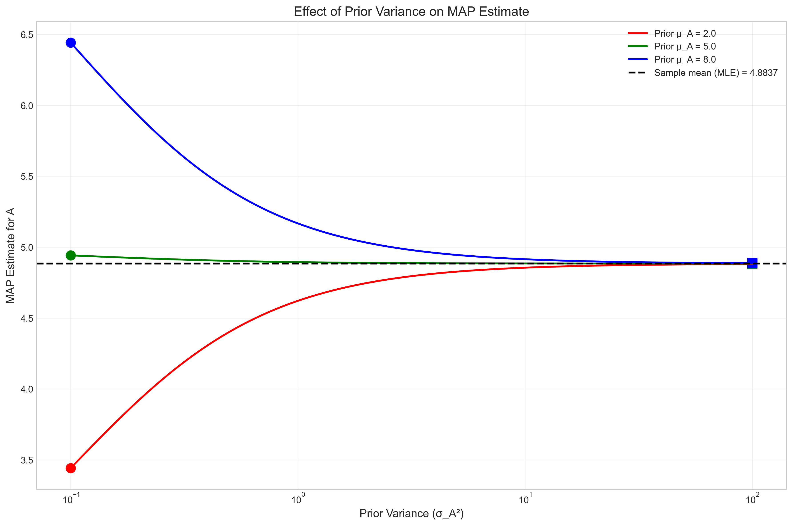
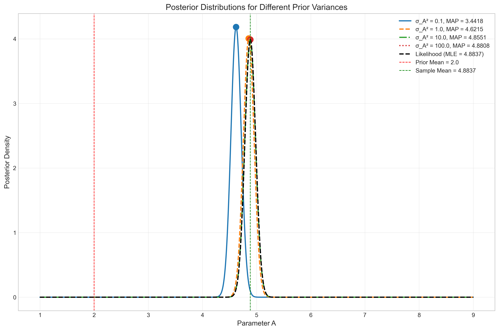
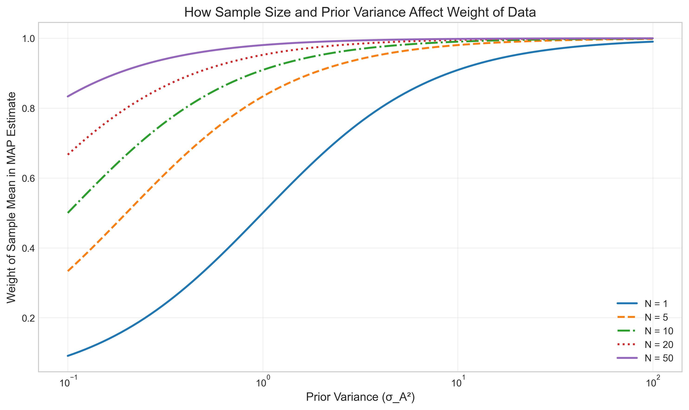

# Question 18: Normal MAP Estimation

## Problem Statement
You are given N, I.I.D samples for the books "standard problem":

$$x_i = A + n_i$$

We wish to estimate the parameter "A" using Maximum A Posteriori Estimation.

We know that the distribution of the samples is given by:

$$f(x|A) = \frac{1}{\sqrt{2\pi\sigma^2}}e^{-\frac{(x_i-A)^2}{2\sigma^2}}$$

We also have the following Bayesian Prior Distribution for A:

$$f(A) = \frac{1}{\sqrt{2\pi\sigma_A^2}}e^{-\frac{(A-\mu_A)^2}{2\sigma_A^2}}$$

Assume that the parameters: $\sigma^2$, $\sigma_A^2$, and $\mu_A$ are constant and are known.

## Task
1. Determine the MAP estimator for the parameter A.
2. If $\sigma_A^2$ was extremely large, what would the estimator look like?

## Solution

### Step 1: Understanding the Problem

In this problem, we have a standard additive noise model where each observation $x_i$ is the true parameter $A$ plus some noise $n_i$. The noise follows a normal distribution with zero mean and variance $\sigma^2$, making the likelihood also normal. We are given a normal prior for the parameter $A$ with mean $\mu_A$ and variance $\sigma_A^2$.

Our goal is to find the Maximum A Posteriori (MAP) estimate for $A$ given the data and analyze what happens when the prior variance becomes very large.

### Step 2: Deriving the MAP Estimator

To find the MAP estimator, we need to find the value of $A$ that maximizes the posterior distribution $p(A|x)$. By Bayes' rule:

$$p(A|x) \propto p(x|A) \times p(A)$$

Where $p(x|A)$ is the likelihood and $p(A)$ is the prior.

Working with the log posterior is more convenient:

$$\log p(A|x) \propto \log p(x|A) + \log p(A)$$

For $N$ i.i.d. samples, the log-likelihood is:

$$\log p(x|A) = -\frac{N}{2}\log(2\pi\sigma^2) - \frac{1}{2\sigma^2}\sum_{i=1}^{N}(x_i-A)^2$$

The log-prior is:

$$\log p(A) = -\frac{1}{2}\log(2\pi\sigma_A^2) - \frac{(A-\mu_A)^2}{2\sigma_A^2}$$

Combining these and dropping constant terms:

$$\log p(A|x) \propto -\frac{1}{2\sigma^2}\sum_{i=1}^{N}(x_i-A)^2 - \frac{(A-\mu_A)^2}{2\sigma_A^2}$$

Expanding the sum in the likelihood term:

$$\sum_{i=1}^{N}(x_i-A)^2 = \sum_{i=1}^{N}x_i^2 - 2A\sum_{i=1}^{N}x_i + NA^2$$

Substituting and rearranging to collect terms with $A$:

$$\log p(A|x) \propto -\frac{1}{2\sigma^2}[\sum_{i=1}^{N}x_i^2 - 2A\sum_{i=1}^{N}x_i + NA^2] - \frac{(A-\mu_A)^2}{2\sigma_A^2}$$

$$\log p(A|x) \propto -\frac{1}{2\sigma^2}[\sum_{i=1}^{N}x_i^2 - 2A\sum_{i=1}^{N}x_i + NA^2] - \frac{A^2-2A\mu_A+\mu_A^2}{2\sigma_A^2}$$

$$\log p(A|x) \propto -[\frac{NA^2-2A\sum_{i=1}^{N}x_i}{2\sigma^2} + \frac{A^2-2A\mu_A}{2\sigma_A^2}] + \text{constant terms}$$

$$\log p(A|x) \propto -[A^2(\frac{N}{2\sigma^2} + \frac{1}{2\sigma_A^2}) - A(\frac{\sum_{i=1}^{N}x_i}{\sigma^2} + \frac{\mu_A}{\sigma_A^2})] + \text{constant terms}$$

To find the MAP estimate, we take the derivative with respect to $A$ and set it to zero:

$$\frac{d}{dA}(\log p(A|x)) = -[2A(\frac{N}{2\sigma^2} + \frac{1}{2\sigma_A^2}) - (\frac{\sum_{i=1}^{N}x_i}{\sigma^2} + \frac{\mu_A}{\sigma_A^2})]$$

Setting this equal to zero:

$$2A(\frac{N}{2\sigma^2} + \frac{1}{2\sigma_A^2}) = \frac{\sum_{i=1}^{N}x_i}{\sigma^2} + \frac{\mu_A}{\sigma_A^2}$$

Solving for $A$:

$$A = \frac{\frac{\sum_{i=1}^{N}x_i}{\sigma^2} + \frac{\mu_A}{\sigma_A^2}}{\frac{N}{\sigma^2} + \frac{1}{\sigma_A^2}}$$

Using the sample mean $\bar{x} = \frac{\sum_{i=1}^{N}x_i}{N}$:

$$A_{MAP} = \frac{\frac{N\bar{x}}{\sigma^2} + \frac{\mu_A}{\sigma_A^2}}{\frac{N}{\sigma^2} + \frac{1}{\sigma_A^2}}$$

This can be rewritten in an alternative form:

$$A_{MAP} = \frac{\sigma_A^2 \times N \times \bar{x} + \sigma^2 \times \mu_A}{\sigma_A^2 \times N + \sigma^2}$$

### Step 3: Analyzing the MAP Estimator

The MAP estimator we derived is a weighted average of the sample mean $\bar{x}$ and the prior mean $\mu_A$:

$$A_{MAP} = w \times \bar{x} + (1-w) \times \mu_A$$

where $w = \frac{\sigma_A^2 \times N}{\sigma_A^2 \times N + \sigma^2}$ is the weight given to the sample mean.

This weight $w$ determines how much we trust the data versus the prior:
- When $\sigma_A^2$ is small (strong prior), $w$ is closer to 0, and $A_{MAP}$ is closer to $\mu_A$
- When $\sigma_A^2$ is large (weak prior), $w$ is closer to 1, and $A_{MAP}$ is closer to $\bar{x}$
- When $N$ is large (lots of data), $w$ is closer to 1, and $A_{MAP}$ is closer to $\bar{x}$

For the second part of the question, when $\sigma_A^2 \to \infty$ (extremely large), the prior becomes non-informative:

$$\lim_{\sigma_A^2 \to \infty} A_{MAP} = \lim_{\sigma_A^2 \to \infty} \frac{\sigma_A^2 \times N \times \bar{x} + \sigma^2 \times \mu_A}{\sigma_A^2 \times N + \sigma^2}$$

$$\lim_{\sigma_A^2 \to \infty} A_{MAP} = \lim_{\sigma_A^2 \to \infty} \frac{\sigma_A^2 \times N \times \bar{x}}{\sigma_A^2 \times N} = \bar{x}$$

Therefore, when $\sigma_A^2$ is extremely large, the MAP estimator approaches the sample mean $\bar{x}$, which is exactly the Maximum Likelihood Estimator (MLE) for this problem.

### Step 4: Visualization and Interpretation

To understand the behavior of the MAP estimator better, we can visualize how it changes with different prior variances and sample sizes.

This figure shows how the MAP estimate varies with increasing prior variance ($\sigma_A^2$) for different prior means. We can see that regardless of the prior mean, as $\sigma_A^2$ increases, all MAP estimates converge to the sample mean (shown by the horizontal dashed line).

This figure shows the posterior distributions for different prior variances. For a small prior variance (strong prior), the posterior is peaked close to the prior mean. As the prior variance increases, the posterior becomes more influenced by the data and eventually approaches the likelihood function.

This figure illustrates how the weight of the sample mean in the MAP estimate changes with prior variance and sample size. With larger sample sizes, the data quickly dominates the prior, even when the prior variance is relatively small.

## Key Insights

1. **Weighted Average Interpretation**: The MAP estimator is a weighted average of the prior mean and the sample mean. The weights depend on the prior variance, data variance, and sample size.

2. **Bridge Between Bayesian and Frequentist Approaches**: When the prior becomes non-informative ($\sigma_A^2 \to \infty$), the MAP estimator converges to the MLE. This shows how MAP estimation provides a bridge between Bayesian and frequentist methods.

3. **Automatic Regularization**: The MAP estimate naturally incorporates regularization through the prior. With limited data, the prior has a stronger influence; with more data, the estimate becomes more data-driven.

4. **Handling Uncertainty**: The MAP framework allows us to incorporate prior knowledge when data is limited and automatically transitions to data-driven estimation as more evidence accumulates.

5. **Practical Applications**: This result is widely applicable in many fields where we need to combine prior knowledge with new observations, such as adaptive filtering, tracking systems, and parameter estimation in dynamic systems.

## Conclusion

The MAP estimator for the normal model with normal prior is:

$$A_{MAP} = \frac{\sigma_A^2 \times N \times \bar{x} + \sigma^2 \times \mu_A}{\sigma_A^2 \times N + \sigma^2}$$

When $\sigma_A^2$ is extremely large, the MAP estimator approaches the sample mean $\bar{x}$, which is the MLE. This illustrates a key property of Bayesian methods: with increasingly diffuse priors, Bayesian estimators tend to agree with their frequentist counterparts.

The weighting mechanism in the MAP estimator provides an elegant way to balance prior knowledge with observed data, making it a versatile tool for statistical inference and machine learning applications. 