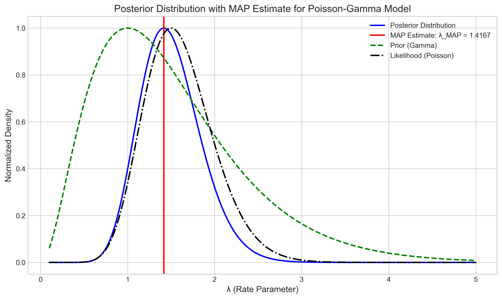
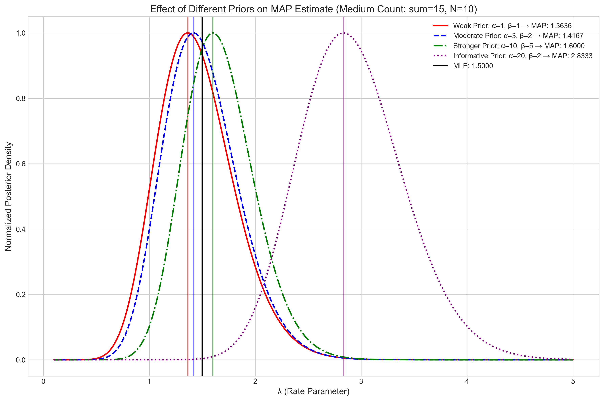
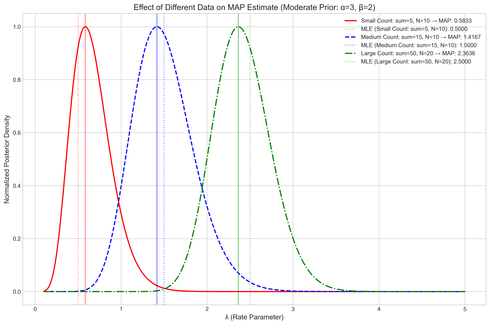

# Question 19: MAP Estimation with Poisson-Gamma Model

## Problem Statement
Consider a scenario where we observe count data $D = \{x_1, x_2, ..., x_N\}$, such as the number of events occurring in fixed time intervals. Assume these counts come from $N$ independent and identically distributed Poisson random variables with rate parameter $\lambda$. In Bayesian statistics, we model our prior belief about $\lambda$ using a Gamma distribution with shape parameter $\alpha$ and rate parameter $\beta$.

## Task
1. Write out the log-posterior $\log P(\lambda|D) \propto \log P(D|\lambda) + \log P(\lambda)$.
2. Take the derivative of $\log P(D|\lambda) + \log P(\lambda)$ with respect to the parameter $\lambda$.
3. Set the derivative equal to zero and solve for $\lambda$ - call this maximizing value $\lambda_{MAP}$.

## Solution

### Step 1: Deriving the Log-Posterior

In this problem, we have:
- A Poisson likelihood with parameter $\lambda$ (rate of events)
- A Gamma prior on $\lambda$ with parameters $\alpha$ (shape) and $\beta$ (rate)

First, let's write out the likelihood function. For a single observation $x_i$ from a Poisson distribution:
$$P(x_i|\lambda) = \frac{\lambda^{x_i} e^{-\lambda}}{x_i!}$$

For $N$ independent observations, the joint likelihood is:
$$P(D|\lambda) = \prod_{i=1}^N P(x_i|\lambda) = \prod_{i=1}^N \frac{\lambda^{x_i} e^{-\lambda}}{x_i!} = \frac{\lambda^{\sum x_i} e^{-N\lambda}}{\prod x_i!}$$

The Gamma prior for $\lambda$ is:
$$P(\lambda) = \frac{\beta^\alpha}{\Gamma(\alpha)} \lambda^{\alpha-1} e^{-\beta\lambda}$$

Using Bayes' rule, the posterior is proportional to the likelihood times the prior:
$$P(\lambda|D) \propto P(D|\lambda) \times P(\lambda)$$

Taking the logarithm of both sides:
$$\log P(\lambda|D) \propto \log P(D|\lambda) + \log P(\lambda)$$

Substituting the expressions for the likelihood and prior:
$$\log P(\lambda|D) \propto \log\left[\frac{\lambda^{\sum x_i} e^{-N\lambda}}{\prod x_i!}\right] + \log\left[\frac{\beta^\alpha}{\Gamma(\alpha)} \lambda^{\alpha-1} e^{-\beta\lambda}\right]$$

Expanding the logarithms:
$$\log P(\lambda|D) \propto \sum x_i \log(\lambda) - N\lambda - \log(\prod x_i!) + \alpha\log(\beta) - \log(\Gamma(\alpha)) + (\alpha-1)\log(\lambda) - \beta\lambda$$

Simplifying by removing terms that don't depend on $\lambda$ (i.e., constants with respect to $\lambda$):
$$\log P(\lambda|D) \propto \sum x_i \log(\lambda) - N\lambda + (\alpha-1)\log(\lambda) - \beta\lambda$$

Further simplifying:
$$\log P(\lambda|D) \propto (\sum x_i + \alpha - 1) \log(\lambda) - (N + \beta)\lambda$$

This is our final expression for the log-posterior distribution, up to a constant that doesn't depend on $\lambda$.

### Step 2: Taking the Derivative of the Log-Posterior

To find the Maximum A Posteriori (MAP) estimate, we need to find the value of $\lambda$ that maximizes the log-posterior. We do this by taking the derivative with respect to $\lambda$ and setting it equal to zero.

The derivative of the log-posterior with respect to $\lambda$ is:
$$\frac{d}{d\lambda}[\log P(\lambda|D)] = \frac{\sum x_i + \alpha - 1}{\lambda} - (N + \beta)$$

### Step 3: Solving for $\lambda_{MAP}$

Setting the derivative equal to zero:
$$\frac{\sum x_i + \alpha - 1}{\lambda} - (N + \beta) = 0$$

Solving for $\lambda$:
$$\frac{\sum x_i + \alpha - 1}{\lambda} = N + \beta$$
$$\lambda = \frac{\sum x_i + \alpha - 1}{N + \beta}$$

This gives us the MAP estimator for $\lambda$:
$$\lambda_{MAP} = \frac{\sum x_i + \alpha - 1}{N + \beta}$$

The figure above shows the posterior distribution (in blue) along with the MAP estimate (red vertical line). For comparison, we also show the prior distribution (green dashed line) and the likelihood function (black dash-dotted line).

## Interpretation and Key Insights

### Interpretation of the MAP Estimator

The MAP estimator $\lambda_{MAP} = \frac{\sum x_i + \alpha - 1}{N + \beta}$ can be interpreted as a weighted average between:

1. The Maximum Likelihood Estimate (MLE): $\lambda_{MLE} = \frac{\sum x_i}{N}$, which is based solely on the observed data
2. A prior-related term: $\frac{\alpha - 1}{\beta}$, which is related to the mode of the Gamma prior

The weights are determined by the relative strengths of the data (represented by $N$) and the prior (represented by $\beta$).

### Effect of Different Priors

The choice of prior can significantly influence the MAP estimate, especially when the amount of data is limited.

The figure above shows how different priors affect the posterior distribution and the resulting MAP estimate for a fixed dataset. We can observe that:

1. A weak prior (e.g., $\alpha=1, \beta=1$) has minimal influence, and the MAP estimate is closer to the MLE
2. More informative priors (e.g., $\alpha=20, \beta=2$) can significantly shift the MAP estimate away from the MLE
3. The direction and magnitude of this shift depend on the prior parameters $\alpha$ and $\beta$

### Effect of Different Data

As we collect more data, the influence of the prior diminishes, and the MAP estimate converges toward the MLE.

The figure above illustrates how varying amounts of data affect the posterior distribution and the MAP estimate for a fixed prior. We can see that:

1. With limited data (small counts), the prior has a stronger influence on the MAP estimate
2. As the amount of data increases (larger counts), the likelihood dominates, and the MAP estimate gets closer to the MLE
3. The posterior distribution becomes more concentrated (less uncertain) with more data

### Special Case: Large Prior Variance

In the special case where the prior variance becomes extremely large ($\beta \to 0$ for a Gamma prior), the MAP estimate approaches the MLE:

$$\lim_{\beta \to 0} \lambda_{MAP} = \lim_{\beta \to 0} \frac{\sum x_i + \alpha - 1}{N + \beta} \approx \frac{\sum x_i + \alpha - 1}{N}$$

And if $\alpha$ is also small compared to $\sum x_i$, then:

$$\lambda_{MAP} \approx \frac{\sum x_i}{N} = \lambda_{MLE}$$

This illustrates how the Bayesian approach (MAP estimation) relates to the frequentist approach (maximum likelihood estimation) when the prior becomes non-informative.

## Summary

1. For a Poisson likelihood with a Gamma prior, the log-posterior is proportional to $(\sum x_i + \alpha - 1) \log(\lambda) - (N + \beta)\lambda$.
2. The MAP estimator is $\lambda_{MAP} = \frac{\sum x_i + \alpha - 1}{N + \beta}$.
3. This MAP estimator balances the information from the data (summarized by the MLE $\frac{\sum x_i}{N}$) and the prior (related to $\frac{\alpha - 1}{\beta}$).
4. The influence of the prior decreases as we collect more data.
5. With a very diffuse prior ($\beta \to 0$), the MAP estimate approaches the MLE.

The Poisson-Gamma model is a classic example of conjugate Bayesian analysis, where the posterior distribution follows the same parametric form as the prior (in this case, the posterior is also a Gamma distribution). This conjugacy property makes the derivation of the MAP estimate analytically tractable. 