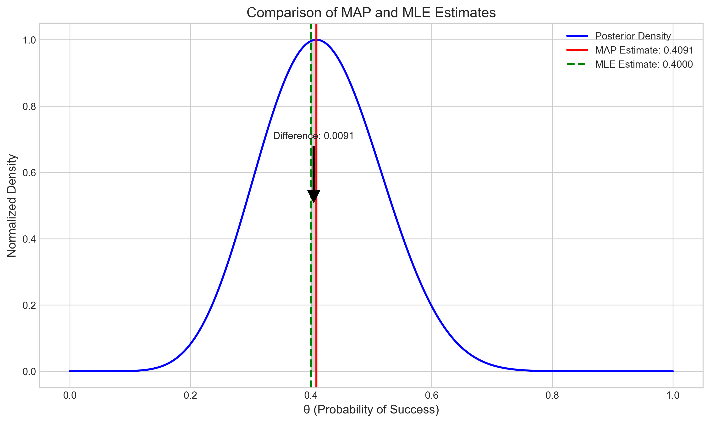

# Question 1: MAP vs MLE for Binomial Data

## Problem Statement
Consider a binomial likelihood with parameter $\theta$ representing the probability of success. We observe data $D = 8$ successes out of $n = 20$ trials.

## Task
1. Using a $\text{Beta}(2, 2)$ prior for $\theta$, derive the posterior distribution
2. Calculate the Maximum A Posteriori (MAP) estimate for $\theta$
3. Calculate the Maximum Likelihood Estimate (MLE) for $\theta$
4. Compare the MAP and MLE estimates and explain why they differ

## Solution

### Step 1: Deriving the Posterior Distribution

For Bayesian inference with a binomial likelihood and a Beta prior, we can use the Beta-Binomial conjugacy property. This means that when we start with a Beta prior and observe binomial data, the posterior distribution is also a Beta distribution.

Given:
- Prior: $\theta \sim \text{Beta}(\alpha=2, \beta=2)$
- Data: $D = 8$ successes out of $n = 20$ trials

The posterior distribution is:
$\theta | D \sim \text{Beta}(\alpha + k, \beta + n - k)$
$\theta | D \sim \text{Beta}(2 + 8, 2 + 20 - 8)$
$\theta | D \sim \text{Beta}(10, 14)$

This conjugacy property makes the computation very convenient, as we simply add the number of successes to the prior's first parameter and the number of failures to the prior's second parameter.

The figure below shows the prior, likelihood, and posterior distributions:

From the plot, we can see how the prior (red dashed line) and the likelihood (green dash-dotted line) combine to form the posterior distribution (blue solid line). The posterior is influenced by both the prior beliefs and the observed data.

### Step 2: Calculating the MAP Estimate

The Maximum A Posteriori (MAP) estimate is the value of $\theta$ that maximizes the posterior distribution. For a Beta distribution $\text{Beta}(a, b)$ with $a, b > 1$, the mode (which is the MAP estimate) is given by:

$\text{MAP} = \frac{a - 1}{a + b - 2}$

For our posterior $\text{Beta}(10, 14)$:
$\text{MAP} = \frac{10 - 1}{10 + 14 - 2} = \frac{9}{22} = 0.4091$

### Step 3: Calculating the MLE Estimate

The Maximum Likelihood Estimate (MLE) is the value of $\theta$ that maximizes the likelihood function. For a binomial distribution, the MLE is simply the proportion of successes:

$\text{MLE} = \frac{k}{n} = \frac{8}{20} = 0.4000$

### Step 4: Comparing MAP and MLE Estimates

The comparison of the MAP and MLE estimates shows:
- MAP estimate: 0.4091
- MLE estimate: 0.4000
- Difference (MAP - MLE): 0.0091

The difference between the MAP and MLE estimates can be explained by the influence of the prior distribution. The MAP estimate incorporates both the prior belief and the data, while the MLE only considers the data.

In this case, the prior $\text{Beta}(2, 2)$ has a mean of $\frac{\alpha}{\alpha+\beta} = \frac{2}{2+2} = 0.5$, which is higher than the observed proportion of successes (0.4). As a result, the prior pulls the MAP estimate slightly toward 0.5, making it a bit larger than the MLE.

### Effect of Different Priors

To understand the relationship between MAP and MLE further, we can examine how different prior distributions affect the MAP estimate:

The comparison table shows the MAP estimates for different priors and their differences from the MLE:

| Prior           | MAP Estimate | Difference from MLE |
|-----------------|--------------|---------------------|
| Beta(1, 1)      | 0.4000       | +0.0000             |
| Beta(2, 2)      | 0.4091       | +0.0091             |
| Beta(8, 2)      | 0.5357       | +0.1357             |
| Beta(2, 8)      | 0.3214       | -0.0786             |
| Beta(20, 20)    | 0.4655       | +0.0655             |
| MLE             | 0.4000       | 0.0000              |

Key observations:
1. With a uniform prior Beta(1, 1), the MAP estimate equals the MLE. This is because a uniform prior places equal weight on all possible values of θ, so it doesn't bias the estimate in any direction.
2. More informative priors (like Beta(8, 2) which strongly favors higher values of θ) cause larger deviations from the MLE.
3. The direction of the deviation depends on where the prior is centered. A prior centered above the MLE (like Beta(8, 2)) pulls the MAP estimate up, while a prior centered below the MLE (like Beta(2, 8)) pulls the MAP estimate down.
4. A symmetric prior centered at 0.5 (like Beta(2, 2) or Beta(20, 20)) will pull the MAP estimate toward 0.5, but the strength of this pull depends on how informative the prior is.

## Key Insights

1. **Bayesian Inference Framework**: The solution demonstrates the core components of Bayesian inference: we start with a prior belief, update it with observed data using Bayes' rule to obtain a posterior distribution, and then derive point estimates like the MAP from that posterior.

2. **Prior Influence**: The prior distribution can significantly influence the resulting parameter estimates, especially when the amount of data is limited. As we gather more data, the influence of the prior diminishes, and the MAP estimate converges toward the MLE.

3. **Beta-Binomial Conjugacy**: This example showcases the convenience of conjugate priors, where the posterior distribution follows the same family as the prior, making calculations analytically tractable.

4. **Regularization Effect**: The MAP estimate can be seen as a regularized version of the MLE, where the prior adds a bias toward values that are considered more likely a priori. This can help prevent overfitting, especially in small sample scenarios.

5. **Uniform Prior Special Case**: With a uniform prior (Beta(1, 1)), the MAP equals the MLE. This illustrates the connection between Bayesian and frequentist approaches - when the prior is non-informative, the results converge.

## Conclusion

The MAP and MLE estimates differ because they are based on different philosophical approaches to inference. The MLE only considers the observed data, while the MAP incorporates prior beliefs about the parameter. The magnitude and direction of the difference depend on the prior distribution's shape and how it relates to the observed data.

In practical applications, the choice between MAP and MLE (or full Bayesian inference) would depend on whether reliable prior information is available and how much data has been collected. With large datasets, the difference becomes negligible as both approaches converge to the true parameter value. 