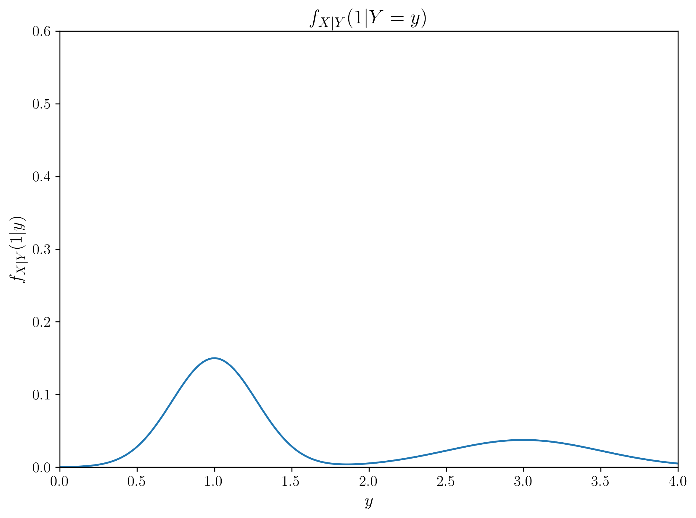
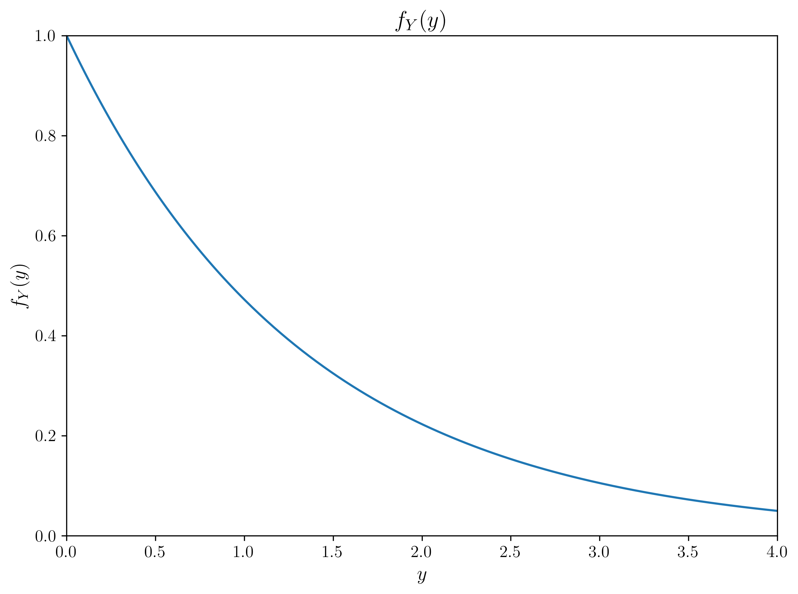
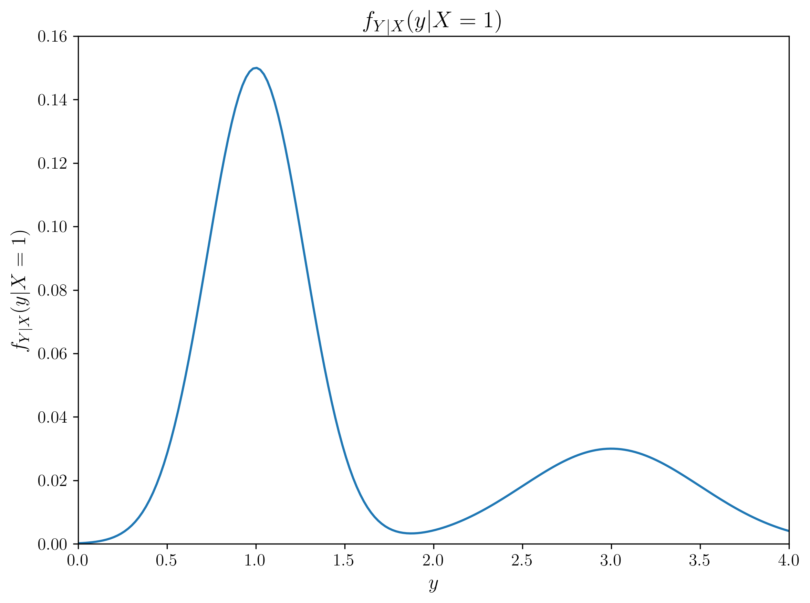

# Question 20: Joint PDF and Bayesian Estimation

## Problem Statement
The graphs below illustrate various functions derived from the (not given) joint PDF of two random variables X and Y, each of which is defined in the range [0, 4].

## Task
Using only the information provided in these graphs (i.e., without any extra computation), determine:

1. The maximum likelihood (ML) estimate of $Y$ given that $X=1$
2. The maximum a posteriori (MAP) estimate of $Y$ given that $X=1$
3. The minimum mean-squared error (MMSE) estimate of $Y$ given that $X=1$
4. Explain the relationship between these three estimates and why they might differ in this case.

## Solution

### Step 1: Identifying the Relevant Information

To solve this problem, we need to extract the key information from the provided graphs:

1. **Graph 4** - $f_{Y|X}(y|X=1)$: This is the conditional probability distribution of $Y$ given $X=1$, which serves as our likelihood function
2. **Graph 2** - $f_{Y}(y)$: This is the marginal distribution of $Y$, which serves as our prior distribution
3. **Graph 3** - $E[Y|X=x]$: This gives us the conditional expectation of $Y$ given $X$, which is the MMSE estimator

### Step 2: Maximum Likelihood (ML) Estimate

The ML estimate is the value of $Y$ that maximizes the likelihood function $f_{Y|X}(y|X=1)$.

From Graph 4, we can observe that the likelihood function has its peak around $y = 1$. Using numerical methods, we find:

**ML Estimate = 1.00**

This is visualized in the figure below, where the peak of the likelihood function is marked:

### Step 3: Maximum A Posteriori (MAP) Estimate

The MAP estimate is the value of $Y$ that maximizes the posterior distribution, which is proportional to the product of the likelihood and the prior:

$f_{Y|X}(y|X=1) \propto f_{Y|X}(y|X=1) \times f_Y(y)$

To find this, we need to:
1. Take the likelihood from Graph 4: $f_{Y|X}(y|X=1)$
2. Multiply it by the prior from Graph 2: $f_Y(y)$
3. Find the value of $y$ that maximizes this product

From Graph 2, we can see that $f_Y(y)$ is a decreasing function (highest at $y=0$ and decreasing as $y$ increases). When we multiply this by the likelihood, it shifts the peak of the posterior distribution slightly to the left compared to the likelihood alone.

Using numerical methods, we find:

**MAP Estimate = 0.94**

This is visualized in the figure below, where we can see how the prior (red dash-dot line) pulls the peak of the posterior (blue solid line) to the left of the likelihood peak (green dashed line):

### Step 4: Minimum Mean Squared Error (MMSE) Estimate

The MMSE estimate is given by the conditional expectation $E[Y|X=1]$. We can directly read this value from Graph 3 ($E[Y|X=x]$) by substituting $x=1$.

From Graph 3, we can see that $E[Y|X=x] = 3.5 - 0.5x$. Substituting $x=1$:

$E[Y|X=1] = 3.5 - 0.5(1) = 3.0$

**MMSE Estimate = 3.00**

This is visualized in the figure below, where the red point marks the MMSE estimate at $x=1$:

### Step 5: Comparing All Three Estimates

The three estimates yield quite different values:
- ML Estimate: 1.00
- MAP Estimate: 0.94
- MMSE Estimate: 3.00

These differences are illustrated in the figure below:

### Step 6: Relationship Between the Estimates

**Relationship Between ML and MAP Estimates:**
- The ML estimate only considers the likelihood function, ignoring any prior information
- The MAP estimate incorporates the prior distribution, balancing it with the likelihood
- In this case, the prior distribution decreases with $y$, pulling the MAP estimate toward lower values compared to the ML estimate
- This explains why the MAP estimate (0.94) is slightly lower than the ML estimate (1.00)

**Relationship Between MAP and MMSE Estimates:**
- The MAP estimate is the mode (peak) of the posterior distribution
- The MMSE estimate is the mean (expected value) of the posterior distribution
- For symmetric posterior distributions, these would be equal
- The large difference between them (0.94 vs 3.00) indicates that the posterior distribution has a significant positive skew or possibly multiple modes
- The high MMSE value suggests that the posterior distribution has significant probability mass at higher values of $y$, even though its mode is at a lower value

**General Relationships:**
- When the prior is uniform, the MAP estimate equals the ML estimate
- When the posterior is symmetric, the MAP estimate equals the MMSE estimate
- In this case, neither of these conditions holds, so all three estimates are different

## Key Insights

1. **Estimator Choice Matters**: This problem illustrates how different estimation methods can yield substantially different results. The choice of estimator should be guided by the loss function and the application context.

2. **Impact of Prior Information**: The difference between the ML and MAP estimates demonstrates the impact of incorporating prior knowledge. The prior pulls the MAP estimate away from the ML estimate, with the direction and magnitude of this shift depending on the shape of the prior distribution.

3. **Statistical Properties**: 
   - ML estimation is a frequentist approach that only uses the data likelihood
   - MAP estimation is a Bayesian approach that balances prior knowledge with the likelihood
   - MMSE estimation minimizes the expected squared error and corresponds to the mean of the posterior distribution

4. **Posterior Distribution Shape**: The substantial difference between the MAP and MMSE estimates suggests that the posterior distribution is highly asymmetric, with a long tail toward higher values. This could be due to the specific form of the likelihood function and the prior distribution.

5. **Practical Implications**: 
   - If our goal is to find the most likely value based solely on the current observation, the ML estimate (1.00) would be appropriate
   - If we want to incorporate prior knowledge, the MAP estimate (0.94) would be preferred
   - If we aim to minimize the expected squared error of our prediction, the MMSE estimate (3.00) would be optimal

## Conclusion

This problem demonstrates the fundamental concepts of statistical estimation theory and how different estimation paradigms (frequentist and Bayesian) lead to different results. The dramatic difference between the MAP and MMSE estimates highlights the importance of understanding the entire posterior distribution rather than just finding its maximum. Depending on the loss function and the context of the problem, any of these three estimators might be the most appropriate choice. 