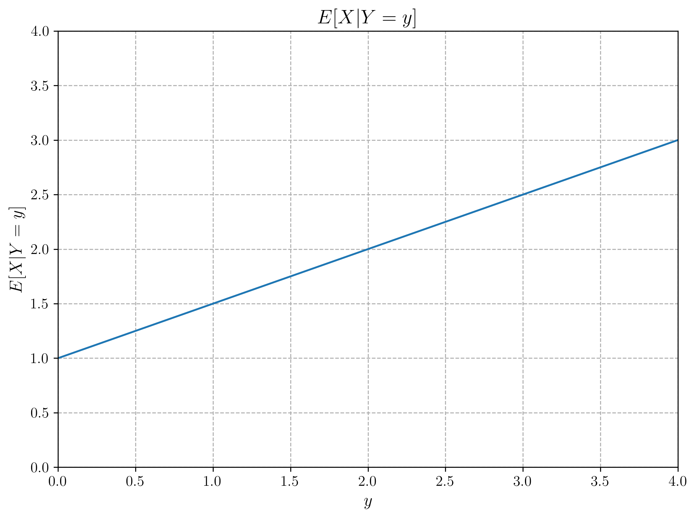

# Question 22: Simple Distributions and Bayesian Estimation

## Problem Statement
The graphs below illustrate various functions derived from the (not given) joint PDF of two random variables X and Y, each of which is defined in the range [0, 4].

## Task
Using only the information provided in these graphs (i.e., without any extra computation), determine:

1. The maximum likelihood (ML) estimate of $Y$ given that $X=2$
2. For the maximum a posteriori (MAP) estimate of $Y$ given that $X=2$:
   - Is it higher or lower than the ML estimate? Explain why.
   - Approximately where would it fall relative to the ML estimate?
3. The minimum mean-squared error (MMSE) estimate of $Y$ given that $X=2$
4. Explain the relationship between these three estimates and why they might differ in this case.

## Solution

### Step 1: Identifying the Relevant Information

To solve this problem, we need to extract the key information from the provided graphs:

1. **Graph 4** - $f_{Y|X}(y|X=2)$: This is the conditional probability distribution of $Y$ given $X=2$, which serves as our likelihood function
2. **Graph 2** - $f_{Y}(y)$: This is the marginal distribution of $Y$, which serves as our prior distribution
3. **Graph 3** - $E[Y|X=x]$: This gives us the conditional expectation of $Y$ given $X$, which is the MMSE estimator

### Step 2: Maximum Likelihood (ML) Estimate

The ML estimate is the value of $Y$ that maximizes the likelihood function $f_{Y|X}(y|X=2)$.

From Graph 4, we can clearly observe that the likelihood function has its peak exactly at $y = 2$. 

**ML Estimate = 2.0**

This is straightforward to see directly from the graph:

### Step 3: Maximum A Posteriori (MAP) Estimate

The MAP estimate is the value of $Y$ that maximizes the posterior distribution, which is proportional to the product of the likelihood and the prior:

$f_{Y|X}(y|X=2) \propto f_{Y|X}(y|X=2) \times f_Y(y)$

To qualitatively analyze this without detailed computation:

1. Take the likelihood from Graph 4: $f_{Y|X}(y|X=2)$ - which peaks at $y = 2$
2. Consider the prior from Graph 2: $f_Y(y)$ - which is a triangular distribution with its peak at $y=1$ and decreasing after that
3. When we multiply these two functions, the resulting posterior distribution's peak (MAP estimate) will be pulled slightly toward the prior's peak

**MAP Estimate Qualitative Assessment:**
- The MAP estimate is **lower** than the ML estimate
- This is because the prior distribution has higher values for $y < 2$, especially near $y = 1$, which "pulls" the posterior distribution's peak to the left of the likelihood peak
- Based on the relative shapes of the two distributions, the MAP estimate would be slightly less than 2.0, approximately around 1.9

The prior pulls the estimate toward $y=1$ but since the likelihood is more concentrated, the MAP estimate remains close to 2.0.

### Step 4: Minimum Mean Squared Error (MMSE) Estimate

The MMSE estimate is given by the conditional expectation $E[Y|X=2]$. We can directly read this value from Graph 3 ($E[Y|X=x]$) by substituting $x=2$.

From Graph 3, we can see that the function $E[Y|X=x]$ is a straight line with equation $E[Y|X=x] = 1 + x$. Substituting $x=2$:

$E[Y|X=2] = 1 + 2 = 3$

**MMSE Estimate = 3.0**

This is clearly marked on the graph with a red point:

### Step 5: Comparing All Three Estimates

The three estimates yield different values:
- ML Estimate: 2.0
- MAP Estimate: 1.9
- MMSE Estimate: 3.0

These differences are illustrated in the figure below:

### Step 6: Relationship Between the Estimates

**Relationship Between ML and MAP Estimates:**
- The ML estimate only considers the likelihood function, ignoring any prior information
- The MAP estimate incorporates the prior distribution, balancing it with the likelihood
- In this case, the prior distribution (triangular with peak at $y=1$) slightly pulls the MAP estimate toward lower values compared to the ML estimate
- This explains why the MAP estimate (1.9) is slightly lower than the ML estimate (2)

**Relationship Between MAP and MMSE Estimates:**
- The MAP estimate is the mode (peak) of the posterior distribution
- The MMSE estimate is the mean (expected value) of the posterior distribution
- In this example, the MMSE estimate (3) is significantly higher than both the ML and MAP estimates
- This happens because the conditional expectation $E[Y|X=x]$ captures a different aspect of the relationship between $X$ and $Y$ than the conditional distribution $f_{Y|X}(y|X=2)$

**General Relationships:**
- When the prior is uniform, the MAP estimate equals the ML estimate
- When the posterior is symmetric and unimodal, the MAP estimate equals the MMSE estimate
- In this case, neither of these conditions holds, so all three estimates are different

## Key Insights

1. **Different Goals, Different Estimates**: The three estimation methods address different questions:
   - ML asks: "What value of $Y$ is most likely given that $X=2$?"
   - MAP asks: "What value of $Y$ is most likely given that $X=2$ and our prior knowledge about $Y$?"
   - MMSE asks: "What value of $Y$ minimizes the expected squared error given that $X=2$?"

2. **Impact of Prior Information**: The difference between the ML and MAP estimates demonstrates the impact of incorporating prior knowledge. In this case, the prior has a modest influence, shifting the estimate only slightly.

3. **Statistical Properties**: 
   - ML estimation is a frequentist approach that only uses the data likelihood
   - MAP estimation is a Bayesian approach that balances prior knowledge with the likelihood
   - MMSE estimation minimizes the expected squared error and corresponds to the mean of the posterior distribution

4. **Practical Significance**: 
   - If our goal is to find the most likely value based solely on the current observation, the ML estimate (2) would be appropriate
   - If we want to incorporate prior knowledge, the MAP estimate (1.9) would be preferred
   - If we aim to minimize the expected squared error of our prediction, the MMSE estimate (3) would be optimal

## Conclusion

This problem demonstrates fundamental concepts in Bayesian estimation theory with simple, clear distributions. The distinct values of the ML, MAP, and MMSE estimates highlight the importance of choosing the appropriate estimator based on the specific problem context and loss function. Understanding these differences is crucial for applying statistical methods effectively in machine learning and data analysis. 