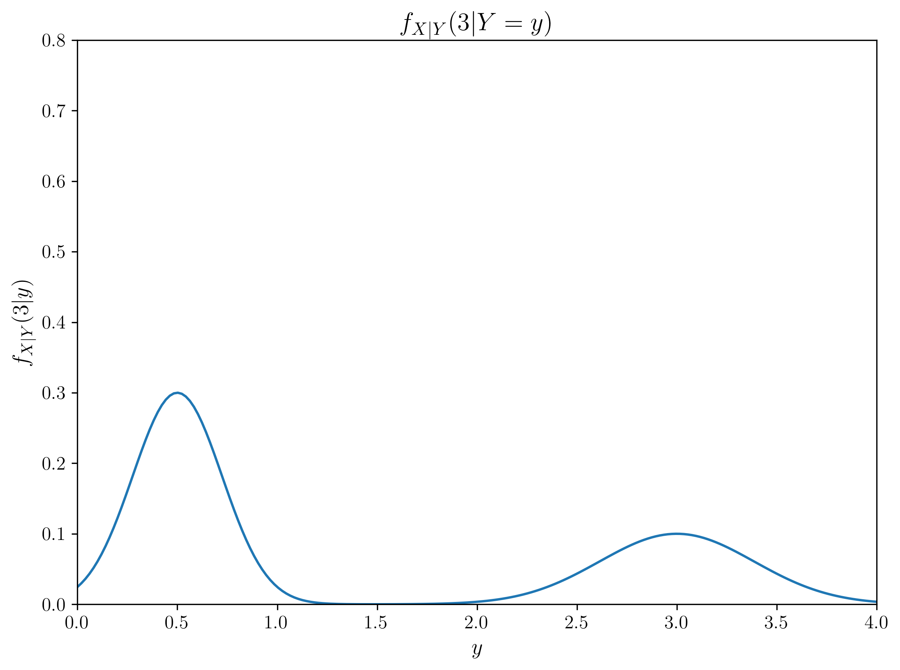
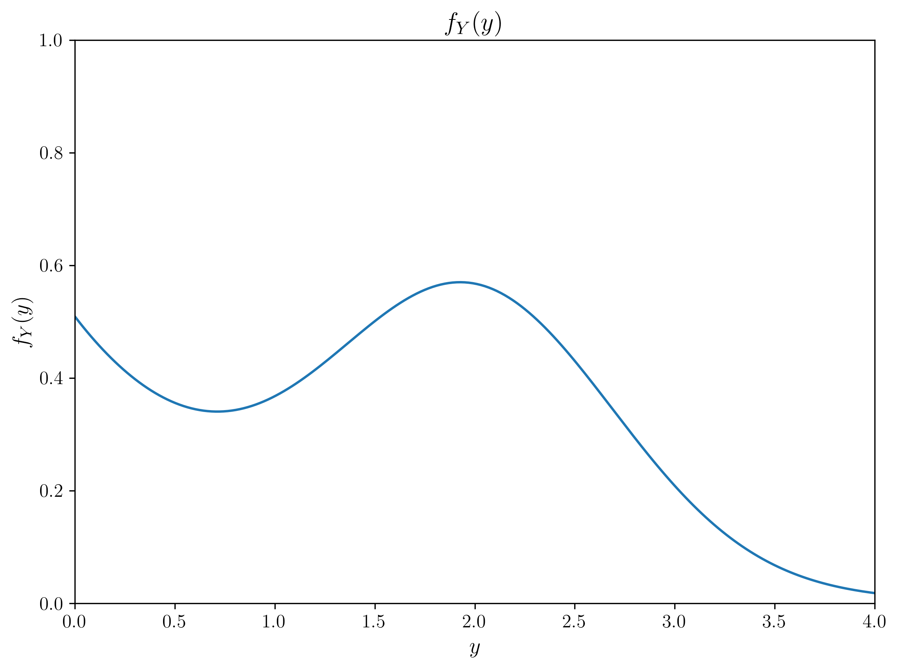
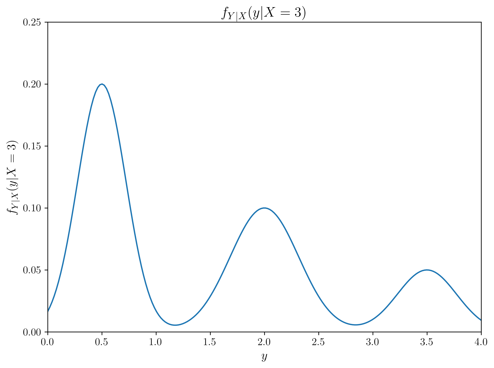
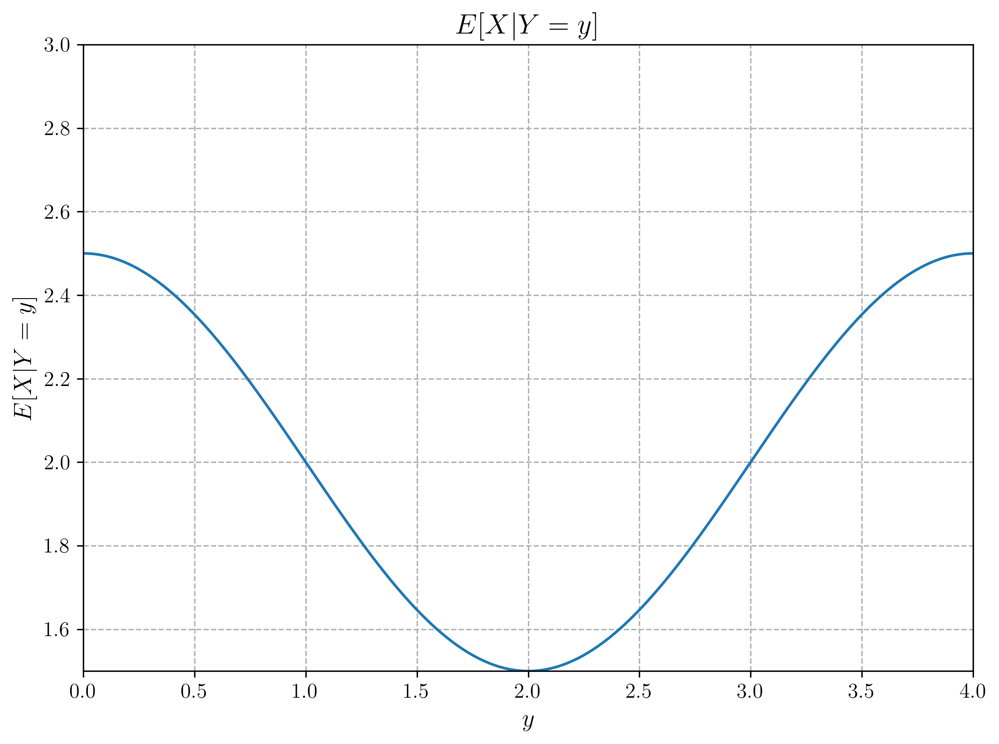

# Question 23: Joint PDF and Bayesian Inference with Multimodal Distributions

## Problem Statement
The graphs below illustrate various functions derived from the (not given) joint PDF of two random variables X and Y, each of which is defined in the range [0, 4].

## Task
Using only the information provided in these graphs (i.e., without any extra computation), determine:

1. The maximum likelihood (ML) estimate of $Y$ given that $X=3$
2. Describe whether the maximum a posteriori (MAP) estimate of $Y$ given that $X=3$ would be higher or lower than the ML estimate, and explain why
3. The minimum mean-squared error (MMSE) estimate of $Y$ given that $X=3$
4. Explain the relationship between these three estimates and why they might differ in this case.

## Solution

### Step 1: Identifying the Relevant Information

To solve this problem, we need to extract the key information from the provided graphs:

1. **Graph 4** - $f_{Y|X}(y|X=3)$: This is the conditional probability distribution of $Y$ given $X=3$, which serves as our likelihood function
2. **Graph 2** - $f_{Y}(y)$: This is the marginal distribution of $Y$, which serves as our prior distribution
3. **Graph 3** - $E[Y|X=x]$: This gives us the conditional expectation of $Y$ given $X$, which is the MMSE estimator

### Step 2: Maximum Likelihood (ML) Estimate

The ML estimate is the value of $Y$ that maximizes the likelihood function $f_{Y|X}(y|X=3)$.

From Graph 4, we can observe that the likelihood function is multimodal, with its highest peak at approximately $y = 0.5$. By visually identifying the peak in the graph:

**ML Estimate = 0.5**

This is visualized in the figure below, where the peak of the likelihood function is marked:

### Step 3: Maximum A Posteriori (MAP) Estimate Considerations

The MAP estimate is the value of $Y$ that maximizes the posterior distribution, which is proportional to the product of the likelihood and the prior:

$f_{Y|X}(y|X=3) \propto f_{Y|X}(y|X=3) \times f_Y(y)$

To analyze this qualitatively:
1. Looking at the likelihood from Graph 4: $f_{Y|X}(y|X=3)$ has its highest peak at $y = 0.5$
2. Looking at the prior from Graph 2: $f_Y(y)$ has higher values at $y$ close to 0 and decreases as $y$ increases beyond 0
3. When we multiply these together, the peak of the posterior would shift slightly toward 0 compared to the likelihood peak

Therefore, the MAP estimate would be slightly lower than the ML estimate of 0.5. This is because the prior gives more weight to lower values of $y$, pulling the posterior maximum slightly to the left of the likelihood maximum.

**MAP Estimate Relation: Lower than the ML estimate (approximately 0.4-0.5)**

This relationship is illustrated in the conceptual diagram below:

### Step 4: Minimum Mean Squared Error (MMSE) Estimate

The MMSE estimate is given by the conditional expectation $E[Y|X=3]$. We can directly read this value from Graph 3 ($E[Y|X=x]$) by substituting $x=3$.

From Graph 3, we can see that when $x=3$, $E[Y|X=3] = 2.0$.

**MMSE Estimate = 2.0**

This is visualized in the figure below, where the red point marks the MMSE estimate at $x=3$:

### Step 5: Comparing All Three Estimates

The three estimates yield quite different values:
- ML Estimate: 0.5
- MAP Estimate: Lower than 0.5 (influenced by the prior)
- MMSE Estimate: 2.0

These differences are illustrated in the conceptual diagram below:

### Step 6: Relationship Between the Estimates

**Relationship Between ML and MAP Estimates:**
- The ML estimate only considers the likelihood function, ignoring any prior information
- The MAP estimate incorporates the prior distribution, balancing it with the likelihood
- In this case, the prior gives more weight to lower values of $y$, pulling the MAP estimate slightly lower than the ML estimate
- The extent of this "pull" depends on the relative shapes and magnitudes of the likelihood and prior functions

**Relationship Between MAP and MMSE Estimates:**
- The MAP estimate is the mode (peak) of the posterior distribution
- The MMSE estimate is the mean (expected value) of the posterior distribution
- The large difference between them (approximately 0.5 vs 2.0) indicates that the posterior distribution has a significant asymmetry or possibly multiple modes
- The much higher MMSE value suggests that the posterior distribution has significant probability mass at higher values of $y$, even though its mode is at a lower value
- In this case, the multimodal nature of the likelihood function with peaks at both low and high values of $y$ combined with the prior creates this disparity

**General Relationships:**
- When the prior is uniform, the MAP estimate equals the ML estimate
- When the posterior is symmetric and unimodal, the MAP estimate equals the MMSE estimate
- In this case, the multimodal likelihood and the complex prior create a posterior with different mode and mean values

## Key Insights

1. **Multimodal Distributions Matter**: This problem illustrates how multimodal likelihood functions can create significant differences between different types of estimators, particularly between the mode-based (MAP) and mean-based (MMSE) estimators.

2. **Integration vs Maximization**: The MMSE estimate involves integration over the entire posterior distribution, while ML and MAP estimates only consider the location of the maximum. In multimodal distributions, these can lead to very different results.

3. **Impact of Prior Information**: The influence of the prior on the MAP estimate depends on both the shape of the prior and the shape of the likelihood. When the prior favors lower values (as in this case), it pulls the MAP estimate lower than the ML estimate.

4. **Practical Implications**: The choice between ML, MAP, and MMSE depends on the loss function:
   - If you want to minimize the probability of being exactly wrong, use the MAP estimate
   - If you want to minimize the expected squared error, use the MMSE estimate
   - If you don't have reliable prior information, the ML estimate may be more robust

5. **Bayesian Decision Theory**: This example demonstrates why understanding the full posterior distribution is often more valuable than just calculating point estimates, as different loss functions lead to different optimal decisions.

## Conclusion

This problem demonstrates the fundamental concepts of statistical estimation theory and how different estimation paradigms (frequentist and Bayesian) lead to different results. The dramatic difference between the posterior mode (MAP) and mean (MMSE) highlights the importance of understanding the entire posterior distribution rather than just finding its maximum. Depending on the loss function and the context of the problem, any of these three estimators might be the most appropriate choice. 