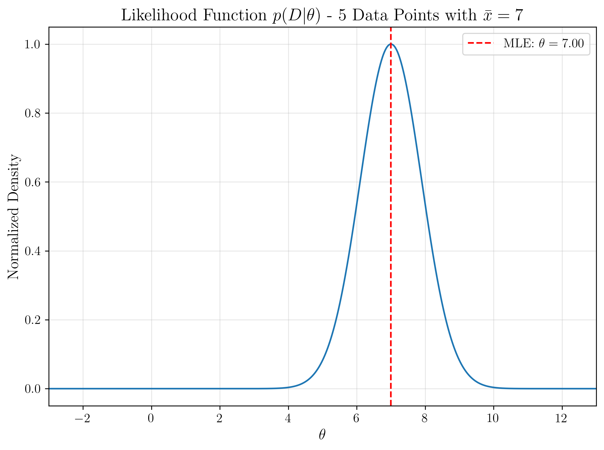
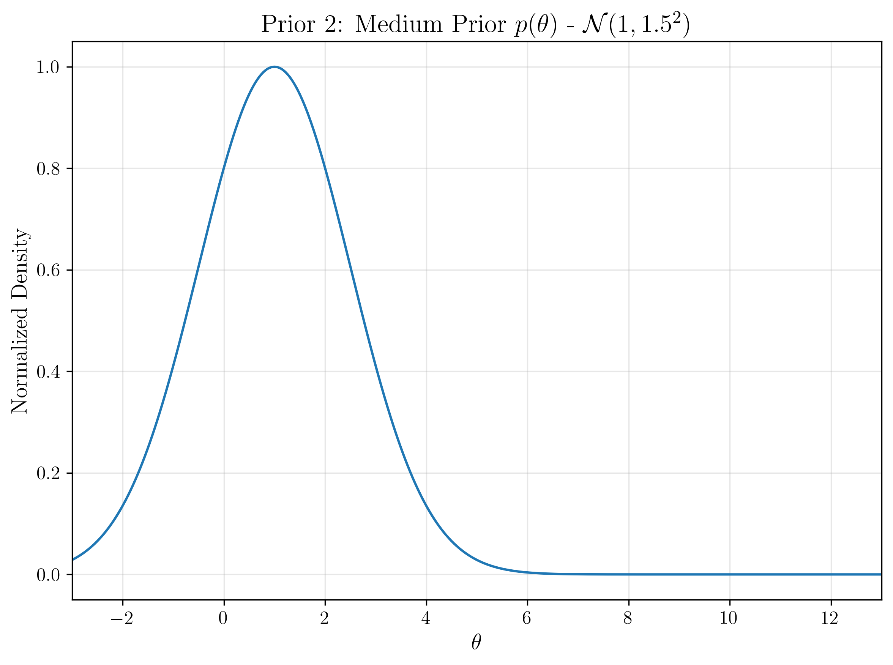
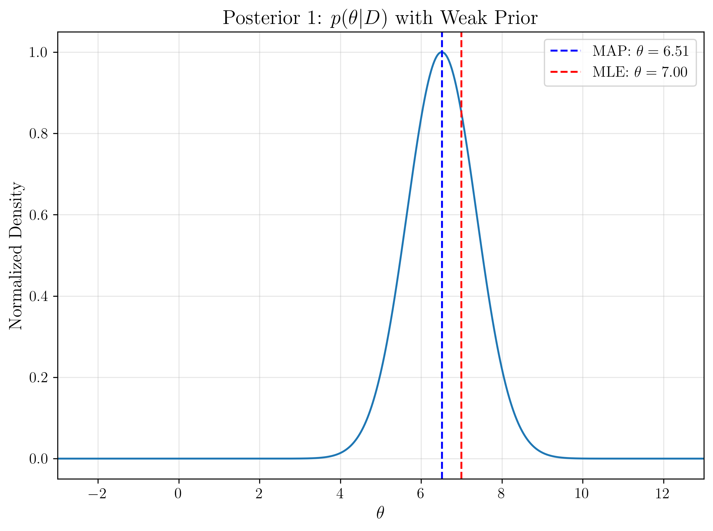
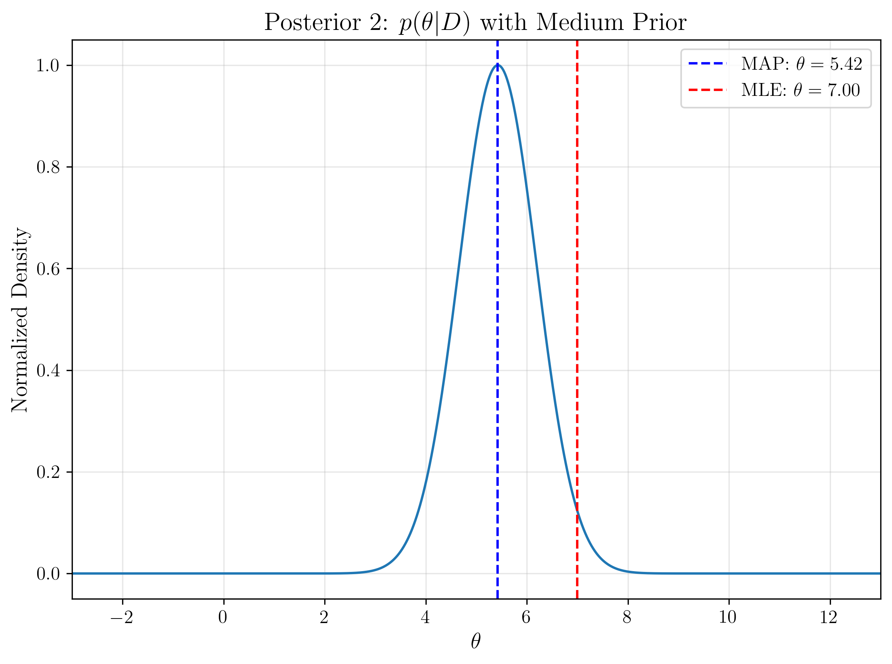
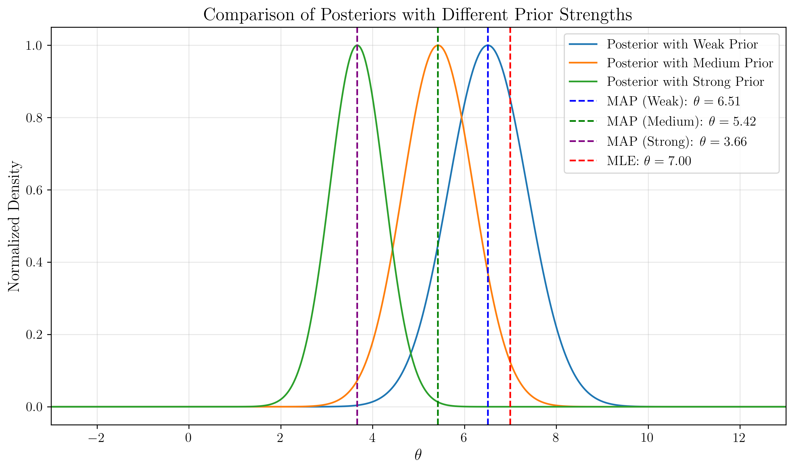

# Question 24: Prior Strength and MAP Estimation

## Problem Statement
Consider a scenario where we're estimating an unknown parameter $\theta$ with the following information:

1. We have collected 5 data points from a normal distribution $\mathcal{N}(\theta, 4)$ (where the variance is known to be 4)
2. The sample mean of our data is $\bar{x} = 7$
3. We're exploring the effect of different prior beliefs about $\theta$ on our MAP estimates

The graphs below illustrate different functions involved in Bayesian estimation:

### Task
1. Identify the maximum likelihood estimate (MLE) for $\theta$ based on the observed data.
2. For each of the three priors (weak, medium, and strong), calculate approximately how far the MAP estimate deviates from the MLE.
3. Explain the pattern you observe in how the MAP estimates relate to both the prior mean and the MLE as the prior becomes stronger.
4. If you were to collect 20 more data points (for a total of 25) with the same sample mean, how would you expect the three MAP estimates to change relative to the MLE? Explain your reasoning.

## Solution

### Step 1: Identifying the MLE

The maximum likelihood estimate (MLE) is the value of $\theta$ that maximizes the likelihood function $p(D|\theta)$. From the first graph, we can see that the likelihood function peaks at $\theta = 7.0$, which is precisely the sample mean of our data.

Therefore:
**MLE = 7.0**

This result is expected because for normal distributions with known variance, the MLE for the mean parameter is equal to the sample mean.

### Step 2: Analyzing MAP Estimates and Deviation from MLE

Looking at the posterior distributions and the comparison graph, we can identify the MAP estimates for each prior:

1. **With Weak Prior ($\mathcal{N}(1, 3^2)$)**:
   - MAP estimate: $\theta \approx 6.51$
   - Deviation from MLE: $|7.0 - 6.51| \approx 0.49$

2. **With Medium Prior ($\mathcal{N}(1, 1.5^2)$)**:
   - MAP estimate: $\theta \approx 5.42$
   - Deviation from MLE: $|7.0 - 5.42| \approx 1.58$

3. **With Strong Prior ($\mathcal{N}(1, 0.8^2)$)**:
   - MAP estimate: $\theta \approx 3.66$
   - Deviation from MLE: $|7.0 - 3.66| \approx 3.34$

We can observe that as the prior becomes stronger (smaller variance), the MAP estimate deviates more significantly from the MLE and moves closer to the prior mean.

### Step 3: Pattern Between MAP, MLE, and Prior Mean

The MAP estimate can be understood as a compromise between the MLE (data-driven estimate) and the prior mean (our prior belief). The specific pattern we observe is:

1. For all three priors, the MAP estimate falls between the MLE (7.0) and the prior mean (1.0)
2. As the prior becomes stronger (variance decreases), the MAP estimate moves closer to the prior mean
3. With the weak prior, the MAP is much closer to the MLE, indicating that the data has more influence
4. With the strong prior, the MAP shifts significantly toward the prior mean, indicating that our prior belief has more influence

This pattern can be explained mathematically. For a normal likelihood with known variance and a normal prior, the MAP estimate is given by:

$$\theta_{MAP} = \frac{\frac{n\bar{x}}{\sigma^2} + \frac{\mu_0}{\sigma_0^2}}{\frac{n}{\sigma^2} + \frac{1}{\sigma_0^2}}$$

Where:
- $n$ is the number of data points (5 in this case)
- $\bar{x}$ is the sample mean (7.0)
- $\sigma^2$ is the known data variance (4)
- $\mu_0$ is the prior mean (1.0)
- $\sigma_0^2$ is the prior variance (varying across the three priors)

This formula is a weighted average of the MLE and the prior mean, with weights inversely proportional to their respective variances. As the prior variance decreases (stronger prior), more weight is given to the prior mean in this average.

### Step 4: Effect of Additional Data

If we were to collect 20 more data points (for a total of 25) with the same sample mean, the MAP estimates would all move closer to the MLE. This is because:

1. The weight of the data in the MAP formula increases linearly with the number of data points
2. The weight of the prior remains constant

Using the formula above, with $n=25$ instead of $n=5$:

$$\theta_{MAP} = \frac{\frac{25 \cdot 7}{\sigma^2} + \frac{\mu_0}{\sigma_0^2}}{\frac{25}{\sigma^2} + \frac{1}{\sigma_0^2}}$$

The data would now have 5 times more influence than before. This would result in:

1. **Weak Prior**: The MAP would be extremely close to the MLE, with minimal deviation
2. **Medium Prior**: The MAP would move much closer to the MLE, with significantly reduced deviation
3. **Strong Prior**: The MAP would still be influenced by the prior but would move considerably closer to the MLE

This illustrates an important principle in Bayesian inference: as more data is collected, the influence of the prior diminishes, and different Bayesian analyses tend to converge regardless of their initial prior beliefs (as long as the priors don't assign zero probability to the true parameter value).

## Key Insights

1. **Balance Between Prior Knowledge and Data**:
   - The MAP estimate represents a balance between prior knowledge and observed data
   - The strength of the prior (inverse of its variance) determines how much the prior pulls the estimate away from the MLE

2. **Quantification of Prior Influence**:
   - We can quantify precisely how different prior strengths affect the final estimate
   - This allows us to understand the sensitivity of our conclusions to our prior assumptions

3. **Diminishing Prior Influence**:
   - As more data is collected, the influence of the prior diminishes
   - This is a key aspect of Bayesian learning: the posterior converges to the same distribution regardless of the prior (with sufficient data)

4. **Practical Implementation**:
   - In practice, the choice of prior strength should reflect genuine prior knowledge
   - If we have limited confidence in our prior beliefs, a weak prior (large variance) is appropriate
   - If we have strong domain knowledge, a stronger prior (smaller variance) can be justified

5. **Mathematical Interpretation**:
   - The MAP estimate is the mode of the posterior distribution
   - For conjugate normal-normal models like this one, the posterior is also normal with a mean that is a precision-weighted average of the prior mean and the MLE

These concepts are fundamental to understanding how prior information is incorporated into Bayesian inference and how MAP estimation provides a principled way to balance prior knowledge with observed data. 