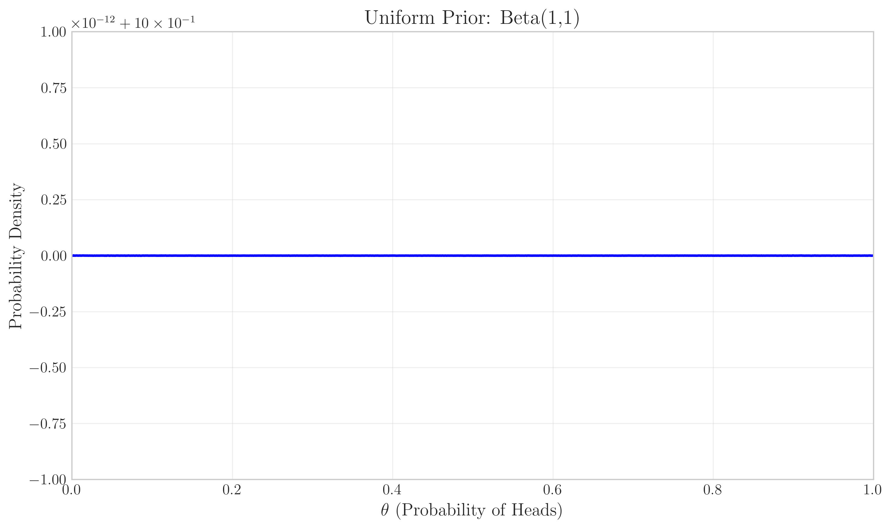
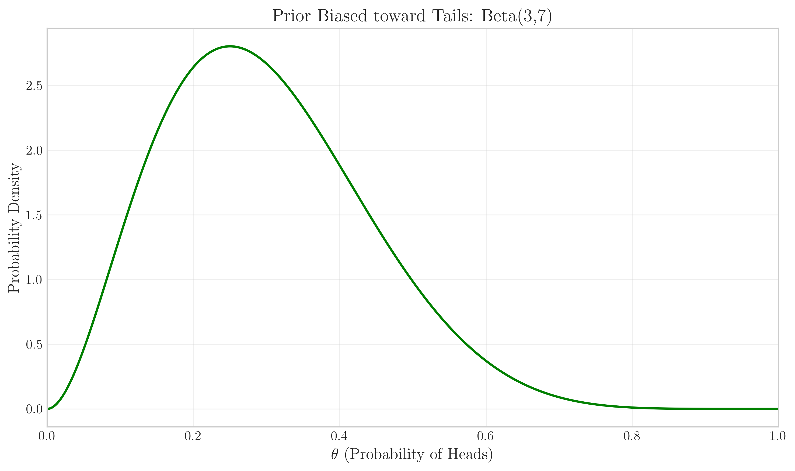
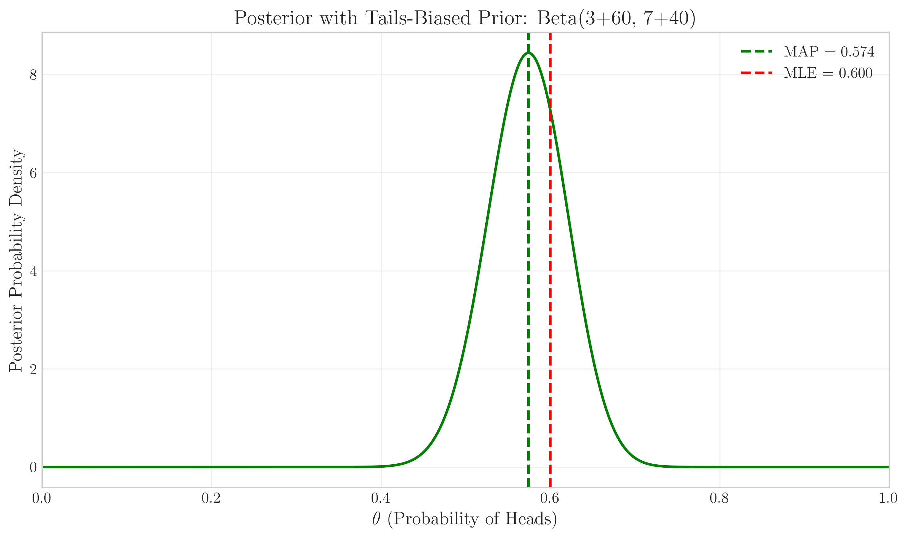
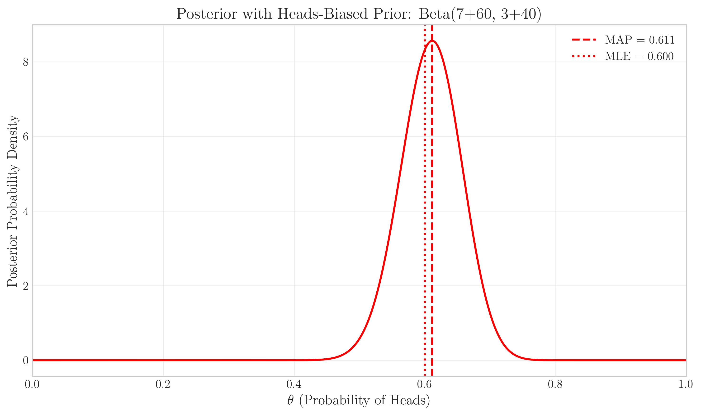
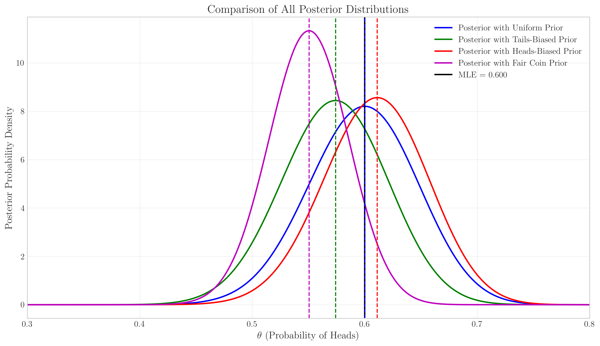

# Question 25: Effect of Priors on MAP Estimation for Coin Flips

## Problem Statement
You are analyzing data from a coin-flipping experiment where you observed 60 heads out of 100 flips. You want to estimate θ, the probability of getting heads, using different approaches including Maximum Likelihood Estimation (MLE) and Maximum A Posteriori (MAP) estimation with various priors.

Below are several visualizations to help you understand how different prior distributions affect Bayesian estimation:

*Figure 1: Likelihood function for the observed data (60 heads in 100 flips). The vertical red dashed line marks the position of maximum likelihood.*

*Figure 2: Uniform Prior - Beta(1,1) distribution.*

*Figure 3: Prior Biased toward Tails - Beta(3,7) distribution.*

*Figure 4: Prior Biased toward Heads - Beta(7,3) distribution.*

*Figure 5: Prior with Strong Belief in Fair Coin - Beta(50,50) distribution with peak at θ=0.5.*

*Figure 6: Posterior with Uniform Prior. Blue vertical line shows MAP estimate (θ=0.600); red vertical line shows MLE (θ=0.600).*

*Figure 7: Posterior with Tails-Biased Prior. Green vertical line shows MAP estimate (θ=0.574); red vertical line shows MLE (θ=0.600).*

*Figure 8: Posterior with Heads-Biased Prior. Red dashed line shows MAP estimate (θ=0.611); red dotted line shows MLE (θ=0.600).*

*Figure 9: Posterior with Fair Coin Prior. Magenta vertical line shows MAP estimate (θ=0.551); red vertical line shows MLE (θ=0.600).*

*Figure 10: Comparison of all posterior distributions with their respective MAP estimates (vertical dashed lines in corresponding colors) and the MLE (solid black vertical line at θ=0.600).*

*Figure 11: Evolution of the posterior starting from Beta(3,7) prior as more data is collected, maintaining a 60% heads ratio. Different colors represent increasing sample sizes from 5 flips to 500 flips, and the dashed lines indicate the corresponding MAP estimates. Note how the MAP estimates converge toward the MLE (θ=0.600) as data increases.*

*Figure 12: Different Bayesian estimators for the posterior with uniform prior. Red vertical line shows MAP estimate (θ=0.600, optimizing 0-1 loss); green vertical line shows posterior mean (θ=0.598, optimizing squared loss); purple vertical line shows posterior median (θ=0.599, optimizing absolute loss).*

### Task
Using only the information provided in these figures:

1. Identify the Maximum Likelihood Estimate (MLE) for θ based on the observed data. (The MLE value can be seen in Figure 1.)
2. For each of the four priors (Uniform, Tails-Biased, Heads-Biased, and Fair Coin), determine the MAP estimate for θ. (These values can be directly read from the captions of Figures 6-9.)
3. Explain how the choice of prior affects the MAP estimate relative to the MLE. (Compare the MAP values from Figures 6-9 with the MLE value from Figure 1.)
4. Based on Figure 11 (Evolution of Posterior), explain what happens to the MAP estimate as more data is collected (while maintaining the same ratio of heads to total flips). The figure shows MAP estimates for the following data points:
   - 3 heads, 2 tails (MAP = 0.364)
   - 6 heads, 4 tails (MAP = 0.416)
   - 15 heads, 10 tails (MAP = 0.486)
   - 30 heads, 20 tails (MAP = 0.525)
   - 60 heads, 40 tails (MAP = 0.554)
   - 150 heads, 100 tails (MAP = 0.577)
   - 300 heads, 200 tails (MAP = 0.588)
5. From Figure 12 (Different Bayesian Estimators), identify the posterior mean and median, and explain why they might differ from the MAP estimate. The figure shows:
   - MAP (0-1 Loss): θ = 0.600
   - Mean (Squared Loss): θ = 0.598
   - Median (Absolute Loss): θ = 0.599

## Solution

### Step 1: Identifying the MLE

From Figure 1, we can directly identify that the Maximum Likelihood Estimate (MLE) is marked with a vertical red dashed line at:

**MLE = 0.600**

This value represents the proportion of heads in our observed data (60 heads out of 100 flips), which is exactly what we would expect from maximum likelihood estimation for a binomial proportion.

### Step 2: Determining MAP Estimates for Different Priors

From Figures 6-9, we can directly read the MAP estimates for each prior:

1. **With Uniform Prior (Beta(1,1))** (Figure 6):
   - MAP estimate: θ = 0.600
   - This is identical to the MLE because the uniform prior doesn't bias the estimate in any direction.

2. **With Tails-Biased Prior (Beta(3,7))** (Figure 7):
   - MAP estimate: θ = 0.574
   - This is lower than the MLE because the prior believes the coin is biased toward tails.

3. **With Heads-Biased Prior (Beta(7,3))** (Figure 8):
   - MAP estimate: θ = 0.611
   - This is higher than the MLE because the prior believes the coin is biased toward heads.

4. **With Fair Coin Prior (Beta(50,50))** (Figure 9):
   - MAP estimate: θ = 0.551
   - This is pulled toward 0.5 (fair coin) because the prior strongly believes the coin is fair.

### Step 3: Effect of Prior Choice on MAP Estimates

Comparing the MAP estimates from Figures 6-9 with the MLE value from Figure 1, we can observe:

1. **Uniform Prior (Beta(1,1))**: MAP = 0.600, which equals the MLE of 0.600.
   - When the prior is uniform, it doesn't favor any particular value of θ over others, so the MAP estimate equals the MLE.

2. **Tails-Biased Prior (Beta(3,7))**: MAP = 0.574, which is 0.026 lower than the MLE.
   - This prior places more probability mass on values of θ less than 0.5, pulling the MAP estimate downward from the MLE.

3. **Heads-Biased Prior (Beta(7,3))**: MAP = 0.611, which is 0.011 higher than the MLE.
   - This prior places more probability mass on values of θ greater than 0.5, pulling the MAP estimate upward from the MLE.

4. **Fair Coin Prior (Beta(50,50))**: MAP = 0.551, which is 0.049 lower than the MLE.
   - This prior places a strong peak at θ = 0.5, pulling the MAP estimate significantly toward 0.5 despite the data showing 60% heads.

This demonstrates that the MAP estimate represents a compromise between the information from the data (represented by the likelihood) and our prior beliefs. The stronger and more informative the prior, the more it can pull the MAP estimate away from the MLE.

### Step 4: Evolution of Posterior with Increasing Data

From Figure 11, we can observe how the MAP estimate changes as more data is collected while maintaining the same 60% heads ratio:

- 3 heads, 2 tails: MAP = 0.364
- 6 heads, 4 tails: MAP = 0.416
- 15 heads, 10 tails: MAP = 0.486
- 30 heads, 20 tails: MAP = 0.525
- 60 heads, 40 tails: MAP = 0.554
- 150 heads, 100 tails: MAP = 0.577
- 300 heads, 200 tails: MAP = 0.588

We can observe several important patterns:

1. The MAP estimate starts at 0.364, which is much closer to the mean of the Beta(3,7) prior than to the observed proportion of heads (0.6).

2. As more data is collected (from 5 flips to 500 flips), the MAP estimate steadily increases toward the MLE of 0.6.

3. With each increase in sample size, the posterior distribution becomes narrower (indicating increased certainty) and the MAP estimate moves closer to the MLE.

4. Even with 300 heads and 200 tails (500 total flips), the MAP estimate (0.588) is still slightly below the MLE (0.600), showing that the prior still has a small influence.

This demonstrates a fundamental principle in Bayesian analysis: with sufficient data, the posterior distribution becomes increasingly determined by the data rather than the prior. As sample size increases, different priors will eventually lead to approximately the same posterior given enough data.

### Step 5: Different Bayesian Estimators

From Figure 12, we can directly read three different Bayesian estimators:

- MAP Estimate (0-1 Loss): θ = 0.600
- Posterior Mean (Squared Loss): θ = 0.598
- Posterior Median (Absolute Loss): θ = 0.599

The differences between these three estimators represent different optimization criteria:

1. **MAP Estimate (θ = 0.600)**: This is the mode of the posterior distribution and minimizes the expected 0-1 loss (which penalizes any error equally, regardless of magnitude).

2. **Posterior Mean (θ = 0.598)**: This is the mean of the posterior distribution and minimizes the expected squared error loss (which penalizes large errors more heavily).

3. **Posterior Median (θ = 0.599)**: This is the median of the posterior distribution and minimizes the expected absolute error loss (which penalizes errors proportionally to their magnitude).

In this case, the posterior distribution with the uniform prior is nearly symmetric but slightly skewed, so these estimators are very close to each other but not identical. The small differences reflect the slight asymmetry in the posterior distribution. When posteriors are more skewed or have multiple modes, these estimators can differ more significantly.

## Key Insights

1. **Balance Between Prior Knowledge and Data**:
   - The MAP estimate represents a balance between prior knowledge and observed data
   - The strength and shape of the prior determine how much it pulls the estimate away from the MLE

2. **Conjugate Priors in Bayesian Analysis**:
   - The Beta distribution is a conjugate prior for the Bernoulli/Binomial likelihood
   - This conjugacy allows for analytical solutions for the posterior, which is also a Beta distribution

3. **Diminishing Prior Influence with Increasing Data**:
   - As more data is collected, the influence of the prior diminishes
   - Asymptotically, the MAP estimate converges to the MLE with sufficient data
   - We observed this directly in the sequence: MAP = 0.364 → 0.416 → 0.486 → 0.525 → 0.554 → 0.577 → 0.588 → (eventually) 0.600

4. **Different Loss Functions Lead to Different Estimators**:
   - The MAP (0.600) is optimal under 0-1 loss
   - The posterior mean (0.598) is optimal under squared error loss
   - The posterior median (0.599) is optimal under absolute error loss

5. **Practical Implications**:
   - In data-limited situations, the choice of prior can significantly affect the conclusions
   - When strong domain knowledge exists, informative priors can improve estimation
   - With substantial data, the prior choice becomes less critical

These concepts are foundational to Bayesian inference and demonstrate how prior knowledge can be systematically incorporated into statistical estimation while allowing the data to dominate as sample sizes increase. 