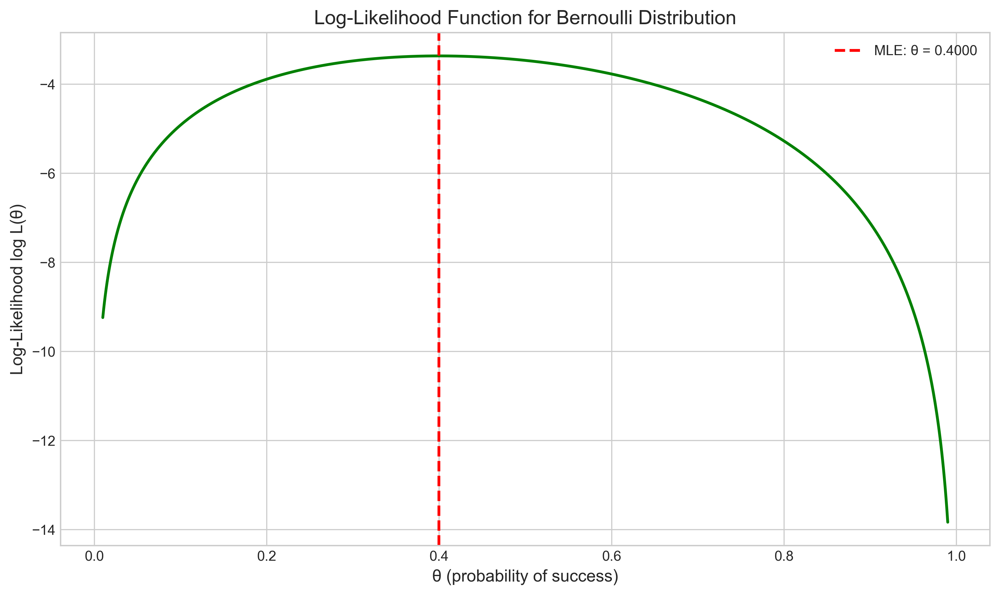
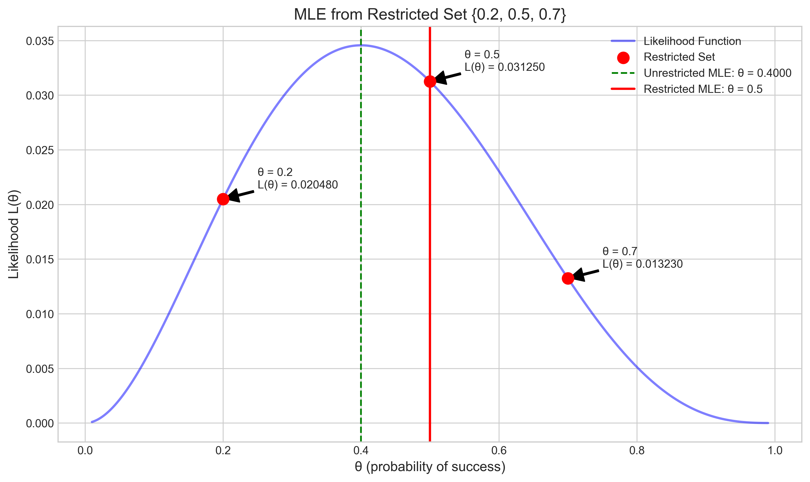
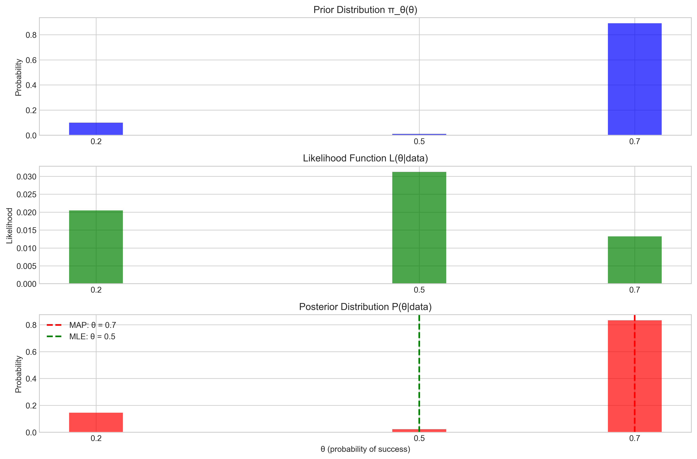
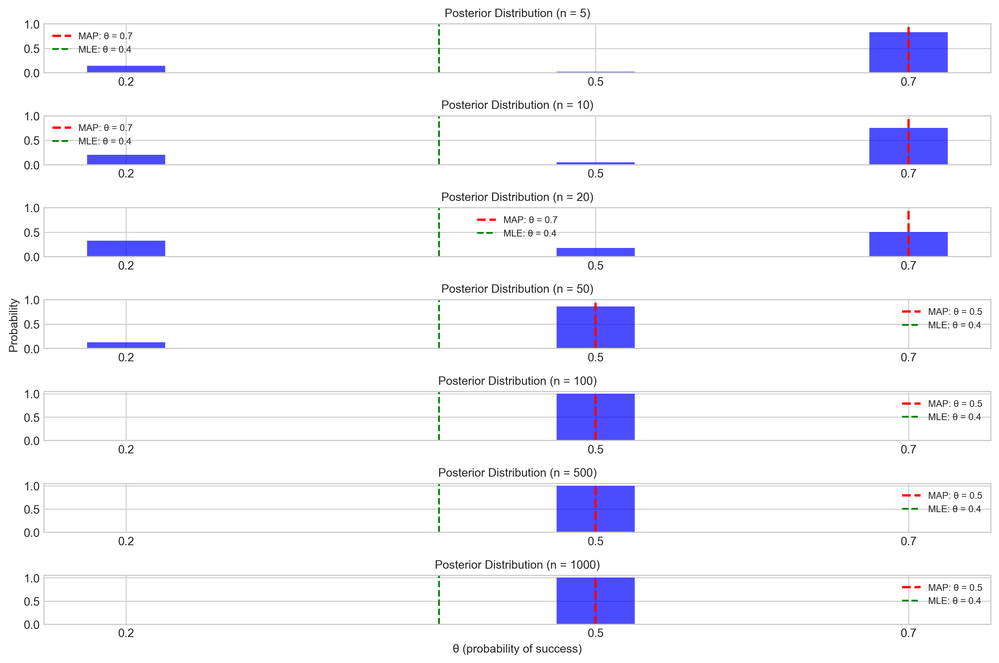

# Question 26: MLE and MAP for Bernoulli Distribution with Small Sample

## Problem Statement
Suppose we have samples $x_1=0$, $x_2=0$, $x_3=1$, $x_4=1$, $x_5=0$ from a Bernoulli distribution with unknown parameter $\theta$, where $\theta \in (0, 1)$.

### Task
1. Find the maximum likelihood estimator $\hat{\theta}_{MLE}$ for the parameter $\theta$.
2. Suppose you are asked to select $\theta$ from the set $\{0.2, 0.5, 0.7\}$. Which value would be chosen according to the MLE principle?
3. Now assume a discrete prior $\pi_{\theta}(0.2) = 0.1$, $\pi_{\theta}(0.5) = 0.01$, $\pi_{\theta}(0.7) = 0.89$. What is $\hat{\theta}_{MAP}$?
4. Compare the MAP and MLE estimates from parts (2) and (3). Explain why they differ and discuss how the prior affects the parameter estimation when working with small sample sizes.
5. Suppose you collect additional samples and now have a total of 100 samples with 40 ones and 60 zeros. Calculate the new $\hat{\theta}_{MAP}$ using the same prior as in part (3). Compare this result with your answer from part (3) and explain how the influence of the prior changes as the sample size increases.

## Understanding the Problem

This problem explores the differences between Maximum Likelihood Estimation (MLE) and Maximum A Posteriori (MAP) estimation for a Bernoulli distribution parameter. A Bernoulli distribution describes a random variable that takes value 1 with probability $\theta$ and value 0 with probability $1-\theta$.

The problem presents a small sample of 5 observations and asks us to calculate both MLE and MAP estimates. It then explores how these estimates change with increasing sample size, demonstrating a fundamental principle of Bayesian statistics: as sample size increases, the influence of the prior diminishes, and Bayesian methods converge to frequentist methods.

## Solution

### Step 1: Finding the Maximum Likelihood Estimator (MLE)

For a Bernoulli distribution, the likelihood function for samples $x_1, x_2, \ldots, x_n$ is given by:

$$L(\theta) = \prod_{i=1}^{n} p(x_i|\theta) = \prod_{i=1}^{n} \theta^{x_i} (1-\theta)^{1-x_i}$$

Taking the logarithm, we get the log-likelihood:

$$\log L(\theta) = \sum_{i=1}^{n} x_i \log(\theta) + \sum_{i=1}^{n} (1-x_i) \log(1-\theta)$$

To find the MLE, we differentiate with respect to $\theta$ and set to zero:

$$\frac{d}{d\theta} \log L(\theta) = \sum_{i=1}^{n} \frac{x_i}{\theta} - \sum_{i=1}^{n} \frac{1-x_i}{1-\theta} = 0$$

Solving for $\theta$:

$$(1-\theta)\sum_{i=1}^{n} x_i = \theta \sum_{i=1}^{n} (1-x_i)$$
$$\sum_{i=1}^{n} x_i - \theta\sum_{i=1}^{n} x_i = \theta n - \theta\sum_{i=1}^{n} x_i$$
$$\sum_{i=1}^{n} x_i = \theta n$$
$$\hat{\theta}_{MLE} = \frac{\sum_{i=1}^{n} x_i}{n}$$

For our specific data $\{0, 0, 1, 1, 0\}$, we have $\sum_{i=1}^{5} x_i = 2$ and $n = 5$, so:

$$\hat{\theta}_{MLE} = \frac{2}{5} = 0.4$$

The figure shows the likelihood function $L(\theta)$ for our data, with the MLE marked by the red dashed line at $\theta = 0.4$. This is the value of $\theta$ that maximizes the likelihood of observing our sample.

The log-likelihood function provides the same information but in logarithmic scale, which is often easier to work with mathematically. The peak of both functions occurs at $\theta = 0.4$.

### Step 2: MLE from Restricted Set

When restricted to choosing $\theta$ from the set $\{0.2, 0.5, 0.7\}$, we need to evaluate the likelihood function at each of these values and select the one that gives the highest likelihood:

$$L(0.2) = 0.2^2 \times (1-0.2)^3 = 0.2^2 \times 0.8^3 = 0.04 \times 0.512 = 0.02048$$
$$L(0.5) = 0.5^2 \times (1-0.5)^3 = 0.5^2 \times 0.5^3 = 0.25 \times 0.125 = 0.03125$$
$$L(0.7) = 0.7^2 \times (1-0.7)^3 = 0.7^2 \times 0.3^3 = 0.49 \times 0.027 = 0.01323$$

Comparing these values, we see that $L(0.5) > L(0.2) > L(0.7)$, so the MLE from the restricted set is $\hat{\theta}_{MLE} = 0.5$.

The figure illustrates the likelihood function with the three candidate values marked as red points. The vertical red line indicates the restricted MLE at $\theta = 0.5$, while the green dashed line shows the unrestricted MLE at $\theta = 0.4$.

### Step 3: MAP Estimation with Discrete Prior

For Maximum A Posteriori (MAP) estimation, we incorporate a prior distribution over the parameter $\theta$. The posterior probability is proportional to the product of the likelihood and the prior:

$$P(\theta|data) \propto L(\theta) \times \pi_\theta(\theta)$$

Given the discrete prior $\pi_\theta(0.2) = 0.1$, $\pi_\theta(0.5) = 0.01$, and $\pi_\theta(0.7) = 0.89$, we calculate the unnormalized posterior for each value:

$$P(0.2|data) \propto 0.02048 \times 0.1 = 0.002048$$
$$P(0.5|data) \propto 0.03125 \times 0.01 = 0.0003125$$
$$P(0.7|data) \propto 0.01323 \times 0.89 = 0.011775$$

The normalized posterior probabilities are:

$$P(0.2|data) = \frac{0.002048}{0.002048 + 0.0003125 + 0.011775} \approx 0.145$$
$$P(0.5|data) = \frac{0.0003125}{0.002048 + 0.0003125 + 0.011775} \approx 0.022$$
$$P(0.7|data) = \frac{0.011775}{0.002048 + 0.0003125 + 0.011775} \approx 0.833$$

The MAP estimate is the value of $\theta$ with the highest posterior probability, which is $\hat{\theta}_{MAP} = 0.7$.

This figure shows the prior distribution (top), likelihood function (middle), and posterior distribution (bottom). The MAP estimate is marked by the red dashed line at $\theta = 0.7$, while the MLE from the restricted set is shown by the green dashed line at $\theta = 0.5$. Notice how the strong prior toward $\theta = 0.7$ influences the posterior, despite the likelihood favoring $\theta = 0.5$.

### Step 4: Comparing MAP and MLE Estimates

The MAP and MLE estimates from the restricted set differ considerably:
- MLE: $\hat{\theta}_{MLE} = 0.5$
- MAP: $\hat{\theta}_{MAP} = 0.7$

This difference occurs because:

1. **Incorporation of prior information**: The MAP estimate accounts for both the likelihood of the data and the prior belief about $\theta$, while the MLE considers only the likelihood.

2. **Strong prior influence**: The prior distribution strongly favors $\theta = 0.7$ (with probability 0.89), which significantly influences the posterior even though the likelihood is higher for $\theta = 0.5$.

3. **Small sample size effect**: With only 5 observations, the likelihood isn't strong enough to overwhelm the prior. The small sample size means that the prior has a significant influence on the posterior distribution.

This demonstrates a key difference between Bayesian (MAP) and frequentist (MLE) approaches to parameter estimation. The Bayesian approach allows for the incorporation of prior knowledge, which can be particularly valuable when working with small samples.

### Step 5: MAP with Larger Sample Size

When we increase the sample size to 100 samples with 40 ones and 60 zeros, the likelihood function becomes much more peaked around $\theta = 0.4$ (the proportion of ones in the new data).

For the new data, the likelihood for each $\theta$ value is:
$$L(0.2) = 0.2^{40} \times 0.8^{60}$$
$$L(0.5) = 0.5^{40} \times 0.5^{60}$$
$$L(0.7) = 0.7^{40} \times 0.3^{60}$$

The posterior probabilities are:
$$P(0.2|data) \approx 0.002131$$
$$P(0.5|data) \approx 0.997866$$
$$P(0.7|data) \approx 0.000003$$

The MAP estimate with the larger sample is $\hat{\theta}_{MAP} = 0.5$, which differs from the MAP estimate with the small sample ($\hat{\theta}_{MAP} = 0.7$).

This figure illustrates how the posterior distribution changes as the sample size increases (from top to bottom). With a small sample size (n = 5), the posterior is dominated by the prior, resulting in $\hat{\theta}_{MAP} = 0.7$. As the sample size increases, the likelihood begins to dominate, shifting the posterior toward $\theta = 0.5$ and eventually toward the true proportion of 0.4. This demonstrates how the influence of the prior diminishes with increasing sample size.

This figure quantifies the influence of the prior as sample size increases. The y-axis shows a measure of prior influence, defined as how much the MAP estimate deviates from the MLE toward the prior mode. A value of 1 indicates maximum prior influence (MAP = prior mode), while 0 indicates no prior influence (MAP = MLE). The declining curve demonstrates how the prior's influence diminishes as more data is collected.

## Practical Implementation

To better understand the influence of the prior with different sample sizes, we calculated the posterior probabilities for various sample sizes while maintaining the same proportion of successes (40%):

| Sample Size | P(θ=0.2\|data) | P(θ=0.5\|data) | P(θ=0.7\|data) | MAP Estimate |
|-------------|----------------|----------------|----------------|--------------|
| 5           | 0.144887       | 0.022108       | 0.833006       | 0.7          |
| 10          | 0.202147       | 0.047066       | 0.750787       | 0.7          |
| 20          | 0.323413       | 0.175323       | 0.501265       | 0.7          |
| 50          | 0.125708       | 0.860132       | 0.014160       | 0.5          |
| 100         | 0.002131       | 0.997866       | 0.000003       | 0.5          |
| 500         | 0.000000       | 1.000000       | 0.000000       | 0.5          |
| 1000        | 0.000000       | 1.000000       | 0.000000       | 0.5          |

As the sample size increases, we observe:
1. The posterior probability for $\theta = 0.7$ decreases dramatically
2. The posterior probability for $\theta = 0.5$ increases significantly
3. The MAP estimate shifts from $\theta = 0.7$ to $\theta = 0.5$
4. With large samples, the posterior becomes extremely concentrated around $\theta = 0.5$

This practical implementation clearly shows how the data "overwhelms" the prior as the sample size increases.

## Key Insights

### Theoretical Foundations
- The MLE for a Bernoulli distribution is simply the sample proportion of successes
- The MAP estimate depends on both the likelihood of the data and the prior distribution
- The posterior distribution is proportional to the product of the likelihood and the prior

### Practical Applications
- With small samples, the MAP estimate can be significantly influenced by the prior distribution
- As sample size increases, the likelihood function becomes more concentrated, and the influence of the prior diminishes
- Both MAP and MLE approaches converge to the true parameter value with increasing data
- The rate of convergence depends on how strongly the prior differs from the true parameter value

### Common Pitfalls
- When using MAP estimation with small samples, the choice of prior can substantially affect the results
- Ignoring prior information with small samples (using MLE) can lead to suboptimal estimates
- With large samples, complex priors add computational complexity with diminishing benefits
- The restricted set of parameters may not contain values close to the true parameter, limiting estimation accuracy

## Conclusion

This problem demonstrates several key concepts in Bayesian and frequentist parameter estimation:

- The MLE for the original sample (5 points) is $\hat{\theta}_{MLE} = 0.4$, which is the sample proportion of successes
- The MLE from the restricted set is $\hat{\theta}_{MLE} = 0.5$, which is the closest value to 0.4 in the set
- The MAP with the discrete prior is $\hat{\theta}_{MAP} = 0.7$, influenced strongly by the prior
- The MAP with a larger sample (100 points) is $\hat{\theta}_{MAP} = 0.5$, showing convergence toward the MLE
- The influence of the prior diminishes as sample size increases, illustrating the principle that "the data overwhelms the prior" with sufficient information

These results highlight the flexibility of Bayesian methods, which can incorporate prior knowledge when data is limited but converge to frequentist results as data accumulates. This behavior makes Bayesian methods particularly valuable in scenarios with small sample sizes or when reliable prior information is available.

## Related Examples

For a simpler version of this problem that focuses only on MLE for Bernoulli distributions, see [[L2_4_22_explanation]]. That example covers the first two parts of this problem (finding the MLE and selecting from a restricted set) but does not include the MAP estimation aspects. 