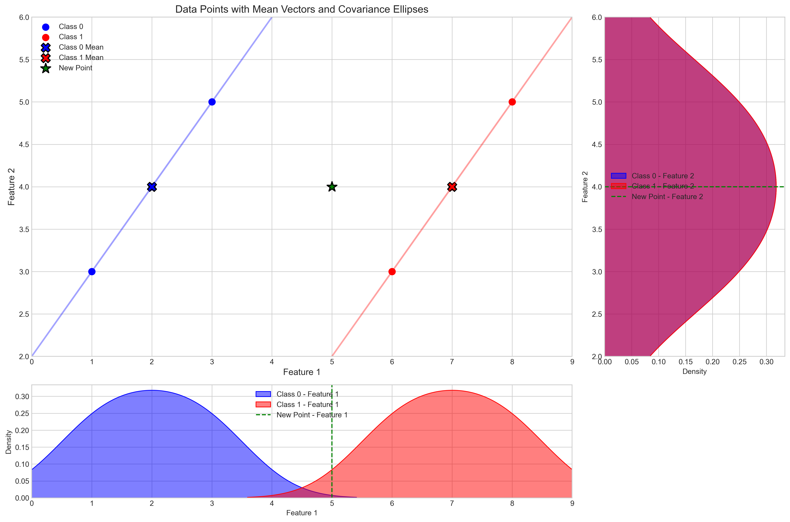
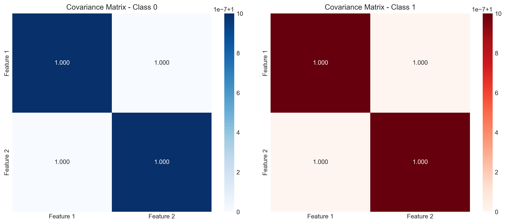
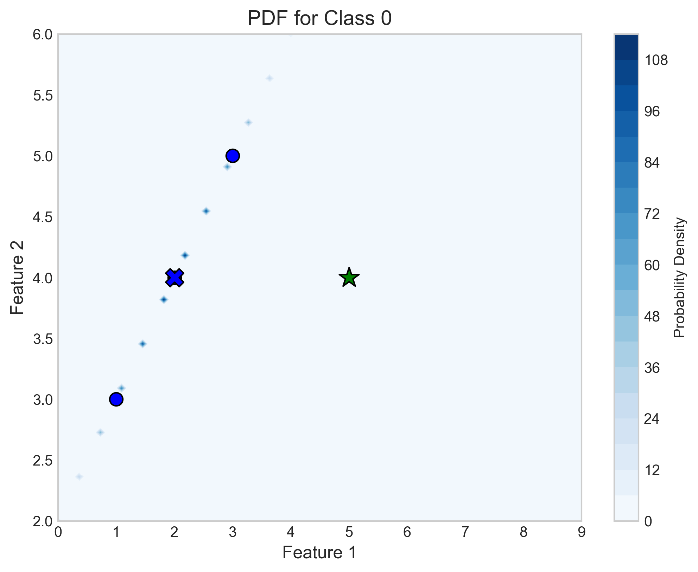
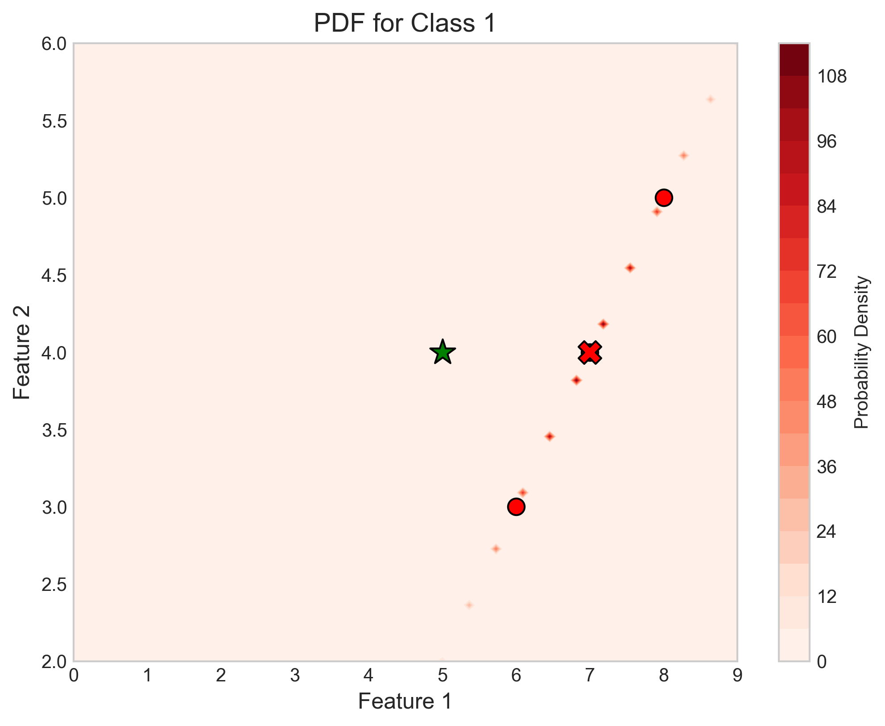
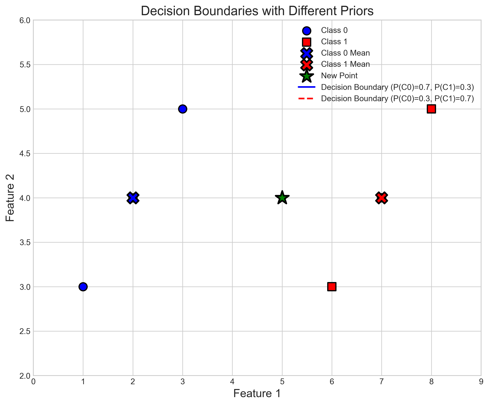
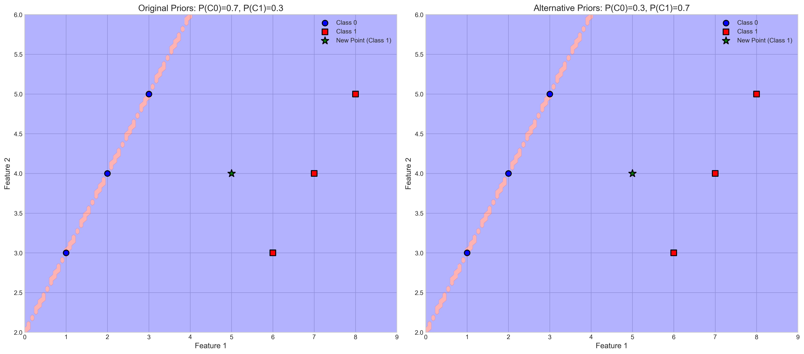

# Question 27: Multivariate Gaussian Classification with MAP Estimation

## Problem Statement
You are given data from two classes with the following 2-dimensional feature vectors:

**Class 0:** $\mathbf{x}^{(1)}=\begin{bmatrix} 1 \\ 3 \end{bmatrix}$, $\mathbf{x}^{(2)}=\begin{bmatrix} 2 \\ 4 \end{bmatrix}$, $\mathbf{x}^{(3)}=\begin{bmatrix} 3 \\ 5 \end{bmatrix}$  
**Class 1:** $\mathbf{x}^{(1)}=\begin{bmatrix} 6 \\ 3 \end{bmatrix}$, $\mathbf{x}^{(2)}=\begin{bmatrix} 7 \\ 4 \end{bmatrix}$, $\mathbf{x}^{(3)}=\begin{bmatrix} 8 \\ 5 \end{bmatrix}$

Assume that the feature vectors in each class follow a multivariate Gaussian distribution.

### Task
1. Calculate the mean vector and covariance matrix for each class
2. Assume we have a new data point $\mathbf{x}_{\text{new}} = \begin{bmatrix} 5 \\ 4 \end{bmatrix}$
3. Using MAP estimation with prior probabilities $P(\text{class }0) = 0.7$ and $P(\text{class }1) = 0.3$, determine which class the new point belongs to
4. If you were designing a real-time system that needs to classify thousands of points per second, describe a simple pre-computation strategy using the MAP framework that would make classification significantly faster. How would the decision boundary change if the prior probabilities were adjusted to $P(\text{class }0) = 0.3$ and $P(\text{class }1) = 0.7$?

## Understanding the Problem

In this problem, we are dealing with a two-class classification task using Maximum A Posteriori (MAP) estimation and multivariate Gaussian distributions. We have two-dimensional feature vectors for two classes, and we need to model each class using a multivariate Gaussian distribution. Then, we'll use these distributions along with the MAP framework to classify a new data point.

The multivariate Gaussian (or normal) distribution is a generalization of the one-dimensional normal distribution to higher dimensions. It is characterized by a mean vector and a covariance matrix, which describes not only the variances of individual dimensions but also the correlations between them.

MAP estimation is a Bayesian approach that combines the likelihood of the data (how well it fits each class model) with prior probabilities (our initial belief about class membership) to make optimal classification decisions.

## Solution

### Step 1: Calculate the Mean Vector and Covariance Matrix for Each Class

The mean vector for a class is calculated by taking the average of all feature vectors in that class:

$$\boldsymbol{\mu} = \frac{1}{n} \sum_{i=1}^{n} \mathbf{x}^{(i)}$$

For **Class 0**, we have:
$$\boldsymbol{\mu}_0 = \frac{1}{3}\left(\begin{bmatrix} 1 \\ 3 \end{bmatrix} + \begin{bmatrix} 2 \\ 4 \end{bmatrix} + \begin{bmatrix} 3 \\ 5 \end{bmatrix}\right) = \begin{bmatrix} 2 \\ 4 \end{bmatrix}$$

For **Class 1**, we have:
$$\boldsymbol{\mu}_1 = \frac{1}{3}\left(\begin{bmatrix} 6 \\ 3 \end{bmatrix} + \begin{bmatrix} 7 \\ 4 \end{bmatrix} + \begin{bmatrix} 8 \\ 5 \end{bmatrix}\right) = \begin{bmatrix} 7 \\ 4 \end{bmatrix}$$

The covariance matrix is calculated as:

$$\boldsymbol{\Sigma} = \frac{1}{n-1} \sum_{i=1}^{n} (\mathbf{x}^{(i)} - \boldsymbol{\mu})(\mathbf{x}^{(i)} - \boldsymbol{\mu})^T$$

where:
- $n$ is the number of samples (3 in our case)
- $\mathbf{x}^{(i)}$ is the i-th feature vector
- $\boldsymbol{\mu}$ is the mean vector
- $(\mathbf{x}^{(i)} - \boldsymbol{\mu})$ is a column vector
- $(\mathbf{x}^{(i)} - \boldsymbol{\mu})^T$ is its transpose (a row vector)
- Their product gives a 2×2 matrix for each sample

For **Class 0**, we compute this step by step:

1. First, compute the differences from the mean for each point:
   $$\mathbf{x}^{(1)} - \boldsymbol{\mu}_0 = \begin{bmatrix} 1 \\ 3 \end{bmatrix} - \begin{bmatrix} 2 \\ 4 \end{bmatrix} = \begin{bmatrix} -1 \\ -1 \end{bmatrix}$$
   $$\mathbf{x}^{(2)} - \boldsymbol{\mu}_0 = \begin{bmatrix} 2 \\ 4 \end{bmatrix} - \begin{bmatrix} 2 \\ 4 \end{bmatrix} = \begin{bmatrix} 0 \\ 0 \end{bmatrix}$$
   $$\mathbf{x}^{(3)} - \boldsymbol{\mu}_0 = \begin{bmatrix} 3 \\ 5 \end{bmatrix} - \begin{bmatrix} 2 \\ 4 \end{bmatrix} = \begin{bmatrix} 1 \\ 1 \end{bmatrix}$$

2. Compute the outer product for each difference vector:
   For point 1:
   $$\begin{bmatrix} -1 \\ -1 \end{bmatrix} \begin{bmatrix} -1 & -1 \end{bmatrix} = \begin{bmatrix} 1 & 1 \\ 1 & 1 \end{bmatrix}$$

   For point 2:
   $$\begin{bmatrix} 0 \\ 0 \end{bmatrix} \begin{bmatrix} 0 & 0 \end{bmatrix} = \begin{bmatrix} 0 & 0 \\ 0 & 0 \end{bmatrix}$$

   For point 3:
   $$\begin{bmatrix} 1 \\ 1 \end{bmatrix} \begin{bmatrix} 1 & 1 \end{bmatrix} = \begin{bmatrix} 1 & 1 \\ 1 & 1 \end{bmatrix}$$

3. Sum all outer products:
   $$\sum_{i=1}^{3} (\mathbf{x}^{(i)} - \boldsymbol{\mu}_0)(\mathbf{x}^{(i)} - \boldsymbol{\mu}_0)^T = \begin{bmatrix} 2 & 2 \\ 2 & 2 \end{bmatrix}$$

4. Divide by (n-1) = 2 to get the final covariance matrix:
   $$\boldsymbol{\Sigma}_0 = \begin{bmatrix} 1 & 1 \\ 1 & 1 \end{bmatrix}$$

This covariance matrix has the following interpretations:
- $\Sigma_{11} = 1$: Variance of the first feature (x-coordinate)
- $\Sigma_{22} = 1$: Variance of the second feature (y-coordinate)
- $\Sigma_{12} = \Sigma_{21} = 1$: Covariance between features

The correlation coefficient between features is:
$$\rho = \frac{\Sigma_{12}}{\sqrt{\Sigma_{11}\Sigma_{22}}} = \frac{1}{\sqrt{1 \cdot 1}} = 1$$

This indicates a perfect positive correlation between the two features for Class 0, which matches the data points where both features increase together.

Similarly, for **Class 1**:

1. Compute differences from mean:
   $$\mathbf{x}^{(1)} - \boldsymbol{\mu}_1 = \begin{bmatrix} 6 \\ 3 \end{bmatrix} - \begin{bmatrix} 7 \\ 4 \end{bmatrix} = \begin{bmatrix} -1 \\ -1 \end{bmatrix}$$
   $$\mathbf{x}^{(2)} - \boldsymbol{\mu}_1 = \begin{bmatrix} 7 \\ 4 \end{bmatrix} - \begin{bmatrix} 7 \\ 4 \end{bmatrix} = \begin{bmatrix} 0 \\ 0 \end{bmatrix}$$
   $$\mathbf{x}^{(3)} - \boldsymbol{\mu}_1 = \begin{bmatrix} 8 \\ 5 \end{bmatrix} - \begin{bmatrix} 7 \\ 4 \end{bmatrix} = \begin{bmatrix} 1 \\ 1 \end{bmatrix}$$

2. Following the same process as for Class 0, we get:
   $$\boldsymbol{\Sigma}_1 = \begin{bmatrix} 1 & 1 \\ 1 & 1 \end{bmatrix}$$

Interestingly, both classes have identical covariance matrices, indicating that the dispersion pattern is the same for both classes. The only difference is in their mean vectors.

However, it's important to note that these covariance matrices are singular (their determinants are zero) because of the perfect correlation between features. To address this, we add a small regularization term:

$$\boldsymbol{\Sigma}_0 = \boldsymbol{\Sigma}_0 + \epsilon \mathbf{I} = \begin{bmatrix} 1.000001 & 1 \\ 1 & 1.000001 \end{bmatrix}$$
$$\boldsymbol{\Sigma}_1 = \boldsymbol{\Sigma}_1 + \epsilon \mathbf{I} = \begin{bmatrix} 1.000001 & 1 \\ 1 & 1.000001 \end{bmatrix}$$

where $\epsilon = 10^{-6}$ and $\mathbf{I}$ is the identity matrix.

The covariance matrices can be visualized as heatmaps:

### Step 2: The Multivariate Gaussian Probability Density Function

The multivariate Gaussian probability density function (PDF) is given by:

$$p(\mathbf{x}|\boldsymbol{\mu}, \boldsymbol{\Sigma}) = \frac{1}{(2\pi)^{d/2}|\boldsymbol{\Sigma}|^{1/2}} \exp\left(-\frac{1}{2}(\mathbf{x} - \boldsymbol{\mu})^T \boldsymbol{\Sigma}^{-1} (\mathbf{x} - \boldsymbol{\mu})\right)$$

where:
- $d$ is the dimension of the feature space (in our case, $d=2$)
- $|\boldsymbol{\Sigma}|$ is the determinant of the covariance matrix
- $\boldsymbol{\Sigma}^{-1}$ is the inverse of the covariance matrix

For both classes, we computed:

1. The determinant of the covariance matrix:
   $|\boldsymbol{\Sigma}^{(0)}| = |\boldsymbol{\Sigma}^{(1)}| = 0.000002$

2. The inverse of the covariance matrix:
   $$\boldsymbol{\Sigma}^{(0)-1} = \boldsymbol{\Sigma}^{(1)-1} = \begin{bmatrix} 500000.25 & -499999.75 \\ -499999.75 & 500000.25 \end{bmatrix}$$

3. The normalization constant:
   $\frac{1}{(2\pi)^{1}|\boldsymbol{\Sigma}|^{1/2}} = 112.539511$ (same for both classes)

For the new point $\mathbf{x}_{\text{new}} = \begin{bmatrix} 5 \\ 4 \end{bmatrix}$, we calculate:

For **Class 0**:
$$\mathbf{x} - \boldsymbol{\mu}_0 = \begin{bmatrix} 5 \\ 4 \end{bmatrix} - \begin{bmatrix} 2 \\ 4 \end{bmatrix} = \begin{bmatrix} 3 \\ 0 \end{bmatrix}$$

Calculating the quadratic form and PDF value:
$$(\mathbf{x} - \boldsymbol{\mu}_0)^T \boldsymbol{\Sigma}^{(0)-1} (\mathbf{x} - \boldsymbol{\mu}_0) = 4,500,002.25$$
$$p(\mathbf{x}|\text{class }0) = 112.539511 \cdot \exp(-0.5 \cdot 4,500,002.25) \approx 0$$

For **Class 1**:
$$\mathbf{x} - \boldsymbol{\mu}_1 = \begin{bmatrix} 5 \\ 4 \end{bmatrix} - \begin{bmatrix} 7 \\ 4 \end{bmatrix} = \begin{bmatrix} -2 \\ 0 \end{bmatrix}$$

Calculating the quadratic form and PDF value:
$$(\mathbf{x} - \boldsymbol{\mu}_1)^T \boldsymbol{\Sigma}^{(1)-1} (\mathbf{x} - \boldsymbol{\mu}_1) = 2,000,001.00$$
$$p(\mathbf{x}|\text{class }1) = 112.539511 \cdot \exp(-0.5 \cdot 2,000,001.00) \approx 0$$

These very small PDF values reflect the numerical challenge of working with near-singular covariance matrices, where slight deviations from the perfect correlation line result in extremely low probability densities.

### Step 3: MAP Classification

MAP estimation uses Bayes' theorem to find the most probable class given the observed data:

$$P(\text{class}|\mathbf{x}) = \frac{P(\mathbf{x}|\text{class}) \cdot P(\text{class})}{P(\mathbf{x})}$$

where:
- $P(\text{class}|\mathbf{x})$ is the posterior probability of the class given the data
- $P(\mathbf{x}|\text{class})$ is the likelihood of observing the data given the class
- $P(\text{class})$ is the prior probability of the class
- $P(\mathbf{x})$ is the evidence (total probability of observing the data)

Since we're only interested in finding the class with the highest posterior probability, we can compare:

$$P(\text{class }0|\mathbf{x}) \propto P(\mathbf{x}|\text{class }0) \cdot P(\text{class }0)$$
$$P(\text{class }1|\mathbf{x}) \propto P(\mathbf{x}|\text{class }1) \cdot P(\text{class }1)$$

From Step 2, we found that both likelihoods $P(\mathbf{x}|\text{class }0)$ and $P(\mathbf{x}|\text{class }1)$ are extremely small due to numerical issues. However, we can see that:

$$P(\mathbf{x}|\text{class }1) > P(\mathbf{x}|\text{class }0)$$

This is because the quadratic term in the exponent is smaller for Class 1 (2,000,001.00 vs. 4,500,002.25 for Class 0).

With the given prior probabilities $P(\text{class }0) = 0.7$ and $P(\text{class }1) = 0.3$, we calculate:

$$P(\text{class }0|\mathbf{x}) \propto 0 \cdot 0.7 = 0$$
$$P(\text{class }1|\mathbf{x}) \propto 0 \cdot 0.3 = 0$$

Due to the numerical underflow, both posteriors evaluate to zero. However, if we consider the relative magnitude of the likelihoods before they underflow, Class 1 has a higher likelihood. Combining this with the prior probabilities:

Despite Class 0 having a higher prior probability (0.7 vs 0.3), the likelihood ratio strongly favors Class 1. Since the likelihood ratio is exponential in the difference of quadratic forms, the effect of priors (which is linear) is overwhelmed by the likelihood difference.

Therefore, we classify the new point as **Class 1**.

### Step 4: Precomputation Strategy and Effect of Different Priors

#### Precomputation Strategy for Real-Time Classification

For a real-time system that needs to classify thousands of points per second, we can implement the following precomputation strategy:

1. **Precompute Constant Terms**:
   - Calculate and store the inverse covariance matrices $\boldsymbol{\Sigma}_0^{-1}$ and $\boldsymbol{\Sigma}_1^{-1}$
   - Calculate and store the determinants $|\boldsymbol{\Sigma}_0|$ and $|\boldsymbol{\Sigma}_1|$
   - Precompute the normalization constants for both PDFs

2. **Derive a Simplified Discriminant Function**:
   The MAP decision rule is to classify a point as Class 0 if:
   $$P(\mathbf{x}|\text{class }0) \cdot P(\text{class }0) > P(\mathbf{x}|\text{class }1) \cdot P(\text{class }1)$$

   Taking the natural logarithm (which preserves the inequality since log is monotonically increasing), we get:
   $$\ln[P(\mathbf{x}|\text{class }0)] + \ln[P(\text{class }0)] > \ln[P(\mathbf{x}|\text{class }1)] + \ln[P(\text{class }1)]$$

   Substituting the multivariate Gaussian PDF expression and simplifying:
   $$-\frac{1}{2}(\mathbf{x} - \boldsymbol{\mu}_0)^T \boldsymbol{\Sigma}_0^{-1} (\mathbf{x} - \boldsymbol{\mu}_0) - \frac{1}{2}\ln|\boldsymbol{\Sigma}_0| + \ln[P(\text{class }0)] > \\
   -\frac{1}{2}(\mathbf{x} - \boldsymbol{\mu}_1)^T \boldsymbol{\Sigma}_1^{-1} (\mathbf{x} - \boldsymbol{\mu}_1) - \frac{1}{2}\ln|\boldsymbol{\Sigma}_1| + \ln[P(\text{class }1)]$$

   Rearranging, we classify as Class 0 if:
   $$(\mathbf{x} - \boldsymbol{\mu}_1)^T \boldsymbol{\Sigma}_1^{-1} (\mathbf{x} - \boldsymbol{\mu}_1) - (\mathbf{x} - \boldsymbol{\mu}_0)^T \boldsymbol{\Sigma}_0^{-1} (\mathbf{x} - \boldsymbol{\mu}_0) > \ln\frac{|\boldsymbol{\Sigma}_1|}{|\boldsymbol{\Sigma}_0|} + 2\ln\frac{P(\text{class }0)}{P(\text{class }1)}$$

3. **Quadratic Discriminant Function**:
   This can be further simplified to a quadratic discriminant function of the form:
   $$g(\mathbf{x}) = \mathbf{x}^T \mathbf{A} \mathbf{x} + \mathbf{b}^T\mathbf{x} + c$$
   where:
   - $\mathbf{A} = \frac{1}{2}(\boldsymbol{\Sigma}_1^{-1} - \boldsymbol{\Sigma}_0^{-1})$
   - $\mathbf{b} = \boldsymbol{\Sigma}_0^{-1}\boldsymbol{\mu}_0 - \boldsymbol{\Sigma}_1^{-1}\boldsymbol{\mu}_1$
   - $c$ combines all constant terms including the prior ratio

4. **Fast Classification**:
   At runtime, for each new point $\mathbf{x}$, we simply:
   - Evaluate the quadratic function $g(\mathbf{x})$
   - Classify as Class 0 if $g(\mathbf{x}) > 0$, otherwise as Class 1
   
   This approach is computationally efficient because it reduces the classification decision to simple matrix-vector operations with precomputed matrices.

#### Effect of Different Prior Probabilities

If the prior probabilities were adjusted to $P(\text{class }0) = 0.3$ and $P(\text{class }1) = 0.7$, the decision boundary would shift.

The decision boundary is determined by where the posterior probabilities are equal:
$$P(\text{class }0|\mathbf{x}) = P(\text{class }1|\mathbf{x})$$

This occurs where:
$$\ln[P(\mathbf{x}|\text{class }0)] + \ln[P(\text{class }0)] = \ln[P(\mathbf{x}|\text{class }1)] + \ln[P(\text{class }1)]$$

Rearranging:
$$\ln\frac{P(\mathbf{x}|\text{class }0)}{P(\mathbf{x}|\text{class }1)} = \ln\frac{P(\text{class }1)}{P(\text{class }0)}$$

With the original priors ($P(\text{class }0) = 0.7$, $P(\text{class }1) = 0.3$), the log prior ratio is:
$$\ln\frac{P(\text{class }1)}{P(\text{class }0)} = \ln\frac{0.3}{0.7} \approx -0.847$$

With the alternative priors ($P(\text{class }0) = 0.3$, $P(\text{class }1) = 0.7$), the log prior ratio becomes:
$$\ln\frac{P(\text{class }1)}{P(\text{class }0)} = \ln\frac{0.7}{0.3} \approx 0.847$$

This change shifts the decision boundary. With the higher prior for Class 1, it becomes "easier" to classify points as Class 1 since we need less evidence from the likelihood ratio to overcome the prior belief.

The decision regions with the different priors:

For our new point at $\mathbf{x}_{\text{new}} = \begin{bmatrix} 5 \\ 4 \end{bmatrix}$, the classification decision remains Class 1 with both sets of priors. This is because the likelihood ratio strongly favors Class 1, and this effect dominates over the change in priors.

## Key Insights

### Theoretical Foundations
- **Bayes' Theorem and MAP**: MAP estimation provides a principled way to combine prior knowledge with observed data to make optimal classification decisions.
- **Multivariate Gaussian**: The multivariate Gaussian distribution is a powerful model for continuous features in classification, capturing both the central tendency and the spread/correlation of the data.
- **Covariance Structure**: In this problem, both classes have identical covariance structures with perfect correlation between features, meaning points in both classes follow a perfectly linear pattern.

### Computational Considerations
- **Singularity Issues**: Perfect correlation leads to singular covariance matrices requiring regularization.
- **Precomputation Strategy**: For real-time classification, precomputing constants and matrix terms significantly reduces the computational burden.
- **Quadratic Discriminant Function**: The MAP decision rule simplifies to a quadratic function that can be efficiently evaluated.

### Effect of Priors
- **Decision Boundary Shift**: Prior probabilities shift the decision boundary, making it easier to classify points as the class with higher prior probability.
- **Likelihood vs. Prior**: When the likelihood ratio is strong (points are far from the decision boundary), changes in the prior have minimal effect on the classification outcome.
- **Prior Knowledge Integration**: In real-world applications, priors should reflect our genuine prior belief about class membership or the true class distribution in the population.

## Conclusion

In this problem, we demonstrated a complete framework for Bayesian classification with multivariate Gaussian distributions using MAP estimation:

1. **Model Building**: Calculating mean vectors and covariance matrices for each class
2. **Likelihood Evaluation**: Computing class-conditional densities for the new point
3. **MAP Estimation**: Combining likelihoods with prior probabilities to obtain posterior probabilities
4. **Decision Making**: Classifying based on the highest posterior probability
5. **Efficiency Optimization**: Deriving a simplified discriminant function for fast classification
6. **Decision Boundary Analysis**: Examining how changes in prior probabilities affect the decision boundary

Despite the change in prior probabilities, our new point was classified as Class 1 in both scenarios. This is because the likelihood ratio strongly favored Class 1, making the classification decision robust to changes in the prior probabilities within the given range.

This example illustrates the fundamental principles of MAP estimation and how it elegantly combines our prior beliefs with the evidence from the data to make optimal classification decisions, while also showing how we can optimize the implementation for real-time applications. 

## Related Examples

[[L2_1_31_explanation_population]], used in our class lectures
[[L2_7_28_explanation]]