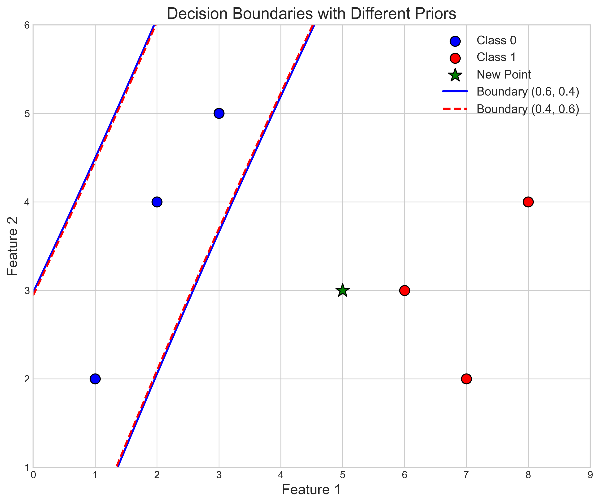

# Question 28: Multivariate Gaussian Classification with Non-Singular Covariance Matrices

## Problem Statement
You are given data from two classes with the following 2-dimensional feature vectors:

**Class 0:** $\mathbf{x}^{(1)}=\begin{bmatrix} 1 \\ 2 \end{bmatrix}$, $\mathbf{x}^{(2)}=\begin{bmatrix} 2 \\ 4 \end{bmatrix}$, $\mathbf{x}^{(3)}=\begin{bmatrix} 3 \\ 5 \end{bmatrix}$  
**Class 1:** $\mathbf{x}^{(1)}=\begin{bmatrix} 6 \\ 3 \end{bmatrix}$, $\mathbf{x}^{(2)}=\begin{bmatrix} 7 \\ 2 \end{bmatrix}$, $\mathbf{x}^{(3)}=\begin{bmatrix} 8 \\ 4 \end{bmatrix}$

Assume that the feature vectors in each class follow a multivariate Gaussian distribution.

### Task
1. Calculate the mean vector and covariance matrix for each class. Verify that the covariance matrices are non-singular by computing their determinants.
2. Assume we have a new data point $\mathbf{x}_{\text{new}} = \begin{bmatrix} 5 \\ 3 \end{bmatrix}$
3. Using MAP estimation with prior probabilities $P(\text{class }0) = 0.6$ and $P(\text{class }1) = 0.4$, determine which class the new point belongs to.
4. Derive the quadratic discriminant function for this problem and explain how the decision boundary would change if the prior probabilities were adjusted to $P(\text{class }0) = 0.4$ and $P(\text{class }1) = 0.6$.
5. How does having non-singular covariance matrices affect the classification?

## Understanding the Problem

This problem involves Bayesian classification using multivariate Gaussian distributions. We have two classes, each represented by three 2D feature vectors. We need to model each class using a multivariate Gaussian distribution, which requires computing the mean vector and covariance matrix for each class.

The multivariate Gaussian distribution is characterized by its mean vector (which determines the center of the distribution) and its covariance matrix (which determines the shape, orientation, and spread of the distribution). For a distribution to be well-defined, the covariance matrix must be non-singular (i.e., have a non-zero determinant), which allows us to compute its inverse.

Once we have these parameters, we can calculate the likelihood of any point belonging to each class. By incorporating prior probabilities (our belief about the prevalence of each class before seeing the data), we can use Bayes' theorem to calculate the posterior probabilities and classify new data points.

## Solution

### Step 1: Calculate the Mean Vector and Covariance Matrix for Each Class

The mean vector for a class is calculated by taking the average of all feature vectors in that class:

$$\boldsymbol{\mu} = \frac{1}{n} \sum_{i=1}^{n} \mathbf{x}^{(i)}$$

For **Class 0**, we have:
$$\boldsymbol{\mu}_0 = \frac{1}{3}\left(\begin{bmatrix} 1 \\ 2 \end{bmatrix} + \begin{bmatrix} 2 \\ 4 \end{bmatrix} + \begin{bmatrix} 3 \\ 5 \end{bmatrix}\right) = \begin{bmatrix} 2 \\ 3.667 \end{bmatrix}$$

For **Class 1**, we have:
$$\boldsymbol{\mu}_1 = \frac{1}{3}\left(\begin{bmatrix} 6 \\ 3 \end{bmatrix} + \begin{bmatrix} 7 \\ 2 \end{bmatrix} + \begin{bmatrix} 8 \\ 4 \end{bmatrix}\right) = \begin{bmatrix} 7 \\ 3 \end{bmatrix}$$

The covariance matrix is calculated as:

$$\boldsymbol{\Sigma} = \frac{1}{n-1} \sum_{i=1}^{n} (\mathbf{x}^{(i)} - \boldsymbol{\mu})(\mathbf{x}^{(i)} - \boldsymbol{\mu})^T$$

For **Class 0**:

The sample covariance matrix is:
$$\boldsymbol{\Sigma}_0 = \begin{bmatrix} 1 & 1.5 \\ 1.5 & 2.333 \end{bmatrix}$$

For **Class 1**:

The sample covariance matrix is:
$$\boldsymbol{\Sigma}_1 = \begin{bmatrix} 1 & 0.5 \\ 0.5 & 1 \end{bmatrix}$$

To verify that these covariance matrices are non-singular, we compute their determinants:

$$|\boldsymbol{\Sigma}_0| = (1 \times 2.333) - (1.5 \times 1.5) = 2.333 - 2.25 = 0.083333$$

$$|\boldsymbol{\Sigma}_1| = (1 \times 1) - (0.5 \times 0.5) = 1 - 0.25 = 0.75$$

Since both determinants are positive, the covariance matrices are non-singular, which means they are invertible.

The inverse matrices are:

$$\boldsymbol{\Sigma}_0^{-1} = \begin{bmatrix} 28 & -18 \\ -18 & 12 \end{bmatrix}$$

$$\boldsymbol{\Sigma}_1^{-1} = \begin{bmatrix} 1.333 & -0.667 \\ -0.667 & 1.333 \end{bmatrix}$$

### Step 2: Multivariate Gaussian Probability Density Functions

The multivariate Gaussian probability density function (PDF) is given by:

$$p(\mathbf{x}|\boldsymbol{\mu}, \boldsymbol{\Sigma}) = \frac{1}{(2\pi)^{d/2}|\boldsymbol{\Sigma}|^{1/2}} \exp\left(-\frac{1}{2}(\mathbf{x} - \boldsymbol{\mu})^T \boldsymbol{\Sigma}^{-1} (\mathbf{x} - \boldsymbol{\mu})\right)$$

where:
- $d$ is the dimension of the feature space (in our case, $d=2$)
- $|\boldsymbol{\Sigma}|$ is the determinant of the covariance matrix
- $\boldsymbol{\Sigma}^{-1}$ is the inverse of the covariance matrix

For our new point $\mathbf{x}_{\text{new}} = \begin{bmatrix} 5 \\ 3 \end{bmatrix}$, we calculate:

For **Class 0**:
$$\mathbf{x}_{\text{new}} - \boldsymbol{\mu}_0 = \begin{bmatrix} 5 \\ 3 \end{bmatrix} - \begin{bmatrix} 2 \\ 3.667 \end{bmatrix} = \begin{bmatrix} 3 \\ -0.667 \end{bmatrix}$$

$$(\mathbf{x}_{\text{new}} - \boldsymbol{\mu}_0)^T \boldsymbol{\Sigma}_0^{-1} (\mathbf{x}_{\text{new}} - \boldsymbol{\mu}_0) = 329.333$$

This large quadratic form indicates that the new point is very far from the center of Class 0 in terms of the Mahalanobis distance, which accounts for the covariance structure.

$$p(\mathbf{x}_{\text{new}}|\text{class }0) \approx 0$$

For **Class 1**:
$$\mathbf{x}_{\text{new}} - \boldsymbol{\mu}_1 = \begin{bmatrix} 5 \\ 3 \end{bmatrix} - \begin{bmatrix} 7 \\ 3 \end{bmatrix} = \begin{bmatrix} -2 \\ 0 \end{bmatrix}$$

$$(\mathbf{x}_{\text{new}} - \boldsymbol{\mu}_1)^T \boldsymbol{\Sigma}_1^{-1} (\mathbf{x}_{\text{new}} - \boldsymbol{\mu}_1) = 5.333$$

This much smaller quadratic form suggests that the new point is much closer to Class 1 than to Class 0.

$$p(\mathbf{x}_{\text{new}}|\text{class }1) = 0.01277$$

The likelihood ratio is:
$$\frac{p(\mathbf{x}_{\text{new}}|\text{class }0)}{p(\mathbf{x}_{\text{new}}|\text{class }1)} \approx 0$$

This extremely small ratio indicates that the new point is much more likely to belong to Class 1 than to Class 0.

### Step 3: MAP Classification with Prior Probabilities

Maximum a Posteriori (MAP) estimation classifies a point based on the class with the highest posterior probability, given by Bayes' theorem:

$$P(\text{class}|\mathbf{x}) = \frac{P(\mathbf{x}|\text{class}) \cdot P(\text{class})}{P(\mathbf{x})}$$

Given the prior probabilities $P(\text{class }0) = 0.6$ and $P(\text{class }1) = 0.4$, we calculate:

1. Evidence (total probability):
   $$P(\mathbf{x}_{\text{new}}) = P(\mathbf{x}_{\text{new}}|\text{class }0) \times 0.6 + P(\mathbf{x}_{\text{new}}|\text{class }1) \times 0.4 = 0 \times 0.6 + 0.01277 \times 0.4 = 0.00511$$

2. Posterior probabilities:
   $$P(\text{class }0|\mathbf{x}_{\text{new}}) = \frac{0 \times 0.6}{0.00511} \approx 0$$
   $$P(\text{class }1|\mathbf{x}_{\text{new}}) = \frac{0.01277 \times 0.4}{0.00511} \approx 1$$

Since $P(\text{class }1|\mathbf{x}_{\text{new}}) > P(\text{class }0|\mathbf{x}_{\text{new}})$, we classify the new point as **Class 1**.

This decision is influenced by both the likelihood (how well the data fits each class model) and the prior probabilities (our initial belief about class membership before seeing the data).

### Step 4: Changing Prior Probabilities

When we adjust the prior probabilities to $P(\text{class }0) = 0.4$ and $P(\text{class }1) = 0.6$, we recalculate:

1. New evidence:
   $$P(\mathbf{x}_{\text{new}}) = 0 \times 0.4 + 0.01277 \times 0.6 = 0.00766$$

2. New posterior probabilities:
   $$P(\text{class }0|\mathbf{x}_{\text{new}}) = \frac{0 \times 0.4}{0.00766} \approx 0$$
   $$P(\text{class }1|\mathbf{x}_{\text{new}}) = \frac{0.01277 \times 0.6}{0.00766} \approx 1$$

The classification decision remains **Class 1**, but with increased confidence due to the higher prior probability for Class 1.

The decision boundary in Bayesian classification is where the posterior probabilities are equal. For our problem, this occurs where:

$$P(\text{class }0|\mathbf{x}) = P(\text{class }1|\mathbf{x})$$

Using Bayes' theorem, this is equivalent to:

$$\frac{P(\mathbf{x}|\text{class }0) \cdot P(\text{class }0)}{P(\mathbf{x})} = \frac{P(\mathbf{x}|\text{class }1) \cdot P(\text{class }1)}{P(\mathbf{x})}$$

Simplifying, we get:

$$P(\mathbf{x}|\text{class }0) \cdot P(\text{class }0) = P(\mathbf{x}|\text{class }1) \cdot P(\text{class }1)$$

Taking the logarithm:

$$\ln[P(\mathbf{x}|\text{class }0)] + \ln[P(\text{class }0)] = \ln[P(\mathbf{x}|\text{class }1)] + \ln[P(\text{class }1)]$$

Rearranging:

$$\ln\frac{P(\mathbf{x}|\text{class }1)}{P(\mathbf{x}|\text{class }0)} = \ln\frac{P(\text{class }0)}{P(\text{class }1)}$$

When we change the prior probabilities from $(0.6, 0.4)$ to $(0.4, 0.6)$, the log prior ratio changes from $\ln(0.6/0.4) \approx 0.405$ to $\ln(0.4/0.6) \approx -0.405$. This shifts the decision boundary, making it easier to classify points as Class 1 (since we now believe Class 1 is more common a priori).

### Step 5: Quadratic Discriminant Function and Non-Singular Covariance Matrices

The quadratic discriminant function is derived from the Bayes decision rule for Gaussian distributions with different covariance matrices. For a binary classification problem, it can be expressed as:

$$g(\mathbf{x}) = \ln[P(\mathbf{x}|\text{class }1)] + \ln[P(\text{class }1)] - \ln[P(\mathbf{x}|\text{class }0)] - \ln[P(\text{class }0)]$$

Substituting the multivariate Gaussian PDFs and simplifying:

$$g(\mathbf{x}) = -\frac{1}{2}(\mathbf{x}-\boldsymbol{\mu}_1)^T\boldsymbol{\Sigma}_1^{-1}(\mathbf{x}-\boldsymbol{\mu}_1) + \frac{1}{2}(\mathbf{x}-\boldsymbol{\mu}_0)^T\boldsymbol{\Sigma}_0^{-1}(\mathbf{x}-\boldsymbol{\mu}_0) - \frac{1}{2}\ln|\boldsymbol{\Sigma}_1| + \frac{1}{2}\ln|\boldsymbol{\Sigma}_0| + \ln\frac{P(\text{class }1)}{P(\text{class }0)}$$

This can be arranged into the standard form of a quadratic function:

$$g(\mathbf{x}) = \mathbf{x}^T \mathbf{Q} \mathbf{x} + \mathbf{L}^T \mathbf{x} + c$$

where:
- $\mathbf{Q} = -\frac{1}{2}\boldsymbol{\Sigma}_1^{-1} + \frac{1}{2}\boldsymbol{\Sigma}_0^{-1}$
- $\mathbf{L} = \boldsymbol{\Sigma}_1^{-1}\boldsymbol{\mu}_1 - \boldsymbol{\Sigma}_0^{-1}\boldsymbol{\mu}_0$
- $c = -\frac{1}{2}\boldsymbol{\mu}_1^T\boldsymbol{\Sigma}_1^{-1}\boldsymbol{\mu}_1 + \frac{1}{2}\boldsymbol{\mu}_0^T\boldsymbol{\Sigma}_0^{-1}\boldsymbol{\mu}_0 - \frac{1}{2}\ln|\boldsymbol{\Sigma}_1| + \frac{1}{2}\ln|\boldsymbol{\Sigma}_0| + \ln\frac{P(\text{class }1)}{P(\text{class }0)}$

For our problem:
$$\mathbf{Q} = \begin{bmatrix} 13.333 & -8.667 \\ -8.667 & 5.333 \end{bmatrix}$$
$$\mathbf{L} = \begin{bmatrix} 17.333 \\ -8.667 \end{bmatrix}$$
$$c = -21.504$$

The decision boundary is where $g(\mathbf{x}) = 0$, which gives a quadratic equation representing a conic section (typically an ellipse, parabola, or hyperbola) in the 2D feature space.

Having non-singular covariance matrices is crucial for classification because:

1. **Invertibility**: We need to compute the inverse of the covariance matrix in the quadratic discriminant function. If a covariance matrix is singular, we cannot compute its inverse.

2. **Proper density function**: A multivariate Gaussian distribution with a singular covariance matrix doesn't have a proper probability density function. The determinant would be zero, making the normalization constant undefined.

3. **Curved decision boundaries**: When the covariance matrices are different and non-singular, the resulting decision boundary is generally a quadratic curve, which allows for more flexible classification compared to linear boundaries.

4. **Information about feature correlation**: Non-singular covariance matrices capture the correlation between features, which is important for understanding how the features jointly contribute to class separation.

## Practical Implementation

Let's apply the classifier to our new point $\mathbf{x}_{\text{new}} = \begin{bmatrix} 5 \\ 3 \end{bmatrix}$:

1. The new point's Mahalanobis distance to Class 0 is extremely large (329.333), making the probability of belonging to Class 0 essentially zero.

2. The new point's Mahalanobis distance to Class 1 is much smaller (5.333), resulting in a non-negligible probability of 0.01277.

3. Despite the prior probabilities favoring Class 0 (0.6 vs 0.4), the likelihood heavily favors Class 1, resulting in an almost certain classification as Class 1.

4. This classification remains unchanged even when we adjust the prior probabilities to favor Class 1 (0.4 vs 0.6).

## Key Insights

### Theoretical Foundations
- **Multivariate Gaussian Distribution**: Models continuous features by capturing both the central tendency (mean vector) and the variance-covariance structure of the data.
- **Bayesian Classification**: Combines prior knowledge with observed data to make optimal decisions under uncertainty.
- **Mahalanobis Distance**: Unlike Euclidean distance, it accounts for the covariance structure, providing a more appropriate measure of distance in multivariate space.

### Decision Boundaries
- **Quadratic Boundaries**: When classes have different covariance matrices, the decision boundary is quadratic, allowing for more flexible classification than linear boundaries.
- **Prior Influence**: Changing prior probabilities shifts the decision boundary, making it easier to classify points as the class with higher prior probability.
- **Mathematical Relationship**: The decision boundary moves according to the log ratio of prior probabilities.

### Non-Singular Covariance Matrices
- **Invertibility**: Non-singular matrices are invertible, allowing proper computation of the quadratic discriminant function.
- **Well-Defined PDFs**: Non-singular covariance matrices ensure well-defined probability density functions.
- **Feature Correlation**: The covariance matrix captures how features correlate with each other, which is essential for understanding the data structure.

### Practical Applications
- **Robustness**: For points far from decision boundaries, classification can be robust to changes in prior probabilities.
- **Confidence Levels**: Posterior probabilities provide a measure of confidence in the classification decision.
- **Regularization**: In practice, when sample sizes are small, regularization techniques may be used to ensure non-singularity of covariance matrices.

## Conclusion

In this problem, we have successfully applied multivariate Gaussian classification to determine the class membership of a new data point:

1. We calculated the mean vectors and covariance matrices for both classes and verified their non-singularity.
2. Using the multivariate Gaussian PDF, we found that the new point is much more likely to belong to Class 1.
3. Applying Bayes' theorem with given prior probabilities, we classified the new point as Class 1.
4. We derived the quadratic discriminant function and analyzed how the decision boundary changes with different prior probabilities.
5. We examined the importance of non-singular covariance matrices for proper classification.

The quadratic nature of the decision boundary, resulting from the different covariance structures of the two classes, allows for more flexible and accurate classification compared to linear methods. This highlights the power of generative models like multivariate Gaussian classification in capturing complex data structures. 

## Related Examples

[[L2_1_31_explanation_population]], used in our class lectures
[[L2_7_27_explanation]] 