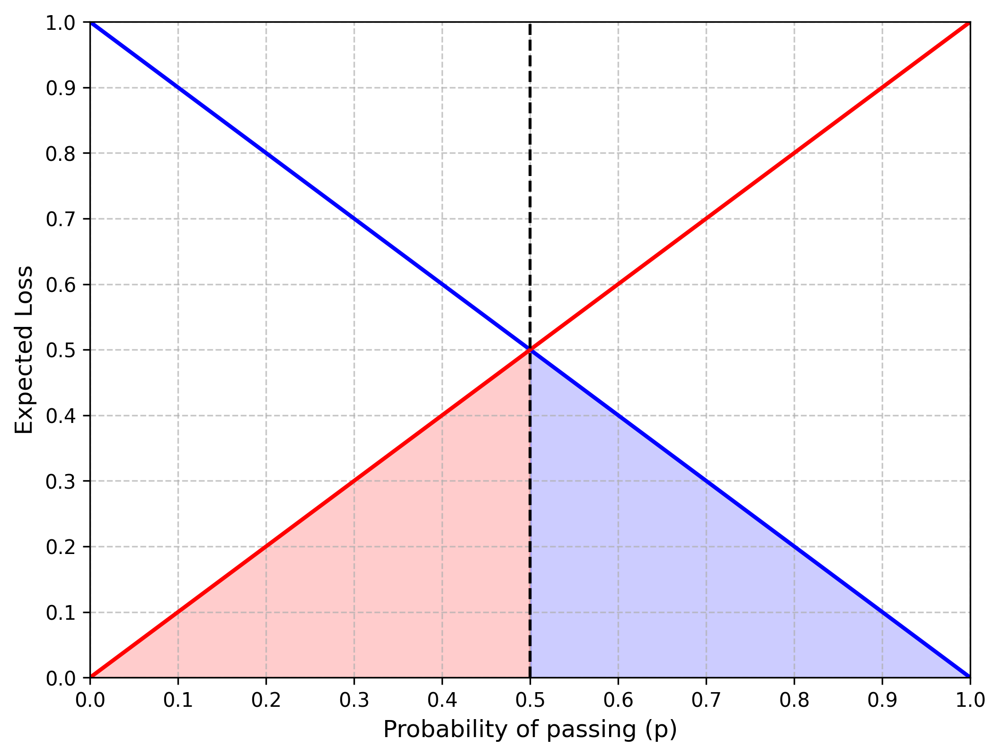
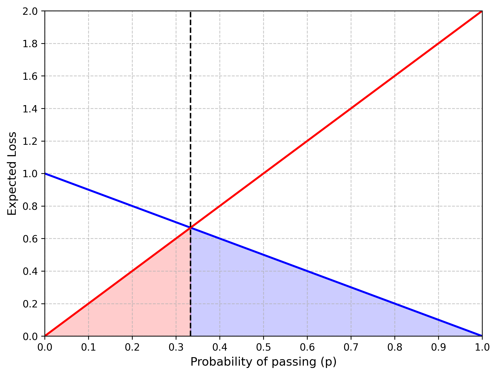
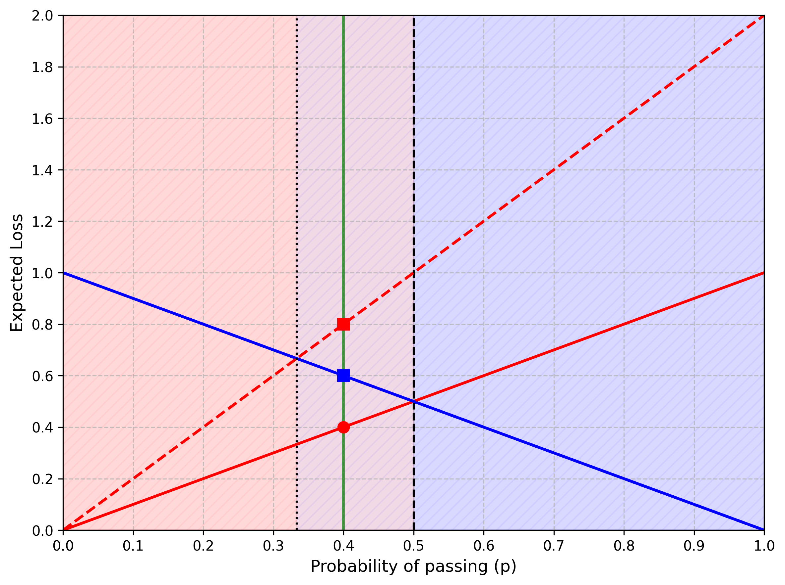
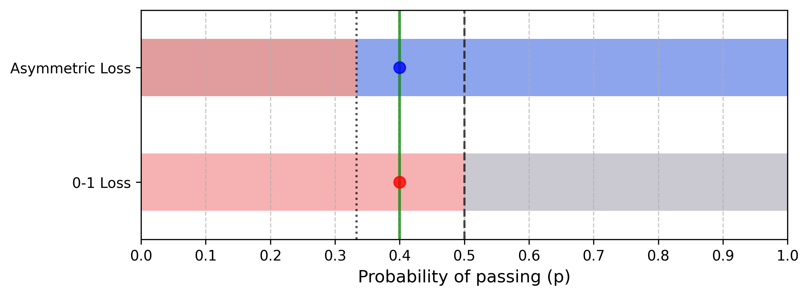
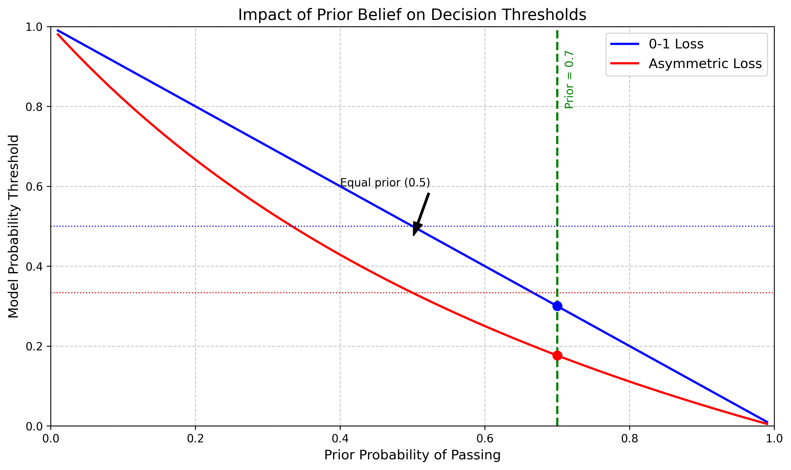
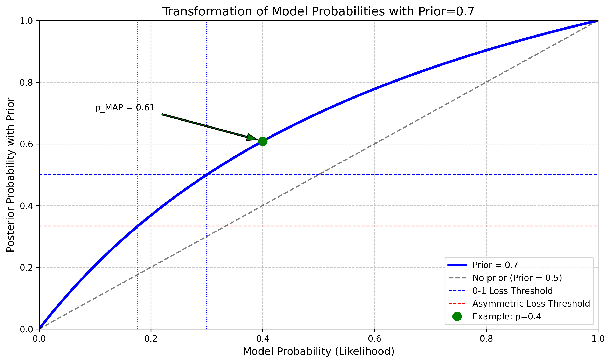

# Question 29: Minimizing Expected Loss in Classification

## Problem Statement
Consider a simple classification problem where we need to predict whether a student will pass (class 1) or fail (class 0) an exam based on their study hours. Our model produces a probability $p$ that the student will pass.

We can make decisions using different loss functions:
- 0-1 Loss: $L(y, \hat{y}) = \mathbf{1}(y \neq \hat{y})$ (equal penalty for all errors)
- Asymmetric Loss: $L(y, \hat{y}) = \begin{cases} 2 & \text{if } y=1, \hat{y}=0 \text{ (missed opportunity)} \\ 1 & \text{if } y=0, \hat{y}=1 \text{ (wasted effort)} \\ 0 & \text{if } y=\hat{y} \text{ (correct decision)} \end{cases}$

### Task
1. For the 0-1 loss function, derive the decision rule that minimizes the expected loss (Bayes risk). At what probability threshold should we predict class 1?
2. For the asymmetric loss function, derive the decision rule that minimizes the expected loss. At what probability threshold should we predict class 1?
3. Explain why these thresholds differ and what this means in practical terms for the student.
4. If our model gives a probability $p = 0.4$ that a student will pass, what decision would minimize expected loss under each loss function?
5. Assuming we have a prior belief that 70% of students pass this exam on average, use the Maximum A Posteriori (MAP) approach to derive a new decision threshold that incorporates this prior with the model's output probability. Explain how this threshold compares with the ones from Tasks 1 and 2 and provide a visualization showing how different priors would affect the decision boundaries.

## Understanding the Problem

In this problem, we are faced with a binary classification task where we need to decide whether to predict if a student will pass or fail an exam. Instead of simply having class labels, we have a probabilistic model that outputs $p$, the probability that the student will pass.

The crucial aspect of this problem is that we need to make decisions that minimize the expected loss (also known as Bayes risk) under different loss functions:

1. The 0-1 loss function assigns an equal penalty (1) for any misclassification and no penalty (0) for correct classifications. This is the most common loss function used in classification problems.

2. The asymmetric loss function assigns different penalties for different types of errors:
   - A penalty of 2 for missed opportunities (predicting fail when the student would have passed)
   - A penalty of 1 for wasted effort (predicting pass when the student would have failed)
   - No penalty for correct predictions

The asymmetric loss reflects real-world scenarios where different types of errors have different consequences. In this case, missing an opportunity (not encouraging a student who would have passed) is considered worse than wasting effort (encouraging a student who ends up failing).

To find the optimal decision rules, we need to calculate the expected loss for each possible action and choose the action that minimizes this expected loss.

## Solution

### Step 1: Deriving the Decision Rule for 0-1 Loss Function

Let's start by clearly defining the 0-1 loss function in tabular form:

| True Class (y) | Predicted Class (ŷ) | Loss L(y,ŷ) |
|----------------|---------------------|-------------|
| 0 (fail)       | 0 (fail)            | 0           |
| 0 (fail)       | 1 (pass)            | 1           |
| 1 (pass)       | 0 (fail)            | 1           |
| 1 (pass)       | 1 (pass)            | 0           |

Under the 0-1 loss function, the loss is 1 if our prediction is incorrect and 0 if it's correct. We want to minimize the expected loss, which depends on our prediction and the true class.

Let's denote:
- $y$ as the true class (1 for pass, 0 for fail)
- $\hat{y}$ as our prediction
- $p = P(y=1)$ as the probability that the student will pass
- $1-p = P(y=0)$ as the probability that the student will fail

For predicting pass ($\hat{y}=1$):
- Case 1: Student fails (y=0) but we predicted pass ($\hat{y}=1$)
  - Probability: $P(y=0) = 1-p$
  - Loss: $L(0,1) = 1$
- Case 2: Student passes (y=1) and we predicted pass ($\hat{y}=1$)
  - Probability: $P(y=1) = p$
  - Loss: $L(1,1) = 0$

The expected loss (Bayes risk) when we predict pass ($\hat{y}=1$) is:
$$R(\hat{y}=1) = P(y=0) \cdot L(0,1) + P(y=1) \cdot L(1,1)$$
$$R(\hat{y}=1) = (1-p) \cdot 1 + p \cdot 0 = 1-p$$

For predicting fail ($\hat{y}=0$):
- Case 1: Student fails (y=0) and we predicted fail ($\hat{y}=0$)
  - Probability: $P(y=0) = 1-p$
  - Loss: $L(0,0) = 0$
- Case 2: Student passes (y=1) but we predicted fail ($\hat{y}=0$)
  - Probability: $P(y=1) = p$
  - Loss: $L(1,0) = 1$

The expected loss when we predict fail ($\hat{y}=0$) is:
$$R(\hat{y}=0) = P(y=0) \cdot L(0,0) + P(y=1) \cdot L(1,0)$$
$$R(\hat{y}=0) = (1-p) \cdot 0 + p \cdot 1 = p$$

To minimize the expected loss, we compare the two risks and choose the action with the lower risk:
- Predict pass ($\hat{y}=1$) if $R(\hat{y}=1) < R(\hat{y}=0)$
- Predict fail ($\hat{y}=0$) if $R(\hat{y}=0) < R(\hat{y}=1)$

This gives us:
- Predict pass ($\hat{y}=1$) if $1-p < p$
- Predict fail ($\hat{y}=0$) if $p < 1-p$

Solving the first inequality:
$$1-p < p$$
$$1 < 2p$$
$$0.5 < p$$

Therefore, the decision rule for the 0-1 loss function is: Predict that the student will pass ($\hat{y}=1$) if $p > 0.5$, otherwise predict that the student will fail ($\hat{y}=0$).

At exactly $p = 0.5$, both decisions have equal expected loss (0.5), so either decision is optimal.

In this graph:
- The blue line represents the expected loss when predicting pass ($\hat{y}=1$), which is $1-p$
- The red line represents the expected loss when predicting fail ($\hat{y}=0$), which is $p$
- The vertical dashed line marks the decision threshold at $p = 0.5$
- The red shaded region (left) indicates that it's optimal to predict fail when $p < 0.5$
- The blue shaded region (right) indicates that it's optimal to predict pass when $p > 0.5$

### Step 2: Deriving the Decision Rule for Asymmetric Loss Function

Now let's analyze the asymmetric loss function in tabular form:

| True Class (y) | Predicted Class (ŷ) | Loss L(y,ŷ) | Interpretation     |
|----------------|---------------------|-------------|-------------------|
| 0 (fail)       | 0 (fail)            | 0           | Correct prediction |
| 0 (fail)       | 1 (pass)            | 1           | Wasted effort     |
| 1 (pass)       | 0 (fail)            | 2           | Missed opportunity |
| 1 (pass)       | 1 (pass)            | 0           | Correct prediction |

For this asymmetric loss function, we follow a similar approach but use the different loss values specified in the problem.

For predicting pass ($\hat{y}=1$):
- Case 1: Student fails (y=0) but we predicted pass ($\hat{y}=1$)
  - Probability: $P(y=0) = 1-p$
  - Loss: $L(0,1) = 1$ (wasted effort)
- Case 2: Student passes (y=1) and we predicted pass ($\hat{y}=1$)
  - Probability: $P(y=1) = p$
  - Loss: $L(1,1) = 0$

The expected loss when we predict pass ($\hat{y}=1$) is:
$$R(\hat{y}=1) = P(y=0) \cdot L(0,1) + P(y=1) \cdot L(1,1)$$
$$R(\hat{y}=1) = (1-p) \cdot 1 + p \cdot 0 = 1-p$$

For predicting fail ($\hat{y}=0$):
- Case 1: Student fails (y=0) and we predicted fail ($\hat{y}=0$)
  - Probability: $P(y=0) = 1-p$
  - Loss: $L(0,0) = 0$
- Case 2: Student passes (y=1) but we predicted fail ($\hat{y}=0$)
  - Probability: $P(y=1) = p$
  - Loss: $L(1,0) = 2$ (missed opportunity)

The expected loss when we predict fail ($\hat{y}=0$) is:
$$R(\hat{y}=0) = P(y=0) \cdot L(0,0) + P(y=1) \cdot L(1,0)$$
$$R(\hat{y}=0) = (1-p) \cdot 0 + p \cdot 2 = 2p$$

Again, to minimize the expected loss, we compare the two risks:
- Predict pass ($\hat{y}=1$) if $1-p < 2p$
- Predict fail ($\hat{y}=0$) if $2p < 1-p$

Solving the first inequality:
$$1-p < 2p$$
$$1 < 2p + p$$
$$1 < 3p$$
$$\frac{1}{3} < p$$

Therefore, the decision rule for the asymmetric loss function is: Predict that the student will pass ($\hat{y}=1$) if $p > \frac{1}{3}$, otherwise predict that the student will fail ($\hat{y}=0$).

At exactly $p = \frac{1}{3}$, both decisions have equal expected loss ($\frac{2}{3}$), so either decision is optimal.

In this graph:
- The blue line represents the expected loss when predicting pass ($\hat{y}=1$), which is $1-p$
- The red line represents the expected loss when predicting fail ($\hat{y}=0$), which is $2p$
- The vertical dashed line marks the decision threshold at $p = \frac{1}{3}$
- The red shaded region (left) indicates that it's optimal to predict fail when $p < \frac{1}{3}$
- The blue shaded region (right) indicates that it's optimal to predict pass when $p > \frac{1}{3}$

### Step 3: Explaining the Difference in Thresholds

The thresholds differ due to the asymmetric nature of the second loss function. We can derive a general formula for the optimal threshold $p^*$ in binary classification problems:

For a general binary classification with cost $C_{FP}$ for false positives and $C_{FN}$ for false negatives:
- Expected loss for predicting class 1 = $(1-p) \times C_{FP}$
- Expected loss for predicting class 0 = $p \times C_{FN}$

The optimal threshold $p^*$ is where these expected losses are equal:
$$(1-p^*) \times C_{FP} = p^* \times C_{FN}$$
$$C_{FP} - p^* \times C_{FP} = p^* \times C_{FN}$$
$$C_{FP} = p^* \times (C_{FP} + C_{FN})$$
$$p^* = \frac{C_{FP}}{C_{FP} + C_{FN}}$$

Applying this formula:
- For 0-1 loss: $C_{FP} = C_{FN} = 1$, so $p^* = \frac{1}{1+1} = 0.5$
- For asymmetric loss: $C_{FP} = 1$, $C_{FN} = 2$, so $p^* = \frac{1}{1+2} = \frac{1}{3}$

In practical terms for the student, this means:

1. With the 0-1 loss, our approach is balanced: we simply predict the more likely outcome. If the probability of passing is greater than 50%, we predict pass, otherwise, we predict fail.

2. With the asymmetric loss, we're more inclined to be optimistic and predict that the student will pass even when the probability is lower (as long as it's above 33.3%). This reflects a teaching philosophy that it's worse to discourage a student who could have passed (missed opportunity) than to encourage a student who ultimately fails (wasted effort).

The lower threshold means we would provide more students with encouragement and resources to pass, potentially at the cost of some wasted effort, but with the benefit of not missing opportunities for students who are on the edge but could succeed with the right support.

This comparison plot shows both loss functions together:
- Solid blue line: Expected loss when predicting pass (0-1 loss)
- Solid red line: Expected loss when predicting fail (0-1 loss)
- Dashed blue line: Expected loss when predicting pass (asymmetric loss)
- Dashed red line: Expected loss when predicting fail (asymmetric loss)
- Vertical dashed line: 0-1 loss threshold at $p = 0.5$
- Vertical dotted line: Asymmetric loss threshold at $p = \frac{1}{3}$
- Vertical green line: Example case with $p = 0.4$
- The markers at $p = 0.4$ show the expected losses for each combination of loss function and decision

### Step 4: Decision for p = 0.4

If our model gives a probability $p = 0.4$ that a student will pass, we can calculate the expected losses for each decision under both loss functions:

For the 0-1 loss function:
- Expected loss if we predict pass ($\hat{y}=1$):
  - $R(\hat{y}=1) = (1-p) \times 1 + p \times 0 = (1-0.4) \times 1 + 0.4 \times 0 = 0.6$
- Expected loss if we predict fail ($\hat{y}=0$):
  - $R(\hat{y}=0) = (1-p) \times 0 + p \times 1 = (1-0.4) \times 0 + 0.4 \times 1 = 0.4$
- Since $0.4 < 0.6$, the expected loss is lower when predicting fail
- Therefore, with the 0-1 loss function, we would predict that the student will fail ($\hat{y}=0$)

For the asymmetric loss function:
- Expected loss if we predict pass ($\hat{y}=1$):
  - $R(\hat{y}=1) = (1-p) \times 1 + p \times 0 = (1-0.4) \times 1 + 0.4 \times 0 = 0.6$
- Expected loss if we predict fail ($\hat{y}=0$):
  - $R(\hat{y}=0) = (1-p) \times 0 + p \times 2 = (1-0.4) \times 0 + 0.4 \times 2 = 0.8$
- Since $0.6 < 0.8$, the expected loss is lower when predicting pass
- Therefore, with the asymmetric loss function, we would predict that the student will pass ($\hat{y}=1$)

This illustrates how the choice of loss function directly affects our decisions. With $p = 0.4$, we get opposite decisions depending on which loss function we use:
- With 0-1 loss: Predict fail (ŷ=0)
- With asymmetric loss: Predict pass (ŷ=1)

This visualization shows the decision regions for both loss functions:
- Top bar: Decision regions for 0-1 loss
  - Red region (0 to 0.5): Predict fail
  - Blue region (0.5 to 1): Predict pass
- Bottom bar: Decision regions for asymmetric loss
  - Red region (0 to 1/3): Predict fail
  - Blue region (1/3 to 1): Predict pass
- The vertical green line shows our example case $p = 0.4$
- The red circle on the top bar indicates that with 0-1 loss and $p = 0.4$, we predict fail
- The blue circle on the bottom bar indicates that with asymmetric loss and $p = 0.4$, we predict pass

### Step 5: MAP Approach with Prior Belief

In the previous steps, we derived decision rules based solely on the model's output probability $p$ (which is actually a likelihood in this context, not a posterior probability). Now, we'll incorporate a prior belief about the pass rate to obtain a Maximum A Posteriori (MAP) estimate.

Assuming we have a prior belief that 70% of students pass this exam on average, we need to incorporate this with our model's output using Bayes' theorem:

$$P(y=1|x) = \frac{P(x|y=1) \cdot P(y=1)}{P(x)}$$

Where:
- $P(y=1|x)$ is the posterior probability of passing given the features $x$
- $P(x|y=1)$ is the likelihood of observing features $x$ given that the student passes
- $P(y=1)$ is our prior belief that a student passes (0.7 in this case)
- $P(x)$ is the evidence (normalizing constant)

In our notation from previous steps, the model outputs $p$, which represents $P(x|y=1)$, the likelihood. We need to convert this to a posterior probability using our prior:

$$P(y=1|x) = \frac{p \cdot 0.7}{p \cdot 0.7 + (1-p) \cdot 0.3}$$

Let's denote this posterior probability as $p_{MAP}$. For our decision rules, we would replace $p$ with $p_{MAP}$ in the calculations.

For the 0-1 loss function, the threshold becomes:
- Predict pass ($\hat{y}=1$) if $p_{MAP} > 0.5$

Solving for the original model probability $p$ that would give $p_{MAP} = 0.5$:

$$0.5 = \frac{p \cdot 0.7}{p \cdot 0.7 + (1-p) \cdot 0.3}$$
$$0.5 \cdot (p \cdot 0.7 + (1-p) \cdot 0.3) = p \cdot 0.7$$
$$0.35p + 0.15(1-p) = 0.7p$$
$$0.35p + 0.15 - 0.15p = 0.7p$$
$$0.2p + 0.15 = 0.7p$$
$$0.15 = 0.5p$$
$$p = 0.3$$

Therefore, with our prior belief that 70% of students pass, we only need a model probability of $p > 0.3$ to predict pass using the 0-1 loss function, lower than the original threshold of 0.5.

For the asymmetric loss function, the threshold becomes:
- Predict pass ($\hat{y}=1$) if $p_{MAP} > \frac{1}{3}$

Solving for the original model probability $p$ that would give $p_{MAP} = \frac{1}{3}$:

$$\frac{1}{3} = \frac{p \cdot 0.7}{p \cdot 0.7 + (1-p) \cdot 0.3}$$
$$\frac{1}{3} \cdot (p \cdot 0.7 + (1-p) \cdot 0.3) = p \cdot 0.7$$
$$\frac{0.7p + 0.3(1-p)}{3} = 0.7p$$
$$\frac{0.7p + 0.3 - 0.3p}{3} = 0.7p$$
$$\frac{0.4p + 0.3}{3} = 0.7p$$
$$0.4p + 0.3 = 2.1p$$
$$0.3 = 1.7p$$
$$p \approx 0.176$$

Therefore, with our prior belief that 70% of students pass, we only need a model probability of $p > 0.176$ to predict pass using the asymmetric loss function, much lower than the original threshold of $\frac{1}{3}$.

This demonstrates how incorporating a prior belief shifts our decision thresholds. In this case, since our prior belief favors passing (70%), we require less evidence from the model (lower model probability) to predict that a student will pass.

This visualization shows how different prior beliefs about the pass rate affect the decision thresholds for both loss functions:
- The x-axis represents different prior beliefs about the pass rate
- The y-axis shows the required model probability threshold for predicting pass
- The blue line shows the threshold for the 0-1 loss function
- The red line shows the threshold for the asymmetric loss function
- The vertical dashed green line marks our example prior of 0.7
- As the prior belief that students pass increases, the threshold required from the model decreases
- When the prior is 0.5 (no preference), the thresholds match our original calculations (0.5 for 0-1 loss, 1/3 for asymmetric loss)

For our specific example with a prior of 0.7 and model probability $p = 0.4$:
- Under 0-1 loss: $p = 0.4 > 0.3$, so we predict pass (unlike the original decision without the prior)
- Under asymmetric loss: $p = 0.4 > 0.176$, so we predict pass (same as the original decision)

The MAP approach effectively shifts our decision boundary by incorporating our prior beliefs, which in this case leads to more predictions of passing when we believe most students pass on average.

This graph shows:
- The posterior probability $p_{MAP}$ (y-axis) for different model probabilities $p$ (x-axis)
- The blue curve shows how the model probability is transformed by our prior belief of 0.7 pass rate
- The horizontal dashed lines show the decision thresholds (0.5 for 0-1 loss, 1/3 for asymmetric loss)
- The vertical dashed lines show the corresponding thresholds on the original model probability
- The green dot marks our example with model probability p = 0.4, yielding a posterior probability higher than both thresholds

This visualization clearly shows how incorporating the prior belief shifts the decision boundaries, effectively lowering the threshold required from the model probability.

## Key Insights

### Theoretical Foundations
- The optimal decision rule for minimizing expected loss depends on the specific loss function used.
- For symmetric loss functions like 0-1 loss, the decision threshold is 0.5 (predict the most likely class).
- For asymmetric loss functions, the threshold shifts to reflect the relative costs of different types of errors.
- The general formula for the optimal threshold in binary classification is $p^* = \frac{C_{FP}}{C_{FP} + C_{FN}}$, where $C_{FP}$ is the cost of false positives and $C_{FN}$ is the cost of false negatives.
- When using the MAP approach, prior beliefs about class distribution shift the decision thresholds, potentially leading to different decisions than those based solely on the model probability.
- The MAP framework provides a principled way to combine prior knowledge with model outputs, leading to more informed decisions.

### Practical Applications
- In educational settings, asymmetric loss functions better reflect real-world priorities, where missing an opportunity for a student might be considered worse than wasted effort.
- Medical diagnostics often use asymmetric loss functions, where failing to diagnose a serious condition (false negative) may be much costlier than a false alarm (false positive).
- Business decisions frequently involve asymmetric costs, such as in fraud detection where missing a fraud case (false negative) may be much more expensive than investigating a legitimate transaction (false positive).
- Prior beliefs based on historical data or domain knowledge can be incorporated via MAP estimation to improve decision-making, especially when the model's evidence is weak or uncertain.
- MAP estimation is particularly valuable in high-stakes decisions where we have reliable prior information and want to avoid extreme decisions based on limited evidence.

### Common Pitfalls
- Using the standard 0.5 threshold when the costs of different errors are actually asymmetric.
- Failing to explicitly consider the cost structure of errors in a specific domain.
- Not communicating the expected loss to stakeholders, which is necessary for informed decision-making.
- Assuming that model accuracy is the only relevant metric, when in fact expected loss may be more directly relevant to the business or application context.
- Using inappropriate or unjustified priors in MAP estimation, which can bias decisions in undesirable ways.
- Failing to update priors as new evidence becomes available, leading to decision inertia.

## Conclusion

- The 0-1 loss function leads to a decision threshold of $p = 0.5$, meaning we predict the most likely class.
- The asymmetric loss function, which penalizes missed opportunities more than wasted effort, leads to a lower threshold of $p = \frac{1}{3}$, making us more inclined to predict that students will pass.
- For a probability of $p = 0.4$, the 0-1 loss function would lead us to predict fail, while the asymmetric loss function would lead us to predict pass.
- Incorporating a prior belief that 70% of students pass (using MAP estimation) shifts the decision thresholds to $p = 0.3$ for 0-1 loss and $p = 0.176$ for asymmetric loss, making us more likely to predict pass in both cases.
- With MAP estimation and $p = 0.4$, we would predict pass for both loss functions, demonstrating how prior beliefs can change our decisions.
- This demonstrates how incorporating domain-specific costs into our loss functions and prior knowledge into our decision process can lead to different, and potentially more appropriate, decisions.

By understanding how to derive and apply optimal decision rules for different loss functions and how to incorporate prior beliefs through MAP estimation, we can make better predictions that align with the specific priorities, cost structures, and domain knowledge of our application context. 