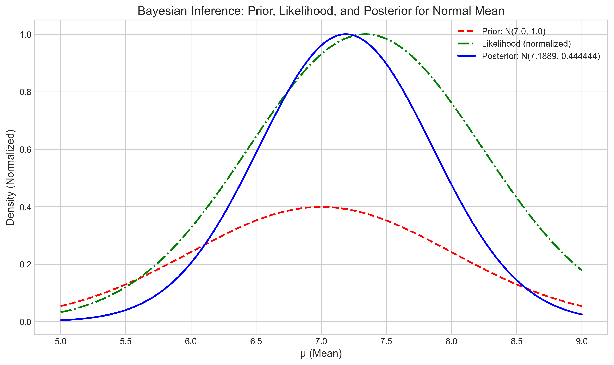
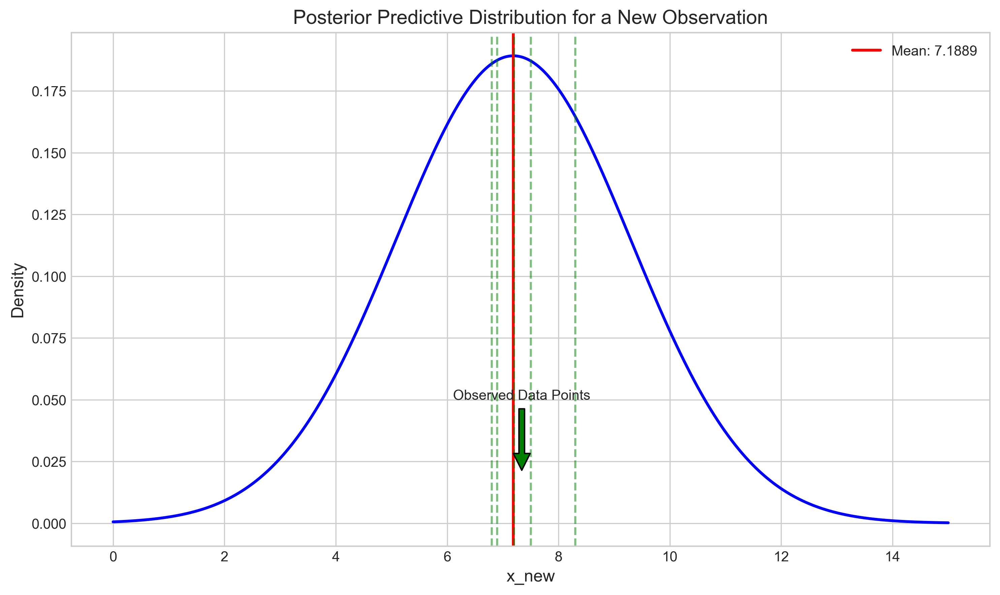
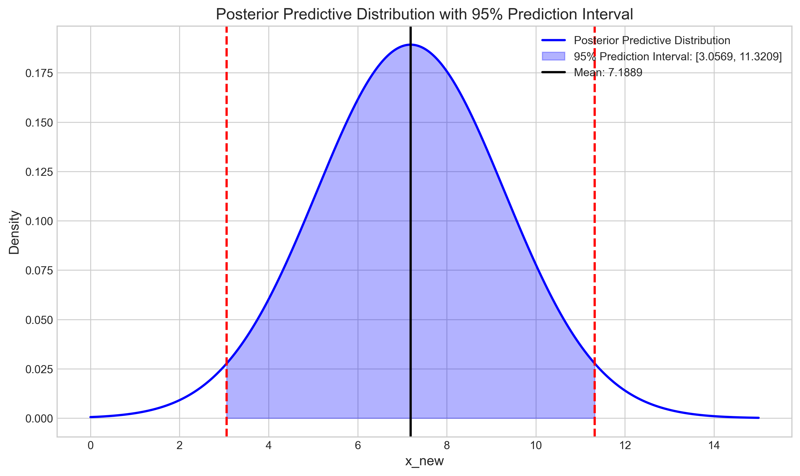
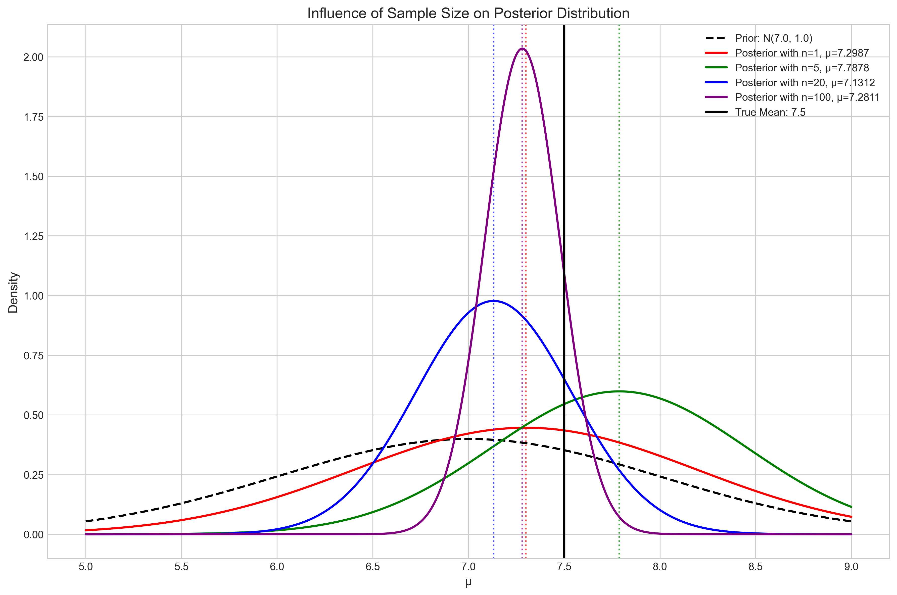

 # Question 2: Bayesian Inference for Normal Mean

## Problem Statement
Consider a normal distribution with unknown mean $\mu$ and known variance $\sigma^2 = 4$. We observe data $X = \{7.2, 6.8, 8.3, 7.5, 6.9\}$.

## Task
1. If we use a normal prior $N(7, 1)$ for $\mu$, derive the posterior distribution
2. Calculate the MAP estimate for $\mu$
3. Derive the full Bayesian posterior predictive distribution for a new observation $X_{new}$
4. Calculate the 95% prediction interval for a new observation

## Solution

### Step 1: Deriving the Posterior Distribution

For Bayesian inference with a normal likelihood and a normal prior for the mean (with known variance), we can use conjugacy properties to derive the posterior distribution analytically.

Given:
- Prior: $\mu \sim N(7, 1)$
- Likelihood (for each observation): $x_i | \mu \sim N(\mu, 4)$
- Data: $X = \{7.2, 6.8, 8.3, 7.5, 6.9\}$ with sample mean $\bar{x} = 7.34$

The posterior distribution for $\mu$ is also a normal distribution with parameters that can be calculated as follows:

**Posterior variance:**
$$\frac{1}{\sigma^2_{\text{posterior}}} = \frac{1}{\sigma^2_{\text{prior}}} + \frac{n}{\sigma^2_{\text{likelihood}}}$$
$$\frac{1}{\sigma^2_{\text{posterior}}} = \frac{1}{1.0} + \frac{5}{4.0} = 1.0 + 1.25 = 2.25$$
$$\sigma^2_{\text{posterior}} = \frac{1}{2.25} = 0.444444$$

**Posterior mean:**
$$\mu_{\text{posterior}} = \sigma^2_{\text{posterior}} \cdot \left( \frac{\mu_{\text{prior}}}{\sigma^2_{\text{prior}}} + \frac{\sum_{i=1}^{n} x_i}{\sigma^2_{\text{likelihood}}} \right)$$
$$\mu_{\text{posterior}} = 0.444444 \cdot \left( \frac{7.0}{1.0} + \frac{36.7}{4.0} \right) = 0.444444 \cdot (7.0 + 9.175) = 0.444444 \cdot 16.175 = 7.188889$$

Therefore, the posterior distribution is:
$$\mu | X \sim N(7.189, 0.444)$$

The figure below illustrates the prior, likelihood, and posterior distributions:

From the plot, we can observe how the prior (red dashed line) and the likelihood (green dash-dotted line) combine to form the posterior distribution (blue solid line). The posterior is narrower than both the prior and likelihood, reflecting the reduced uncertainty about $\mu$ after observing the data.

### Step 2: Calculating the MAP Estimate

For a normal posterior distribution, the mode (which is the MAP estimate) equals the mean. This is because the normal distribution is symmetric around its mean.

$$\text{MAP} = \mu_{\text{posterior}} = 7.188889$$

The MAP estimate represents the value of $\mu$ that maximizes the posterior probability density function.

### Step 3: Deriving the Posterior Predictive Distribution

The posterior predictive distribution represents our belief about a new, unobserved data point $x_{\text{new}}$ given the observed data. It is calculated by marginalizing over the posterior distribution:

$$p(x_{\text{new}} | X) = \int p(x_{\text{new}} | \mu) \cdot p(\mu | X) d\mu$$

For a normal likelihood and a normal posterior, this integral has a closed-form solution. The posterior predictive distribution is also normal with:

$$x_{\text{new}} | X \sim N(\mu_{\text{posterior}}, \sigma^2_{\text{posterior}} + \sigma^2_{\text{likelihood}})$$
$$x_{\text{new}} | X \sim N(7.188889, 0.444444 + 4.0) = N(7.188889, 4.444444)$$

The figure below shows the posterior predictive distribution with the original data points marked on the x-axis:

The posterior predictive distribution represents our uncertainty about a new observation, accounting for both the uncertainty in the parameter estimate (posterior variance) and the inherent variability in the data (likelihood variance).

### Step 4: Calculating the 95% Prediction Interval

A 95% prediction interval for a new observation can be calculated using the posterior predictive distribution. For a normal distribution, this interval is given by:

$$\text{Prediction Interval} = \mu_{\text{predictive}} \pm z_{1-\alpha/2} \cdot \sigma_{\text{predictive}}$$

where $z_{1-\alpha/2} = 1.96$ for a 95% confidence level.

**Lower bound:**
$$\text{Lower bound} = 7.188889 - 1.96 \cdot \sqrt{4.444444} = 7.188889 - 1.96 \cdot 2.108185 = 7.188889 - 4.131967 = 3.056922$$

**Upper bound:**
$$\text{Upper bound} = 7.188889 + 1.96 \cdot \sqrt{4.444444} = 7.188889 + 1.96 \cdot 2.108185 = 7.188889 + 4.131967 = 11.320856$$

Therefore, the 95% prediction interval for a new observation is $[3.057, 11.321]$.

The figure below shows the posterior predictive distribution with the 95% prediction interval shaded:

### Influence of Prior vs. Data Size

An important aspect of Bayesian inference is understanding how the influence of the prior diminishes as we collect more data. The figure below shows how the posterior distribution changes with increasing sample size:

This figure demonstrates that:
1. With small sample sizes (n=1), the posterior is heavily influenced by the prior
2. As the sample size increases (n=5, n=20, n=100), the posterior becomes increasingly dominated by the data (likelihood)
3. With large sample sizes, the posterior converges toward the true parameter value, regardless of the prior

## Key Insights

1. **Conjugacy Properties**: The normal-normal model demonstrates conjugacy, making the posterior calculations analytically tractable. The posterior distribution is in the same family as the prior (normal), just with updated parameters.

2. **Precision Weighting**: The posterior mean is a weighted average of the prior mean and the data mean, with weights proportional to their precisions (inverse variances). This is known as precision weighting.

3. **Uncertainty Reduction**: The posterior variance is smaller than both the prior variance and the likelihood variance, reflecting reduced uncertainty about the parameter after observing data.

4. **MAP Equals Mean for Normal**: For normal distributions, the MAP estimate equals the posterior mean, which is a weighted average of the prior mean and MLE.

5. **Predictive Distribution**: The predictive distribution incorporates both parameter uncertainty (posterior variance) and data variability (likelihood variance), providing a comprehensive measure of uncertainty about future observations.

6. **Prior Influence Diminishes**: As the sample size increases, the influence of the prior on the posterior diminishes, and the Bayesian estimate converges to the frequentist MLE.

## Conclusion

Bayesian inference for the normal mean with known variance provides a coherent framework for parameter estimation and prediction that accounts for both prior knowledge and observed data. The conjugacy properties of the normal-normal model make the calculations straightforward, and the resulting posterior and predictive distributions have interpretable parameters.

The MAP estimate offers a point estimate that incorporates prior information, while the full posterior distribution captures the remaining uncertainty about the parameter. The posterior predictive distribution extends this to make probabilistic predictions about new observations, accounting for both parameter uncertainty and inherent data variability.