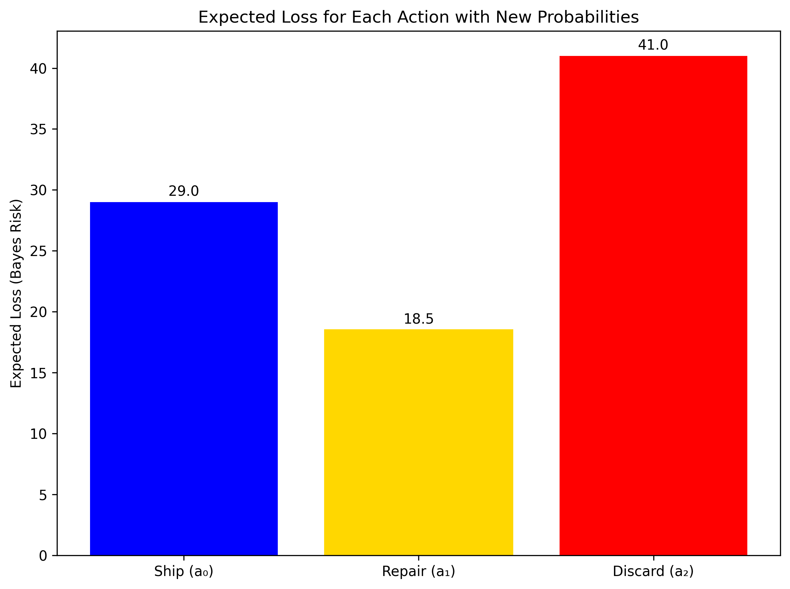

# Question 30: Bayes Risk in Manufacturing Decisions

## Problem Statement
A factory produces electronic components that can be in one of three states: functioning perfectly (state 0), minor defect (state 1), or major defect (state 2). Based on test measurements, our model outputs a probability distribution over these three states for each component: $P(\theta = 0) = 0.7$, $P(\theta = 1) = 0.2$, and $P(\theta = 2) = 0.1$.

We must decide whether to: ship the component (action $a_0$), perform minor repairs (action $a_1$), or discard the component (action $a_2$).

The loss function for each combination of true state and action is given by the following table:

| Loss | Ship ($a_0$) | Repair ($a_1$) | Discard ($a_2$) |
|:----:|:------------:|:--------------:|:---------------:|
| Perfect ($\theta = 0$) | 0 | 10 | 50 |
| Minor defect ($\theta = 1$) | 30 | 5 | 40 |
| Major defect ($\theta = 2$) | 100 | 60 | 20 |

### Task
1. Calculate the expected loss (Bayes risk) for each possible action.
2. Determine which action minimizes the Bayes risk.
3. How would your decision change if the probability distribution changes to $P(\theta = 0) = 0.5$, $P(\theta = 1) = 0.3$, and $P(\theta = 2) = 0.2$?
4. For what range of values of $P(\theta = 0)$ would "ship the component" be the optimal decision, assuming that $P(\theta = 1) = P(\theta = 2) = \frac{1-P(\theta = 0)}{2}$?
5. Formulate a MAP (Maximum A Posteriori) estimation approach to determine the most likely state of a component. Assuming a uniform prior over the states, calculate the MAP estimate for both probability distributions. How does the MAP estimate relate to the optimal decision under 0-1 loss?

## Understanding the Problem

This problem involves decision-making under uncertainty in a manufacturing context. We have:

- **Three possible states** of a component: perfect, minor defect, or major defect
- **Three possible actions** we can take: ship, repair, or discard the component
- **A loss function** that quantifies the cost associated with each action-state combination
- **A probability distribution** over the states based on our testing model

The loss function reflects the economic consequences of our decisions:
- Shipping a perfect component has zero loss (optimal)
- Repairing a perfect component incurs a small loss (unnecessary repair)
- Discarding a perfect component results in a large loss (wasted good product)
- Shipping a component with a major defect incurs a very large loss (customer impact)
- Discarding a component with a major defect has the smallest loss for that state

Our goal is to find the decision rule that minimizes the expected loss (Bayes risk) based on the probability distribution over states. This is a classic application of statistical decision theory.

## Solution

### Step 1: Calculate Expected Loss for Each Action

The expected loss (Bayes risk) for an action is the weighted average of the losses for that action across all possible states, with the weights being the probabilities of each state.

For the initial probability distribution $P(\theta = 0) = 0.7$, $P(\theta = 1) = 0.2$, and $P(\theta = 2) = 0.1$:

#### Ship the component ($a_0$):
$$\begin{align*}
R(a_0) &= P(\theta = 0) \times L(\theta = 0, a_0) + P(\theta = 1) \times L(\theta = 1, a_0) + P(\theta = 2) \times L(\theta = 2, a_0) \\
&= 0.7 \times 0 + 0.2 \times 30 + 0.1 \times 100 \\
&= 0 + 6 + 10 \\
&= 16
\end{align*}$$

#### Perform minor repairs ($a_1$):
$$\begin{align*}
R(a_1) &= P(\theta = 0) \times L(\theta = 0, a_1) + P(\theta = 1) \times L(\theta = 1, a_1) + P(\theta = 2) \times L(\theta = 2, a_1) \\
&= 0.7 \times 10 + 0.2 \times 5 + 0.1 \times 60 \\
&= 7 + 1 + 6 \\
&= 14
\end{align*}$$

#### Discard the component ($a_2$):
$$\begin{align*}
R(a_2) &= P(\theta = 0) \times L(\theta = 0, a_2) + P(\theta = 1) \times L(\theta = 1, a_2) + P(\theta = 2) \times L(\theta = 2, a_2) \\
&= 0.7 \times 50 + 0.2 \times 40 + 0.1 \times 20 \\
&= 35 + 8 + 2 \\
&= 45
\end{align*}$$

### Step 2: Determine the Optimal Action

To determine the optimal action, we compare the expected losses and choose the action with the minimum expected loss:

$$\begin{align*}
R(a_0) &= 16 \\
R(a_1) &= 14 \\
R(a_2) &= 45
\end{align*}$$

Since $R(a_1) < R(a_0) < R(a_2)$, the action that minimizes the Bayes risk is $a_1$: perform minor repairs.

This makes intuitive sense given the probability distribution and loss function:
- With a high probability of perfect components (0.7), we want to avoid discarding (high loss of 50)
- The low cost of repairing minor defects (5) combined with the moderate probability of minor defects (0.2) makes repair attractive
- The high cost of shipping major defects (100) makes us cautious about shipping directly

### Step 3: Decision Change with New Probability Distribution

Now let's recalculate the expected losses with the new probability distribution: $P(\theta = 0) = 0.5$, $P(\theta = 1) = 0.3$, and $P(\theta = 2) = 0.2$.

#### Ship the component ($a_0$):
$$\begin{align*}
R(a_0) &= P(\theta = 0) \times L(\theta = 0, a_0) + P(\theta = 1) \times L(\theta = 1, a_0) + P(\theta = 2) \times L(\theta = 2, a_0) \\
&= 0.5 \times 0 + 0.3 \times 30 + 0.2 \times 100 \\
&= 0 + 9 + 20 \\
&= 29
\end{align*}$$

#### Perform minor repairs ($a_1$):
$$\begin{align*}
R(a_1) &= P(\theta = 0) \times L(\theta = 0, a_1) + P(\theta = 1) \times L(\theta = 1, a_1) + P(\theta = 2) \times L(\theta = 2, a_1) \\
&= 0.5 \times 10 + 0.3 \times 5 + 0.2 \times 60 \\
&= 5 + 1.5 + 12 \\
&= 18.5
\end{align*}$$

#### Discard the component ($a_2$):
$$\begin{align*}
R(a_2) &= P(\theta = 0) \times L(\theta = 0, a_2) + P(\theta = 1) \times L(\theta = 1, a_2) + P(\theta = 2) \times L(\theta = 2, a_2) \\
&= 0.5 \times 50 + 0.3 \times 40 + 0.2 \times 20 \\
&= 25 + 12 + 4 \\
&= 41
\end{align*}$$

Comparing the expected losses:
$$\begin{align*}
R(a_0) &= 29 \\
R(a_1) &= 18.5 \\
R(a_2) &= 41
\end{align*}$$

Since $R(a_1) < R(a_0) < R(a_2)$, the optimal action remains $a_1$: perform minor repairs.

Despite the significant change in the probability distribution (less perfect components, more defective ones), the optimal action doesn't change. This indicates that the repair option is robust across a range of probability distributions.

The main impact of the changed probabilities is an increase in all expected losses, as we're dealing with more potentially defective components. The repair option's expected loss increases the least proportionally, making it even more favorable compared to shipping or discarding.

### Step 4: Range of P(θ=0) for Optimal Shipping Decision

To find the range of values of $P(\theta = 0)$ for which shipping the component would be the optimal decision, we need to determine when $R(a_0) < R(a_1)$ and $R(a_0) < R(a_2)$, assuming that $P(\theta = 1) = P(\theta = 2) = \frac{1-P(\theta = 0)}{2}$.

Let's define $p_0 = P(\theta = 0)$, $p_1 = P(\theta = 1) = \frac{1-p_0}{2}$, and $p_2 = P(\theta = 2) = \frac{1-p_0}{2}$.

#### For shipping to be better than repair ($R(a_0) < R(a_1)$):

$$\begin{align*}
p_0 \times 0 + p_1 \times 30 + p_2 \times 100 &< p_0 \times 10 + p_1 \times 5 + p_2 \times 60 \\
p_1 \times 30 + p_2 \times 100 &< p_0 \times 10 + p_1 \times 5 + p_2 \times 60 \\
p_1 \times 30 - p_1 \times 5 + p_2 \times 100 - p_2 \times 60 &< p_0 \times 10 \\
p_1 \times 25 + p_2 \times 40 &< p_0 \times 10 \\
\end{align*}$$

Since $p_1 = p_2 = \frac{1-p_0}{2}$:

$$\begin{align*}
\frac{1-p_0}{2} \times 25 + \frac{1-p_0}{2} \times 40 &< p_0 \times 10 \\
\frac{1-p_0}{2} \times (25 + 40) &< p_0 \times 10 \\
\frac{1-p_0}{2} \times 65 &< p_0 \times 10 \\
\frac{65(1-p_0)}{2} &< 10p_0 \\
32.5 - 32.5p_0 &< 10p_0 \\
32.5 &< 10p_0 + 32.5p_0 \\
32.5 &< 42.5p_0 \\
\frac{32.5}{42.5} &< p_0 \\
0.7647 &< p_0
\end{align*}$$

#### For shipping to be better than discarding ($R(a_0) < R(a_2)$):

$$\begin{align*}
p_0 \times 0 + p_1 \times 30 + p_2 \times 100 &< p_0 \times 50 + p_1 \times 40 + p_2 \times 20 \\
p_1 \times 30 + p_2 \times 100 &< p_0 \times 50 + p_1 \times 40 + p_2 \times 20 \\
p_1 \times 30 - p_1 \times 40 + p_2 \times 100 - p_2 \times 20 &< p_0 \times 50 \\
p_1 \times (-10) + p_2 \times 80 &< p_0 \times 50 \\
\end{align*}$$

Since $p_1 = p_2 = \frac{1-p_0}{2}$:

$$\begin{align*}
\frac{1-p_0}{2} \times (-10) + \frac{1-p_0}{2} \times 80 &< p_0 \times 50 \\
\frac{1-p_0}{2} \times (80 - 10) &< p_0 \times 50 \\
\frac{1-p_0}{2} \times 70 &< p_0 \times 50 \\
\frac{70(1-p_0)}{2} &< 50p_0 \\
35 - 35p_0 &< 50p_0 \\
35 &< 50p_0 + 35p_0 \\
35 &< 85p_0 \\
\frac{35}{85} &< p_0 \\
0.4118 &< p_0
\end{align*}$$

For shipping to be the optimal decision, both conditions must be satisfied:
- $p_0 > 0.7647$ (for shipping to be better than repair)
- $p_0 > 0.4118$ (for shipping to be better than discarding)

Taking the more restrictive condition, shipping is the optimal decision when $p_0 > 0.7647$.

The graph above shows how the expected loss for each action varies with the probability of the component being perfect ($p_0$). Shipping becomes the optimal action (having the lowest expected loss) when $p_0 > 0.7647$.

This visualization shows the optimal decision regions across the full range of $p_0$ values. It clearly demonstrates that:
- When $p_0$ is low (many defective components), discarding is optimal
- For intermediate values of $p_0$, repair is optimal
- Only when $p_0$ is high (> 0.7647, mostly perfect components) does shipping become optimal

### Step 5: MAP Estimation and Relation to 0-1 Loss

Maximum A Posteriori (MAP) estimation provides a way to estimate the most likely state of a component based on the probability distribution. With a uniform prior over the states, the MAP estimate is simply the state with the highest posterior probability.

#### MAP Estimation Theory

In general, the MAP estimate $\hat{\theta}_{MAP}$ is given by:

$$\hat{\theta}_{MAP} = \arg\max_{\theta} P(\theta | \text{data})$$

Using Bayes' rule:

$$P(\theta | \text{data}) = \frac{P(\text{data} | \theta) P(\theta)}{P(\text{data})}$$

With a uniform prior $P(\theta)$, the MAP estimate reduces to the maximum likelihood estimate (MLE):

$$\hat{\theta}_{MAP} = \arg\max_{\theta} P(\text{data} | \theta)$$

In our case, we already have the posterior probabilities: $P(\theta = 0) = 0.7$, $P(\theta = 1) = 0.2$, and $P(\theta = 2) = 0.1$ for the initial scenario, and $P(\theta = 0) = 0.5$, $P(\theta = 1) = 0.3$, and $P(\theta = 2) = 0.2$ for the new scenario.

#### Initial Probability Distribution

For the initial probability distribution:
- $P(\theta = 0) = 0.7$
- $P(\theta = 1) = 0.2$
- $P(\theta = 2) = 0.1$

The MAP estimate is $\hat{\theta}_{MAP} = 0$ (the perfect state), as it has the highest probability.

#### New Probability Distribution

For the new probability distribution:
- $P(\theta = 0) = 0.5$
- $P(\theta = 1) = 0.3$
- $P(\theta = 2) = 0.2$

The MAP estimate remains $\hat{\theta}_{MAP} = 0$ (the perfect state), though with a lower probability than before.

#### Relationship to 0-1 Loss

The 0-1 loss function assigns a loss of 0 for correct classification and 1 for incorrect classification:

$$L_{0-1}(\theta, \hat{\theta}) = \begin{cases}
0 & \text{if } \theta = \hat{\theta} \\
1 & \text{if } \theta \neq \hat{\theta}
\end{cases}$$

This can be written in matrix form for our three states:

$$L_{0-1} = \begin{pmatrix}
0 & 1 & 1 \\
1 & 0 & 1 \\
1 & 1 & 0
\end{pmatrix}$$

Where each row corresponds to the true state and each column to the estimated state.

The expected 0-1 loss for each possible state estimate is:

$$R(\hat{\theta}) = \sum_{\theta} P(\theta) \times L_{0-1}(\theta, \hat{\theta})$$

For the initial probabilities:

For $\hat{\theta} = 0$:
$$\begin{align*}
R(\hat{\theta} = 0) &= P(\theta = 0) \times L_{0-1}(0, 0) + P(\theta = 1) \times L_{0-1}(1, 0) + P(\theta = 2) \times L_{0-1}(2, 0) \\
&= 0.7 \times 0 + 0.2 \times 1 + 0.1 \times 1 \\
&= 0 + 0.2 + 0.1 \\
&= 0.3
\end{align*}$$

For $\hat{\theta} = 1$:
$$\begin{align*}
R(\hat{\theta} = 1) &= P(\theta = 0) \times L_{0-1}(0, 1) + P(\theta = 1) \times L_{0-1}(1, 1) + P(\theta = 2) \times L_{0-1}(2, 1) \\
&= 0.7 \times 1 + 0.2 \times 0 + 0.1 \times 1 \\
&= 0.7 + 0 + 0.1 \\
&= 0.8
\end{align*}$$

For $\hat{\theta} = 2$:
$$\begin{align*}
R(\hat{\theta} = 2) &= P(\theta = 0) \times L_{0-1}(0, 2) + P(\theta = 1) \times L_{0-1}(1, 2) + P(\theta = 2) \times L_{0-1}(2, 2) \\
&= 0.7 \times 1 + 0.2 \times 1 + 0.1 \times 0 \\
&= 0.7 + 0.2 + 0 \\
&= 0.9
\end{align*}$$

The state estimate that minimizes the expected 0-1 loss is $\hat{\theta} = 0$, which matches our MAP estimate.

For the new probabilities, similar calculations would lead to expected 0-1 losses of:
- $R(\hat{\theta} = 0) = 0.5$
- $R(\hat{\theta} = 1) = 0.7$
- $R(\hat{\theta} = 2) = 0.8$

Again, the state that minimizes the expected 0-1 loss is $\hat{\theta} = 0$, matching the MAP estimate.

#### MAP Estimates vs. Optimal Actions

An interesting observation is that the MAP estimate (which identifies the most likely state) and the optimal action (which minimizes the expected loss) can be different. In our case:

- For the initial probabilities ($p_0 = 0.7$), the MAP estimate is state 0 (perfect), but the optimal action is $a_1$ (repair).
- For the new probabilities ($p_0 = 0.5$), the MAP estimate is still state 0 (perfect), and the optimal action remains $a_1$ (repair).

This discrepancy arises because the loss function for actions is asymmetric and doesn't directly correspond to the state estimation problem. The MAP estimate tells us the most likely state of the component, while the optimal action accounts for the different costs associated with each action-state combination.

This visualization shows how the MAP estimates and optimal actions change as the probability of a perfect component ($p_0$) varies. The MAP estimate transitions from state 1 (or 2) to state 0 at $p_0 = 0.3343$, while the optimal action transitions from discard to repair and then to ship at different thresholds.

**Key insights:**
1. The MAP estimate is the state with the highest probability, which minimizes the expected 0-1 loss.
2. The MAP estimate doesn't necessarily lead to the optimal action when using asymmetric loss functions.
3. Both the MAP estimate and the optimal action depend on the probability distribution, but they change at different probability thresholds.
4. Understanding both the most likely state and the optimal action provides a more complete decision-making framework.

## Practical Implementation

### Application to Manufacturing Quality Control

Let's apply this decision framework to a real manufacturing scenario:

1. A new batch of components arrives at the quality control station
2. Our testing equipment generates a probability distribution: $P(\theta = 0) = 0.7$, $P(\theta = 1) = 0.2$, $P(\theta = 2) = 0.1$
3. We calculate the expected losses:
   - Ship: 16
   - Repair: 14
   - Discard: 45
4. Based on the minimum expected loss, we decide to perform minor repairs on the components
5. After process improvements, the probability of perfect components increases to 0.8
6. The expected losses would now be:
   - Ship: 12 (0.8×0 + 0.1×30 + 0.1×100)
   - Repair: 13 (0.8×10 + 0.1×5 + 0.1×60)
   - Discard: 43 (0.8×50 + 0.1×40 + 0.1×20)
7. Now, shipping becomes the optimal decision as the manufacturing quality improves

### Sensitivity Analysis for Decision Thresholds

The shipping threshold of $p_0 > 0.7647$ shows that:

1. The manufacturing process must produce a high percentage of perfect components for direct shipping to be economically viable
2. When $p_0$ is near the threshold, small changes in component quality can drive different optimal decisions
3. Process improvement efforts should aim to achieve and maintain $p_0 > 0.7647$ to minimize overall costs

## Key Insights

### Theoretical Foundations
- The Bayes risk (expected loss) provides a rational basis for decision-making under uncertainty
- The optimal decision rule minimizes the expected loss across all possible states of nature
- When multiple actions are available, the optimal action depends critically on both the loss values and the probability distribution
- MAP estimation identifies the most likely state, which minimizes the expected 0-1 loss

### Practical Applications
- In manufacturing, different actions (ship, repair, discard) have different cost structures depending on the component's true state
- The optimal decision policy adapts to changing probability distributions as manufacturing processes improve or degrade
- Decision thresholds provide clear targets for quality control and process improvement efforts
- MAP estimation can be used to predict the most likely state, providing additional information beyond the optimal action

### Economic Implications
- Repairing components is economically beneficial when there's significant uncertainty about component quality
- Direct shipping is optimal only when component quality is reliably high
- The cost structure of the loss function significantly impacts optimal decision thresholds
- MAP estimates and optimal actions provide complementary information for economic decision-making

### Common Pitfalls
- Using a fixed decision rule regardless of the probability distribution leads to suboptimal decisions
- Ignoring the differential costs of different types of errors results in economic inefficiency
- Failing to update decision rules as manufacturing processes change causes decision drift
- Assuming that the most likely state (MAP estimate) always leads to the optimal action can result in suboptimal decisions

## Conclusion

- With the initial probability distribution ($p_0 = 0.7$, $p_1 = 0.2$, $p_2 = 0.1$), the optimal action is to perform minor repairs, with an expected loss of 14.
- When the probability distribution changes to ($p_0 = 0.5$, $p_1 = 0.3$, $p_2 = 0.2$), repair remains optimal though the expected loss increases to 18.5.
- Shipping becomes the optimal decision only when the probability of perfect components exceeds 0.7647 (assuming equal probabilities for the two defect states).
- The MAP estimate for both probability distributions is state 0 (perfect component), which minimizes the expected 0-1 loss.
- There's a distinction between estimating the most likely state (MAP) and choosing the optimal action (minimizing Bayes risk).

This approach to manufacturing decisions balances the costs of different types of errors and optimizes actions based on probabilistic assessments, leading to more economically efficient quality control processes. 