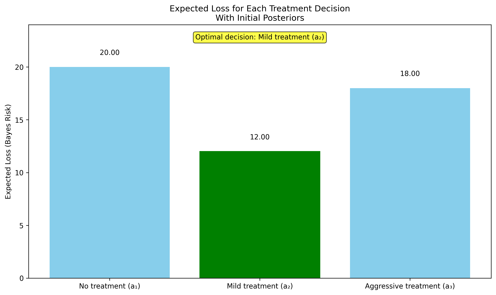
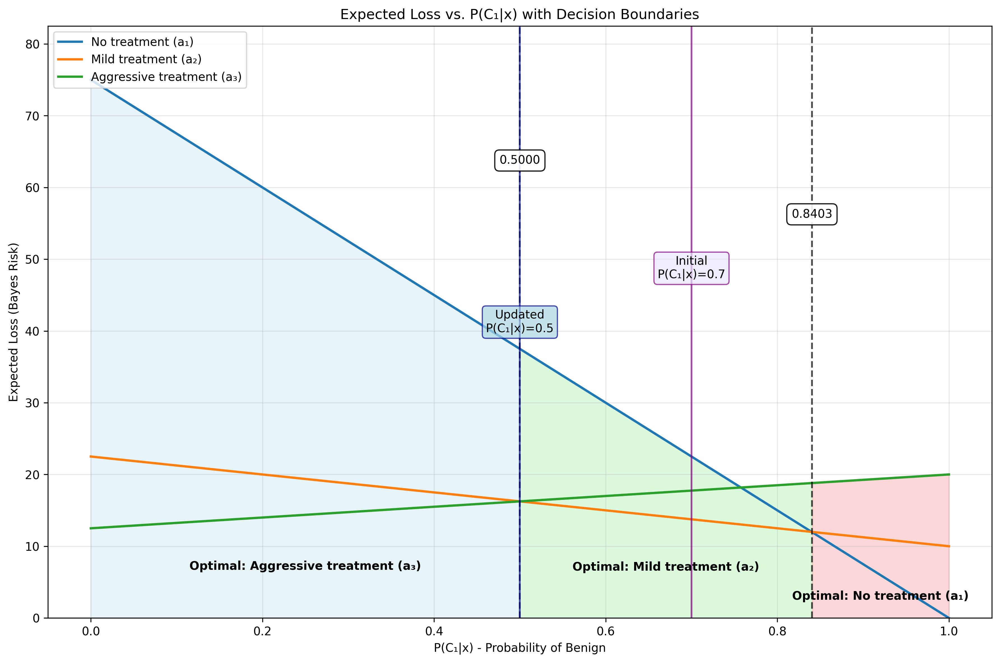
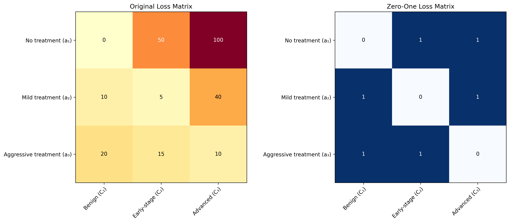
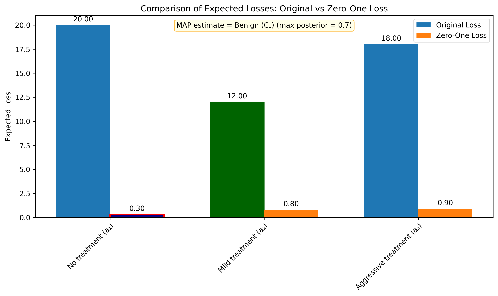

# Question 31: Bayes Risk in Medical Decision Making

## Problem Statement
In oncology, physicians must make treatment decisions based on imperfect diagnostic information. Consider a cancer diagnosis problem where a patient's tumor must be classified into one of three categories based on test results, and an appropriate treatment must be selected.

The three possible tumor states are:
- $C_1$: Benign
- $C_2$: Early-stage malignant
- $C_3$: Advanced malignant

After analyzing test results (represented as features $x$), a machine learning model produces the following posterior probabilities:
- $P(C_1|x) = 0.7$ (probability of benign)
- $P(C_2|x) = 0.2$ (probability of early-stage)
- $P(C_3|x) = 0.1$ (probability of advanced)

The physician must choose between three possible treatments:
- $a_1$: No treatment
- $a_2$: Mild treatment
- $a_3$: Aggressive treatment

The medical team has quantified the loss (negative utility) for each combination of true tumor state and treatment decision:

| Loss | No treatment ($a_1$) | Mild treatment ($a_2$) | Aggressive treatment ($a_3$) |
|:----:|:--------------------:|:----------------------:|:----------------------------:|
| Benign ($C_1$) | 0 | 10 | 20 |
| Early-stage ($C_2$) | 50 | 5 | 15 |
| Advanced ($C_3$) | 100 | 40 | 10 |

Where higher values represent worse outcomes (e.g., unnecessary treatment side effects or untreated cancer progression).

### Task
1. Calculate the expected loss (Bayes risk) for each possible treatment decision using the formula for conditional risk.
2. Determine which treatment decision minimizes the Bayes risk according to the Bayes minimum loss (risk) decision rule.
3. If a second opinion changed the posterior probabilities to $P(C_1|x) = 0.5$, $P(C_2|x) = 0.3$, and $P(C_3|x) = 0.2$, how would this affect the optimal treatment decision? Recalculate the conditional risks.
4. For patients with these types of test results, what range of $P(C_1|x)$ values would make "no treatment" the optimal decision, assuming that $P(C_2|x) = P(C_3|x) = \frac{1-P(C_1|x)}{2}$?
5. Create a zero-one loss function for this problem and show how the Bayes decision rule simplifies to the MAP estimate. Compare the treatment decision under MAP with your answer in Task 2.
6. Explain how the loss values in the table effectively serve as a "prior" in the decision-making process.

## Understanding the Problem

This problem deals with medical decision-making under uncertainty, which is a classic application of Bayesian decision theory. The physician must choose one of three treatments based on probabilistic information about the patient's condition.

The fundamental challenge is that the true state of the patient's tumor is uncertain - we only have posterior probabilities from a machine learning model. Different treatments have different risks and benefits depending on the true tumor state. For example:
- Doing nothing ($a_1$) is best for benign tumors (loss = 0) but catastrophic for advanced malignant tumors (loss = 100)
- Mild treatment ($a_2$) is a balanced approach with lowest risk for early-stage malignancy
- Aggressive treatment ($a_3$) has the lowest risk for advanced malignant tumors but high cost for benign conditions

The Bayes risk framework helps us make optimal decisions by minimizing the expected loss, considering both the posterior probabilities and the loss values.

## Solution

### Step 1: Calculate Expected Loss (Bayes Risk) for Each Treatment Decision

To calculate the expected loss (Bayes risk) for each treatment option, we need to apply the conditional risk formula:

$$R(a_i) = \sum_{j=1}^K L(a_i, C_j)P(C_j|x)$$

where:
- $R(a_i)$ is the expected loss (Bayes risk) for action $a_i$
- $L(a_i, C_j)$ is the loss incurred when taking action $a_i$ and the true state is $C_j$
- $P(C_j|x)$ is the posterior probability of state $C_j$ given evidence $x$

Let's apply this formula to each treatment option:

**For No Treatment ($a_1$):**
$$R(a_1) = L(a_1,C_1)P(C_1|x) + L(a_1,C_2)P(C_2|x) + L(a_1,C_3)P(C_3|x)$$
$$R(a_1) = 0 \times 0.7 + 50 \times 0.2 + 100 \times 0.1$$
$$R(a_1) = 0 + 10 + 10 = 20$$

**For Mild Treatment ($a_2$):**
$$R(a_2) = L(a_2,C_1)P(C_1|x) + L(a_2,C_2)P(C_2|x) + L(a_2,C_3)P(C_3|x)$$
$$R(a_2) = 10 \times 0.7 + 5 \times 0.2 + 40 \times 0.1$$
$$R(a_2) = 7 + 1 + 4 = 12$$

**For Aggressive Treatment ($a_3$):**
$$R(a_3) = L(a_3,C_1)P(C_1|x) + L(a_3,C_2)P(C_2|x) + L(a_3,C_3)P(C_3|x)$$
$$R(a_3) = 20 \times 0.7 + 15 \times 0.2 + 10 \times 0.1$$
$$R(a_3) = 14 + 3 + 1 = 18$$

### Step 2: Determine the Treatment Decision that Minimizes Bayes Risk

Based on our calculations in Step 1, the expected losses (Bayes risks) for each treatment option are:
- No Treatment ($a_1$): 20
- Mild Treatment ($a_2$): 12
- Aggressive Treatment ($a_3$): 18

According to the Bayes minimum risk decision rule, we should choose the action that minimizes the expected loss. In this case, the optimal decision is **Mild Treatment ($a_2$)** with an expected loss of 12.

This makes intuitive sense. Given the posterior probabilities (70% benign, 20% early-stage, 10% advanced) and the loss matrix, mild treatment provides the best balance between unnecessary treatment for potentially benign cases and inadequate treatment for potentially malignant cases.

### Step 3: Recalculate with Updated Posterior Probabilities

Now, let's recalculate the expected losses with the updated posterior probabilities from a second opinion:
- $P(C_1|x) = 0.5$ (probability of benign)
- $P(C_2|x) = 0.3$ (probability of early-stage)
- $P(C_3|x) = 0.2$ (probability of advanced)

**For No Treatment ($a_1$):**
$$R(a_1) = 0 \times 0.5 + 50 \times 0.3 + 100 \times 0.2$$
$$R(a_1) = 0 + 15 + 20 = 35$$

**For Mild Treatment ($a_2$):**
$$R(a_2) = 10 \times 0.5 + 5 \times 0.3 + 40 \times 0.2$$
$$R(a_2) = 5 + 1.5 + 8 = 14.5$$

**For Aggressive Treatment ($a_3$):**
$$R(a_3) = 20 \times 0.5 + 15 \times 0.3 + 10 \times 0.2$$
$$R(a_3) = 10 + 4.5 + 2 = 16.5$$

With the updated posterior probabilities, the expected losses are:
- No Treatment ($a_1$): 35
- Mild Treatment ($a_2$): 14.5
- Aggressive Treatment ($a_3$): 16.5

The optimal decision is still **Mild Treatment ($a_2$)** with an expected loss of 14.5.

However, note that the expected loss for no treatment has increased significantly (from 20 to 35) because the updated probabilities show a higher chance of malignancy (50% vs 30% previously). The relative differences between treatment options have also changed, with mild treatment becoming even more preferable compared to aggressive treatment.

### Step 4: Finding the Range of $P(C_1|x)$ Values for Optimal "No Treatment"

To find the range of $P(C_1|x)$ values that would make "no treatment" the optimal decision, we need to determine when the expected loss for no treatment is less than the expected losses for both mild and aggressive treatments.

We're given the constraint that $P(C_2|x) = P(C_3|x) = \frac{1-P(C_1|x)}{2}$, meaning the remaining probability is split equally between early-stage and advanced malignant cases.

Let's define $p = P(C_1|x)$ to simplify notation. Then $P(C_2|x) = P(C_3|x) = \frac{1-p}{2}$.

We can rewrite the expected loss functions in terms of $p$:

$$R(a_1) = 0 \times p + 50 \times \frac{1-p}{2} + 100 \times \frac{1-p}{2} = 75(1-p)$$

$$R(a_2) = 10 \times p + 5 \times \frac{1-p}{2} + 40 \times \frac{1-p}{2} = 10p + 22.5(1-p) = 22.5 - 12.5p$$

$$R(a_3) = 20 \times p + 15 \times \frac{1-p}{2} + 10 \times \frac{1-p}{2} = 20p + 12.5(1-p) = 12.5 + 7.5p$$

For "no treatment" to be optimal, we need:
1. $R(a_1) < R(a_2)$, which gives $75(1-p) < 22.5 - 12.5p$
2. $R(a_1) < R(a_3)$, which gives $75(1-p) < 12.5 + 7.5p$

Solving these inequalities:

From inequality 1:
$$75(1-p) < 22.5 - 12.5p$$
$$75 - 75p < 22.5 - 12.5p$$
$$75 - 22.5 < 75p - 12.5p$$
$$52.5 < 62.5p$$
$$p > \frac{52.5}{62.5} = 0.84$$

From inequality 2:
$$75(1-p) < 12.5 + 7.5p$$
$$75 - 75p < 12.5 + 7.5p$$
$$75 - 12.5 < 75p + 7.5p$$
$$62.5 < 82.5p$$
$$p > \frac{62.5}{82.5} = 0.7576$$

The stricter condition is $p > 0.84$, so "no treatment" is optimal when $P(C_1|x) > 0.84$, or approximately when $P(C_1|x) \in (0.84, 1]$.

This makes intuitive sense - only when we're very confident that the tumor is benign (more than 84% probability) should we choose to do nothing.

The decision boundaries can be seen in the graph above. The vertical line at $P(C_1|x) = 0.8403$ marks the threshold above which "no treatment" becomes optimal.

### Step 5: Zero-One Loss Function and Comparison with MAP Estimation

To create a zero-one loss function for this problem, we assign a loss of 0 for correct decisions and a loss of 1 for incorrect decisions:

| Loss | No treatment ($a_1$) | Mild treatment ($a_2$) | Aggressive treatment ($a_3$) |
|:----:|:--------------------:|:----------------------:|:----------------------------:|
| Benign ($C_1$) | 0 | 1 | 1 |
| Early-stage ($C_2$) | 1 | 0 | 1 |
| Advanced ($C_3$) | 1 | 1 | 0 |

We define "correct" decisions as:
- Choose no treatment ($a_1$) when the tumor is benign ($C_1$)
- Choose mild treatment ($a_2$) when the tumor is early-stage ($C_2$)
- Choose aggressive treatment ($a_3$) when the tumor is advanced ($C_3$)

Under this zero-one loss, the expected loss for each action is:

**For No Treatment ($a_1$):**
$$R(a_1) = 0 \times 0.7 + 1 \times 0.2 + 1 \times 0.1 = 0.3$$

**For Mild Treatment ($a_2$):**
$$R(a_2) = 1 \times 0.7 + 0 \times 0.2 + 1 \times 0.1 = 0.8$$

**For Aggressive Treatment ($a_3$):**
$$R(a_3) = 1 \times 0.7 + 1 \times 0.2 + 0 \times 0.1 = 0.9$$

The minimum expected loss is 0.3, which corresponds to no treatment ($a_1$).

With zero-one loss, the Bayes decision rule simplifies to:

$$\hat{a}(x) = \arg\min_{i=1,2,3} \sum_{j=1}^3 L(a_i, C_j)P(C_j|x)$$

$$= \arg\min_{i=1,2,3} \sum_{j=1}^3 (1 - \delta_{ij})P(C_j|x)$$

$$= \arg\min_{i=1,2,3} \sum_{j=1}^3 P(C_j|x) - \sum_{j=1}^3 \delta_{ij}P(C_j|x)$$

$$= \arg\min_{i=1,2,3} 1 - P(C_i|x)$$

$$= \arg\max_{i=1,2,3} P(C_i|x)$$

This is exactly the Maximum A Posteriori (MAP) estimate - choose the action that corresponds to the most probable class.

In our case, $\arg\max_{i=1,2,3} P(C_i|x) = 1$ since $P(C_1|x) = 0.7$ is the highest posterior probability. This corresponds to no treatment ($a_1$).

Comparing the decisions:
- Under the original asymmetric loss: Mild Treatment ($a_2$)
- Under zero-one loss (equivalent to MAP estimation): No Treatment ($a_1$)

The decisions differ because the asymmetric loss accounts for the different severities of different types of errors, while the zero-one loss treats all errors equally.

### Step 6: Loss Values as "Prior" in the Decision-Making Process

The loss values in the table serve as a kind of "prior" in the decision-making process in the following ways:

1. **They Encode Domain Knowledge**: Just as prior probabilities encode our prior beliefs about the likelihood of different states, the loss values encode our prior knowledge about the consequences of different decisions. For example, the high loss (100) assigned to no treatment when the tumor is advanced reflects our prior knowledge that untreated advanced cancer is extremely harmful.

2. **They Shift the Decision Boundaries**: Just as prior probabilities shift the posterior probabilities and thus the decision boundaries in Bayesian inference, the loss values shift the decision boundaries in Bayesian decision theory. Without the asymmetric loss values, we would simply choose the action corresponding to the most probable state (MAP estimation). The asymmetric loss values shift our decision from "no treatment" to "mild treatment" despite benign being the most probable state.

3. **They Allow Different Weightings of Errors**: Just as we might use different prior distributions to reflect different beliefs about the world, we can use different loss functions to reflect different valuations of outcomes. A more risk-averse physician might assign even higher losses to untreated malignancies, further shifting the decision toward more aggressive treatment.

4. **They Complement the Probabilistic Model**: The posterior probabilities from our model tell us what is likely to be true, but the loss function tells us what is important. This is analogous to how the likelihood function tells us what the data suggests, while the prior tells us what we believed before seeing the data.

As shown in the decision boundaries plot, changing the loss values would shift the decision boundaries between different treatment options, just as changing the prior would shift the posterior probabilities in Bayesian inference.

## Key Insights

### Theoretical Foundations
- Bayes risk is calculated by taking the expectation of the loss function with respect to the posterior distribution.
- The Bayes minimum risk decision rule selects the action that minimizes the expected loss.
- When using zero-one loss, the Bayes minimum risk decision is equivalent to the Maximum A Posteriori (MAP) decision.
- Different loss functions can lead to different optimal decisions, even with the same posterior probabilities.
- The decision boundaries for different actions depend on both the posterior probabilities and the loss function.

### Practical Applications
- Medical decision-making often involves asymmetric risks - false negatives (missing a disease) may be much more costly than false positives (unnecessary treatment).
- Explicitly modeling these risks through a loss function leads to better decisions than simply choosing the most likely diagnosis.
- As we gain more certainty about a diagnosis (higher probability of one state), our treatment decisions can be more tailored to that state.
- For medical decisions, we typically need very high confidence (>84% in this case) to choose "no treatment" when the consequences of untreated disease are severe.
- Mild treatments often represent a good compromise when diagnostic uncertainty is high, as they balance the risks of under-treatment and over-treatment.

### Common Pitfalls
- Using a zero-one loss function when the true costs of different errors are asymmetric can lead to suboptimal decisions.
- Focusing only on the most likely diagnosis without considering the potential consequences of being wrong.
- Not updating decisions when new evidence changes the posterior probabilities.
- Assuming that all patients with the same diagnosis should receive the same treatment, without accounting for individual risk factors.
- Failing to communicate the uncertainty and risk calculations to patients, who may have different personal loss functions.

## Conclusion

- The Bayes risk framework provides a principled approach to medical decision-making under uncertainty, accounting for both the probability of different conditions and the consequences of different treatment choices.
- For the initial posterior probabilities (70% benign, 20% early-stage, 10% advanced), mild treatment minimizes the expected loss with a Bayes risk of 12.
- Even with updated posterior probabilities showing a higher risk of malignancy (50% benign, 30% early-stage, 20% advanced), mild treatment remains optimal, though with a higher expected loss of 14.5.
- "No treatment" becomes optimal only when the probability of a benign tumor exceeds 84%, reflecting the high cost of failing to treat malignancy.
- Using a zero-one loss function would lead to the MAP decision of "no treatment" based solely on the most likely state, but this ignores the asymmetric costs of different errors.
- The loss values serve as a kind of "prior" in the decision-making process, encoding domain knowledge about the consequences of different actions and shifting the decision boundaries accordingly.

This example illustrates the power of Bayesian decision theory in medical contexts, where both diagnostic uncertainty and asymmetric risks are common features of decision problems. By explicitly modeling both the probabilities and the consequences, we can make better decisions that minimize the expected harm to patients. 