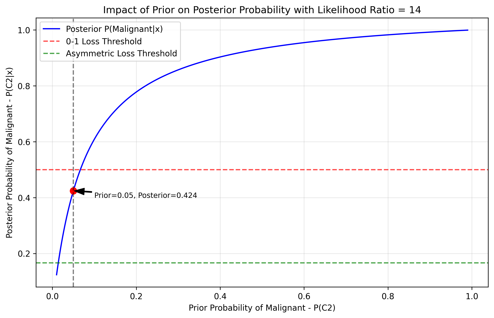

# Question 32: Bayes Risk in Medical Diagnosis

## Problem Statement
A hospital is implementing an automated cancer screening system to classify patient biopsies as either benign or malignant. The system uses machine learning to produce posterior probabilities based on various features extracted from biopsy images.

For a specific patient sample, the system has calculated:
- $P(C_1|x) = 0.3$ (probability of benign)
- $P(C_2|x) = 0.7$ (probability of malignant)

The hospital administrators are considering two different loss function frameworks for making classification decisions:

**Framework 1: Zero-One Loss (Minimizing misclassification rate)**

| Loss | Classify as Benign ($a_1$) | Classify as Malignant ($a_2$) |
| :---: | :------------------------: | :---------------------------: |
| Benign ($C_1$) | 0 | 1 |
| Malignant ($C_2$) | 1 | 0 |

**Framework 2: Asymmetric Loss (Accounting for different error costs)**

| Loss | Classify as Benign ($a_1$) | Classify as Malignant ($a_2$) |
| :---: | :------------------------: | :---------------------------: |
| Benign ($C_1$) | 0 | 2 |
| Malignant ($C_2$) | 10 | 0 |

Where the asymmetric loss reflects that missing a malignant tumor (false negative) is considered much more serious than misclassifying a benign tumor as malignant (false positive).

### Task
1. For the zero-one loss function, calculate the expected loss (Bayes risk) for each possible action using the formula:
   $$R(a_i) = \sum_{j=1}^K L_{ij}P(C_j|x)$$
   and determine the optimal decision according to:
   $$\hat{\alpha}(x) = \arg\min_{i=1,...,K} \sum_{j=1}^K L_{ij}p(C_j|x)$$
2. For the asymmetric loss function, calculate the expected loss for each possible action and determine the optimal decision.
3. For the zero-one loss function, show how the Bayes decision rule simplifies to:
   $$\hat{\alpha}(x) = \arg\max_{i=1,...,K} p(C_i|x)$$
   Use this to demonstrate that the Bayes minimum risk decision with 0-1 loss is equivalent to the MAP (Maximum A Posteriori) decision.
4. For the asymmetric loss function, derive the decision threshold $t$ such that we classify a sample as malignant when $P(C_2|x) > t$. Show your work using the formula:
   $$R(a_1) < R(a_2) \iff \sum_{j=1}^K L_{1j}P(C_j|x) < \sum_{j=1}^K L_{2j}P(C_j|x)$$
5. The hospital is considering updating their model with a prior distribution reflecting the prevalence of cancer in the population, which is estimated to be 5% (i.e., $P(C_2) = 0.05$). Using Bayes' theorem:
   $$P(C_j|x) = \frac{P(x|C_j)P(C_j)}{P(x)}$$
   If the likelihood ratios $\frac{P(x|C_2)}{P(x|C_1)} = 14$ for this patient sample:
   a. Calculate the posterior probabilities incorporating this prior
   b. Determine the optimal decision under both loss functions with these updated posteriors
   c. Explain how this demonstrates the relationship between prior probabilities in MAP estimation and the expected loss minimization framework
6. Describe how the Bayes risk minimization framework generalizes to more complex loss functions and multi-class problems. How would you extend this approach to a problem with more than two classes and a custom loss matrix?

## Understanding the Problem

In this problem, we are working with a medical diagnostic system that needs to classify biopsy samples as either benign or malignant. The system already produces posterior probabilities: $P(C_1|x) = 0.3$ for benign and $P(C_2|x) = 0.7$ for malignant, where $x$ represents the features extracted from the biopsy image.

The key aspect of this problem is understanding how different loss functions affect our decision-making process. We need to consider two frameworks:

1. **Zero-One Loss**: This standard loss function assigns a penalty of 1 for any misclassification and 0 for correct classifications. It simply aims to maximize the overall classification accuracy.

2. **Asymmetric Loss**: This more nuanced loss function reflects the reality of medical diagnosis where different types of errors have different consequences. Missing a malignant tumor (false negative, assigning benign when it's actually malignant) is given a much higher penalty (10) than misclassifying a benign tumor as malignant (false positive, with penalty 2).

The Bayes risk framework provides a mathematical foundation for making optimal decisions by minimizing the expected loss, taking into account both the loss values and the posterior probabilities.

## Solution

### Step 1: Calculating Expected Loss for Zero-One Loss Function

The zero-one loss function is defined as follows:

| Loss | Classify as Benign ($a_1$) | Classify as Malignant ($a_2$) |
| :---: | :------------------------: | :---------------------------: |
| Benign ($C_1$) | 0 | 1 |
| Malignant ($C_2$) | 1 | 0 |

For action $a_1$ (Classify as Benign):
- $L(a_1, C_1) \times P(C_1|x) = 0 \times 0.3 = 0$
- $L(a_1, C_2) \times P(C_2|x) = 1 \times 0.7 = 0.7$
- $R(a_1) = 0 + 0.7 = 0.7$

For action $a_2$ (Classify as Malignant):
- $L(a_2, C_1) \times P(C_1|x) = 1 \times 0.3 = 0.3$
- $L(a_2, C_2) \times P(C_2|x) = 0 \times 0.7 = 0$
- $R(a_2) = 0.3 + 0 = 0.3$

Since $R(a_2) = 0.3 < R(a_1) = 0.7$, the optimal decision under the zero-one loss function is $a_2$ (Classify as Malignant).

From the top graph in this visualization, we can see that with $P(C_2|x) = 0.7$:
- The red line (risk for classifying as benign) = 0.7
- The blue line (risk for classifying as malignant) = 0.3
- The optimal decision is to classify as malignant (blue region)

### Step 2: Calculating Expected Loss for Asymmetric Loss Function

The asymmetric loss function is defined as follows:

| Loss | Classify as Benign ($a_1$) | Classify as Malignant ($a_2$) |
| :---: | :------------------------: | :---------------------------: |
| Benign ($C_1$) | 0 | 2 |
| Malignant ($C_2$) | 10 | 0 |

For action $a_1$ (Classify as Benign):
- $L(a_1, C_1) \times P(C_1|x) = 0 \times 0.3 = 0$
- $L(a_1, C_2) \times P(C_2|x) = 10 \times 0.7 = 7$
- $R(a_1) = 0 + 7 = 7$

For action $a_2$ (Classify as Malignant):
- $L(a_2, C_1) \times P(C_1|x) = 2 \times 0.3 = 0.6$
- $L(a_2, C_2) \times P(C_2|x) = 0 \times 0.7 = 0$
- $R(a_2) = 0.6 + 0 = 0.6$

Since $R(a_2) = 0.6 < R(a_1) = 7$, the optimal decision under the asymmetric loss function is also $a_2$ (Classify as Malignant).

From the bottom graph in the visualization:
- The red line (risk for classifying as benign) = 10 × 0.7 = 7
- The blue line (risk for classifying as malignant) = 2 × 0.3 = 0.6
- The optimal decision is to classify as malignant (blue region)

The asymmetric loss function strongly penalizes false negatives (missing a malignant tumor), which results in an even clearer decision to classify the sample as malignant in this case.

### Step 3: Simplifying the Bayes Decision Rule for Zero-One Loss

For the zero-one loss function, we can simplify the Bayes decision rule as follows:

1. Start with the Bayes decision rule: $\hat{\alpha}(x) = \arg\min_{i} \sum_{j} L_{ij} P(C_j|x)$
2. For zero-one loss, $L_{ij} = 1 - \delta_{ij}$, where $\delta_{ij} = 1$ if $i=j$ and 0 otherwise
3. Substituting: $\hat{\alpha}(x) = \arg\min_{i} \sum_{j} (1 - \delta_{ij}) P(C_j|x)$
4. Expanding: $\hat{\alpha}(x) = \arg\min_{i} [\sum_{j} P(C_j|x) - \sum_{j} \delta_{ij} P(C_j|x)]$
5. Since $\sum_{j} P(C_j|x) = 1$ (sum of probabilities): $\hat{\alpha}(x) = \arg\min_{i} [1 - \sum_{j} \delta_{ij} P(C_j|x)]$
6. The only term with $\delta_{ij} = 1$ is when $j = i$: $\hat{\alpha}(x) = \arg\min_{i} [1 - P(C_i|x)]$
7. Since we want to minimize $[1 - P(C_i|x)]$, this is equivalent to maximizing $P(C_i|x)$
8. Therefore: $\hat{\alpha}(x) = \arg\max_{i} P(C_i|x)$

This shows that the Bayes minimum risk decision with zero-one loss is equivalent to the MAP (Maximum A Posteriori) estimate: choose the class with the highest posterior probability.

For our problem, $\arg\max_{i} P(C_i|x) = \arg\max(0.3, 0.7) = C_2$ (Malignant), so the optimal action is $a_2$ (Classify as Malignant), confirming our result from Step 1.

### Step 4: Deriving the Decision Threshold for Asymmetric Loss

We want to find the threshold $t$ such that we classify a sample as malignant when $P(C_2|x) > t$. We start by setting up the condition for when we should choose action $a_2$ (Classify as Malignant) over action $a_1$ (Classify as Benign):

$R(a_2) < R(a_1)$

Expanding this:
- $R(a_2) = L(a_2,C_1)P(C_1|x) + L(a_2,C_2)P(C_2|x) = 2 \times P(C_1|x) + 0 \times P(C_2|x) = 2 \times P(C_1|x)$
- $R(a_1) = L(a_1,C_1)P(C_1|x) + L(a_1,C_2)P(C_2|x) = 0 \times P(C_1|x) + 10 \times P(C_2|x) = 10 \times P(C_2|x)$

For $a_2$ to be optimal: $2 \times P(C_1|x) < 10 \times P(C_2|x)$

Using $P(C_1|x) = 1 - P(C_2|x)$: $2 \times (1-P(C_2|x)) < 10 \times P(C_2|x)$

Expanding: $2 - 2 \times P(C_2|x) < 10 \times P(C_2|x)$

Rearranging: $2 < 10 \times P(C_2|x) + 2 \times P(C_2|x) = 12 \times P(C_2|x)$

Solving for $P(C_2|x)$: $\frac{2}{12} < P(C_2|x)$

Therefore, the decision threshold is $t = \frac{2}{12} = \frac{1}{6} \approx 0.1667$

This means we should classify a sample as malignant whenever the posterior probability of malignancy exceeds 16.67%. This threshold is much lower than the standard 50% threshold used with zero-one loss, reflecting the higher cost associated with missing a malignant tumor.

For our patient with $P(C_2|x) = 0.7 > 0.1667$, the optimal action is clearly $a_2$ (Classify as Malignant), matching our result from Step 2.

The visualization shows the decision boundaries for both loss functions:
- For zero-one loss (top bar), the threshold is at 0.5
- For asymmetric loss (bottom bar), the threshold is at 0.1667
- With our example of $P(C_2|x) = 0.7$ (green dashed line), both loss functions lead to a classification of malignant (blue region)

### Step 5: Incorporating a Prior Distribution

The hospital wants to incorporate a prior distribution reflecting the cancer prevalence in the population (5%). We need to use Bayes' theorem to update our posteriors.

Given:
- Prior probability of malignant: $P(C_2) = 0.05$
- Likelihood ratio: $\frac{P(x|C_2)}{P(x|C_1)} = 14$

Using Bayes' theorem and the likelihood ratio:
$\frac{P(C_2|x)}{P(C_1|x)} = \frac{P(x|C_2)}{P(x|C_1)} \times \frac{P(C_2)}{P(C_1)} = 14 \times \frac{0.05}{0.95} \approx 14 \times 0.0526 \approx 0.7364$

Let's denote $P(C_2|x)$ as $p$. Then $P(C_1|x) = 1-p$, and we have:
$\frac{p}{1-p} = 0.7364$

Solving for $p$:
$p = 0.7364 \times (1-p)$
$p = 0.7364 - 0.7364p$
$p + 0.7364p = 0.7364$
$p \times (1 + 0.7364) = 0.7364$
$p = \frac{0.7364}{1 + 0.7364} \approx 0.4242$

Therefore, the updated posterior probabilities are:
- $P(C_1|x) = 1 - 0.4242 = 0.5758$
- $P(C_2|x) = 0.4242$

#### Optimal Decisions with Updated Posteriors

For zero-one loss:
- $R(a_1) = L(a_1, C_1) \times P(C_1|x) + L(a_1, C_2) \times P(C_2|x) = 0 \times 0.5758 + 1 \times 0.4242 = 0.4242$
- $R(a_2) = L(a_2, C_1) \times P(C_1|x) + L(a_2, C_2) \times P(C_2|x) = 1 \times 0.5758 + 0 \times 0.4242 = 0.5758$

Since $R(a_1) = 0.4242 < R(a_2) = 0.5758$, the optimal decision under zero-one loss is now $a_1$ (Classify as Benign).

For asymmetric loss:
- $R(a_1) = L(a_1, C_1) \times P(C_1|x) + L(a_1, C_2) \times P(C_2|x) = 0 \times 0.5758 + 10 \times 0.4242 = 4.242$
- $R(a_2) = L(a_2, C_1) \times P(C_1|x) + L(a_2, C_2) \times P(C_2|x) = 2 \times 0.5758 + 0 \times 0.4242 = 1.1516$

Since $R(a_2) = 1.1516 < R(a_1) = 4.242$, the optimal decision under asymmetric loss is still $a_2$ (Classify as Malignant).

#### Relationship Between Prior and Expected Loss

This visualization shows how the prior probability impacts the posterior probability and decision boundaries:
- The blue curve shows the relationship between prior and posterior probabilities with a likelihood ratio of 14
- The horizontal red dashed line shows the zero-one loss threshold (0.5)
- The horizontal green dashed line shows the asymmetric loss threshold (0.1667)
- The red dot marks the specific case with prior=0.05, where the posterior is around 0.42

The introduction of the prior has a significant impact on our decisions:
1. Even with a high likelihood ratio of 14 (strong evidence for malignancy), the low prior of 0.05 results in a lower posterior probability of malignancy (0.4242 instead of 0.7).
2. This changes our decision for the zero-one loss function from 'Malignant' to 'Benign', because $P(C_2|x) = 0.4242 < 0.5$.
3. For the asymmetric loss, our decision is still 'Malignant' because $P(C_2|x) = 0.4242 > 0.1667$, the asymmetric threshold.
4. This demonstrates how the prior encodes our belief about class distribution, while the loss function encodes the costs of different decision errors.

In MAP estimation with zero-one loss, the prior directly influences the posterior probabilities, which determine the classification. With a custom loss function, the prior still affects the posterior probabilities, but the decision threshold is adjusted based on the relative costs of different errors, potentially leading to different decisions even with the same posterior probabilities.

### Step 6: Extending to More Complex Problems

The Bayes risk minimization framework can be extended to more complex problems in several ways:

1. **Multi-class extension:**
   - For K classes, use a K×K loss matrix L where L_ij is the cost of predicting class i when the true class is j
   - The Bayes decision rule remains: $\hat{\alpha}(x) = \arg\min_{i} \sum_{j} L_{ij} P(C_j|x)$
   - For each possible action (predicted class), calculate the expected loss by summing over all possible true classes

2. **Custom loss functions:**
   - Any arbitrary loss matrix can be used, reflecting domain-specific costs of different error types
   - For example, in medical diagnostics, missing different diseases may have different costs
   - The framework automatically balances these different costs with class probabilities

3. **Decision regions:**
   - The decision boundaries in feature space are determined by both the posterior probabilities and the loss function
   - The optimal decision for a given example depends on where it falls in these decision regions
   - These regions can be visualized to understand how the classifier behaves

4. **Regression extension:**
   - For continuous outputs, the sum becomes an integral over the conditional density
   - The optimal decision minimizes: $\hat{\alpha}(x) = \arg\min_{a} \int L(a,y) p(y|x) dy$
   - For squared error loss, this gives the conditional mean E[Y|X=x]
   - For absolute error loss, this gives the conditional median

5. **Cost-sensitive learning:**
   - Machine learning algorithms can be modified to directly optimize the expected loss
   - This is especially important when class distributions are imbalanced or errors have asymmetric costs
   - Instead of optimizing for accuracy, the learning algorithm optimizes for minimum expected loss

## Key Insights

### Theoretical Foundations
- The Bayes decision rule provides a principled framework for making optimal decisions by minimizing expected loss.
- Different loss functions encode different priorities and lead to different decision boundaries.
- With zero-one loss, the Bayes decision rule simplifies to choosing the class with the highest posterior probability (MAP decision).
- Custom loss functions allow us to encode domain knowledge about the relative costs of different types of errors.
- The decision threshold in binary classification is determined by the ratio of loss values and can be derived analytically.

### Practical Applications
- In medical diagnosis, asymmetric loss functions better reflect the reality that false negatives (missing a disease) are typically more costly than false positives (unnecessary treatment).
- Prior probabilities based on population statistics can significantly impact diagnostic decisions, especially when evidence is ambiguous.
- The Bayes risk framework provides a way to optimally balance evidence (likelihoods) with prior beliefs and the costs of different decisions.
- For rare conditions (low prior probability), we need stronger evidence to justify a positive diagnosis under zero-one loss, but asymmetric loss may still recommend positive diagnosis with weaker evidence.

### Common Pitfalls
- Using zero-one loss by default without considering the actual costs of different errors can lead to suboptimal decisions.
- Ignoring prior probabilities can result in poor decisions, especially for rare conditions.
- Not calibrating model outputs to true probabilities can lead to incorrect expected loss calculations.
- Using inappropriate or outdated priors that don't reflect the current population being diagnosed.
- Failing to communicate the expected loss to physicians and patients, which is necessary for informed decision-making.

## Conclusion

- For zero-one loss, the optimal decision is to classify as the class with the highest posterior probability. With our original posteriors ($P(C_2|x) = 0.7$), we classify the sample as malignant.
- For asymmetric loss that penalizes false negatives more heavily, the decision threshold shifts to a lower value ($t = 0.1667$), making us more likely to classify as malignant. With our posteriors, we still classify as malignant.
- When incorporating a prior that reflects the low prevalence of cancer in the population (5%), the posterior probability of malignancy decreases to 0.4242.
- With this updated posterior, the zero-one loss leads to classifying as benign, while the asymmetric loss still leads to classifying as malignant.
- This demonstrates the interplay between evidence, prior beliefs, and loss functions in making optimal decisions.
- The Bayes risk minimization framework provides a powerful and flexible approach to decision-making that can be extended to more complex problems with multiple classes and arbitrary loss functions.

By understanding and applying Bayes risk minimization, medical practitioners can make more informed decisions that balance the available evidence with prior knowledge and the specific costs of different types of diagnostic errors, ultimately leading to better patient outcomes. 