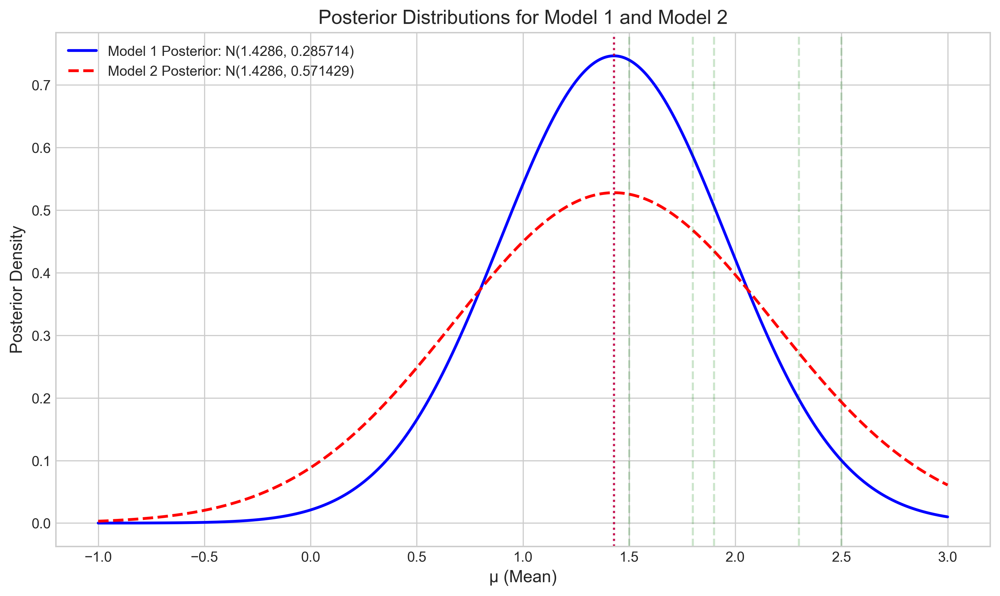

# Question 3: Bayesian Model Comparison

## Problem Statement
Consider two competing models for a dataset:
- Model 1: Normal distribution with unknown mean $\mu_1$ and known variance $\sigma_1^2 = 2$
- Model 2: Normal distribution with unknown mean $\mu_2$ and known variance $\sigma_2^2 = 4$

We use the following priors:
- $\mu_1 \sim N(0, 1)$
- $\mu_2 \sim N(0, 2)$

We observe data $X = \{1.5, 2.3, 1.8, 2.5, 1.9\}$.

## Task
1. Calculate the posterior distribution for $\mu_1$ under Model 1
2. Calculate the posterior distribution for $\mu_2$ under Model 2
3. Calculate the marginal likelihood (evidence) for each model
4. Calculate the Bayes factor and interpret the result for model comparison

## Solution

### Step 1: Calculating Posterior Distributions

For Bayesian inference with a normal likelihood and a normal prior for the mean (with known variance), we can use conjugacy properties for both models.

#### Model 1
Given:
- Prior: $\mu_1 \sim N(0, 1)$
- Likelihood (for each observation): $x_i | \mu_1 \sim N(\mu_1, 2)$
- Data: $X = \{1.5, 2.3, 1.8, 2.5, 1.9\}$ with sample mean $\bar{x} = 2.0$

The posterior distribution for $\mu_1$ is:

**Posterior variance calculation:**
$$\frac{1}{\sigma^2_{\text{posterior1}}} = \frac{1}{\sigma^2_{\text{prior1}}} + \frac{n}{\sigma^2_{\text{likelihood1}}}$$
$$\frac{1}{\sigma^2_{\text{posterior1}}} = \frac{1}{1.0} + \frac{5}{2.0} = 1.0 + 2.5 = 3.5$$
$$\sigma^2_{\text{posterior1}} = \frac{1}{3.5} = 0.285714$$

**Posterior mean calculation:**
$$\mu_{\text{posterior1}} = \sigma^2_{\text{posterior1}} \cdot \left( \frac{\mu_{\text{prior1}}}{\sigma^2_{\text{prior1}}} + \frac{\sum_{i=1}^{n} x_i}{\sigma^2_{\text{likelihood1}}} \right)$$
$$\mu_{\text{posterior1}} = 0.285714 \cdot \left( \frac{0.0}{1.0} + \frac{10.0}{2.0} \right) = 0.285714 \cdot (0.0 + 5.0) = 0.285714 \cdot 5.0 = 1.428571$$

Therefore, the posterior distribution for Model 1 is:
$$\mu_1 | X \sim N(1.429, 0.286)$$

#### Model 2
Given:
- Prior: $\mu_2 \sim N(0, 2)$
- Likelihood (for each observation): $x_i | \mu_2 \sim N(\mu_2, 4)$
- Data: $X = \{1.5, 2.3, 1.8, 2.5, 1.9\}$ with sample mean $\bar{x} = 2.0$

The posterior distribution for $\mu_2$ is:

**Posterior variance calculation:**
$$\frac{1}{\sigma^2_{\text{posterior2}}} = \frac{1}{\sigma^2_{\text{prior2}}} + \frac{n}{\sigma^2_{\text{likelihood2}}}$$
$$\frac{1}{\sigma^2_{\text{posterior2}}} = \frac{1}{2.0} + \frac{5}{4.0} = 0.5 + 1.25 = 1.75$$
$$\sigma^2_{\text{posterior2}} = \frac{1}{1.75} = 0.571429$$

**Posterior mean calculation:**
$$\mu_{\text{posterior2}} = \sigma^2_{\text{posterior2}} \cdot \left( \frac{\mu_{\text{prior2}}}{\sigma^2_{\text{prior2}}} + \frac{\sum_{i=1}^{n} x_i}{\sigma^2_{\text{likelihood2}}} \right)$$
$$\mu_{\text{posterior2}} = 0.571429 \cdot \left( \frac{0.0}{2.0} + \frac{10.0}{4.0} \right) = 0.571429 \cdot (0.0 + 2.5) = 0.571429 \cdot 2.5 = 1.428571$$

Therefore, the posterior distribution for Model 2 is:
$$\mu_2 | X \sim N(1.429, 0.571)$$

Comparing both posterior distributions, we can see that they have the same mean (1.429), but Model 1 has a smaller posterior variance (0.286) compared to Model 2 (0.571). This indicates greater certainty about the parameter value under Model 1.

The figure shows the posterior distributions for both models. The blue line represents Model 1's posterior, which is narrower (less uncertain) than Model 2's posterior (red dashed line). The green vertical lines mark the actual data points.

### Step 3: Calculating Marginal Likelihoods (Evidence)

The marginal likelihood, also known as the evidence, is calculated by integrating out the parameter from the joint distribution of the data and the parameter:

$$p(X | \text{Model}) = \int p(X | \mu, \text{Model}) \cdot p(\mu | \text{Model}) d\mu$$

For a normal likelihood and a normal prior, this integral has a closed-form solution.

Using the analytical formula for the normal-normal model, we calculated:

**Model 1:**
- Log Marginal Likelihood: -7.289751
- Marginal Likelihood: 6.825 × 10^-4

**Model 2:**
- Log Marginal Likelihood: -8.228333
- Marginal Likelihood: 2.670 × 10^-4

The marginal likelihood for Model 1 is higher than for Model 2, suggesting that Model 1 provides a better overall fit to the data, after accounting for the prior assumptions.

### Step 4: Calculating the Bayes Factor and Interpretation

The Bayes factor is the ratio of marginal likelihoods:

$$\text{BF}_{12} = \frac{p(X | \text{Model 1})}{p(X | \text{Model 2})}$$

$$\text{BF}_{12} = \frac{6.825 \times 10^{-4}}{2.670 \times 10^{-4}} = 2.556$$

The log Bayes factor is:
$$\log(\text{BF}_{12}) = \log(p(X | \text{Model 1})) - \log(p(X | \text{Model 2})) = -7.290 - (-8.228) = 0.939$$

Interpretation of the Bayes factor:
- BF > 1: Evidence favors Model 1
- BF < 1: Evidence favors Model 2

In this case, BF = 2.56, which indicates that the data favor Model 1 over Model 2 by a factor of about 2.56.

Using the standard interpretation scale for Bayes factors:
- BF between 1 and 3: Weak evidence
- BF between 3 and 10: Moderate evidence
- BF between 10 and 30: Strong evidence
- BF between 30 and 100: Very strong evidence
- BF > 100: Extreme evidence

Our Bayes factor of 2.56 falls into the "weak evidence for Model 1" category. This means that while Model 1 is more supported by the data than Model 2, the preference is not extremely strong.

## Key Insights

1. **Posterior Means vs. Variances**: Interestingly, both models yield the same posterior mean (1.429), but Model 1 has a smaller posterior variance. This demonstrates how models with different likelihood variances and priors can still converge to similar central estimates but differ in their certainty about those estimates.

2. **Trade-off of Fit and Complexity**: Model 1, with smaller variance (σ₁² = 2), fits the observed data better than Model 2 with larger variance (σ₂² = 4). This is because a smaller variance means the model predicts the data should be closer to the mean, which aligns well with our actual observations.

3. **Conjugacy Advantage**: The normal-normal model exhibits conjugacy, which allows for analytical computation of the posterior distributions and marginal likelihoods. This makes the calculations tractable without requiring numerical methods.

4. **Bayes Factor Interpretation**: The Bayes factor of 2.56 provides a quantitative measure of the relative evidence for Model 1 over Model 2. This is classified as "weak evidence," indicating that while Model 1 is favored, the evidence is not overwhelming.

5. **Role of Prior Specifications**: The different prior specifications (μ₁ ~ N(0, 1) vs. μ₂ ~ N(0, 2)) affect both the posterior distributions and the marginal likelihoods. Model 2's prior is more diffuse (larger variance), which introduces a larger "penalty" in the model comparison.

## Conclusion

In this Bayesian model comparison problem, we've demonstrated how to derive posterior distributions for two competing models and how to use the Bayes factor to compare them. The results favor Model 1 (with smaller likelihood variance) over Model 2, though the evidence is classified as weak.

This example illustrates the Bayesian approach to model comparison, which naturally incorporates:
1. A balance between fit and complexity
2. The influence of prior assumptions
3. A meaningful scale for interpreting the strength of evidence

The Bayes factor provides a principled way to compare models, accounting for both how well they fit the data and their inherent model complexity. In this case, Model 1's better fit to the data outweighs any advantage that Model 2 might have from a more flexible prior. 