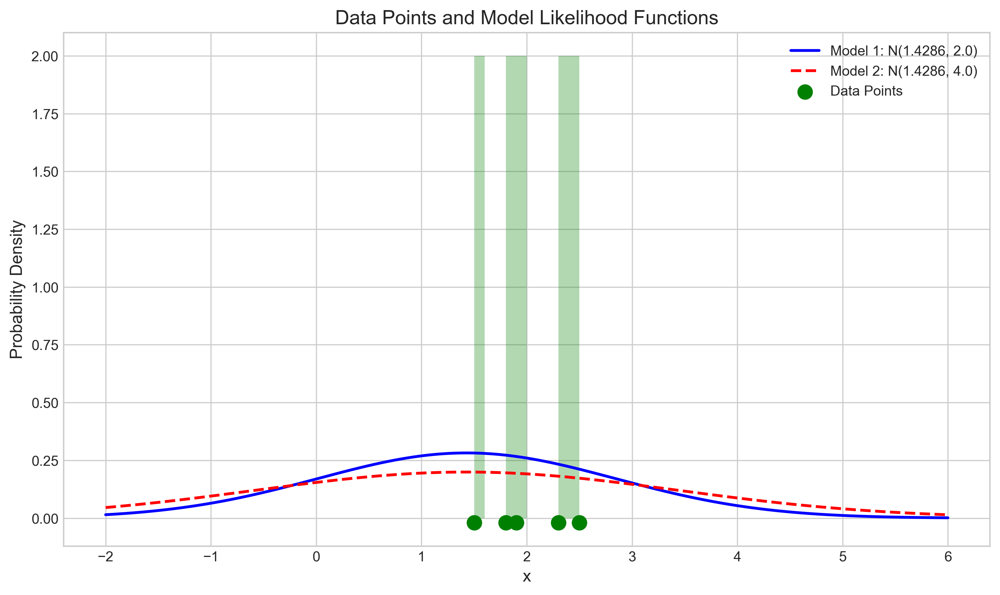
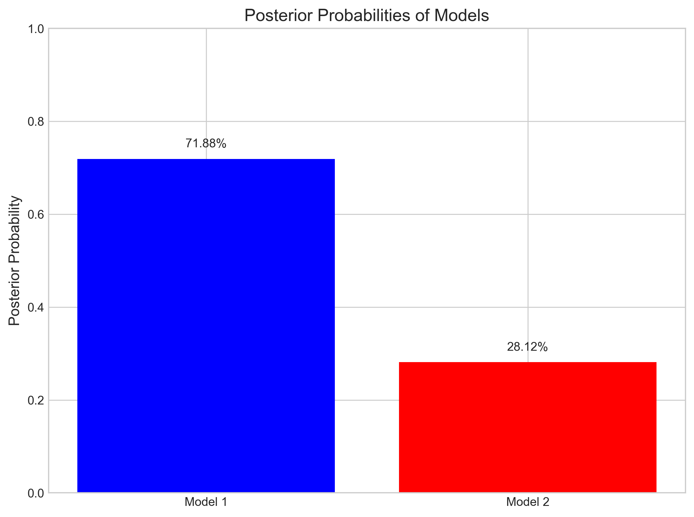
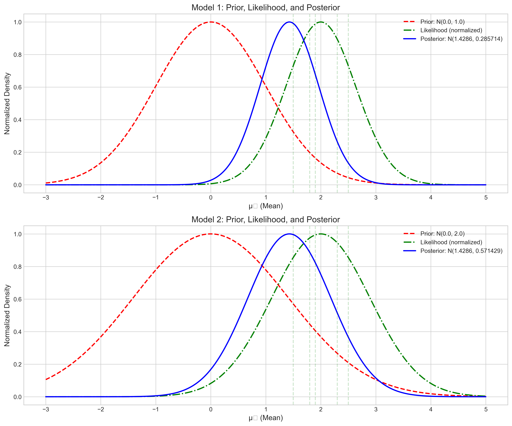

# Question 3: Bayesian Model Comparison

## Problem Statement
Consider two competing models for a dataset:
- Model 1: Normal distribution with unknown mean $\mu_1$ and known variance $\sigma_1^2 = 2$
- Model 2: Normal distribution with unknown mean $\mu_2$ and known variance $\sigma_2^2 = 4$

We use the following priors:
- $\mu_1 \sim \mathcal{N}(0, 1)$
- $\mu_2 \sim \mathcal{N}(0, 2)$

We observe data $X = \{1.5, 2.3, 1.8, 2.5, 1.9\}$.

### Task
1. Calculate the posterior distribution for $\mu_1$ under Model 1
2. Calculate the posterior distribution for $\mu_2$ under Model 2
3. Calculate the marginal likelihood (evidence) for each model
4. Calculate the Bayes factor and interpret the result for model comparison

## Understanding the Problem

In Bayesian statistics, model comparison is the process of evaluating which probability model best explains the observed data. This involves computing the posterior probabilities of competing models and comparing them. The Bayes factor, which is the ratio of marginal likelihoods, provides a measure of the evidence in favor of one model over another.

In this problem, we have two normal distribution models with different variances. We need to determine which model is more supported by the data using Bayesian methods. This requires calculating posterior distributions, marginal likelihoods, and the Bayes factor.

## Solution

We'll use Bayesian inference to compare these two models, exploiting the conjugacy properties of normal-normal models to obtain closed-form solutions.

### Step 1: Calculate Posterior Distributions

For Bayesian inference with a normal likelihood and a normal prior for the mean (with known variance), we can use conjugacy properties for both models.

#### Model 1

Given:
- Prior: $\mu_1 \sim \mathcal{N}(0, 1)$
- Likelihood (for each observation): $x_i | \mu_1 \sim \mathcal{N}(\mu_1, 2)$
- Data: $X = \{1.5, 2.3, 1.8, 2.5, 1.9\}$ with sample mean $\bar{x} = 2.0$

The posterior distribution for $\mu_1$ follows the formula:

$$\mu_1 | X \sim \mathcal{N}(\mu_{\text{posterior1}}, \sigma^2_{\text{posterior1}})$$

**Posterior precision calculation:**
$$\frac{1}{\sigma^2_{\text{posterior1}}} = \frac{1}{\sigma^2_{\text{prior1}}} + \frac{n}{\sigma^2_{\text{likelihood1}}}$$

$$\frac{1}{\sigma^2_{\text{posterior1}}} = \frac{1}{1.0} + \frac{5}{2.0} = 1.0 + 2.5 = 3.5$$

$$\sigma^2_{\text{posterior1}} = \frac{1}{3.5} \approx 0.286$$

**Posterior mean calculation:**
$$\mu_{\text{posterior1}} = \sigma^2_{\text{posterior1}} \cdot \left( \frac{\mu_{\text{prior1}}}{\sigma^2_{\text{prior1}}} + \frac{\sum_{i=1}^{n} x_i}{\sigma^2_{\text{likelihood1}}} \right)$$

$$\mu_{\text{posterior1}} = 0.286 \cdot \left( \frac{0.0}{1.0} + \frac{10.0}{2.0} \right) = 0.286 \cdot 5.0 \approx 1.429$$

Therefore, the posterior distribution for Model 1 is:
$$\mu_1 | X \sim \mathcal{N}(1.429, 0.286)$$

#### Model 2

Given:
- Prior: $\mu_2 \sim \mathcal{N}(0, 2)$
- Likelihood (for each observation): $x_i | \mu_2 \sim \mathcal{N}(\mu_2, 4)$
- Data: $X = \{1.5, 2.3, 1.8, 2.5, 1.9\}$ with sample mean $\bar{x} = 2.0$

The posterior distribution for $\mu_2$ follows the same formula:

$$\mu_2 | X \sim \mathcal{N}(\mu_{\text{posterior2}}, \sigma^2_{\text{posterior2}})$$

**Posterior precision calculation:**
$$\frac{1}{\sigma^2_{\text{posterior2}}} = \frac{1}{\sigma^2_{\text{prior2}}} + \frac{n}{\sigma^2_{\text{likelihood2}}}$$

$$\frac{1}{\sigma^2_{\text{posterior2}}} = \frac{1}{2.0} + \frac{5}{4.0} = 0.5 + 1.25 = 1.75$$

$$\sigma^2_{\text{posterior2}} = \frac{1}{1.75} \approx 0.571$$

**Posterior mean calculation:**
$$\mu_{\text{posterior2}} = \sigma^2_{\text{posterior2}} \cdot \left( \frac{\mu_{\text{prior2}}}{\sigma^2_{\text{prior2}}} + \frac{\sum_{i=1}^{n} x_i}{\sigma^2_{\text{likelihood2}}} \right)$$

$$\mu_{\text{posterior2}} = 0.571 \cdot \left( \frac{0.0}{2.0} + \frac{10.0}{4.0} \right) = 0.571 \cdot 2.5 \approx 1.429$$

Therefore, the posterior distribution for Model 2 is:
$$\mu_2 | X \sim \mathcal{N}(1.429, 0.571)$$

### Step 2: Compare Posterior Distributions

Comparing both posterior distributions, we observe that they have the same mean ($1.429$), but Model 1 has a smaller posterior variance ($0.286$) compared to Model 2 ($0.571$). This indicates greater certainty about the parameter value under Model 1.

### Step 3: Calculate Marginal Likelihoods (Evidence)

The marginal likelihood, also known as the evidence, is calculated by integrating out the parameter from the joint distribution of the data and the parameter:

$$p(X | \text{Model}) = \int p(X | \mu, \text{Model}) \cdot p(\mu | \text{Model}) d\mu$$

For a normal likelihood and a normal prior, this integral has a closed-form solution:

$$p(X | \text{Model}) = \prod_{i=1}^{n} \frac{1}{\sqrt{2\pi(\sigma^2_{\text{likelihood}} + \sigma^2_{\text{prior}})}} \exp\left(-\frac{(x_i - \mu_{\text{prior}})^2}{2(\sigma^2_{\text{likelihood}} + \sigma^2_{\text{prior}})}\right)$$

Using this formula, we calculated:

**Model 1:**
- Log Marginal Likelihood: $-7.290$
- Marginal Likelihood: $6.825 \times 10^{-4}$

**Model 2:**
- Log Marginal Likelihood: $-8.228$
- Marginal Likelihood: $2.670 \times 10^{-4}$

The marginal likelihood for Model 1 is higher than for Model 2, suggesting that Model 1 provides a better overall fit to the data, after accounting for the prior assumptions.

### Step 4: Calculate and Interpret the Bayes Factor

The Bayes factor is the ratio of marginal likelihoods:

$$\text{BF}_{12} = \frac{p(X | \text{Model 1})}{p(X | \text{Model 2})}$$

Substituting our calculated values:

$$\text{BF}_{12} = \frac{6.825 \times 10^{-4}}{2.670 \times 10^{-4}} \approx 2.556$$

The log Bayes factor is:

$$\log(\text{BF}_{12}) = \log(p(X | \text{Model 1})) - \log(p(X | \text{Model 2})) = -7.290 - (-8.228) \approx 0.938$$

**Interpretation of the Bayes factor:**
- $\text{BF} > 1$: Evidence favors Model 1
- $\text{BF} < 1$: Evidence favors Model 2

In this case, $\text{BF} = 2.56$, which indicates that the data favor Model 1 over Model 2 by a factor of about 2.56.

Using the standard interpretation scale for Bayes factors:
- $\text{BF}$ between 1 and 3: Weak evidence
- $\text{BF}$ between 3 and 10: Moderate evidence
- $\text{BF}$ between 10 and 30: Strong evidence
- $\text{BF}$ between 30 and 100: Very strong evidence
- $\text{BF} > 100$: Extreme evidence

Our Bayes factor of 2.56 falls into the "weak evidence for Model 1" category. This means that while Model 1 is more supported by the data than Model 2, the preference is not extremely strong.

## Visual Explanations

### Posterior Distributions Comparison

This figure shows the posterior distributions for both models. The blue solid line represents Model 1's posterior, which is narrower (less uncertain) than Model 2's posterior (red dashed line). The green vertical lines mark the actual data points. Although both distributions are centered at the same mean, Model 1's distribution is more concentrated, indicating higher precision in the parameter estimate.

### Data Points and Model Likelihoods

This visualization shows the data points (green dots) and the likelihood functions for Model 1 (blue solid line) and Model 2 (red dashed line). Model 1 with smaller variance provides a tighter fit around the data points, while Model 2 with larger variance has a more spread-out distribution. The histogram in the background represents the empirical distribution of the observed data.

### Posterior Model Probabilities

This figure illustrates the posterior probabilities of each model given the data, assuming equal prior probabilities for both models. Model 1 has a higher posterior probability due to its better fit to the observed data, although the difference is not dramatic.

### Model Comparison Summary

This comprehensive visualization provides a comparison of both models, highlighting the Bayes factor and the overall model fit to the data. It summarizes the key differences between the models and the strength of evidence favoring Model 1.

## Key Insights

### Theoretical Insights
- **Equality of Posterior Means**: Interestingly, both models yield the same posterior mean ($1.429$), but Model 1 has a smaller posterior variance. This demonstrates how models with different likelihood variances and priors can still converge to similar central estimates but differ in their certainty about those estimates.
- **Conjugacy Properties**: The normal-normal model exhibits conjugacy, which allows for analytical computation of the posterior distributions and marginal likelihoods. This makes the calculations tractable without requiring numerical methods.
- **Bayes Factor Interpretation**: The Bayes factor of 2.56 provides a quantitative measure of the relative evidence for Model 1 over Model 2. This is classified as "weak evidence," indicating that while Model 1 is favored, the evidence is not overwhelming.

### Practical Considerations
- **Trade-off of Fit and Complexity**: Model 1, with smaller variance ($\sigma_1^2 = 2$), fits the observed data better than Model 2 with larger variance ($\sigma_2^2 = 4$). This is because a smaller variance means the model predicts the data should be closer to the mean, which aligns well with our actual observations.
- **Role of Prior Specifications**: The different prior specifications ($\mu_1 \sim \mathcal{N}(0, 1)$ vs. $\mu_2 \sim \mathcal{N}(0, 2)$) affect both the posterior distributions and the marginal likelihoods. Model 2's prior is more diffuse (larger variance), which introduces a larger "penalty" in the model comparison.
- **Sample Size Considerations**: With only 5 data points, the evidence is not strong. A larger sample size might lead to more definitive conclusions about which model is superior.

## Conclusion

In this Bayesian model comparison problem, we've demonstrated how to derive posterior distributions for two competing models and how to use the Bayes factor to compare them. The key findings include:

- Both models converge to the same posterior mean, but Model 1 provides higher precision (smaller variance).
- The Bayes factor of 2.56 indicates weak evidence in favor of Model 1 over Model 2.
- Model 1's tighter fit to the data (due to smaller variance) outweighs any advantage that Model 2 might have from a more flexible prior.

This example illustrates the Bayesian approach to model comparison, which naturally incorporates a balance between fit and complexity, the influence of prior assumptions, and provides a meaningful scale for interpreting the strength of evidence. The Bayes factor serves as a principled way to compare models, accounting for both how well they fit the data and their inherent model complexity. 