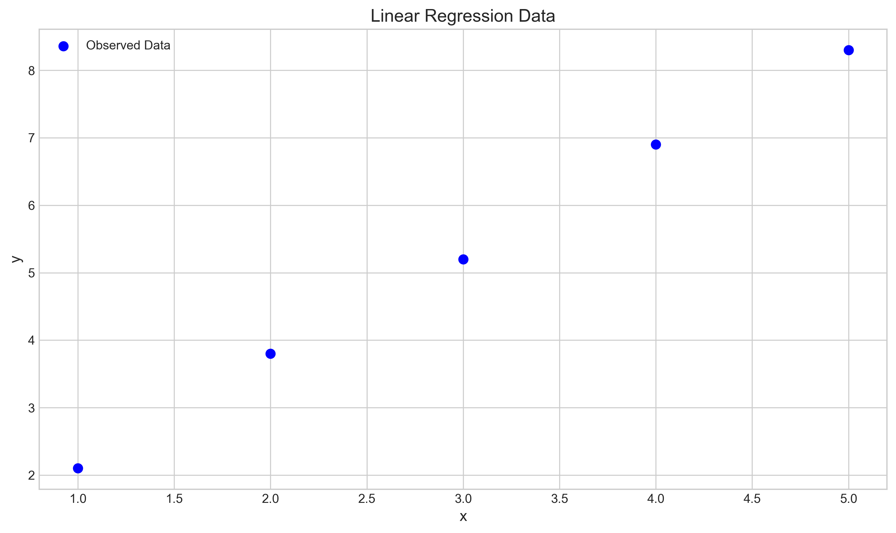
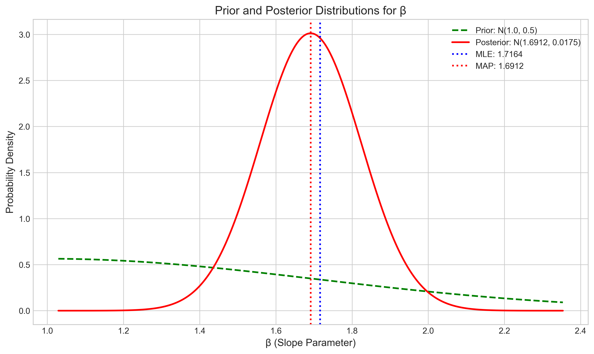
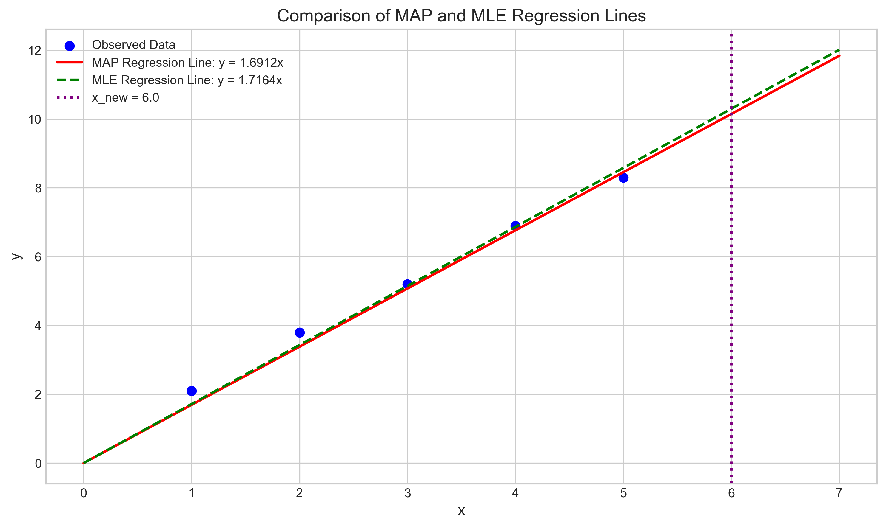
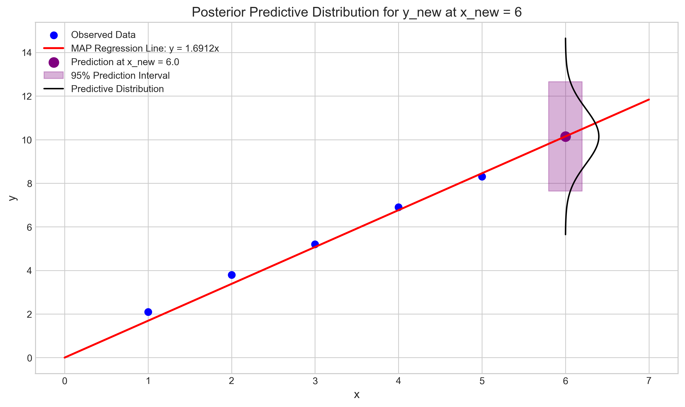

# Question 4: Bayesian Linear Regression

## Problem Statement
Consider a linear regression model $y = \beta x + \varepsilon$ where $\varepsilon \sim N(0, \sigma^2)$ with known $\sigma^2 = 1$. We observe the following data points $(x, y)$:
$\{(1, 2.1), (2, 3.8), (3, 5.2), (4, 6.9), (5, 8.3)\}$

## Task
1. If we use a normal prior $\beta \sim N(1, 0.5)$ for the slope parameter, derive the posterior distribution
2. Calculate the MAP estimate for $\beta$
3. Calculate the MLE for $\beta$
4. Derive the posterior predictive distribution for a new observation $y_{new}$ given $x_{new} = 6$

## Solution

### Step 1: Data Exploration

Let's first visualize the data to understand what we're working with:

The data appears to follow a fairly linear trend, which is consistent with our model assumption. To proceed with Bayesian linear regression, we need to calculate some sufficient statistics from the data:

- Sample size: $n = 5$
- Sum of $x$: $\sum x = 15$
- Sum of $y$: $\sum y = 26.3$
- Sum of $xy$: $\sum xy = 94.4$
- Sum of $x^2$: $\sum x^2 = 55$

### Step 2: Deriving the Posterior Distribution

For Bayesian linear regression with a normal prior on the slope parameter $\beta$ and known error variance $\sigma^2 = 1$, we can use conjugacy properties to derive the posterior distribution analytically.

Given:
- Prior: $\beta \sim N(1, 0.5)$
- Likelihood: $y_i | x_i, \beta \sim N(\beta x_i, 1)$ for each observation
- Data: The 5 data points described above

The posterior distribution for $\beta$ is also normal, with parameters calculated as follows:

**Posterior variance calculation:**
$$\frac{1}{\sigma^2_{\text{posterior}}} = \frac{1}{\sigma^2_{\text{prior}}} + \frac{\sum x^2}{\sigma^2_{\text{likelihood}}}$$
$$\frac{1}{\sigma^2_{\text{posterior}}} = \frac{1}{0.5} + \frac{55}{1.0} = 2.0 + 55.0 = 57.0$$
$$\sigma^2_{\text{posterior}} = \frac{1}{57.0} = 0.017544$$

**Posterior mean calculation:**
$$\beta_{\text{posterior}} = \sigma^2_{\text{posterior}} \cdot \left( \frac{\beta_{\text{prior}}}{\sigma^2_{\text{prior}}} + \frac{\sum xy}{\sigma^2_{\text{likelihood}}} \right)$$
$$\beta_{\text{posterior}} = 0.017544 \cdot \left( \frac{1.0}{0.5} + \frac{94.4}{1.0} \right) = 0.017544 \cdot (2.0 + 94.4) = 0.017544 \cdot 96.4 = 1.691228$$

Therefore, the posterior distribution is:
$$\beta | \text{Data} \sim N(1.691228, 0.017544)$$

This posterior distribution incorporates both our prior belief about $\beta$ being close to 1 and the evidence from the data suggesting a slope closer to 1.7.

The figure shows how the prior distribution (green dashed line) is updated to the posterior distribution (red solid line) after observing the data. The posterior is much narrower than the prior, indicating reduced uncertainty about the parameter value. The MLE (blue dotted line) and MAP (red dotted line) estimates are also marked.

### Step 3: Calculating the MAP Estimate

For a normal posterior distribution, the mode (which is the MAP estimate) equals the mean:

$$\text{MAP} = \beta_{\text{posterior}} = 1.691228$$

The MAP estimate represents the value of $\beta$ that maximizes the posterior probability density function. Because the posterior is normal, this coincides with the posterior mean.

### Step 4: Calculating the MLE Estimate

For simple linear regression without an intercept, the Maximum Likelihood Estimate (MLE) is given by:

$$\text{MLE} = \frac{\sum xy}{\sum x^2}$$

$$\text{MLE} = \frac{94.4}{55} = 1.716364$$

The MLE is the value of $\beta$ that makes the observed data most likely, without any prior information.

### Step 5: Comparing MAP and MLE Estimates

Comparing the two estimates:
- MAP estimate: 1.691228
- MLE estimate: 1.716364
- Difference (MAP - MLE): -0.025136

The figure compares the regression lines for both the MAP estimate (red solid line) and the MLE (green dashed line). The slight difference is due to the influence of the prior, which pulls the MAP estimate toward the prior mean of 1.0. 

The difference is relatively small because:
1. The prior variance is large enough to allow the data to have significant influence
2. The data provides strong evidence about the parameter (low uncertainty)
3. The prior mean (1.0) is not too far from what the data suggests (1.716)

In cases with less data or more uncertain data, the difference between MAP and MLE would be more pronounced.

### Step 6: Deriving the Posterior Predictive Distribution

The posterior predictive distribution represents our belief about a new, unobserved data point $y_{new}$ at $x_{new} = 6$, given the observed data. It is calculated by integrating over the posterior distribution of $\beta$:

$$p(y_{new} | x_{new}, \text{Data}) = \int p(y_{new} | x_{new}, \beta) \cdot p(\beta | \text{Data}) d\beta$$

For a normal likelihood and a normal posterior, this integral has a closed-form solution. The posterior predictive distribution is also normal with:

**Posterior predictive mean:**
$$\mu_{\text{predictive}} = \beta_{\text{posterior}} \cdot x_{new} = 1.691228 \cdot 6.0 = 10.147368$$

**Posterior predictive variance:**
$$\sigma^2_{\text{predictive}} = x_{new}^2 \cdot \sigma^2_{\text{posterior}} + \sigma^2_{\text{likelihood}}$$
$$\sigma^2_{\text{predictive}} = 6.0^2 \cdot 0.017544 + 1.0 = 36.0 \cdot 0.017544 + 1.0 = 0.631579 + 1.0 = 1.631579$$

Therefore, the posterior predictive distribution is:
$$y_{new} | x_{new} = 6, \text{Data} \sim N(10.147368, 1.631579)$$

Based on this distribution, we calculate the 95% prediction interval for $y_{new}$ at $x_{new} = 6$:
$$[7.643842, 12.650895]$$

The figure shows the posterior predictive distribution for a new observation at $x_{new} = 6$. The purple point represents the predicted mean, the shaded region around it shows the 95% prediction interval, and the black curve on the right illustrates the shape of the predictive distribution.

## Key Insights

1. **Bayesian vs. Frequentist Estimation**: The MAP estimate (1.691) incorporates prior information and is slightly different from the MLE (1.716). This difference showcases the Bayesian approach's ability to combine prior knowledge with observed data.

2. **Uncertainty Quantification**: The posterior distribution provides a complete characterization of our uncertainty about the parameter $\beta$. The posterior variance (0.018) is much smaller than the prior variance (0.5), showing how the data has substantially reduced our uncertainty.

3. **Prediction with Uncertainty**: The posterior predictive distribution accounts for two sources of uncertainty:
   - Parameter uncertainty (through the posterior distribution of $\beta$)
   - Inherent noise in the data (through the likelihood variance)

4. **Precision Weighting**: The posterior mean is a weighted average of the prior mean and what the data suggests, with weights proportional to their precisions (inverse variances). Since the data has much higher precision (due to $\sum x^2 = 55$), it has a stronger influence on the posterior than the prior.

5. **Conjugacy Advantage**: The normal-normal model exhibits conjugacy, providing analytical expressions for the posterior and predictive distributions without requiring numerical methods.

## Conclusion

Bayesian linear regression offers a principled framework for combining prior knowledge with observed data to make inferences about model parameters and predictions for new data points. The posterior distribution quantifies our uncertainty about the parameter, and the posterior predictive distribution provides a probabilistic forecast for new observations that accounts for both parameter uncertainty and inherent variability.

In this example, the MAP estimate is pulled slightly toward the prior mean compared to the MLE, demonstrating the influence of prior information. The prediction at $x_{new} = 6$ comes with a well-defined uncertainty interval, reflecting both our uncertainty about the true value of $\beta$ and the inherent noise in the data-generating process.

The Bayesian approach is particularly valuable when the amount of data is limited, the data is noisy, or when we have reliable prior information that can improve our estimates. It provides a unified framework for parameter estimation, uncertainty quantification, and prediction. 