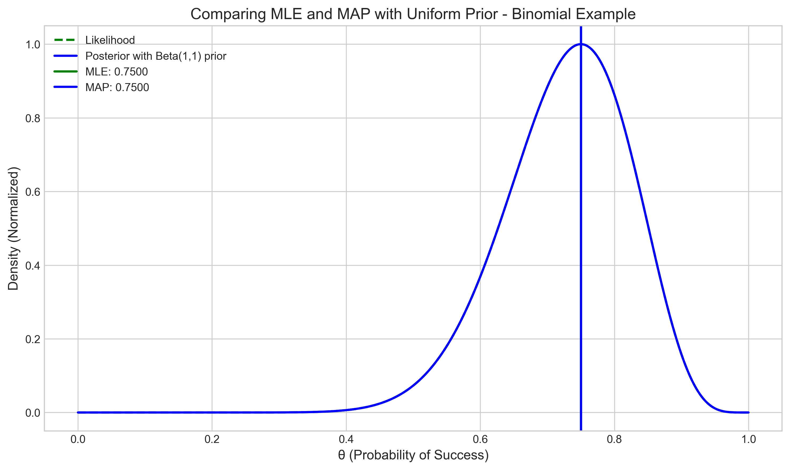
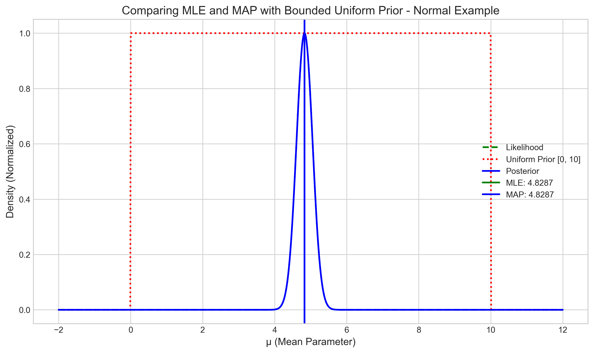
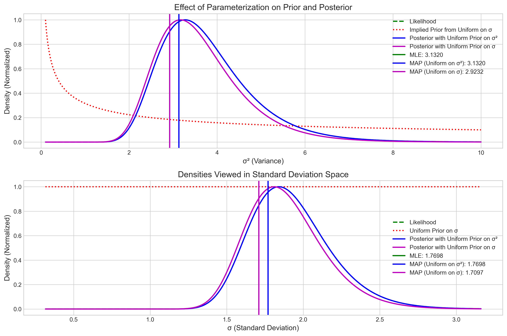

 # Question 5: MAP and MLE Relationship

## Problem Statement
True or False: When using a uniform prior (e.g., $\text{Beta}(1,1)$ for a probability parameter), the MAP estimate is identical to the MLE.

## Task
1. Determine whether the statement is true or false
2. Explain your reasoning mathematically
3. Provide a simple example that illustrates your answer

## Solution

### Step 1: Theoretical Analysis

To determine whether the MAP estimate equals the MLE when using a uniform prior, we need to understand the mathematical relationship between the posterior distribution and the likelihood function.

According to Bayes' rule, the posterior distribution is proportional to the likelihood times the prior:

$$P(\theta|D) \propto P(D|\theta) \times P(\theta)$$

Where:
- $P(\theta|D)$ is the posterior distribution
- $P(D|\theta)$ is the likelihood function
- $P(\theta)$ is the prior distribution

When the prior $P(\theta)$ is uniform (constant across the parameter space):

$$P(\theta|D) \propto P(D|\theta) \times \text{constant}$$
$$P(\theta|D) \propto P(D|\theta)$$

This means the posterior is proportional to the likelihood, and therefore, the value of $\theta$ that maximizes the posterior (MAP) should be the same as the value that maximizes the likelihood (MLE).

However, there are important caveats:
1. A uniform prior might not be uniform in all parameterizations
2. The boundaries of the parameter space might affect the posterior
3. The statement is generally true when the uniform prior is defined over the same parameter space as the likelihood function and there are no boundary effects

Let's illustrate these concepts with some examples.

### Step 2: Example 1 - Binomial Model with Beta(1,1) Prior

Consider a binomial model where we observe 15 successes out of 20 trials, and we're interested in estimating the probability of success $\theta$.

The likelihood function for this data is:

$$P(D|\theta) \propto \theta^{15} (1-\theta)^{5}$$

The MLE is simply the observed proportion of successes:

$$\hat{\theta}_{MLE} = \frac{15}{20} = 0.75$$

Now, if we use a $\text{Beta}(1,1)$ prior, which is a uniform distribution over $[0,1]$, the posterior becomes:

$$P(\theta|D) \propto \theta^{15} (1-\theta)^{5} \times 1 = \theta^{15} (1-\theta)^{5}$$

This corresponds to a $\text{Beta}(16,6)$ distribution. The mode of this distribution (the MAP estimate) is:

$$\hat{\theta}_{MAP} = \frac{16-1}{16+6-2} = \frac{15}{20} = 0.75$$

Comparing the MLE and MAP:
- MLE = 0.75
- MAP = 0.75
- Difference = 0.0

In this figure, we can see that the likelihood function (green dashed line) and the posterior distribution (blue solid line) reach their maximum at exactly the same point. This confirms that in this case, the MAP equals the MLE.

### Step 3: Example 2 - Normal Model with Different Uniform Priors

Let's consider a case with normally distributed data with sample mean 4.83 and sample variance 0.88.

For a normal likelihood with known variance, the MLE for the mean parameter $\mu$ is simply the sample mean:

$$\hat{\mu}_{MLE} = 4.83$$

#### Case 1: Uniform Prior Over the Entire Real Line

If we use a uniform prior over the entire real line $(-\infty, \infty)$, the posterior distribution will be proportional to the likelihood:

$$P(\mu|D) \propto P(D|\mu) \times \text{constant} \propto P(D|\mu)$$

In this case, the MAP estimate equals the MLE:

$$\hat{\mu}_{MAP} = \hat{\mu}_{MLE} = 4.83$$

#### Case 2: Uniform Prior Over a Bounded Interval [0, 10]

When we use a uniform prior over a bounded interval [0, 10], the posterior is still proportional to the likelihood within these bounds but zero outside them:

$$P(\mu|D) \propto \begin{cases}
P(D|\mu) & \text{if } 0 \leq \mu \leq 10 \\
0 & \text{otherwise}
\end{cases}$$

Since our MLE of 4.83 falls within the bounds [0, 10], the MAP estimate still equals the MLE:

$$\hat{\mu}_{MAP} = \hat{\mu}_{MLE} = 4.83$$

However, if the MLE had fallen outside these bounds, the MAP would have been at the boundary closest to the MLE.

In this figure, we can see that the likelihood (green dashed line) and the posterior (blue solid line) reach their maximum at the same point, even though the prior (red dotted line) restricts the parameter space to [0, 10].

### Step 4: Example 3 - Effect of Parameterization

This example illustrates an important caveat about parameterization. Consider a normal distribution with zero mean and unknown variance $\sigma^2$. We'll compare using a uniform prior on $\sigma^2$ versus a uniform prior on $\sigma$ (the standard deviation).

For our simulated data, the sample variance (MLE for $\sigma^2$) is 3.13.

#### Case 1: Uniform Prior on $\sigma^2$

When using a uniform prior on $\sigma^2$, the posterior is proportional to the likelihood:

$$P(\sigma^2|D) \propto P(D|\sigma^2)$$

In this case, the MAP estimate equals the MLE:

$$\hat{\sigma}^2_{MAP} = \hat{\sigma}^2_{MLE} = 3.13$$

#### Case 2: Uniform Prior on $\sigma$

A uniform prior on $\sigma$ implies a non-uniform prior on $\sigma^2$. The relationship is:

$$P(\sigma^2) = P(\sigma) \left|\frac{d\sigma}{d\sigma^2}\right| = P(\sigma) \frac{1}{2\sqrt{\sigma^2}}$$

Since $P(\sigma)$ is constant (uniform), we have $P(\sigma^2) \propto \frac{1}{2\sqrt{\sigma^2}}$.

This prior is not uniform in the $\sigma^2$ space, so the MAP estimate for $\sigma^2$ will not equal the MLE:

$$P(\sigma^2|D) \propto P(D|\sigma^2) \times \frac{1}{2\sqrt{\sigma^2}}$$

For a normal likelihood with fixed mean, this leads to the analytical result:

$$\hat{\sigma}^2_{MAP} = \frac{n-2}{n} \hat{\sigma}^2_{MLE}$$

where $n$ is the sample size.

In our example with $n = 30$:
- MLE for $\sigma^2$: 3.13
- MAP with uniform prior on $\sigma^2$: 3.13
- MAP with uniform prior on $\sigma$: 2.92
- Ratio MAP/MLE with uniform prior on $\sigma$: 0.93
- Theoretical ratio for $n=30$: $(30-2)/30 = 0.93$

The top panel shows the densities as functions of $\sigma^2$. We can see that the likelihood and the posterior with uniform prior on $\sigma^2$ reach their maximum at the same point (the MLE), while the posterior with uniform prior on $\sigma$ has its maximum shifted to the left (the MAP is smaller than the MLE).

The bottom panel shows the same densities transformed to the $\sigma$ space, highlighting how a prior that is uniform in one parameterization is not uniform in another.

## Key Insights

1. **Basic Principle**: When using a uniform prior over the parameter space, the posterior is proportional to the likelihood, which means the MAP estimate should equal the MLE.

2. **Boundary Effects**: If the parameter space is bounded and the MLE falls outside these bounds, the MAP will be at the boundary closest to the MLE, not the MLE itself.

3. **Parameterization Matters**: A prior that is uniform in one parameterization may not be uniform in another, leading to different MAP estimates. The equivalence between MAP and MLE depends on using the same parameterization for both.

4. **Jeffreys' Prior**: The case of a uniform prior on $\sigma$ versus $\sigma^2$ illustrates why uninformative priors are often better chosen using principles like Jeffreys' prior, which is invariant to parameterization.

5. **Beta(1,1) Example**: The specific case of a Beta(1,1) prior for a probability parameter is a true uniform prior on [0,1], and in this case, the MAP does equal the MLE when the MLE is within [0,1].

## Conclusion

Based on our theoretical analysis and examples, we can conclude that the statement is:

**TRUE - but with important caveats.**

When using a uniform prior over the parameter space:
1. If the parameter space is unbounded and the MLE is within the domain, the MAP equals the MLE.
2. If the parameter space is bounded and the MLE falls within these bounds, the MAP equals the MLE.
3. If the MLE falls outside the bounds of the uniform prior, the MAP will be at the boundary closest to the MLE.
4. The equivalence between MAP and MLE depends on the parameterization. A prior that is uniform in one parameterization may not be uniform in another, leading to different MAP estimates.

In summary, a uniform prior makes the posterior proportional to the likelihood within the bounds of the prior, but parameterization choices and boundary constraints can still cause MAP and MLE to differ.