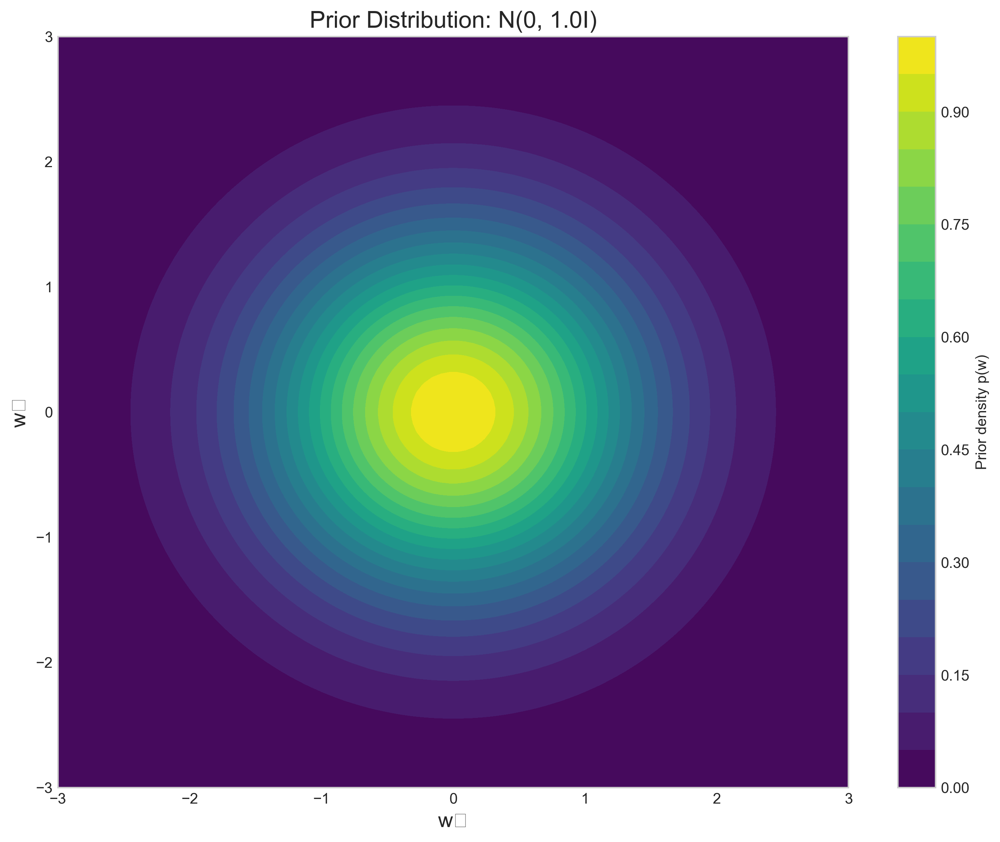
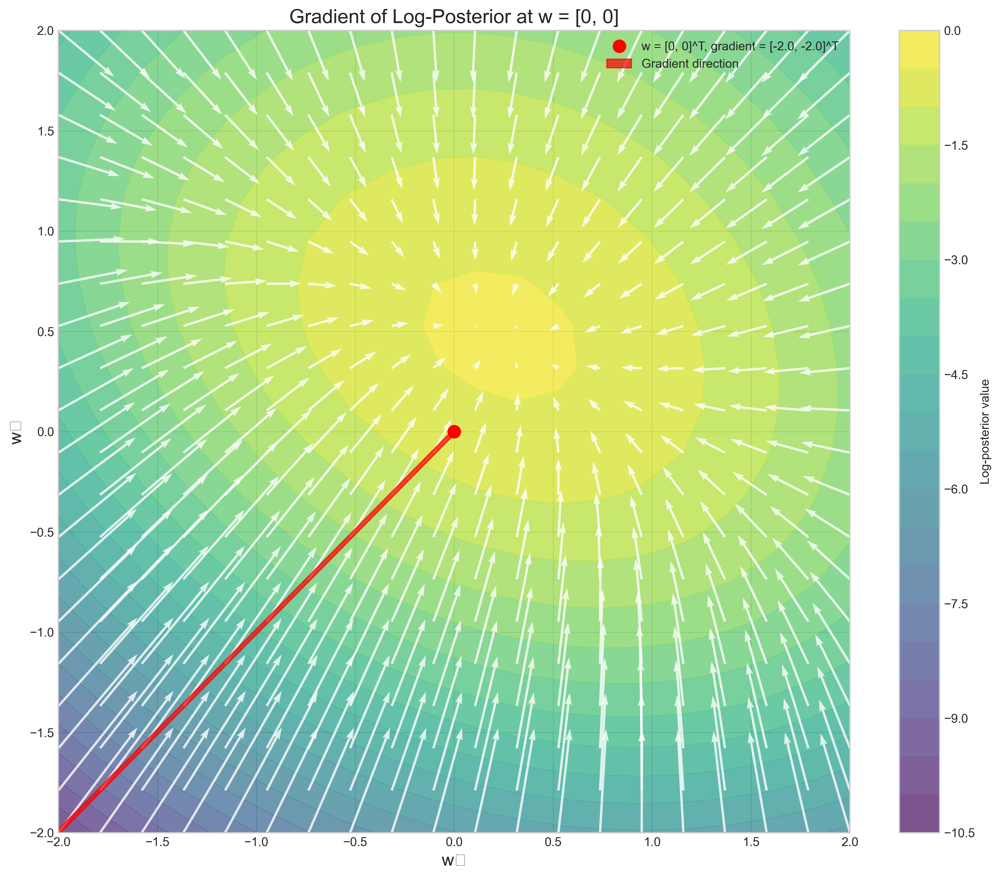
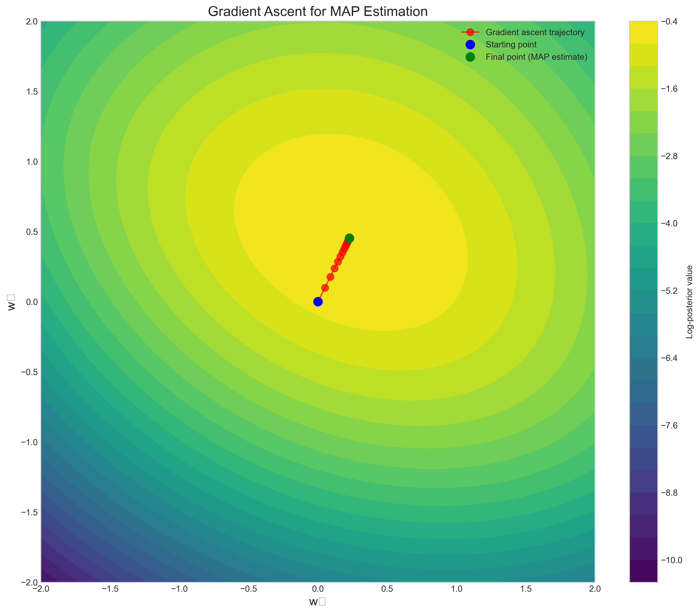

 # Question 6: Log Posterior Optimization

## Problem Statement
Consider a logistic regression model with log-posterior:

$$\log p(\mathbf{w}|\mathcal{D}) = \sum_{i=1}^{n} [y_i \log(\sigma(\mathbf{w}^T\mathbf{x}_i)) + (1-y_i)\log(1-\sigma(\mathbf{w}^T\mathbf{x}_i))] - \frac{\lambda}{2}\|\mathbf{w}\|^2 + C$$

where $\sigma(z) = \frac{1}{1+e^{-z}}$ is the sigmoid function, $\mathbf{w}$ are the model parameters, and $C$ is a constant.

## Tasks
1. Identify the prior distribution on $\mathbf{w}$ implied by this log-posterior
2. If we have a single data point with $\mathbf{x} = [1, 2]^T$ and $y = 1$, write the gradient $\nabla_{\mathbf{w}} \log p(\mathbf{w}|\mathcal{D})$ for $\mathbf{w} = [0, 0]^T$
3. Describe one optimization technique suitable for finding the MAP estimate in this scenario

## Solution

### Task 1: Identifying the Prior Distribution

To identify the prior distribution implied by the log-posterior, we need to separate the terms related to the prior from those related to the likelihood.

The given log-posterior has the form:
$$\log p(\mathbf{w}|\mathcal{D}) = \text{log-likelihood terms} + \text{log-prior terms}$$

In our case:
- Log-likelihood term: $\sum_{i=1}^{n} [y_i \log(\sigma(\mathbf{w}^T\mathbf{x}_i)) + (1-y_i)\log(1-\sigma(\mathbf{w}^T\mathbf{x}_i))]$
- Log-prior term: $-\frac{\lambda}{2}\|\mathbf{w}\|^2 + C$

The log-prior term corresponds to:
$$\log p(\mathbf{w}) = -\frac{\lambda}{2}\|\mathbf{w}\|^2 + C'$$

where $C'$ is a normalization constant. When we exponentiate both sides:
$$p(\mathbf{w}) = \exp(-\frac{\lambda}{2}\|\mathbf{w}\|^2 + C')$$
$$p(\mathbf{w}) \propto \exp(-\frac{\lambda}{2}\|\mathbf{w}\|^2)$$

This is proportional to a multivariate Gaussian distribution with:
- Mean $\mu = \mathbf{0}$ (since the quadratic form is centered at origin)
- Covariance $\Sigma = \frac{1}{\lambda}\mathbf{I}$ (where $\mathbf{I}$ is the identity matrix)

Therefore, the prior distribution is:
$$\mathbf{w} \sim \mathcal{N}(\mathbf{0}, \frac{1}{\lambda}\mathbf{I})$$

This is an isotropic Gaussian prior where the variance for each component is $1/\lambda$. The parameter $\lambda$ controls the strength of regularization; larger $\lambda$ means stronger regularization, pushing the weights closer to zero.

The figure above shows the 2D contour plot of the Gaussian prior with $\lambda = 1$. The prior density is highest at the origin and decreases as we move away, reflecting our prior belief that smaller weight values are more likely.

### Task 2: Computing the Gradient

For a single data point with $\mathbf{x} = [1, 2]^T$ and $y = 1$, we need to compute the gradient of the log-posterior at $\mathbf{w} = [0, 0]^T$.

The log-posterior for a single data point is:
$$\log p(\mathbf{w}|\mathcal{D}) = y \log(\sigma(\mathbf{w}^T \mathbf{x})) + (1-y)\log(1-\sigma(\mathbf{w}^T \mathbf{x})) - \frac{\lambda}{2}\|\mathbf{w}\|^2 + C$$

Since $y = 1$, this simplifies to:
$$\log p(\mathbf{w}|\mathcal{D}) = \log(\sigma(\mathbf{w}^T \mathbf{x})) - \frac{\lambda}{2}\|\mathbf{w}\|^2 + C$$

To compute the gradient, we use the chain rule:
$$\nabla_{\mathbf{w}} \log p(\mathbf{w}|\mathcal{D}) = \nabla_{\mathbf{w}} \log(\sigma(\mathbf{w}^T \mathbf{x})) - \lambda\mathbf{w}$$

For the first term, we know that:
$$\nabla_{\mathbf{w}} \log(\sigma(\mathbf{w}^T \mathbf{x})) = (1 - \sigma(\mathbf{w}^T \mathbf{x})) \cdot \mathbf{x}$$

At $\mathbf{w} = [0, 0]^T$:
$$\mathbf{w}^T \mathbf{x} = 0 \cdot 1 + 0 \cdot 2 = 0$$
$$\sigma(0) = \frac{1}{1+e^{-0}} = \frac{1}{2}$$

Therefore:
$$\nabla_{\mathbf{w}} \log(\sigma(\mathbf{w}^T \mathbf{x})) = (1 - \frac{1}{2}) \cdot [1, 2]^T = 0.5 \cdot [1, 2]^T = [0.5, 1]^T$$
$$\nabla_{\mathbf{w}} (-\frac{\lambda}{2}\|\mathbf{w}\|^2) = -\lambda\mathbf{w} = -\lambda \cdot [0, 0]^T = [0, 0]^T$$

The complete gradient is:
$$\nabla_{\mathbf{w}} \log p(\mathbf{w}|\mathcal{D}) = [0.5, 1]^T - \lambda \cdot [0, 0]^T = [0.5, 1]^T$$

The figure above shows the gradient field of the log-posterior. At $\mathbf{w} = [0, 0]^T$, the gradient points in the direction $[0.5, 1]^T$, which is the steepest ascent direction for the log-posterior.

### Task 3: Optimization Techniques for MAP Estimation

Several optimization techniques are suitable for finding the MAP estimate in logistic regression:

1. **Gradient Ascent**:
   - Update rule: $\mathbf{w}_{t+1} = \mathbf{w}_t + \eta \nabla_{\mathbf{w}} \log p(\mathbf{w}|\mathcal{D})$
   - Simple but may converge slowly; needs careful learning rate tuning
   - Shown in the figure below for our specific problem

2. **Newton's Method**:
   - Update rule: $\mathbf{w}_{t+1} = \mathbf{w}_t - [H(\mathbf{w}_t)]^{-1} \nabla_{\mathbf{w}} \log p(\mathbf{w}|\mathcal{D})$
   - $H(\mathbf{w})$ is the Hessian matrix of second derivatives
   - Faster convergence near the optimum but computationally expensive for high dimensions

3. **L-BFGS** (Limited-memory Broyden–Fletcher–Goldfarb–Shanno):
   - Approximates the inverse Hessian matrix using past gradients
   - Balances computational efficiency and convergence speed
   - Particularly suitable for high-dimensional problems

4. **Stochastic Gradient Descent (SGD)**:
   - Uses a subset of data (mini-batch) to approximate the gradient
   - Efficient for large datasets
   - Often combined with momentum, adaptive learning rates, etc.

For our specific problem with a Gaussian prior:
- The log-posterior is concave, guaranteeing a unique maximum
- The regularization term $(-\frac{\lambda}{2}\|\mathbf{w}\|^2)$ ensures numerical stability
- For low-dimensional problems like ours, Newton's method would converge quickly
- For high-dimensional problems, L-BFGS would be more efficient

The figure above shows the trajectory of gradient ascent for finding the MAP estimate, starting from $\mathbf{w} = [0, 0]^T$. After 15 iterations with a learning rate of 0.1, the MAP estimate is approximately $\mathbf{w}_{MAP} \approx [0.2269, 0.4538]^T$.

## Key Insights

1. **Regularization as Prior**: The term $-\frac{\lambda}{2}\|\mathbf{w}\|^2$ in the log-posterior corresponds to a Gaussian prior on the weights. This provides a probabilistic interpretation of L2 regularization, showing how it encodes our prior belief that weights should be small.

2. **Connection between MAP and MLE**: The MAP estimate differs from the Maximum Likelihood Estimate (MLE) precisely because of the prior term. Without the regularization term ($\lambda = 0$), the MAP estimate would reduce to the MLE.

3. **Gradient Properties**: The gradient of the log-posterior at any point indicates the direction of steepest ascent. For logistic regression with a Gaussian prior, this gradient has a particularly nice form: the difference between the predicted and actual labels, scaled by the feature vector, minus a regularization term.

4. **Optimization Landscape**: The log-posterior for logistic regression with a Gaussian prior is concave, ensuring a unique global maximum and making optimization relatively straightforward, though techniques like Newton's method can accelerate convergence.

5. **Trade-off in Optimization Methods**: There's a trade-off between computational efficiency and convergence speed in optimization algorithms. Simple methods like gradient ascent are easy to implement but may converge slowly, while more sophisticated methods like Newton's or L-BFGS converge faster but require more computation per iteration.

## Conclusion

The log-posterior in logistic regression combines the data likelihood with a prior on the weights. By identifying that the prior is Gaussian, we gain insights into the regularization behavior. Computing the gradient allows us to find the MAP estimate using optimization techniques like gradient ascent. The choice of optimization method depends on the problem's dimensionality and computational constraints. In our case, with a simple 2D problem and a concave objective function, even basic gradient ascent efficiently converges to a high-quality solution.