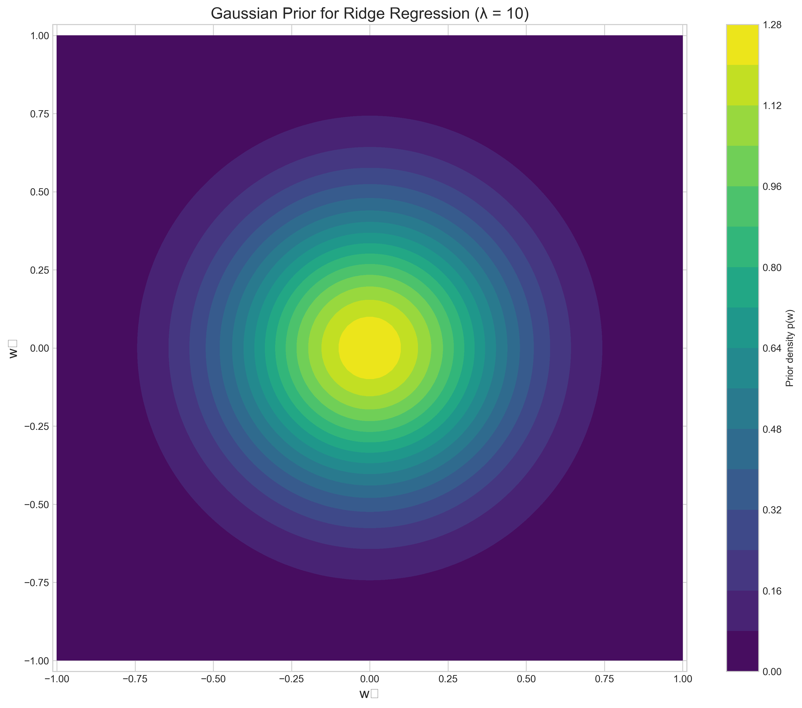
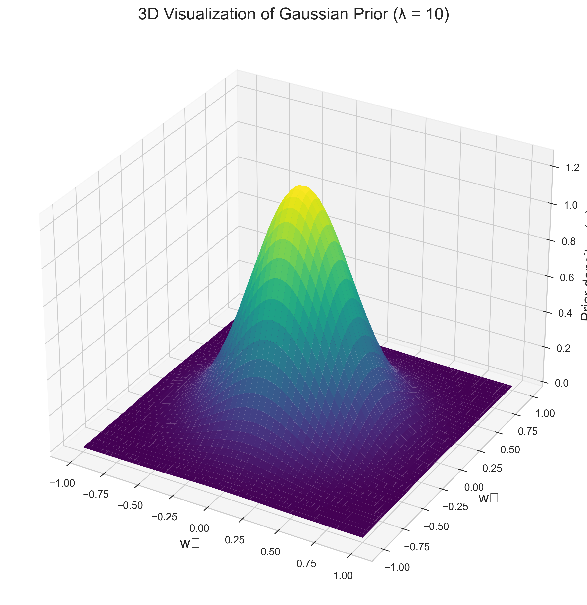
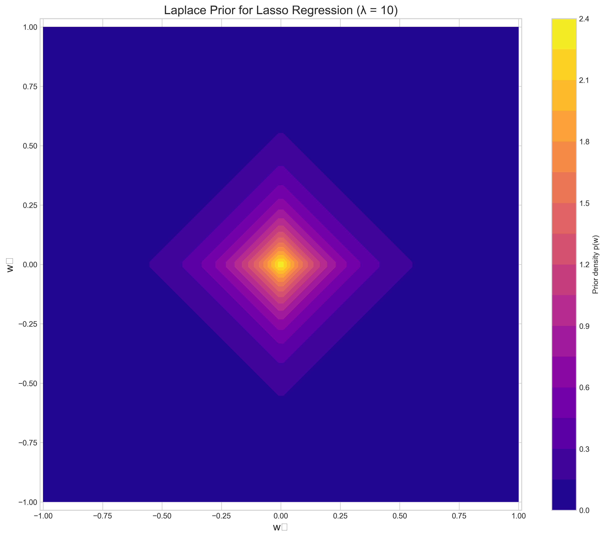
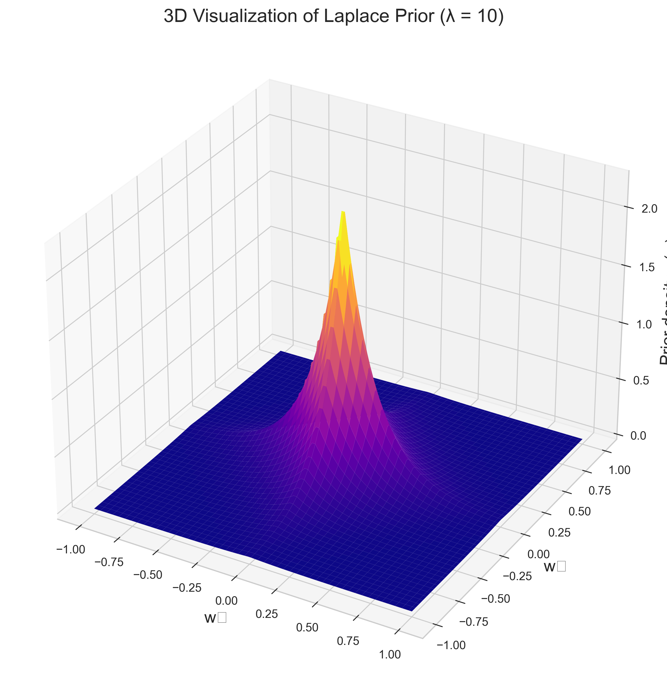
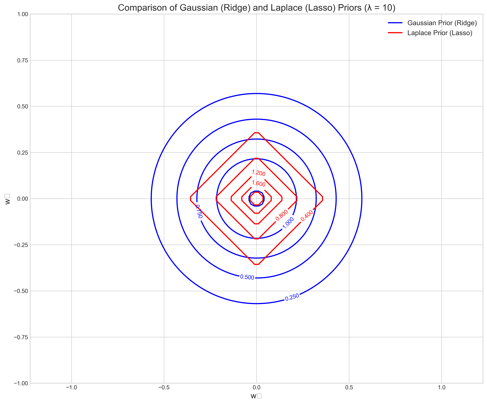
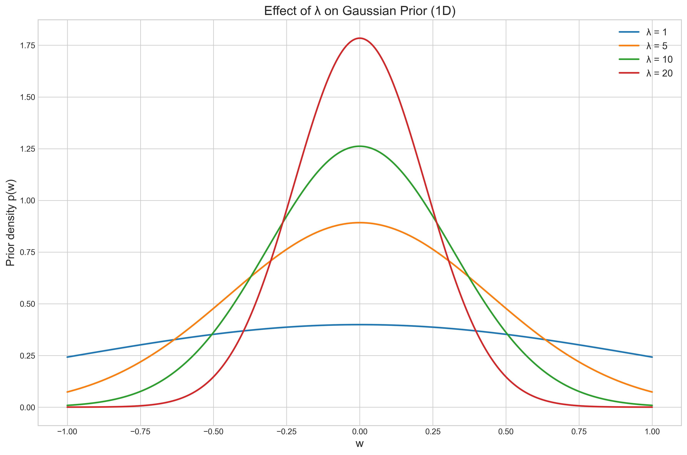
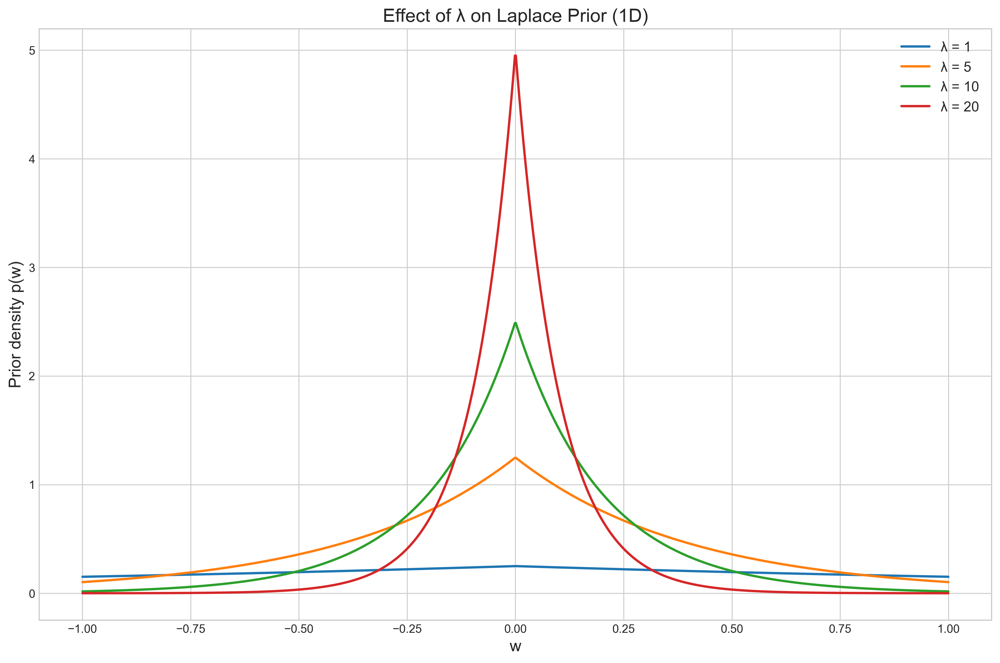

# Question 7: Regularization as MAP

## Problem Statement
Consider the following regularized loss functions used in machine learning:

1. Ridge Regression: $L(\mathbf{w}) = \|\mathbf{y} - \mathbf{X}\mathbf{w}\|^2 + \lambda\|\mathbf{w}\|^2$
2. Lasso Regression: $L(\mathbf{w}) = \|\mathbf{y} - \mathbf{X}\mathbf{w}\|^2 + \lambda\|\mathbf{w}\|_1$

## Tasks
1. Show that Ridge Regression can be interpreted as MAP estimation with a specific prior on $\mathbf{w}$. What is this prior?
2. Show that Lasso Regression can be interpreted as MAP estimation with a different prior on $\mathbf{w}$. What is this prior?
3. For $\lambda = 10$, sketch the shape of both priors in 2D (for a 2-dimensional weight vector)

## Solution

### Task 1: Ridge Regression as MAP Estimation

To connect Ridge Regression to Maximum A Posteriori (MAP) estimation, we need to establish the relationship between the regularized loss function and the posterior distribution in Bayesian inference.

In MAP estimation, we seek to maximize the posterior probability $p(\mathbf{w}|\mathcal{D})$, which by Bayes' rule is:

$$p(\mathbf{w}|\mathcal{D}) \propto p(\mathcal{D}|\mathbf{w}) \times p(\mathbf{w})$$

Taking the logarithm of both sides:

$$\log p(\mathbf{w}|\mathcal{D}) = \log p(\mathcal{D}|\mathbf{w}) + \log p(\mathbf{w}) + \text{const}$$

To maximize $\log p(\mathbf{w}|\mathcal{D})$, we can equivalently minimize $-\log p(\mathbf{w}|\mathcal{D})$:

$$-\log p(\mathbf{w}|\mathcal{D}) = -\log p(\mathcal{D}|\mathbf{w}) - \log p(\mathbf{w}) + \text{const}$$

In linear regression with Gaussian noise, the likelihood term is:

$$p(\mathcal{D}|\mathbf{w}) = \mathcal{N}(\mathbf{y}|\mathbf{X}\mathbf{w}, \sigma^2\mathbf{I})$$

Taking the negative log-likelihood:

$$-\log p(\mathcal{D}|\mathbf{w}) \propto \frac{\|\mathbf{y} - \mathbf{X}\mathbf{w}\|^2}{2\sigma^2}$$

For Ridge Regression to be interpreted as MAP estimation, we need:

$$-\log p(\mathbf{w}|\mathcal{D}) \propto \|\mathbf{y} - \mathbf{X}\mathbf{w}\|^2 + \lambda\|\mathbf{w}\|^2$$

This means the prior must satisfy:

$$-\log p(\mathbf{w}) \propto \frac{\lambda\|\mathbf{w}\|^2}{2\sigma^2}$$

Therefore:

$$p(\mathbf{w}) \propto \exp\left(-\frac{\lambda\|\mathbf{w}\|^2}{2\sigma^2}\right)$$

This is a multivariate Gaussian prior on $\mathbf{w}$:

$$p(\mathbf{w}) = \mathcal{N}(\mathbf{w}|\mathbf{0}, \frac{\sigma^2}{\lambda}\mathbf{I})$$

In other words, Ridge Regression corresponds to MAP estimation with a zero-mean isotropic Gaussian prior with covariance matrix $\frac{\sigma^2}{\lambda}\mathbf{I}$. The regularization parameter $\lambda$ controls the strength of the prior: larger $\lambda$ means smaller variance, reflecting stronger prior belief that weights should be close to zero.

### Task 2: Lasso Regression as MAP Estimation

Similar to Ridge Regression, we can interpret Lasso Regression as MAP estimation.

Lasso Regression minimizes:

$$L(\mathbf{w}) = \|\mathbf{y} - \mathbf{X}\mathbf{w}\|^2 + \lambda\|\mathbf{w}\|_1$$

Following the same approach as before, we need:

$$-\log p(\mathbf{w}|\mathcal{D}) \propto \|\mathbf{y} - \mathbf{X}\mathbf{w}\|^2 + \lambda\|\mathbf{w}\|_1$$

Assuming the same Gaussian likelihood, we have:

$$-\log p(\mathcal{D}|\mathbf{w}) \propto \frac{\|\mathbf{y} - \mathbf{X}\mathbf{w}\|^2}{2\sigma^2}$$

This means the prior must satisfy:

$$-\log p(\mathbf{w}) \propto \frac{\lambda\|\mathbf{w}\|_1}{2\sigma^2}$$

Therefore:

$$p(\mathbf{w}) \propto \exp\left(-\frac{\lambda\|\mathbf{w}\|_1}{2\sigma^2}\right)$$

This corresponds to a Laplace (or double exponential) prior on each component of $\mathbf{w}$:

$$p(\mathbf{w}) = \prod_i \frac{\lambda}{2\sigma^2} \exp\left(-\frac{\lambda|w_i|}{2\sigma^2}\right)$$

In other words, Lasso Regression corresponds to MAP estimation with a Laplace prior. The Laplace distribution has heavier tails than the Gaussian, which makes it more likely to produce sparse solutions (some weights exactly zero).

### Task 3: Visualizing the Priors in 2D

For $\lambda = 10$ and assuming $\sigma^2 = 1$ for simplicity, we can visualize both priors for a 2-dimensional weight vector.

#### Gaussian Prior (Ridge Regression)

The Gaussian prior for Ridge Regression with $\lambda = 10$ is:

$$p(\mathbf{w}) = \mathcal{N}(\mathbf{w}|\mathbf{0}, \frac{1}{10}\mathbf{I})$$

As shown in the contour plot above, the Gaussian prior has circular contours centered at the origin. This reflects the L2 norm's characteristic of penalizing all components of $\mathbf{w}$ equally in all directions.

The 3D visualization below shows the bell shape of the Gaussian distribution:

#### Laplace Prior (Lasso Regression)

The Laplace prior for Lasso Regression with $\lambda = 10$ is:

$$p(\mathbf{w}) \propto \exp\left(-5\|\mathbf{w}\|_1\right)$$

The Laplace prior has diamond-shaped contours, which is characteristic of the L1 norm. The sharp corners along the axes represent regions where one component of $\mathbf{w}$ is exactly zero, which explains why Lasso tends to produce sparse solutions.

The 3D visualization below shows the sharper peak of the Laplace distribution:

#### Direct Comparison of Both Priors

To better understand the differences between these priors, we can compare them directly on the same plot:

This direct comparison clearly shows the circular shape of the Gaussian prior (blue) versus the diamond shape of the Laplace prior (red). The Laplace prior puts more probability mass along the axes, which encourages some weights to be exactly zero.

#### Effect of the Regularization Parameter $\lambda$

The regularization parameter $\lambda$ controls the concentration of both priors around zero:

As $\lambda$ increases, both priors become more concentrated around zero, but they maintain their characteristic shapes – circular for Gaussian and diamond-shaped for Laplace.

## Key Insights

1. **Bayesian Interpretation of Regularization**: Both Ridge and Lasso Regression can be interpreted within a Bayesian framework as MAP estimation with specific priors. This provides a principled way to understand regularization in terms of prior beliefs about the parameters.

2. **Prior Shapes and Sparsity**: The shape of the prior directly influences the nature of the regularization:
   - The circular contours of the Gaussian prior (Ridge) lead to proportional shrinkage of all weights
   - The diamond-shaped contours of the Laplace prior (Lasso) with sharp corners along the axes encourage some weights to be exactly zero, producing sparse solutions

3. **Regularization Parameter as Prior Strength**: The parameter $\lambda$ controls the strength of the prior. Larger values of $\lambda$ correspond to stronger priors (more concentrated around zero), resulting in more aggressive regularization.

4. **Practical Implications**:
   - Ridge Regression (Gaussian prior) is typically preferred when all features are expected to contribute to the prediction
   - Lasso Regression (Laplace prior) is useful for feature selection since it can shrink irrelevant features' weights to exactly zero

5. **Mathematical Properties**:
   - Ridge corresponds to L2 regularization with a differentiable objective function
   - Lasso corresponds to L1 regularization with a non-differentiable objective function at $\mathbf{w} = \mathbf{0}$, which requires specialized optimization techniques

## Conclusion

The connection between regularized regression methods and Bayesian MAP estimation provides valuable insights into how these methods work. Ridge Regression corresponds to a Gaussian prior on the weights, while Lasso Regression corresponds to a Laplace prior. The geometric interpretation of these priors – circular for Gaussian and diamond-shaped for Laplace – explains why Lasso tends to produce sparse solutions while Ridge does not. This Bayesian perspective also clarifies the role of the regularization parameter $\lambda$ as controlling the strength of our prior beliefs about the parameters, offering a principled approach to parameter selection and regularization in machine learning models. 