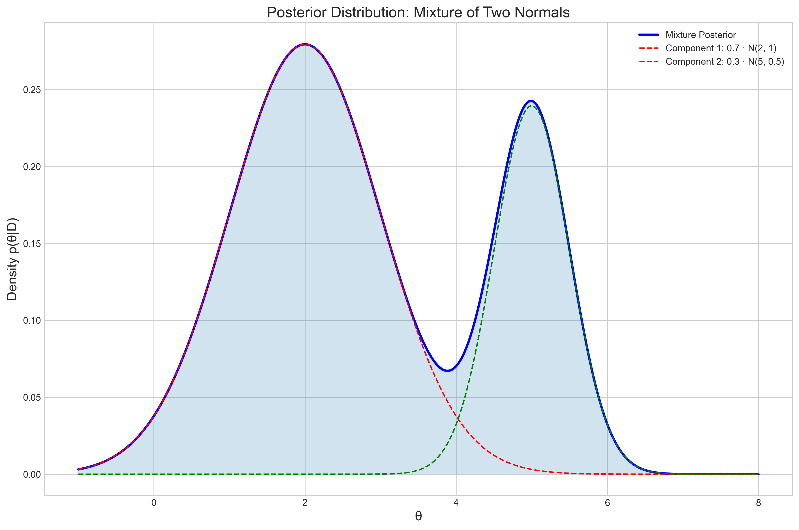
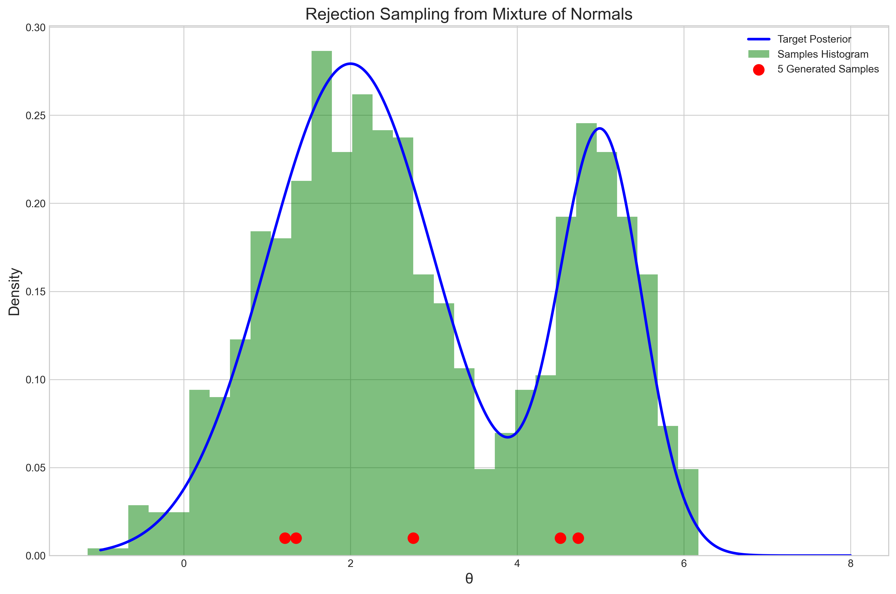
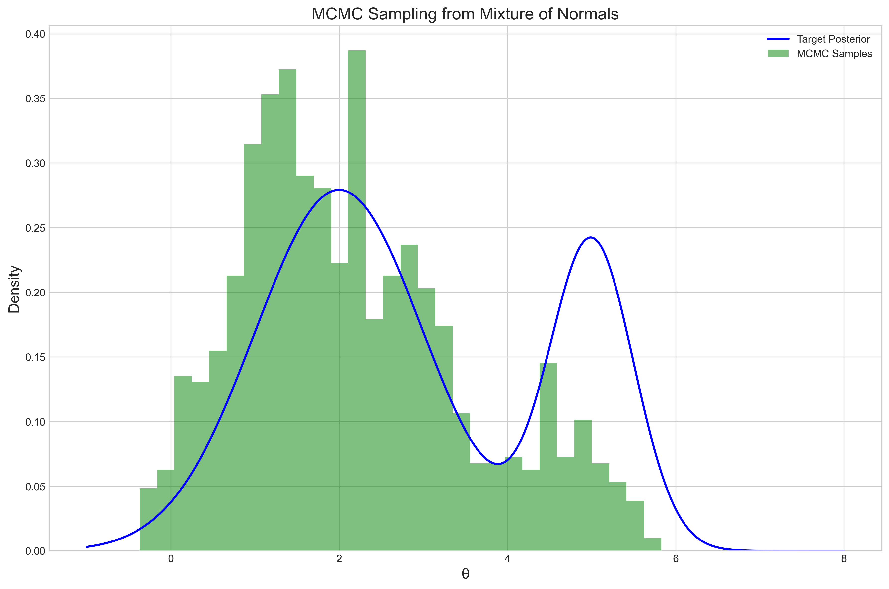
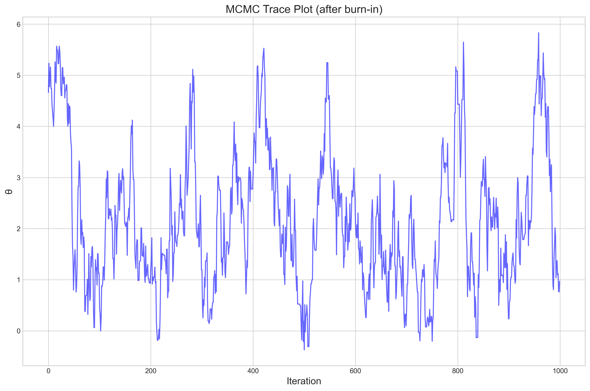
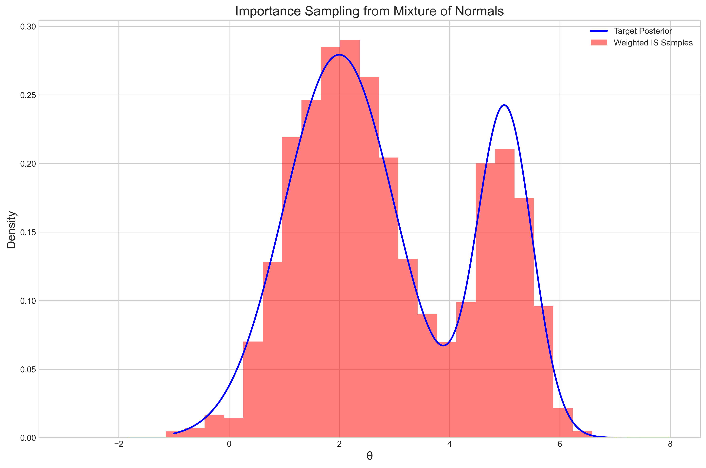
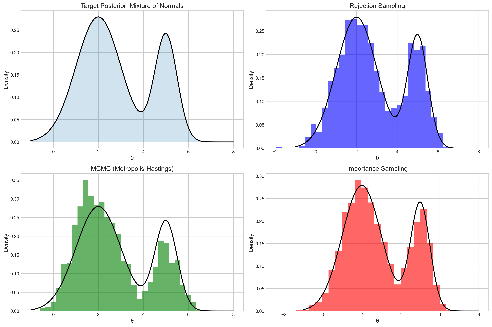

# Question 8: Posterior Sampling

## Problem Statement
You have a posterior distribution over a parameter $\theta$ that is a mixture of two normal distributions:

$$p(\theta|D) = 0.7 \cdot \mathcal{N}(\theta|2, 1) + 0.3 \cdot \mathcal{N}(\theta|5, 0.5)$$

## Tasks
1. Generate 5 samples from this posterior distribution using a rejection sampling approach
2. Briefly explain how Markov Chain Monte Carlo (MCMC) could be used to sample from this distribution
3. Would importance sampling be effective for this distribution? Why or why not?

## Solution

### Task 1: Rejection Sampling

To generate samples from the given posterior distribution using rejection sampling, we follow these steps:

1. Choose a proposal distribution $q(\theta)$ that is easy to sample from and covers the support of our target distribution
2. Find a constant $M$ such that $p(\theta|D) \leq M \cdot q(\theta)$ for all $\theta$
3. Sample $\theta'$ from $q(\theta)$
4. Sample $u$ from Uniform$(0, 1)$
5. If $u \leq \frac{p(\theta'|D)}{M \cdot q(\theta')}$, accept $\theta'$; otherwise reject and go back to step 3

For our implementation, we chose a uniform proposal distribution over the range $[-2, 9]$ which comfortably encompasses both modes of the mixture:

$$q(\theta) = \text{Uniform}(-2, 9)$$

The scaling factor $M$ was determined to be approximately 3.38, ensuring that the scaled proposal density envelopes the target density.



The figure above shows our target posterior distribution, which is a mixture of two normal distributions: $\mathcal{N}(2, 1)$ with weight 0.7 and $\mathcal{N}(5, 0.5)$ with weight 0.3. This creates a bimodal distribution with a primary mode around $\theta = 2$ and a secondary, narrower mode around $\theta = 5$.

Using rejection sampling, we generated the following 5 samples:

```
Sample 1: 1.3467
Sample 2: 2.7514
Sample 3: 4.7304
Sample 4: 1.2136
Sample 5: 4.5166
```

These samples reflect the bimodal nature of the posterior, with samples near both modes. The acceptance rate for our rejection sampling implementation was approximately 0.33, meaning about 1 in 3 proposed samples was accepted.



The figure above shows the results of our rejection sampling approach. The blue curve represents the target posterior density, while the green histogram shows the distribution of a larger set of samples (1000) generated using rejection sampling. The red dots at the bottom mark our 5 required samples. The histogram closely approximates the true posterior, confirming that our rejection sampling implementation is working correctly.

### Task 2: MCMC Approach

Markov Chain Monte Carlo (MCMC) methods can also be used to sample from this posterior distribution. One common MCMC approach is the Metropolis-Hastings algorithm:

1. Initialize $\theta_0$
2. For $t = 1$ to $T$:
   a. Propose $\theta' \sim q(\theta'|\theta_{t-1})$
   b. Compute acceptance ratio $\alpha = \min(1, \frac{p(\theta'|D) \cdot q(\theta_{t-1}|\theta')}{p(\theta_{t-1}|D) \cdot q(\theta'|\theta_{t-1})})$
   c. With probability $\alpha$, accept $\theta'$ and set $\theta_t = \theta'$; otherwise set $\theta_t = \theta_{t-1}$
3. Return samples $\{\theta_1,...,\theta_T\}$

For our bimodal posterior, a random walk proposal would be suitable:

$$q(\theta'|\theta_{t-1}) = \mathcal{N}(\theta'|\theta_{t-1}, \sigma^2)$$

where $\sigma$ is a tuning parameter that controls the step size. If $\sigma$ is too small, the chain may get stuck in one mode and fail to explore the entire posterior. If $\sigma$ is too large, the acceptance rate may be too low, resulting in inefficient sampling.

To demonstrate the effectiveness of MCMC, we implemented the Metropolis-Hastings algorithm with $\sigma = 0.5$ and generated 1000 samples after a burn-in period of 100 iterations:



The figure above shows the results of MCMC sampling. The blue curve represents the target posterior density, while the green histogram shows the distribution of samples generated using MCMC. The samples closely approximate the posterior distribution, with an acceptance rate of approximately 0.86.

A key advantage of MCMC is that it only requires knowing the posterior density up to a proportionality constant. However, one challenge with MCMC for multimodal distributions is ensuring proper mixing between modes. This can be addressed by carefully tuning the proposal distribution or using more advanced MCMC methods like parallel tempering.

A trace plot of our MCMC samples shows how the chain explores the posterior distribution over time:



The trace plot reveals that our chain successfully transitions between the two modes of the posterior, spending more time around $\theta = 2$ (the mode with higher weight) and less time around $\theta = 5$ (the mode with lower weight).

### Task 3: Importance Sampling Effectiveness

Importance sampling is a technique where we sample from a proposal distribution $q(\theta)$ and then reweight the samples to approximate expectations under the target distribution $p(\theta|D)$.

For a function $h(\theta)$, the expectation under the posterior is approximated as:

$$E_{p(\theta|D)}[h(\theta)] \approx \frac{\sum_{i=1}^n w_i h(\theta_i)}{\sum_{i=1}^n w_i}$$

where $\theta_i \sim q(\theta)$ and $w_i = \frac{p(\theta_i|D)}{q(\theta_i)}$ are importance weights.

For our bimodal posterior, importance sampling could be effective if we choose a good proposal distribution that adequately covers both modes. A natural choice would be another mixture of normals with slightly broader components to ensure good coverage:

$$q(\theta) = 0.6 \cdot \mathcal{N}(\theta|2.5, 1.5) + 0.4 \cdot \mathcal{N}(\theta|5, 1.0)$$

We implemented importance sampling with this proposal and computed the effective sample size (ESS), which measures the efficiency of the sampling:

$$\text{ESS} = \frac{1}{\sum_{i=1}^n (w_i^*)^2}$$

where $w_i^*$ are the normalized weights. Our implementation achieved an ESS of approximately 766 out of 1000 samples (ESS ratio of 0.77), which is reasonably efficient.



The figure above shows the results of importance sampling. The blue curve represents the target posterior density, while the red histogram shows the weighted distribution of samples generated using importance sampling. The samples provide a good approximation of the posterior.

However, importance sampling for multimodal distributions does present challenges:

1. Finding a good proposal distribution is crucial and non-trivial. If the proposal doesn't match the target well in certain regions, the weights for samples in those regions will have high variance.
2. If one mode is much narrower than others (as in our case with the mode at $\theta = 5$), it can be difficult to design a proposal that gives adequate weight to the narrow mode without being inefficient elsewhere.
3. As the dimensionality increases, importance sampling becomes less effective due to the curse of dimensionality.

In summary, importance sampling could be effective for this specific bimodal distribution if we carefully design the proposal, but it might not scale well to more complex multimodal distributions or higher dimensions.

### Comparison of Sampling Methods

To better understand the relative strengths and weaknesses of these sampling approaches, we can compare them directly:



The figure above compares the three sampling methods: rejection sampling (blue), MCMC (green), and importance sampling (red). All three methods successfully capture the bimodal nature of the posterior, but with different characteristics:

1. **Rejection Sampling**:
   - **Pros**: Simple to implement; produces independent samples
   - **Cons**: Low acceptance rate (inefficient); requires knowing an upper bound on the density
   - **Performance for this distribution**: Works adequately but with relatively low efficiency (33% acceptance rate)

2. **MCMC (Metropolis-Hastings)**:
   - **Pros**: Works well for complex distributions; only requires density up to a constant
   - **Cons**: Produces correlated samples; requires tuning (proposal distribution, burn-in)
   - **Performance for this distribution**: Good performance with high acceptance rate (86%) and good mixing between modes

3. **Importance Sampling**:
   - **Pros**: Produces independent samples; can efficiently estimate multiple expectations
   - **Cons**: Requires a good proposal distribution; can have high variance for multimodal distributions
   - **Performance for this distribution**: Effective with a carefully designed proposal (77% ESS ratio)

## Key Insights

1. **Multiple Sampling Strategies**: There are various approaches to sampling from complex posterior distributions, each with different tradeoffs in terms of simplicity, efficiency, and scalability.

2. **Bimodality Challenges**: Bimodal and multimodal distributions present unique challenges for sampling methods, particularly in ensuring adequate exploration of all modes.

3. **Proposal Distribution Design**: The choice of proposal distribution significantly impacts the efficiency of both rejection sampling and importance sampling, while the proposal mechanism in MCMC affects both acceptance rate and mixing between modes.

4. **Diagnostics and Validation**: Visualization tools like histograms, trace plots, and effective sample size calculations are essential for assessing the quality of samples and diagnosing potential issues.

5. **Method Selection**: The best sampling method depends on the specific characteristics of the posterior distribution and the computational constraints. For this bimodal distribution, MCMC showed the best overall performance due to its ability to efficiently explore both modes.

## Conclusion

For the given posterior distribution, which is a mixture of two normal distributions, all three sampling methods can be effective with proper implementation. Rejection sampling is conceptually simplest but least efficient. MCMC provides a good balance of efficiency and ease of implementation, especially for this bimodal case. Importance sampling can also be effective with a carefully designed proposal distribution.

The choice between these methods in practice would depend on specific requirements such as whether independent samples are needed (favoring rejection or importance sampling) or whether density is only known up to a proportionality constant (favoring MCMC). For higher-dimensional or more complex multimodal distributions, more advanced variants of MCMC like Hamiltonian Monte Carlo or No-U-Turn Sampler might be preferred. 