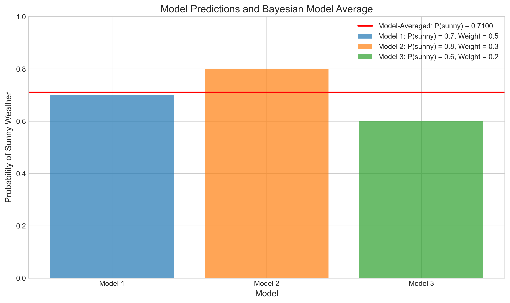
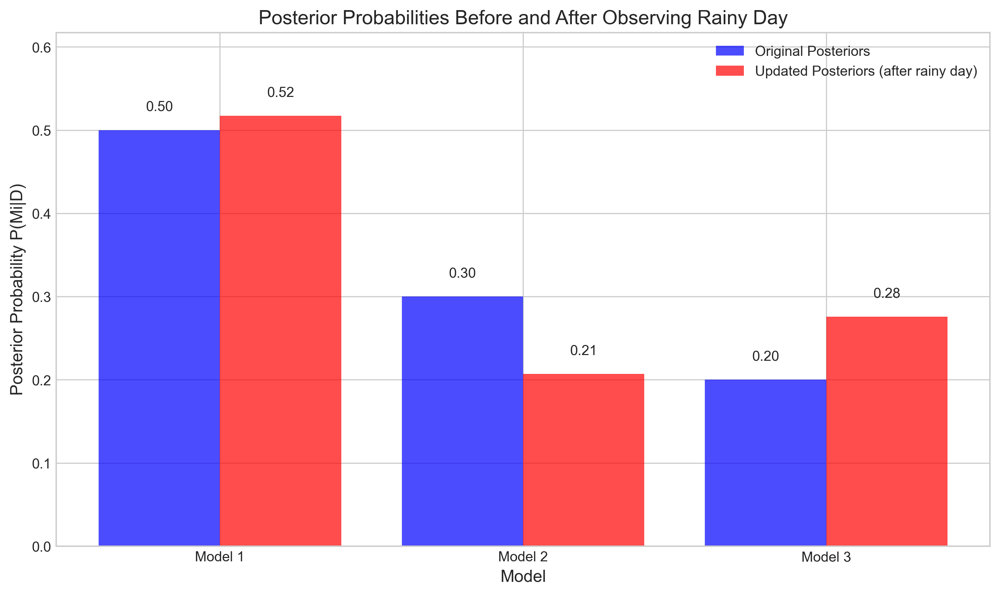
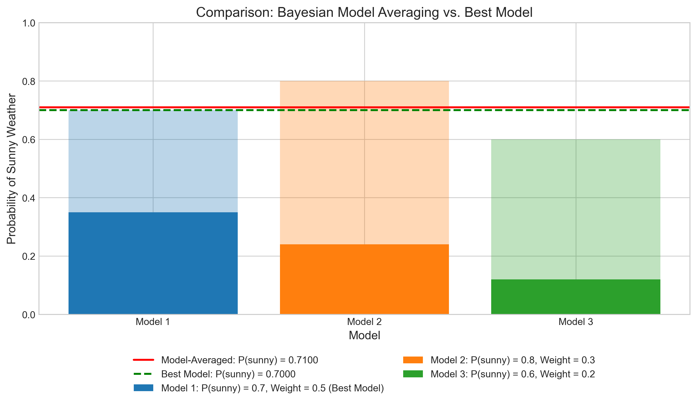
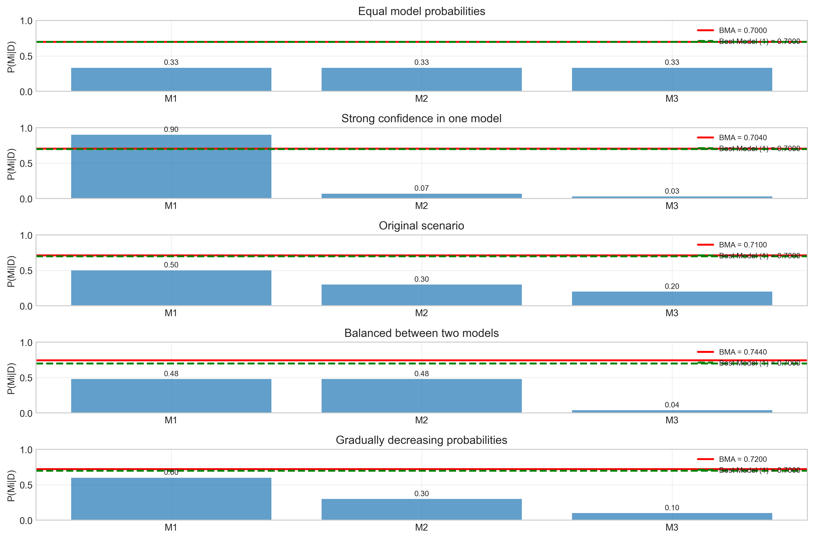

# Question 9: Bayesian Model Averaging

## Problem Statement
You are trying to predict tomorrow's weather (sunny or rainy) using three different models:
- Model 1: Predicts sunny with probability 0.7
- Model 2: Predicts sunny with probability 0.8
- Model 3: Predicts sunny with probability 0.6

Based on historical data, you assign posterior probabilities to these models:
$P(M_1|D) = 0.5$, $P(M_2|D) = 0.3$, and $P(M_3|D) = 0.2$.

### Task
1. Calculate the Bayesian Model Averaged prediction for tomorrow being sunny
2. If tomorrow actually turns out to be rainy, how would the posterior probabilities of each model change?
3. What advantage does Bayesian Model Averaging have over simply selecting the highest probability model?

## Solution

### Step 1: Calculate the Bayesian Model Averaged prediction for tomorrow being sunny

In Bayesian Model Averaging (BMA), we compute the posterior predictive distribution by averaging over all models, weighted by their posterior probabilities. For the probability of sunny weather, we calculate:

$P(\text{sunny}|D) = \sum_{i=1}^{3} P(\text{sunny}|M_i, D) \times P(M_i|D)$

Substituting the given values:

$P(\text{sunny}|D) = P(\text{sunny}|M_1, D) \times P(M_1|D) + P(\text{sunny}|M_2, D) \times P(M_2|D) + P(\text{sunny}|M_3, D) \times P(M_3|D)$

$P(\text{sunny}|D) = 0.7 \times 0.5 + 0.8 \times 0.3 + 0.6 \times 0.2$

$P(\text{sunny}|D) = 0.35 + 0.24 + 0.12 = 0.71$

Therefore, the Bayesian Model Averaged prediction for tomorrow being sunny is 0.71 or 71%.

The figure illustrates how each model contributes to the final model-averaged prediction. Each model's contribution is proportional to both its predicted probability of sunny weather and its posterior probability (weight).

### Step 2: If tomorrow actually turns out to be rainy, how would the posterior probabilities of each model change?

If tomorrow is rainy, we need to update our posterior probabilities using Bayes' rule:

$P(M_i|D, \text{rainy}) = \frac{P(\text{rainy}|M_i, D) \times P(M_i|D)}{P(\text{rainy}|D)}$

First, we calculate the probability of rainy weather according to each model:
- $P(\text{rainy}|M_1) = 1 - P(\text{sunny}|M_1) = 1 - 0.7 = 0.3$
- $P(\text{rainy}|M_2) = 1 - P(\text{sunny}|M_2) = 1 - 0.8 = 0.2$
- $P(\text{rainy}|M_3) = 1 - P(\text{sunny}|M_3) = 1 - 0.6 = 0.4$

The denominator $P(\text{rainy}|D)$ is the model-averaged probability of rainy weather:
$P(\text{rainy}|D) = 0.3 \times 0.5 + 0.2 \times 0.3 + 0.4 \times 0.2 = 0.29$

Now we can calculate the updated posterior probabilities:

$P(M_1|D, \text{rainy}) = \frac{0.3 \times 0.5}{0.29} = 0.5172$

$P(M_2|D, \text{rainy}) = \frac{0.2 \times 0.3}{0.29} = 0.2069$

$P(M_3|D, \text{rainy}) = \frac{0.4 \times 0.2}{0.29} = 0.2759$

The figure shows how the posterior probabilities change after observing rainy weather. Notice that Model 3, which assigned a higher probability to rainy weather (0.4), receives a boost in its posterior probability from 0.2 to 0.2759. Conversely, Model 2, which was most confident about sunny weather (and thus least accurate in this case), sees the largest decrease in its posterior probability from 0.3 to 0.2069.

### Step 3: What advantage does Bayesian Model Averaging have over simply selecting the highest probability model?

If we were to simply select the highest probability model (Model 1 with $P(M_1|D) = 0.5$), we would predict sunny with probability 0.7. However, the Bayesian Model Averaged prediction is 0.71.

The advantages of Bayesian Model Averaging over selecting the highest probability model include:

1. **Accounts for model uncertainty**: BMA acknowledges that no single model may be "true" by incorporating predictions from multiple models.

2. **Provides robust predictions**: By leveraging the strengths of different models, BMA often delivers more accurate predictions than any single model, especially in cases where models have complementary strengths.

3. **Reduces risk of overfitting**: Selecting a single model can lead to overfitting if that model happens to work well on the training data but doesn't generalize well. BMA mitigates this risk by combining multiple models.

4. **Handles model ambiguity**: In situations where multiple models have similar posterior probabilities, choosing just one model would discard valuable information. BMA naturally handles such ambiguity.

5. **Adaptively weights evidence**: The BMA framework automatically adjusts the influence of each model based on its posterior probability, giving more weight to models with stronger evidence.

The figure above shows how BMA behaves under different scenarios of model probability distributions. It adapts to various situations, from equal model probabilities to strong confidence in a single model, providing appropriate weighted predictions in each case.

## Key Insights

1. **Principled Uncertainty Quantification**: Bayesian Model Averaging provides a principled framework for incorporating both within-model and between-model uncertainty into predictions.

2. **Adaptive Learning**: As new evidence arrives (such as observing rainy weather), the framework naturally updates both the model weights and the combined prediction, giving more influence to models that predict well.

3. **Decision-Making Framework**: For decision-making purposes, BMA gives a more complete picture of the underlying uncertainty than selecting a single model, potentially leading to better decisions.

4. **Computational Considerations**: While BMA has theoretical advantages, it requires maintaining and computing with multiple models, which can be computationally intensive for complex models or large model spaces.

5. **Relationship to Ensemble Methods**: BMA can be viewed as a principled Bayesian version of ensemble methods used in machine learning, with posterior probabilities serving as the ensemble weights.

## Conclusion

Bayesian Model Averaging provides a comprehensive framework for prediction that accounts for uncertainty in model selection. In this weather prediction example, BMA produced a prediction (0.71 probability of sunny) that incorporates information from all three models weighted by their posterior probabilities. 

When new evidence becomes available (observing rainy weather), the framework naturally updates the models' posterior probabilities, increasing the weight of models that predicted the observation well and decreasing the weight of those that did not. This adaptive behavior, along with the ability to account for model uncertainty, makes BMA a powerful approach for prediction problems, especially in cases where no single model is clearly superior to all others. 